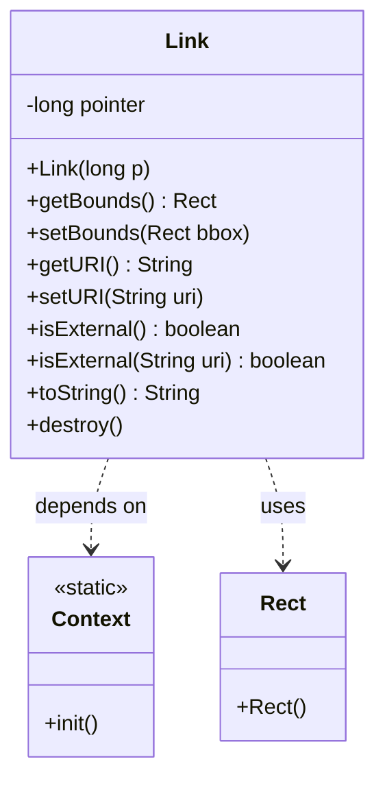
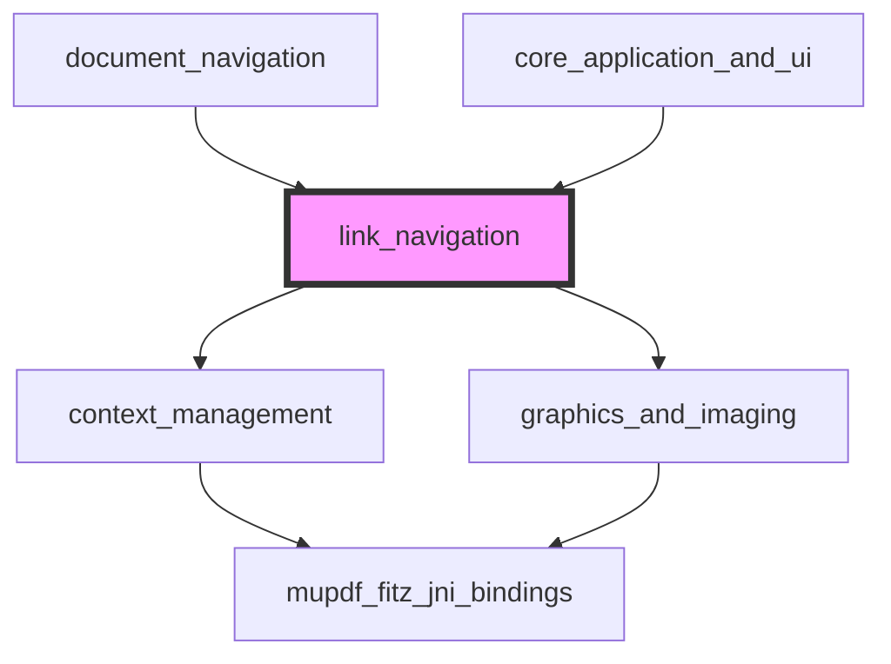
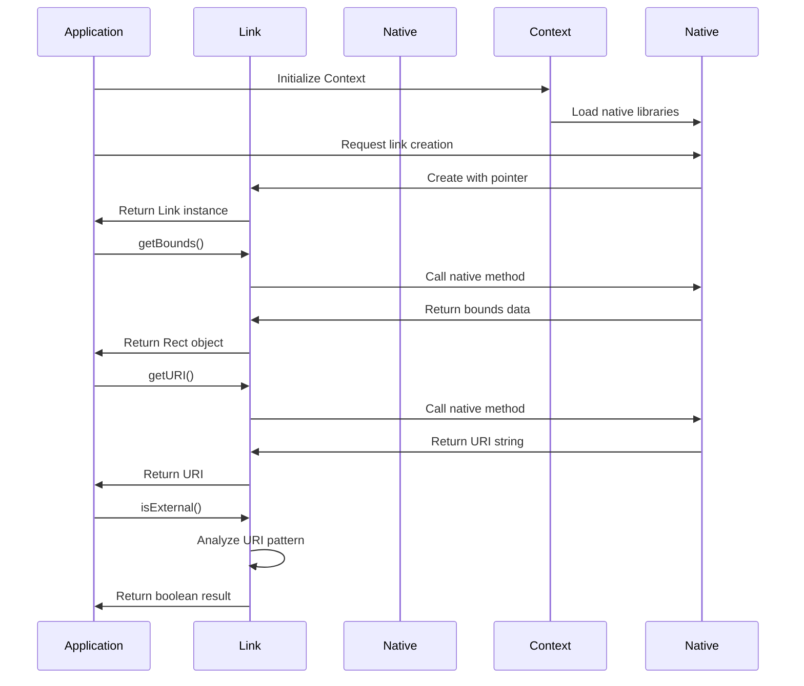
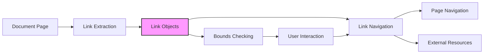
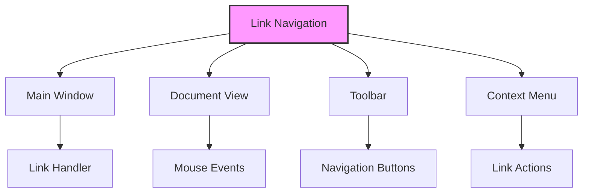

# Link Navigation Module Documentation

## Introduction

The link_navigation module provides the core functionality for handling hyperlinks within documents in the SumatraPDF application. It serves as the Java binding interface to MuPDF's link handling capabilities, enabling navigation between document pages, external resources, and internal references. This module is essential for interactive document viewing, allowing users to click on links, navigate to different sections, and access external resources seamlessly.

## Module Overview

The link_navigation module is built around the `Link` class, which represents a single hyperlink within a document. It provides methods to access link properties, determine link types, and manage link bounds. The module integrates with the broader MuPDF Java bindings ecosystem and serves as a bridge between the native MuPDF link handling and Java-based applications.

## Core Architecture

### Component Structure

### Module Dependencies

## Core Components

### Link Class

The `Link` class is the primary component of this module, providing a Java wrapper around MuPDF's native link functionality.

#### Key Features:
- **Native Integration**: Uses JNI to interface with MuPDF's C library
- **Memory Management**: Implements proper cleanup through native finalization
- **URI Handling**: Supports both internal and external link detection
- **Bounds Management**: Provides geometric information for link positioning

#### Methods:

**Constructor and Lifecycle**
- `Link(long p)`: Creates a Link instance from a native pointer
- `destroy()`: Explicitly releases native resources
- `finalize()`: Native cleanup method

**Bounds Management**
- `getBounds()`: Returns the rectangular area of the link
- `setBounds(Rect bbox)`: Updates the link's bounding rectangle

**URI Management**
- `getURI()`: Retrieves the link's target URI
- `setURI(String uri)`: Sets the link's target URI

**Link Type Detection**
- `isExternal()`: Determines if the link points to an external resource
- `isExternal(String uri)`: Static utility method for URI analysis

## Data Flow Architecture

## Integration with Document Navigation

The link_navigation module integrates with the broader document navigation system:

## URI Analysis and External Link Detection

The module implements sophisticated URI analysis to distinguish between internal and external links:

### External Link Detection Algorithm
1. **Protocol Validation**: Checks for valid protocol prefixes (http://, https://, ftp://, etc.)
2. **Character Analysis**: Validates URI characters according to RFC standards
3. **Scheme Detection**: Identifies URI schemes by looking for colon separators

### Supported Link Types
- **External Links**: Web URLs, file paths, email addresses
- **Internal Links**: Page references, named destinations, bookmarks
- **Special Protocols**: JavaScript actions, form submissions

## Memory Management and Performance

### Native Resource Handling
- **Pointer Management**: Maintains native pointers for MuPDF link objects
- **Automatic Cleanup**: Implements finalization for garbage collection
- **Explicit Destruction**: Provides manual cleanup through `destroy()` method

### Performance Considerations
- **Lazy Loading**: URI and bounds data fetched on demand
- **Caching**: No caching implemented - data fetched from native layer each time
- **Thread Safety**: Native methods are thread-safe through MuPDF's internal locking

## Error Handling and Edge Cases

### URI Validation
- **Empty URIs**: Handled gracefully with appropriate return values
- **Malformed URIs**: External link detection fails safely for invalid formats
- **Unicode Support**: Supports internationalized domain names and paths

### Bounds Management
- **Null Rectangles**: Returns valid Rect objects or null for invalid bounds
- **Coordinate Systems**: Uses MuPDF's coordinate system (points-based)
- **Page Boundaries**: Links may extend beyond visible page areas

## Integration with UI Components

The link_navigation module works with various UI components:

### User Interaction Flow
1. **Mouse Detection**: UI components detect mouse events over link bounds
2. **Link Identification**: Link objects identified based on cursor position
3. **Action Determination**: Internal vs external link classification
4. **Navigation Execution**: Appropriate action taken based on link type

## Testing and Validation

### Unit Testing Considerations
- **URI Parsing**: Test various URI formats and edge cases
- **Bounds Validation**: Verify coordinate system consistency
- **Memory Management**: Test proper cleanup and resource management
- **External Link Detection**: Validate algorithm accuracy

### Integration Testing
- **Document Loading**: Test link extraction from various document types
- **Navigation Flow**: Test complete user navigation scenarios
- **Cross-Reference**: Test links between document sections
- **External Access**: Test web links and file system navigation

## Security Considerations

### URI Sanitization
- **Protocol Validation**: Prevents execution of dangerous protocols
- **Path Traversal**: Guards against directory traversal attacks
- **Resource Access**: Validates external resource accessibility

### Safe Navigation
- **Sandboxing**: External links opened in appropriate applications
- **Permission Checks**: Validates user permissions for file system access
- **Content Validation**: Ensures linked content is safe for viewing

## Future Enhancements

### Potential Improvements
- **Link Caching**: Implement caching for frequently accessed links
- **Preview Support**: Add link preview functionality
- **Batch Operations**: Support for bulk link operations
- **Analytics**: Track link usage patterns

### API Extensions
- **Link Types**: Add support for additional link types
- **Metadata**: Expose additional link metadata
- **History**: Implement navigation history tracking
- **Bookmarks**: Enhanced bookmark management

## Related Documentation

- [mupdf_fitz_jni_bindings.md](mupdf_fitz_jni_bindings.md) - Core MuPDF Java bindings
- [document_navigation.md](document_navigation.md) - Document navigation system
- [core_application_and_ui.md](core_application_and_ui.md) - Main application UI components

## Conclusion

The link_navigation module provides a robust foundation for hyperlink management within the SumatraPDF application. Its clean API design, proper memory management, and comprehensive URI handling make it an essential component for interactive document viewing. The module's integration with both the MuPDF engine and the application's UI components ensures seamless navigation experiences across all supported document formats.