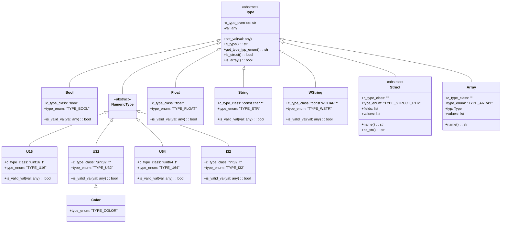
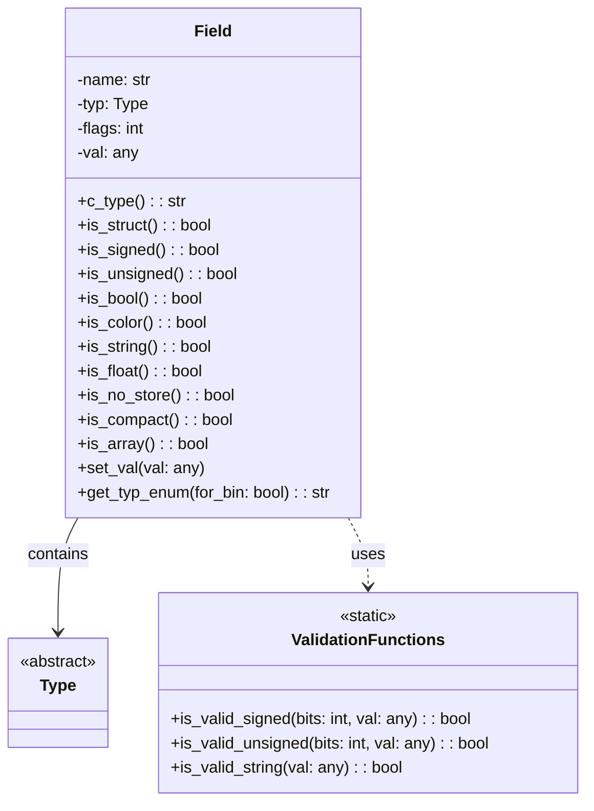
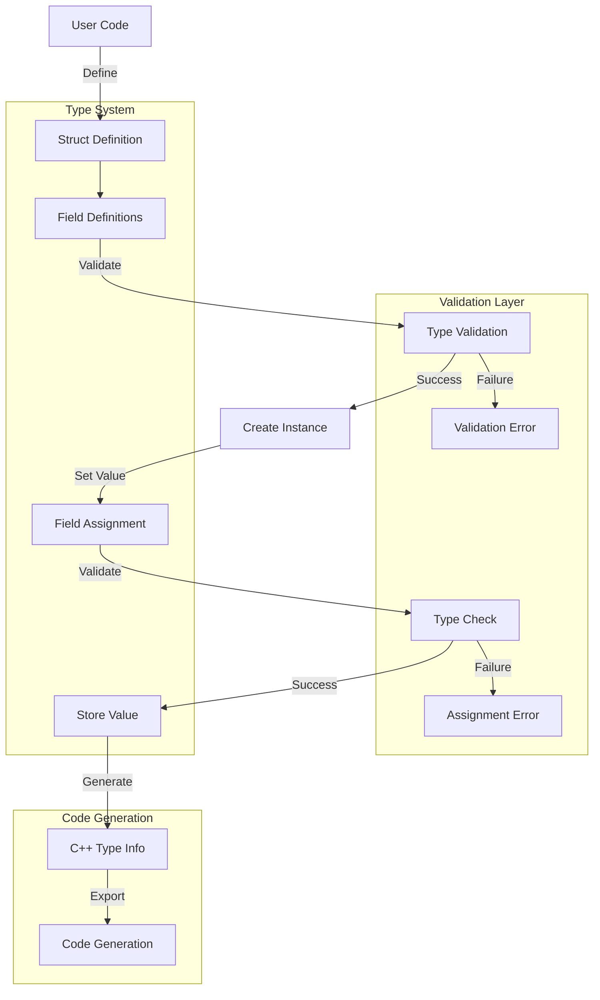

# Metadata Module Documentation

## Introduction

The metadata module provides a comprehensive type system for defining and validating structured data types used throughout the application. It serves as the foundation for data serialization, configuration management, and inter-component communication by offering strongly-typed metadata definitions with built-in validation and C++ type mapping capabilities.

## Architecture Overview

The metadata module implements a hierarchical type system with the following key architectural components:

### Core Type Hierarchy



### Field System Architecture



## Component Details

### Base Type System

#### Type Class
The abstract base class for all metadata types provides:
- **Value validation**: Ensures type safety through `is_valid_val()` method
- **C++ type mapping**: Maps Python types to corresponding C++ types via `c_type()`
- **Type enumeration**: Provides runtime type information through `get_type_typ_enum()`
- **Structure/array detection**: Helper methods for composite types

#### Primitive Types

**Bool Type**
- Maps to C++ `bool` type
- Validates boolean values (True/False only)
- Used for configuration flags and binary settings

**Numeric Types**
- **U16**: 16-bit unsigned integer (`uint16_t`)
- **U32**: 32-bit unsigned integer (`uint32_t`)
- **U64**: 64-bit unsigned integer (`uint64_t`)
- **I32**: 32-bit signed integer (`int32_t`)
- **Float**: Single-precision floating point (`float`)

Each numeric type includes range validation appropriate to its bit width and signedness.

**String Types**
- **String**: C-style string (`const char *`)
- **WString**: Wide string (`const WCHAR *`)
- Both accept None, str, and unicode types

**Color Type**
- Inherits from U32 but uses distinct type enum (`TYPE_COLOR`)
- Represents RGBA color values as 32-bit unsigned integers
- Provides semantic distinction from regular integers

### Composite Types

#### Struct Type
Abstract base class for user-defined structures:
- **Field definition**: Uses class-level `fields` list to define structure members
- **Type safety**: Validates field values during assignment
- **C++ mapping**: Generates appropriate pointer types (`StructName *`)
- **Reflection**: Provides runtime access to field information

#### Array Type
Container for homogeneous collections:
- **Struct-only restriction**: Currently supports only arrays of Struct types
- **Type validation**: Ensures all elements match the specified type
- **C++ mapping**: Maps to `Vec<StructName*> *` for efficient memory management

### Field System

The Field class provides metadata about individual data members:

#### Storage Flags
- **NoStore (1)**: Excludes field from serialization/storage
- **Compact (2)**: Enables compact binary storage format
- **Mutual exclusion**: NoStore and Compact flags are mutually exclusive

#### Type Introspection
Fields provide comprehensive type information:
- **Primitive detection**: `is_bool()`, `is_string()`, `is_float()`
- **Numeric classification**: `is_signed()`, `is_unsigned()`
- **Composite detection**: `is_struct()`, `is_array()`
- **Storage behavior**: `is_no_store()`, `is_compact()`

## Data Flow



## Integration with Other Modules

The metadata module serves as a foundational component that other modules depend on for type-safe data handling:

### Upstream Dependencies
- **Utils Module**: Uses metadata types for configuration and data validation
- **UI Components**: Employs metadata for form validation and data binding
- **Document Formats**: Leverages metadata for document property definitions

### Downstream Consumers
- **Code Generation**: Metadata types drive automatic C++ wrapper generation
- **Serialization**: Provides type information for binary/text serialization formats
- **Configuration Management**: Enables strongly-typed configuration schemas

## Usage Patterns

### Defining Custom Structures
```python
class MyConfig(Struct):
    fields = [
        Field("enabled", Bool(True)),
        Field("timeout", U32(30)),
        Field("name", String("default")),
        Field("color", Color(0xFF0000FF))
    ]
```

### Creating Instances
```python
config = MyConfig(True, 60, "custom", 0x00FF00FF)
config.timeout = 120  # Automatic validation
```

### Type Introspection
```python
for field in config.values:
    print(f"{field.name}: {field.c_type()} ({field.get_typ_enum()})")
```

## Validation and Error Handling

The module implements comprehensive validation at multiple levels:

### Value Validation
- **Range checking**: Ensures numeric values fit within type bounds
- **Type checking**: Validates Python type compatibility
- **String validation**: Accepts None, str, and unicode types

### Structure Validation
- **Field compatibility**: Ensures Compact flag is only used with non-struct fields
- **Flag conflicts**: Prevents NoStore and Compact combination
- **Array homogeneity**: Validates all array elements match specified type

### Error Reporting
- **Descriptive messages**: Provides clear validation failure reasons
- **Type information**: Includes expected vs. actual type details
- **Field context**: Identifies problematic fields in composite types

## Performance Considerations

### Memory Efficiency
- **Compact storage**: Optional compact binary format for primitive fields
- **Pointer optimization**: Struct arrays use pointer vectors for efficiency
- **Lazy validation**: Validation occurs only during value assignment

### Code Generation
- **C++ type mapping**: Direct mapping to native C++ types
- **Template specialization**: Enables efficient C++ template instantiation
- **Compile-time optimization**: Type information available at compile time

## Extension Points

### Custom Types
New primitive types can be added by:
1. Inheriting from `Type` base class
2. Implementing `is_valid_val()` method
3. Defining appropriate C++ type mapping
4. Adding type enum constant

### Validation Extensions
Custom validation logic can be added through:
- Overriding `is_valid_val()` in type subclasses
- Implementing custom validation functions
- Adding new storage flags for specialized behavior

## Security Considerations

### Input Validation
- **Bounds checking**: Prevents integer overflow/underflow
- **Type safety**: Rejects invalid Python type conversions
- **String handling**: Proper handling of None and unicode strings

### Memory Safety
- **Pointer management**: Safe C++ pointer type generation
- **Array bounds**: Implicit bounds checking through type system
- **Resource cleanup**: Automatic cleanup of composite types

This metadata module provides a robust foundation for type-safe data handling throughout the application, enabling reliable configuration management, efficient serialization, and seamless C++ integration while maintaining flexibility for future extensions.