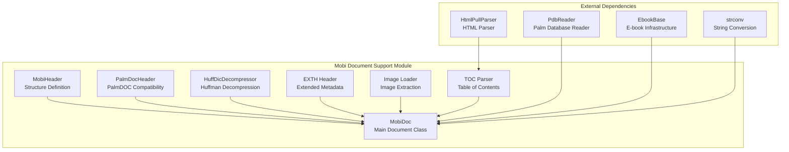
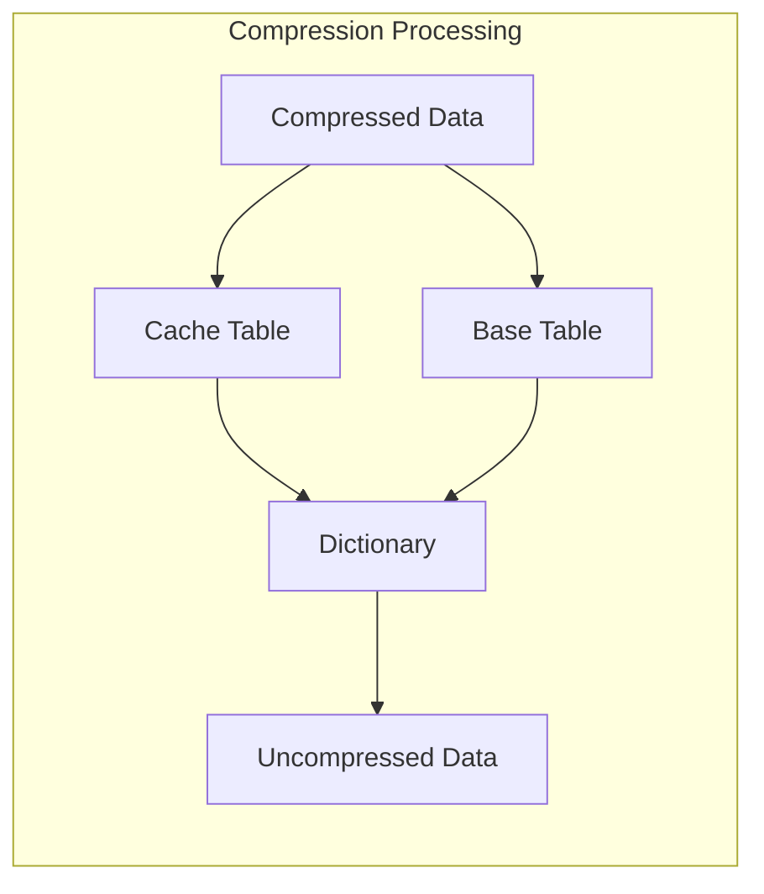
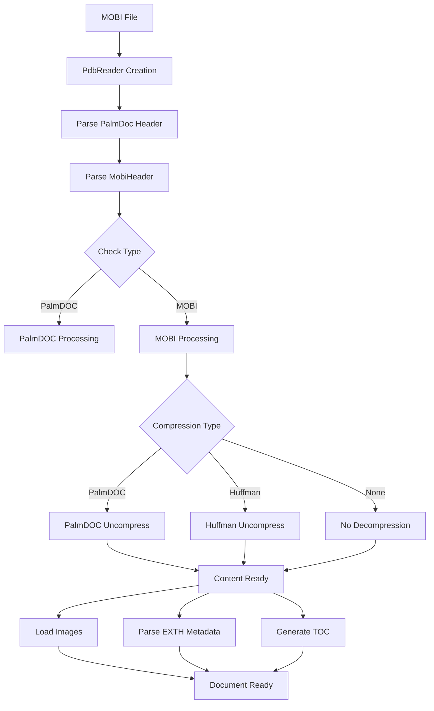
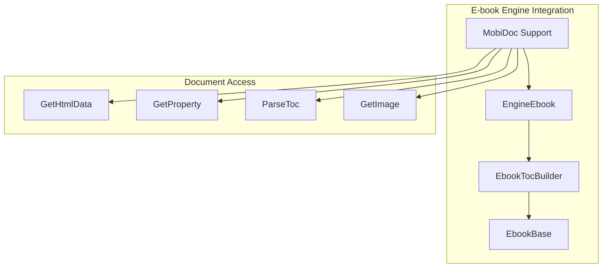

# Mobi Document Support Module

## Introduction

The mobi_document_support module provides comprehensive functionality for parsing, decompressing, and rendering MOBI format e-books within the SumatraPDF application. This module handles the complex MOBI file format, which is based on PalmDOC format with extensions for Amazon Kindle e-books, including support for various compression algorithms, image extraction, and table of contents generation.

## Architecture Overview

The module is built around the `MobiDoc` class, which serves as the primary interface for MOBI document processing. The architecture follows a layered approach with clear separation of concerns for header parsing, decompression, content extraction, and metadata handling.

## Core Components

### MobiHeader Structure

The `MobiHeader` structure is the cornerstone of MOBI document parsing, containing all essential metadata and configuration information extracted from the MOBI file header. This structure follows the official MOBI format specification and provides access to encoding, compression, and document structure information.

**Key Fields:**
- `id`: 4-byte identifier ("MOBI")
- `hdrLen`: Total header length including identifier
- `textEncoding`: Character encoding specification
- `locale`: Language and locale information
- `imageFirstRec`: Index of first image record
- `huffmanFirstRec`: Index of Huffman compression data
- `exthFlags`: Extended header presence indicator
- `extraDataFlags`: Additional content flags

### MobiDoc Class

The `MobiDoc` class provides the primary interface for MOBI document operations, encapsulating the entire document lifecycle from file loading to content extraction. This class manages the complex interactions between different compression algorithms, image handling, and metadata extraction.

**Core Responsibilities:**
- Document header parsing and validation
- Compression algorithm detection and decompression
- Image extraction and management
- Table of contents generation
- Property and metadata handling
- Text encoding conversion

### Compression Support

The module implements support for three compression algorithms used in MOBI format:

1. **No Compression** (`COMPRESSION_NONE`): Direct text storage
2. **PalmDOC Compression** (`COMPRESSION_PALM`): Dictionary-based compression
3. **Huffman Compression** (`COMPRESSION_HUFF`): Advanced Huffman coding with dictionary support

#### Huffman Decompression

The `HuffDicDecompressor` class handles the most complex compression format, implementing Huffman coding with multiple dictionary support. This algorithm requires careful management of cache tables, base tables, and multiple CDIC (dictionary) records.

## Data Flow Architecture

The module processes MOBI documents through a well-defined pipeline that handles the various complexities of the format:

## Image Processing

The module includes sophisticated image handling capabilities, automatically detecting and extracting images from MOBI records while filtering out non-image data and special records.

**Image Detection Process:**
1. Skip known non-image records (FLIS, FCIS, FDST, etc.)
2. Detect EOF record markers
3. Use file type detection for format recognition
4. Store valid images for later retrieval

## Table of Contents Generation

The table of contents parser implements a flexible HTML-based approach, searching for reference tags with specific attributes and building a hierarchical structure based on HTML block elements.

**TOC Features:**
- Automatic detection of TOC presence
- Support for nested hierarchies (blockquote, ul, ol)
- Link extraction with filepos or href attributes
- Text content extraction for link labels

## Integration with E-book System

The mobi_document_support module integrates seamlessly with the broader e-book engine system, providing standardized interfaces for content access and navigation.

## Error Handling and Validation

The module implements comprehensive error handling for various failure scenarios:

- **Format Validation**: Strict header validation with size checks
- **Compression Errors**: Graceful handling of decompression failures
- **Memory Management**: Safe allocation and deallocation of resources
- **Encoding Issues**: Robust text encoding conversion
- **DRM Detection**: Clear handling of encrypted content

## Performance Considerations

The module is optimized for performance while maintaining accuracy:

- **Lazy Loading**: Images loaded only when requested
- **Efficient Decompression**: Optimized algorithms for each compression type
- **Memory Management**: Careful buffer management to prevent leaks
- **Caching**: Strategic caching of parsed data

## Dependencies

The mobi_document_support module relies on several key components from the broader system:

- **[PalmDbReader](palm_db_reader.md)**: Provides low-level Palm database format access
- **[EbookBase](ebook_base.md)**: Supplies common e-book functionality and interfaces
- **[HtmlPullParser](html_pull_parser.md)**: Enables HTML content parsing for TOC generation
- **[String Conversion](string_conversion.md)**: Handles text encoding transformations

## Usage Patterns

The typical usage pattern involves creating a `MobiDoc` instance from a file or stream, then accessing the parsed content through the provided interfaces:

1. Document creation via `MobiDoc::CreateFromFile()` or `MobiDoc::CreateFromStream()`
2. Content access through `GetHtmlData()` for the main document text
3. Image retrieval using `GetImage()` for embedded images
4. Navigation support via `ParseToc()` for table of contents
5. Metadata access through `GetPropertyTemp()` for document properties

This comprehensive approach ensures that the mobi_document_support module can handle the full range of MOBI format variations while providing a clean, consistent interface for the rest of the SumatraPDF application.