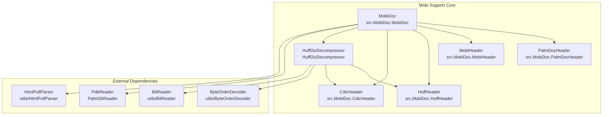
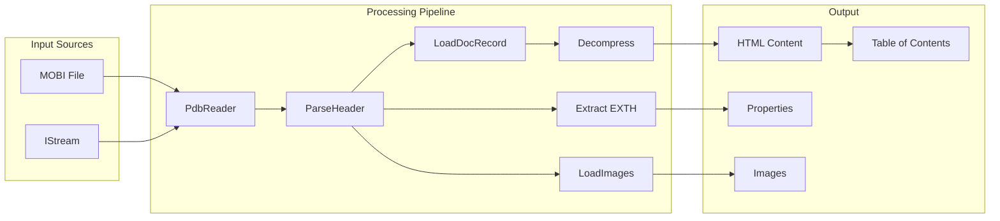
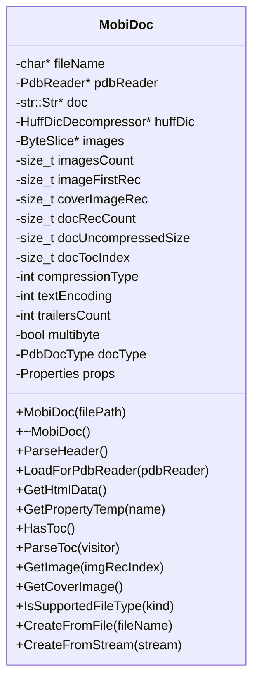
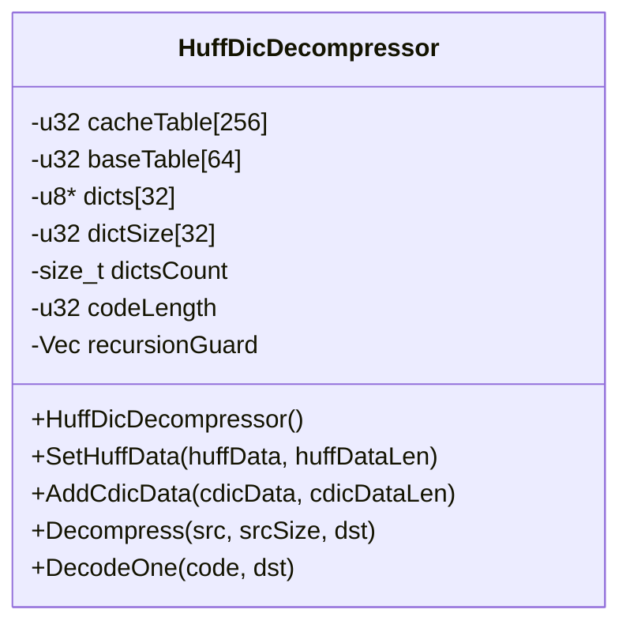
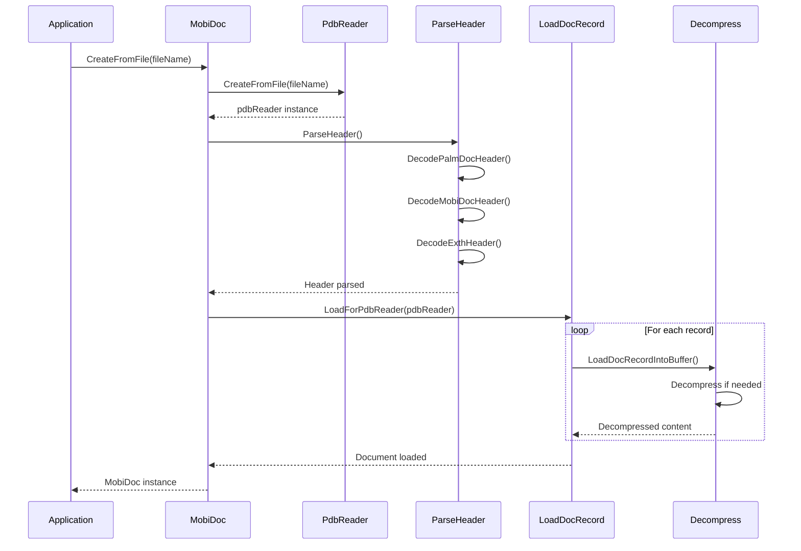
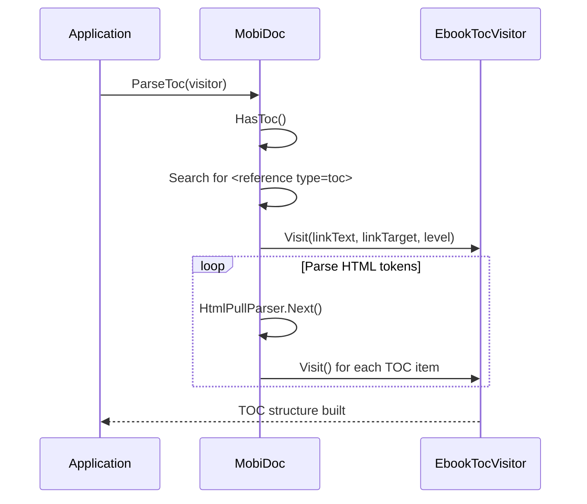
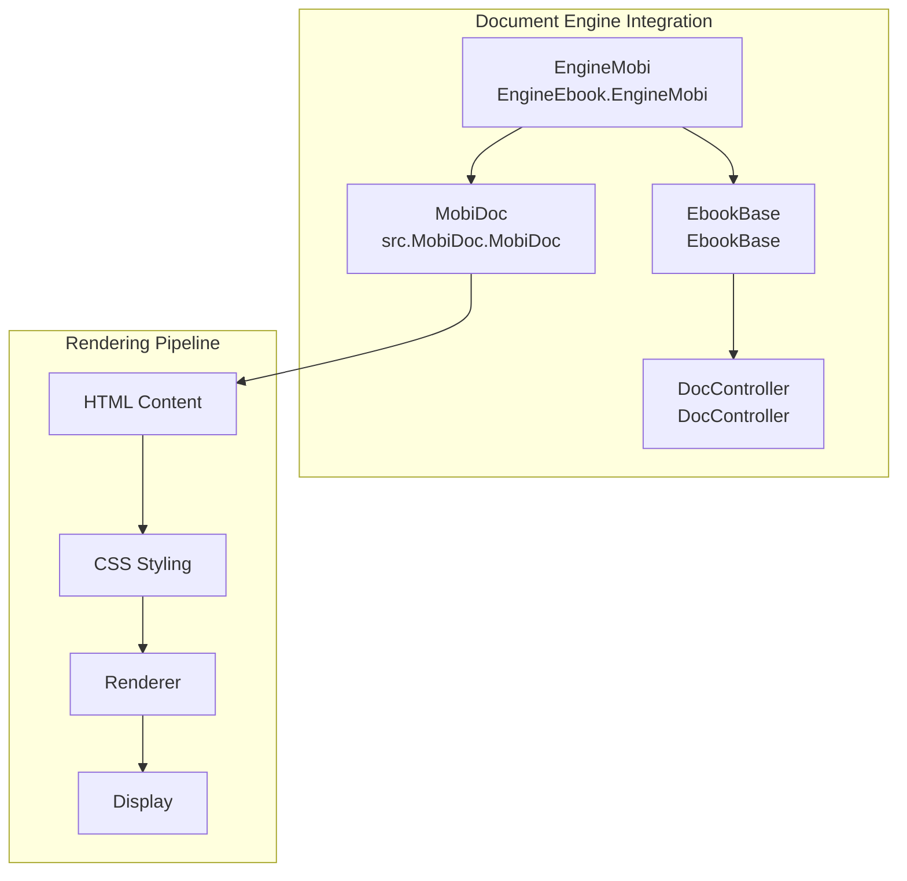

# Mobi Support Module Documentation

## Introduction

The mobi_support module provides comprehensive support for reading and processing MOBI format e-books, a proprietary format developed by Mobipocket and later adopted by Amazon for Kindle devices. This module implements the complete MOBI format specification including PalmDoc compression, Huffman dictionary compression, and various MOBI-specific features like table of contents extraction and image handling.

## Module Architecture

The mobi_support module is built around several key components that work together to provide complete MOBI document support:

### Core Components



### Data Flow Architecture



## Component Details

### Header Structures

#### PalmDocHeader
The PalmDocHeader structure contains basic document metadata and compression information:

```cpp
struct PalmDocHeader {
    u16 compressionType;        // Compression algorithm used
    u16 reserved1;             // Reserved field
    u32 uncompressedDocSize;   // Size of uncompressed document
    u16 recordsCount;          // Number of records in document
    u16 maxRecSize;           // Maximum record size (usually 4096)
    union {
        u32 currPos;          // Current position (PalmDoc)
        struct {
            u16 encrType;     // Encryption type (MOBI)
            u16 reserved2;    // Reserved field
        } mobi;
    };
};
```

#### MobiHeader
The MobiHeader structure contains comprehensive MOBI-specific metadata:

```cpp
struct MobiHeader {
    char id[4];                     // "MOBI" identifier
    u32 hdrLen;                     // Header length including ID
    u32 type;                       // Document type
    u32 textEncoding;               // Text encoding (UTF-8, etc.)
    u32 uniqueId;                   // Unique document ID
    u32 mobiFormatVersion;          // MOBI format version
    u32 ortographicIdxRec;          // Orthographic index record
    u32 inflectionIdxRec;           // Inflection index record
    u32 namesIdxRec;                // Names index record
    u32 keysIdxRec;                 // Keys index record
    u32 extraIdx0Rec;               // Extra index records
    u32 extraIdx1Rec;
    u32 extraIdx2Rec;
    u32 extraIdx3Rec;
    u32 extraIdx4Rec;
    u32 extraIdx5Rec;
    u32 firstNonBookRec;            // First non-book record
    u32 fullNameOffset;             // Offset to full name in record 0
    u32 fullNameLen;                // Length of full name
    u32 locale;                     // Language/locale information
    u32 inputDictLanguage;          // Input dictionary language
    u32 outputDictLanguage;         // Output dictionary language
    u32 minRequiredMobiFormatVersion; // Minimum required format version
    u32 imageFirstRec;              // First image record
    u32 huffmanFirstRec;            // First Huffman compression record
    u32 huffmanRecCount;            // Number of Huffman records
    u32 huffmanTableOffset;         // Huffman table offset
    u32 huffmanTableLen;            // Huffman table length
    u32 exthFlags;                  // EXTH header flags
    char reserved1[32];             // Reserved area
    u32 drmOffset;                  // DRM information offset
    u32 drmEntriesCount;            // DRM entries count
    u32 drmSize;                    // DRM data size
    u32 drmFlags;                   // DRM flags
    char reserved2[62];             // Reserved area
    u16 extraDataFlags;             // Extra data flags
    i32 indxRec;                    // Index record
};
```

#### HuffHeader
The HuffHeader structure manages Huffman dictionary compression:

```cpp
struct HuffHeader {
    char id[4];                     // "HUFF" identifier
    u32 hdrLen;                     // Header length (24 bytes)
    u32 cacheOffset;                // Cache data offset
    u32 baseTableOffset;            // Base table offset
    u32 cacheLEOffset;              // Little-endian cache offset
    u32 baseTableLEOffset;          // Little-endian base table offset
};
```

#### CdicHeader
The CdicHeader structure manages dictionary data for Huffman compression:

```cpp
struct CdicHeader {
    char id[4];                     // "CIDC" identifier
    u32 hdrLen;                     // Header length (16 bytes)
    u32 unknown;                    // Unknown field
    u32 codeLen;                    // Code length
};
```

### Main Document Class

#### MobiDoc
The MobiDoc class is the primary interface for MOBI document processing:



### Compression Support

#### Compression Types
The module supports three compression algorithms:

1. **COMPRESSION_NONE (1)**: No compression, raw text data
2. **COMPRESSION_PALM (2)**: PalmDoc LZ77-style compression
3. **COMPRESSION_HUFF (17480)**: Huffman dictionary compression

#### HuffDicDecompressor
The HuffDicDecompressor class implements sophisticated Huffman dictionary decompression:



## Processing Pipeline

### Document Loading Process



### Table of Contents Extraction



## Dependencies

### Internal Dependencies
The mobi_support module relies on several internal components:

- **PalmDbReader**: For reading Palm Database format files
- **ByteOrderDecoder**: For big-endian data decoding
- **BitReader**: For bit-level data processing in Huffman decompression
- **HtmlPullParser**: For HTML parsing and TOC extraction
- **StrFormat**: For string formatting operations

### External Dependencies
- **Windows API**: For file operations and memory management
- **Standard C++ Library**: For containers and algorithms

## Error Handling

The module implements comprehensive error handling for various scenarios:

### Document Validation
- Invalid compression types
- Unsupported encryption
- Corrupted headers
- Missing required records

### Decompression Errors
- Invalid Huffman table data
- Dictionary corruption
- Infinite recursion detection
- Buffer overflow protection

### Memory Management
- Automatic cleanup in destructors
- Safe memory allocation with error checking
- Prevention of memory leaks

## Performance Considerations

### Optimization Strategies
1. **Lazy Loading**: Images are loaded only when requested
2. **Buffer Reuse**: String buffers are reused to minimize allocations
3. **Early Validation**: Invalid documents are rejected early in the process
4. **Efficient Decompression**: Optimized Huffman and PalmDoc decompression algorithms

### Memory Usage
- Document content is loaded entirely into memory for fast access
- Images are stored as ByteSlice references to avoid duplication
- Huffman dictionaries are shared across document records

## Integration with Document Engine

The mobi_support module integrates with the broader document engine through the [EngineEbook](engines.md#ebook-engine) module, specifically the EngineMobi implementation:



## File Format Support

### Supported Formats
- **MOBI**: Full Mobipocket format support
- **AZW**: Amazon Kindle format (MOBI variant)
- **PRC**: Palm Resource Code format
- **PDB**: Palm Database format

### Unsupported Features
- DRM-protected documents (intentionally not supported)
- Advanced encryption schemes
- Some proprietary MOBI extensions

## Security Considerations

### Input Validation
- All header data is validated before use
- Buffer bounds are strictly enforced
- Malformed documents are safely rejected

### Memory Safety
- No buffer overflows in decompression routines
- Safe handling of corrupted data
- Protection against infinite recursion in Huffman decoding

## Testing and Quality Assurance

### Test Coverage
- Unit tests for all header parsing functions
- Decompression algorithm validation
- Edge case handling for corrupted documents
- Memory leak detection

### Validation Methods
- Round-trip testing with known good documents
- Fuzzing with malformed input
- Performance benchmarking
- Cross-reference with specification documents

## Future Enhancements

### Potential Improvements
1. **Streaming Support**: Process large documents without loading entirely into memory
2. **Incremental Loading**: Load document sections on demand
3. **Enhanced Error Recovery**: Better handling of partially corrupted documents
4. **Performance Optimization**: Further optimization of decompression algorithms
5. **Extended Format Support**: Support for newer Kindle format variants

### API Extensions
- Metadata extraction API
- Document conversion utilities
- Enhanced search capabilities
- Bookmark and annotation support

## References

- [PalmDbReader Documentation](palm_db_reader.md)
- [EngineEbook Documentation](engines.md#ebook-engine)
- [HTML Parser Documentation](utils.md#html-parser)
- [Byte Order Decoder Documentation](utils.md#byte-order-decoder)
- [MOBI Format Specification](http://wiki.mobileread.com/wiki/MOBI)
- [PalmDoc Format Specification](http://wiki.mobileread.com/wiki/PalmDOC#Format)