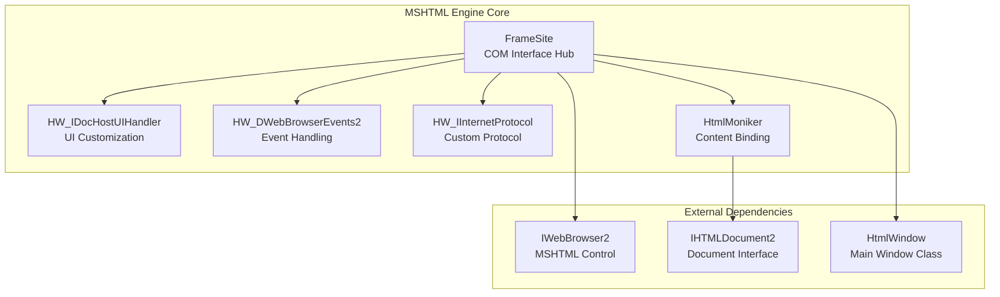
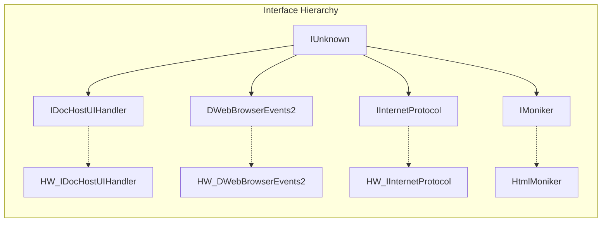
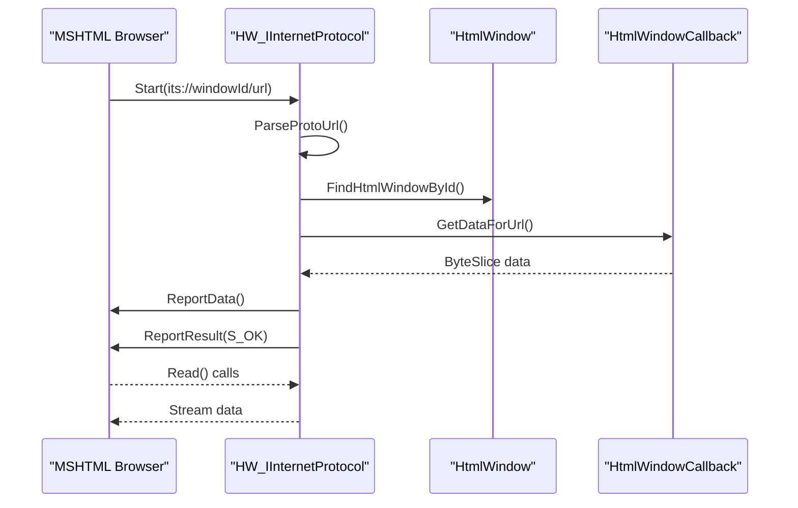
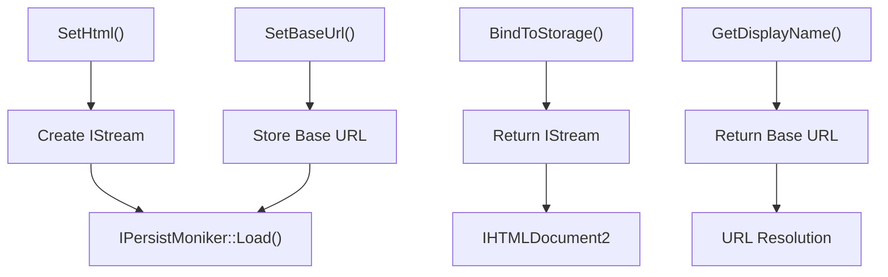
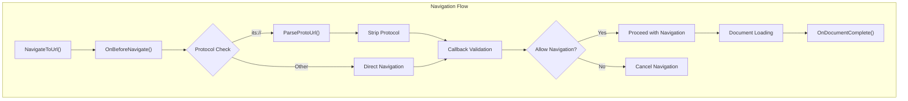
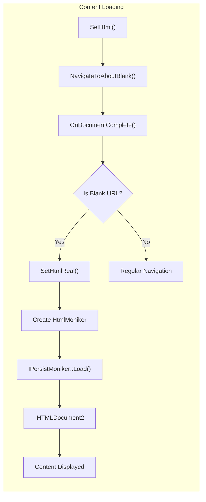
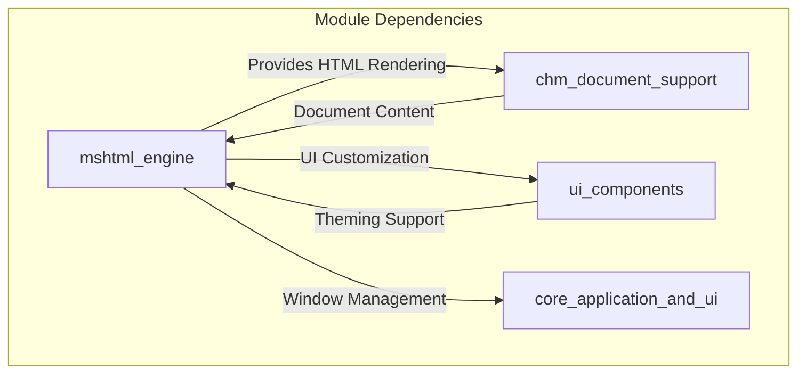

# MSHTML Engine Module Documentation

## Introduction

The MSHTML Engine module provides a comprehensive wrapper around Microsoft's MSHTML (Trident) rendering engine, enabling SumatraPDF to display HTML content and CHM (Compiled HTML Help) documents. This module implements custom COM interfaces and protocol handlers to seamlessly integrate web content rendering within the application's native windowing system.

The module solves critical challenges in displaying CHM documents from network drives and provides a robust framework for handling custom protocols, in-memory HTML content, and complex navigation scenarios.

## Architecture Overview

### Core Components

The MSHTML Engine module consists of five primary components that work together to provide HTML rendering capabilities:



### Component Relationships



## Detailed Component Documentation

### FrameSite - The Central Hub

**Purpose**: FrameSite serves as the central coordination point for all COM interfaces required by the MSHTML engine. It implements a comprehensive set of OLE and COM interfaces needed for proper browser control integration.

**Key Responsibilities**:
- Manages the lifecycle of all COM interface implementations
- Provides interface aggregation and query services
- Coordinates between the HTML window and browser control
- Handles window activation and UI state management

**Interface Implementations**:
- `IOleInPlaceFrame` - Frame window management
- `IOleInPlaceSiteWindowless` - In-place activation support
- `IOleClientSite` - Client site services
- `IOleControlSite` - Control hosting
- `IOleCommandTarget` - Command processing
- `IDocHostUIHandler` - UI customization
- `IDropTarget` - Drag and drop support
- `IServiceProvider` - Service discovery

### HW_IDocHostUIHandler - UI Customization

**Purpose**: Provides comprehensive UI customization capabilities for the hosted browser control, allowing SumatraPDF to maintain consistent visual appearance and behavior.

**Key Features**:
- Disables context menus to prevent external navigation
- Customizes border appearance and 3D effects
- Controls scrollbar behavior and appearance
- Manages host CSS and namespace configurations
- Handles drag target customization

**Integration Points**:
- Works with [core_application_and_ui](core_application_and_ui.md) for consistent theming
- Coordinates with [windows_dark_mode](windows_dark_mode.md) for dark mode support

### HW_DWebBrowserEvents2 - Event Management

**Purpose**: Captures and processes all browser events, providing a bridge between the MSHTML engine and SumatraPDF's navigation system.

**Event Handling**:
- `DISPID_BEFORENAVIGATE2` - Pre-navigation validation
- `DISPID_DOCUMENTCOMPLETE` - Document loading completion
- `DISPID_NAVIGATEERROR` - Navigation error handling
- `DISPID_COMMANDSTATECHANGE` - Browser state changes
- `DISPID_NEWWINDOW3` - New window requests

**Protocol Integration**:
- Intercepts `its://` protocol requests
- Routes navigation through SumatraPDF's document system
- Handles network drive CHM document access

### HW_IInternetProtocol - Custom Protocol Handler

**Purpose**: Implements a custom protocol handler that overrides the `its://` protocol to provide seamless access to CHM documents, particularly from network drives.

**Protocol Flow**:


**Key Features**:
- URL parsing with window ID extraction
- MIME type detection and reporting
- Data streaming with progress notifications
- Error handling for missing content

### HtmlMoniker - Content Binding

**Purpose**: Provides a custom moniker implementation that allows loading HTML content from memory rather than from files or URLs, enabling dynamic content generation and display.

**Content Flow**:


## Data Flow Architecture

### Navigation Process



### Content Loading Process



## Integration with SumatraPDF

### CHM Document Support

The MSHTML Engine is crucial for CHM document rendering, providing:
- Custom protocol handling for `its://` URLs
- Network drive CHM document access
- Embedded image and resource resolution
- Navigation within CHM content

### Relationship to Other Modules



**Related Modules**:
- [core_application_and_ui](core_application_and_ui.md) - Main window management and UI coordination
- [ui_components](ui_components.md) - UI element theming and customization
- [ebook_engines](ebook_engines.md) - CHM document processing and content extraction

## Technical Implementation Details

### COM Interface Management

The module implements a comprehensive set of COM interfaces required for MSHTML integration:

```cpp
// Interface aggregation pattern used in FrameSite
STDMETHODIMP FrameSite::QueryInterface(REFIID riid, void** ppv) {
    if (riid == IID_IDocHostUIHandler) {
        *ppv = docHostUIHandler;
    } else if (riid == IID_DWebBrowserEvents2) {
        *ppv = hwDWebBrowserEvents2;
    }
    // ... additional interface mappings
}
```

### Protocol Registration

The custom protocol handler is registered application-wide:

```cpp
// Registration of custom protocol
HRESULT hr = internetSession->RegisterNameSpace(
    gInternetProtocolFactory, 
    CLSID_HW_IInternetProtocol, 
    HW_PROTO_PREFIX, 0, nullptr, 0
);
```

### Window Management

The module provides sophisticated window subclassing for proper message handling:

```cpp
// Subclassing for message interception
void HtmlWindow::SubclassHwnd() {
    subclassId = NextSubclassId();
    SetWindowSubclass(hwndParent, WndProcParent2, subclassId, (DWORD_PTR)this);
}
```

## Error Handling and Recovery

### Navigation Error Management

The module implements comprehensive error handling for various failure scenarios:

- **INET_E_INVALID_URL**: Malformed protocol URLs
- **INET_E_OBJECT_NOT_FOUND**: Missing window or callback
- **INET_E_DATA_NOT_AVAILABLE**: Content retrieval failures
- **OLE Errors**: COM interface failures

### Resource Cleanup

Proper resource management ensures no memory leaks or COM reference issues:

```cpp
HtmlWindow::~HtmlWindow() {
    UnsubclassHwnd();
    if (connectionPoint) {
        connectionPoint->Unadvise(adviseCookie);
        connectionPoint->Release();
    }
    if (oleObject) {
        oleObject->Close(OLECLOSE_NOSAVE);
        oleObject->SetClientSite(nullptr);
        oleObject->Release();
    }
    // ... additional cleanup
}
```

## Performance Considerations

### Memory Management

- Efficient ByteSlice usage for data transfer
- Stream-based content loading to handle large documents
- Reference counting for COM object lifecycle management

### Threading Model

- STA (Single Threaded Apartment) COM model
- UI thread execution for all browser interactions
- Synchronous protocol handling for immediate response

## Security Considerations

### Content Restrictions

- Silent mode operation prevents script errors
- Disabled context menus prevent external navigation
- Custom protocol limits to internal content only
- Download manager interception for controlled file access

### URL Validation

- Strict protocol URL parsing and validation
- Window ID verification to prevent cross-window access
- Base URL validation for content integrity

## Future Enhancements

### Potential Improvements

1. **WebView2 Integration**: Consider migration to modern WebView2 engine
2. **Async Protocol Handling**: Implement asynchronous protocol processing
3. **Enhanced Error Pages**: Custom error page generation for navigation failures
4. **Performance Monitoring**: Add navigation timing and performance metrics
5. **Accessibility Support**: Enhanced accessibility features for HTML content

### Compatibility Notes

- Designed for Windows platforms with MSHTML support
- Requires Internet Explorer components
- Compatible with Windows 7 and later versions
- Supports both 32-bit and 64-bit architectures

## Conclusion

The MSHTML Engine module provides a robust foundation for HTML content rendering within SumatraPDF, with particular strength in CHM document support. Its custom protocol handling, comprehensive COM interface implementation, and seamless integration with the application's architecture make it an essential component for document viewing capabilities. The module's design allows for future enhancements while maintaining compatibility and performance requirements.