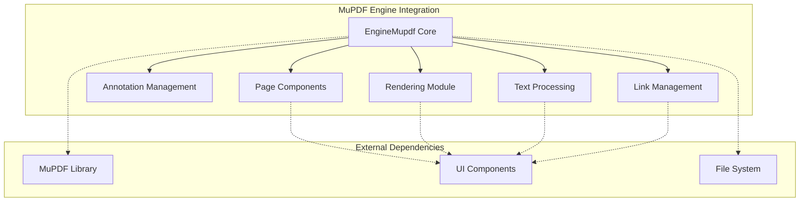

# MuPDF Engine Integration Module

## Overview

The MuPDF Engine Integration module serves as the primary document rendering and processing engine for SumatraPDF, providing comprehensive support for PDF documents and various ebook formats. This module implements a robust wrapper around the MuPDF library, offering high-performance document parsing, rendering, and manipulation capabilities.

## Purpose and Core Functionality

The module's primary responsibilities include:
- **Document Loading and Parsing**: Support for PDF, EPUB, FB2, XPS, and other document formats
- **Page Rendering**: High-quality page rendering with customizable zoom, rotation, and display options
- **Text Extraction**: Full-text extraction and search capabilities
- **Annotation Management**: Comprehensive annotation creation, editing, and management
- **Link Processing**: Internal and external hyperlink handling
- **Document Properties**: Metadata extraction and management
- **Thread-Safe Operations**: Concurrent document access and rendering

## Architecture Overview

## Core Components

### EngineMupdf Core (`src.EngineMupdf`)
The main engine class that orchestrates document operations, providing a unified interface for all document-related functionality. It manages the MuPDF context, handles document loading, and coordinates between different subsystems.

### Page Components (`src.EngineMupdf.PageDestinationMupdf`)
Handles page-level operations including page navigation, coordinate transformations, and page-specific data management. Manages the relationship between logical page numbers and physical document structure.

### Annotation Management (`src.EditAnnotations`)
Provides comprehensive annotation support including creation, modification, deletion, and property management. Supports all standard PDF annotation types and maintains annotation persistence.

### Rendering Module (`src.EngineMupdf.FitzAbortCookie`)
Implements high-performance page rendering with support for different render targets (view, print), quality settings, and abort mechanisms for responsive user experience.

### Text Processing (`src.EngineMupdf.ContextThreadID`)
Handles text extraction, search functionality, and text coordinate mapping. Supports both plain text extraction and structured text with positioning information.

### Link Management
Processes internal document links, external URLs, and file attachments. Provides seamless navigation between document sections and external resources.

## Sub-modules

### [Image Processing](image_processing.md)
Specialized image handling subsystem for processing embedded images, converting between color spaces, and optimizing image rendering performance. Manages MuPDF context creation and Windows-specific image format handling.

### [Filter Integration](filter_integration.md)
Windows Search Filter integration for content indexing and search functionality within the Windows operating system. Provides seamless integration with Windows Explorer search and indexing services.

### [Annotation Editing](annotation_editing.md)
Comprehensive annotation management system supporting creation, modification, deletion, and property management for all standard PDF annotation types. Includes UI components for annotation editing and persistence.

### [Page Management](page_management.md)
Core page-level operations including page navigation, coordinate transformations, destination handling, and thread-safe page access mechanisms. Manages the relationship between logical page numbers and physical document structure.

## Key Features

### Multi-Format Support
- **PDF**: Full PDF specification support including encrypted documents
- **Ebook Formats**: EPUB, FB2, MOBI with reflowable text
- **Document Formats**: XPS, HTML, plain text
- **Image Formats**: Embedded image processing and optimization

### Performance Optimizations
- **Lazy Loading**: Pages and resources loaded on-demand
- **Caching**: Intelligent caching of rendered pages and extracted text
- **Memory Management**: Efficient memory usage with configurable limits
- **Thread Safety**: Concurrent access with proper synchronization

### Advanced Capabilities
- **Annotation Persistence**: Save annotations back to PDF files
- **Form Support**: Interactive form field processing
- **Digital Signatures**: Signature validation and display
- **Accessibility**: Screen reader support and accessibility features
- **Printing**: High-quality print output with proper scaling

## Integration Points

The module integrates with:
- [Core Application and UI](core_application_and_ui.md) - Main application framework
- [Document Navigation](document_navigation.md) - Page navigation and bookmark management
- [Application Services](application_services.md) - File operations and system integration

## Technical Implementation

### Thread Safety
The module implements comprehensive thread safety through:
- Critical sections for document access
- Per-thread MuPDF contexts for concurrent operations
- Lock-free operations where possible for performance

### Error Handling
Robust error handling with:
- Graceful degradation for corrupted documents
- Detailed error reporting and logging
- Recovery mechanisms for partial document loading

### Memory Management
Efficient memory usage through:
- Configurable memory limits
- Automatic resource cleanup
- Memory-mapped file access for large documents

## Configuration and Customization

The module supports extensive configuration options:
- **Display Settings**: DPI, color profiles, rendering quality
- **Performance Tuning**: Cache sizes, memory limits, thread pools
- **Format-Specific**: PDF security settings, ebook layout preferences
- **Accessibility**: Screen reader integration, high contrast support

## Dependencies

### External Libraries
- **MuPDF**: Core PDF and document processing library
- **Windows GDI+**: Image processing and rendering
- **Platform SDK**: System integration and file operations

### Internal Dependencies
- [Core Utilities](core_utilities.md) - Common utility functions
- [Engine Base](engine_base.md) - Base engine interface and contracts

## Performance Characteristics

### Rendering Performance
- Sub-second page rendering for typical documents
- Optimized for common viewing scenarios
- Progressive rendering for large documents

### Memory Usage
- Configurable memory limits (default 32MB for small files)
- Efficient streaming for large documents
- Automatic resource cleanup

### Scalability
- Linear scaling with document size
- Efficient handling of documents with thousands of pages
- Optimized for concurrent user access

This module forms the backbone of SumatraPDF's document processing capabilities, providing a robust, high-performance foundation for all document-related operations while maintaining excellent compatibility with industry-standard document formats.