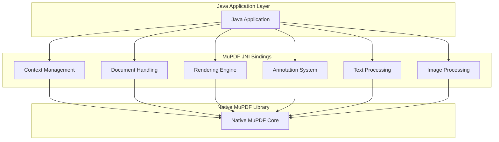
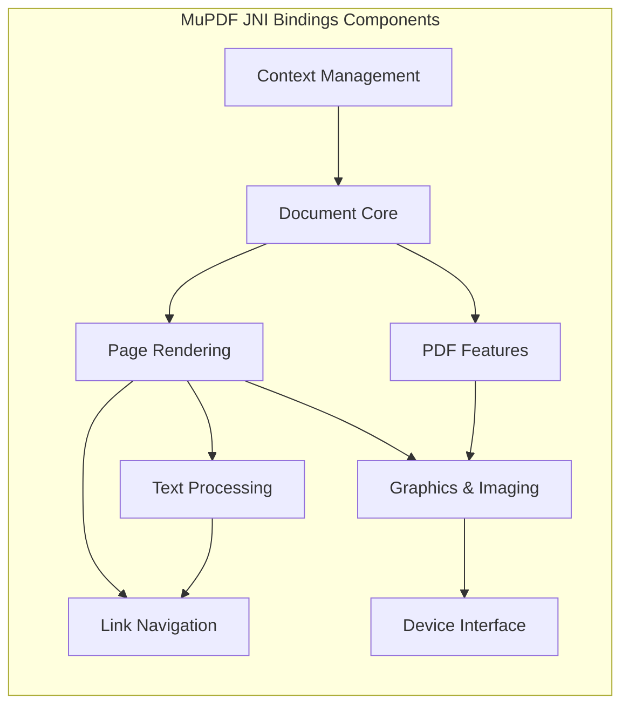
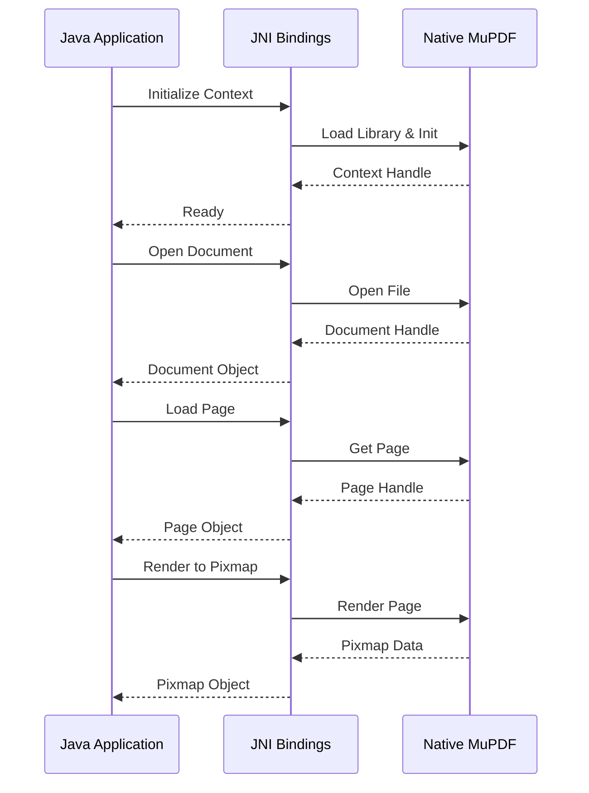

# MuPDF Fitz JNI Bindings Module

## Overview

The `mupdf_fitz_jni_bindings` module provides Java Native Interface (JNI) bindings for the MuPDF Fitz library, enabling Java applications to access MuPDF's powerful document processing, rendering, and manipulation capabilities. This module serves as the bridge between Java applications and the native MuPDF C library, offering comprehensive support for PDF, XPS, CBZ, and other document formats.

## Purpose and Core Functionality

The primary purpose of this module is to:
- Provide Java developers with access to MuPDF's document processing engine
- Enable document rendering, annotation, and manipulation from Java applications
- Support multiple document formats including PDF, XPS, CBZ, and e-book formats
- Offer high-performance native document operations through JNI
- Maintain thread safety and proper memory management across the Java-native boundary

## Architecture Overview



## Module Structure

The module is organized into several key sub-modules, each handling specific aspects of document processing:

### 1. Context Management Sub-module
**File**: [context_management.md](context_management.md)

Manages the MuPDF library initialization, configuration, and global settings. This sub-module handles:
- Library initialization and cleanup
- Memory management and store configuration
- Global settings (ICC profiles, anti-aliasing, CSS)
- Logging and error handling
- Version information

### 2. Document Core Sub-module
**File**: [document_core.md](document_core.md)

Provides the fundamental document handling capabilities including:
- Document opening and closing from various sources (files, buffers, streams)
- Password protection and authentication
- Page navigation and chapter management
- Metadata extraction and modification
- Bookmark creation and management
- Permission handling

### 3. Page Rendering Sub-module
**File**: [page_rendering.md](page_rendering.md)

Handles page content rendering and manipulation:
- Page bounds and geometry management
- Content rendering to various devices
- Display list generation for efficient rendering
- Text extraction and structured text processing
- Link extraction and management
- Barcode detection and decoding

### 4. PDF-Specific Features Sub-module
**File**: [pdf_specific_features.md](pdf_specific_features.md)

Provides PDF-specific functionality beyond basic document handling:
- PDF document creation and manipulation
- Advanced PDF features (forms, JavaScript, layers)
- Page-specific PDF operations
- PDF annotation management
- Redaction support
- Digital signatures and security

### 5. Graphics and Imaging Sub-module
**File**: [graphics_and_imaging.md](graphics_and_imaging.md)

Manages graphics operations and image processing:
- Pixmap creation and manipulation
- Color space management
- Image format conversion and export
- Geometric operations (deskewing, warping)
- Barcode generation and detection
- Font handling and text rendering

### 6. Device Interface Sub-module
**File**: [device_interface.md](device_interface.md)

Provides the abstract device interface for custom rendering:
- Abstract device implementation for custom renderers
- Graphics operation callbacks
- Color management and blending modes
- Structure and metadata handling
- Text and path rendering operations

### 7. Text Processing and Structure Sub-module
**File**: [text_processing.md](text_processing.md)

Handles text extraction and structured content processing:
- Structured text extraction from documents
- Text search and highlighting capabilities
- Text layout analysis and block structure
- HTML and JSON export formats
- Text selection and copying functionality

### 8. Link and Navigation Sub-module
**File**: [link_navigation.md](link_navigation.md)

Manages document navigation and hyperlink functionality:
- Link extraction from documents
- Internal and external link detection
- Link destination resolution
- Navigation between document sections
- URI handling and formatting

## Key Features

### Document Format Support
- **PDF**: Full support including forms, annotations, and advanced features
- **XPS**: Microsoft XML Paper Specification
- **CBZ**: Comic book archives
- **E-book formats**: EPUB, FictionBook, etc.
- **Image formats**: Various raster image formats

### Rendering Capabilities
- High-quality anti-aliased rendering
- Multiple color space support (RGB, CMYK, Grayscale)
- Resolution-independent rendering
- Tile-based rendering for large documents
- Custom device implementation support

### Text Processing
- Structured text extraction
- Text search and highlighting
- Unicode support
- Text layout analysis
- HTML and JSON export

### Annotation Support
- Full PDF annotation support
- Creation, modification, and deletion of annotations
- Rich text content support
- Appearance stream management
- Interactive form field support

## Integration with Other Modules

The MuPDF JNI bindings module integrates with several other system modules:

- **[mupdf_engine_integration.md](mupdf_engine_integration.md)**: Provides the underlying MuPDF engine integration
- **[core_utilities.md](core_utilities.md)**: Utilizes common utilities for file handling and data structures
- **[image_and_comic_book_engine.md](image_and_comic_book_engine.md)**: Shares image processing capabilities

## Component Relationships



## Data Flow Architecture



## Usage Patterns

### Basic Document Opening
```java
// Initialize the library
Context.init();

// Open a document
Document doc = Document.openDocument("document.pdf");

// Load a page
Page page = doc.loadPage(0);

// Render to pixmap
Pixmap pixmap = page.toPixmap(new Matrix(), ColorSpace.DeviceRGB, true);
```

### PDF-Specific Operations
```java
// Cast to PDF document for advanced features
PDFDocument pdfDoc = doc.asPDF();

// Create annotation
PDFAnnotation annot = page.createAnnotation(PDFAnnotation.TYPE_HIGHLIGHT);
annot.setRect(new Rect(100, 100, 200, 200));
annot.setColor(new float[]{1, 1, 0}); // Yellow
```

### Custom Device Implementation
```java
class MyDevice extends Device {
    public void fillPath(Path path, boolean evenOdd, Matrix ctm, 
                        ColorSpace cs, float[] color, float alpha, int cp) {
        // Custom path filling logic
    }
    // Implement other required methods...
}
```

## Performance Considerations

- **Memory Management**: Native resources are automatically managed through finalizers
- **Thread Safety**: Context operations should be synchronized when used across threads
- **Batch Operations**: Use display lists for efficient repeated rendering
- **Resource Cleanup**: Always call `destroy()` methods to release native resources

## Error Handling

The module provides comprehensive error handling through:
- Native exception propagation to Java
- Logging interface for debugging
- Graceful handling of corrupted documents
- Permission-based access control

## Security Features

- Password-protected document support
- Digital signature verification
- Permission-based access control
- Secure document saving with encryption options

This module serves as the foundation for document processing in Java applications, providing a comprehensive and efficient interface to the powerful MuPDF library.