# MuPDF Java Bindings Module Documentation

## Introduction

The MuPDF Java Bindings module provides comprehensive Java language bindings for the MuPDF library, enabling Java applications to leverage MuPDF's powerful document processing, rendering, and manipulation capabilities. This module serves as a bridge between the native MuPDF C library and Java applications, offering a complete API for PDF and other document format operations.

The module is organized into several functional subsystems that work together to provide document loading, rendering, content extraction, interactive features, and security capabilities. It supports multiple document formats including PDF, XPS, EPUB, and various image formats, making it a versatile solution for document processing in Java environments.

## Architecture Overview

The MuPDF Java Bindings module follows a layered architecture that abstracts the complexity of the underlying native MuPDF library while providing Java developers with an intuitive and comprehensive API.

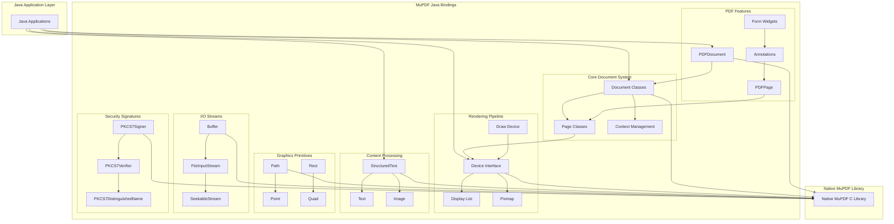
```mermaid
graph TB
    subgraph "Java Application Layer"
        JA[Java Applications]
    end
    
    subgraph "MuPDF Java Bindings"
        subgraph "Core Document System"
            DOC[Document Classes]
            PAGE[Page Classes]
            CTX[Context Management]
        end
        
        subgraph "Rendering Pipeline"
            DEV[Device Interface]
            DL[Display List]
            PIX[Pixmap]
            DD[Draw Device]
        end
        
        subgraph "PDF Features"
            PDFDOC[PDFDocument]
            PDFPAGE[PDFPage]
            ANNOT[Annotations]
            WIDGET[Form Widgets]
        end
        
        subgraph "Content Processing"
            ST[StructuredText]
            TXT[Text]
            IMG[Image]
        end
        
        subgraph "Graphics Primitives"
            PATH[Path]
            POINT[Point]
            RECT[Rect]
            QUAD[Quad]
        end
        
        subgraph "I/O Streams"
            BUF[Buffer]
            FIS[FitzInputStream]
            SS[SeekableStream]
        end
        
        subgraph "Security Signatures"
            PKCS7S[PKCS7Signer]
            PKCS7V[PKCS7Verifier]
            PKCS7DN[PKCS7DistinguishedName]
        end
    end
    
    subgraph "Native MuPDF Library"
        NATIVE[Native MuPDF C Library]
    end
    
    JA --> DOC
    JA --> PDFDOC
    JA --> DEV
    JA --> ST
    
    DOC --> CTX
    DOC --> PAGE
    PDFDOC --> DOC
    PDFPAGE --> PAGE
    
    PAGE --> DEV
    DEV --> DL
    DEV --> PIX
    DD --> DEV
    
    ANNOT --> PDFPAGE
    WIDGET --> ANNOT
    
    ST --> TXT
    ST --> IMG
    
    PATH --> POINT
    RECT --> QUAD
    
    BUF --> FIS
    FIS --> SS
    
    PKCS7S --> PKCS7V
    PKCS7V --> PKCS7DN
    
    DOC --> NATIVE
    DEV --> NATIVE
    PDFDOC --> NATIVE
    ST --> NATIVE
    PATH --> NATIVE
    BUF --> NATIVE
    PKCS7S --> NATIVE
```

## Core Components

### Document Core System

The document core system provides the fundamental infrastructure for document loading, navigation, and management. It establishes the foundation upon which all other functionality is built.

#### Document Class

The `Document` class serves as the primary entry point for document operations. It provides comprehensive document loading capabilities from various sources including files, byte arrays, and streams, with optional accelerator support for improved performance.

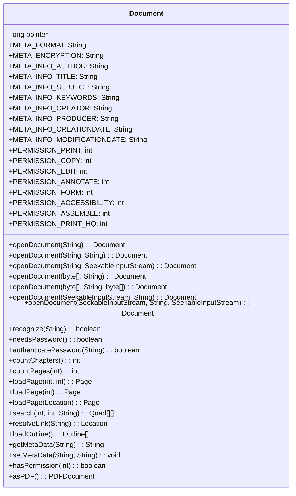
```mermaid
classDiagram
    class Document {
        -long pointer
        +META_FORMAT: String
        +META_ENCRYPTION: String
        +META_INFO_AUTHOR: String
        +META_INFO_TITLE: String
        +META_INFO_SUBJECT: String
        +META_INFO_KEYWORDS: String
        +META_INFO_CREATOR: String
        +META_INFO_PRODUCER: String
        +META_INFO_CREATIONDATE: String
        +META_INFO_MODIFICATIONDATE: String
        +PERMISSION_PRINT: int
        +PERMISSION_COPY: int
        +PERMISSION_EDIT: int
        +PERMISSION_ANNOTATE: int
        +PERMISSION_FORM: int
        +PERMISSION_ACCESSIBILITY: int
        +PERMISSION_ASSEMBLE: int
        +PERMISSION_PRINT_HQ: int
        +openDocument(String): Document
        +openDocument(String, String): Document
        +openDocument(String, SeekableInputStream): Document
        +openDocument(byte[], String): Document
        +openDocument(byte[], String, byte[]): Document
        +openDocument(SeekableInputStream, String): Document
        +openDocument(SeekableInputStream, String, SeekableInputStream): Document
        +recognize(String): boolean
        +needsPassword(): boolean
        +authenticatePassword(String): boolean
        +countChapters(): int
        +countPages(int): int
        +loadPage(int, int): Page
        +loadPage(int): Page
        +loadPage(Location): Page
        +search(int, int, String): Quad[][]
        +resolveLink(String): Location
        +loadOutline(): Outline[]
        +getMetaData(String): String
        +setMetaData(String, String): void
        +hasPermission(int): boolean
        +asPDF(): PDFDocument
    }
```

The Document class provides extensive metadata support, allowing applications to access document properties such as author, title, subject, and creation dates. It also implements a sophisticated permission system that controls access to various document operations like printing, copying, and editing.

#### Page Class

The `Page` class represents individual pages within documents and provides the interface for page-specific operations including rendering, text extraction, and link management.

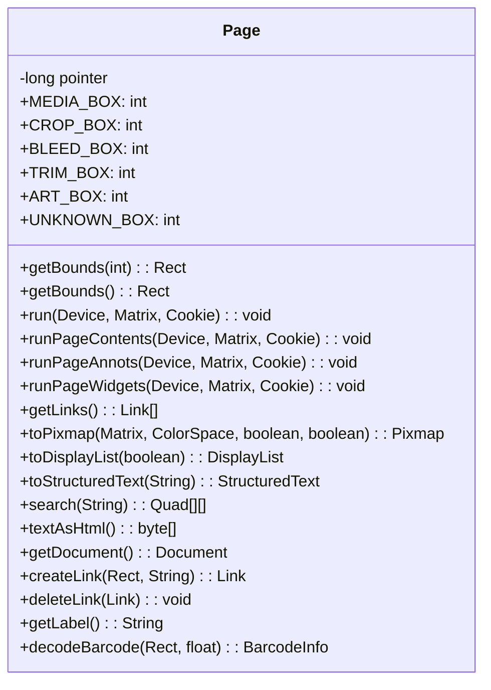
```mermaid
classDiagram
    class Page {
        -long pointer
        +MEDIA_BOX: int
        +CROP_BOX: int
        +BLEED_BOX: int
        +TRIM_BOX: int
        +ART_BOX: int
        +UNKNOWN_BOX: int
        +getBounds(int): Rect
        +getBounds(): Rect
        +run(Device, Matrix, Cookie): void
        +runPageContents(Device, Matrix, Cookie): void
        +runPageAnnots(Device, Matrix, Cookie): void
        +runPageWidgets(Device, Matrix, Cookie): void
        +getLinks(): Link[]
        +toPixmap(Matrix, ColorSpace, boolean, boolean): Pixmap
        +toDisplayList(boolean): DisplayList
        +toStructuredText(String): StructuredText
        +search(String): Quad[][]
        +textAsHtml(): byte[]
        +getDocument(): Document
        +createLink(Rect, String): Link
        +deleteLink(Link): void
        +getLabel(): String
        +decodeBarcode(Rect, float): BarcodeInfo
    }
```

#### Context Management

The `Context` class handles the initialization and configuration of the MuPDF library. It manages the loading of native libraries and provides global configuration options.

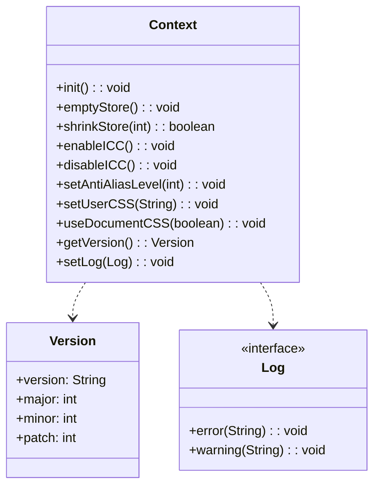
```mermaid
classDiagram
    class Context {
        +init(): void
        +emptyStore(): void
        +shrinkStore(int): boolean
        +enableICC(): void
        +disableICC(): void
        +setAntiAliasLevel(int): void
        +setUserCSS(String): void
        +useDocumentCSS(boolean): void
        +getVersion(): Version
        +setLog(Log): void
    }
    
    class Version {
        +version: String
        +major: int
        +minor: int
        +patch: int
    }
    
    class Log {
        <<interface>>
        +error(String): void
        +warning(String): void
    }
    
    Context ..> Version
    Context ..> Log
```

### Rendering System

The rendering system provides comprehensive capabilities for converting document content into various output formats including pixmaps, display lists, and structured text.

#### Device Interface

The `Device` class serves as an abstract base class for implementing custom rendering devices. It defines the complete rendering pipeline interface that processes various document elements.

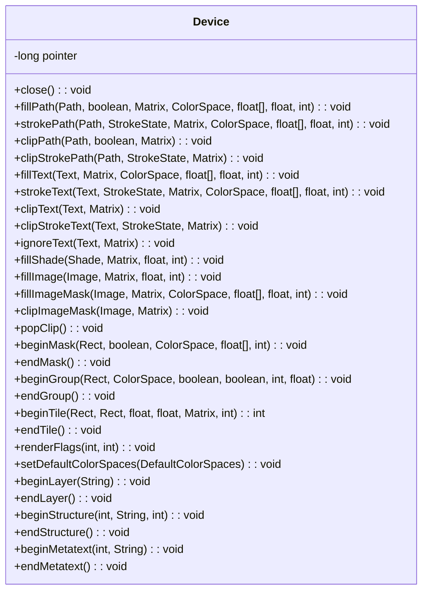
```mermaid
classDiagram
    class Device {
        -long pointer
        +close(): void
        +fillPath(Path, boolean, Matrix, ColorSpace, float[], float, int): void
        +strokePath(Path, StrokeState, Matrix, ColorSpace, float[], float, int): void
        +clipPath(Path, boolean, Matrix): void
        +clipStrokePath(Path, StrokeState, Matrix): void
        +fillText(Text, Matrix, ColorSpace, float[], float, int): void
        +strokeText(Text, StrokeState, Matrix, ColorSpace, float[], float, int): void
        +clipText(Text, Matrix): void
        +clipStrokeText(Text, StrokeState, Matrix): void
        +ignoreText(Text, Matrix): void
        +fillShade(Shade, Matrix, float, int): void
        +fillImage(Image, Matrix, float, int): void
        +fillImageMask(Image, Matrix, ColorSpace, float[], float, int): void
        +clipImageMask(Image, Matrix): void
        +popClip(): void
        +beginMask(Rect, boolean, ColorSpace, float[], int): void
        +endMask(): void
        +beginGroup(Rect, ColorSpace, boolean, boolean, int, float): void
        +endGroup(): void
        +beginTile(Rect, Rect, float, float, Matrix, int): int
        +endTile(): void
        +renderFlags(int, int): void
        +setDefaultColorSpaces(DefaultColorSpaces): void
        +beginLayer(String): void
        +endLayer(): void
        +beginStructure(int, String, int): void
        +endStructure(): void
        +beginMetatext(int, String): void
        +endMetatext(): void
    }
```

#### Display List

The `DisplayList` class provides an intermediate representation of rendered content that can be efficiently reused for multiple rendering operations.

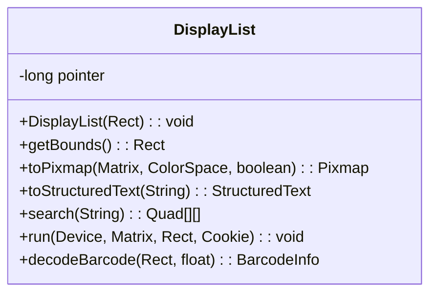
```mermaid
classDiagram
    class DisplayList {
        -long pointer
        +DisplayList(Rect): void
        +getBounds(): Rect
        +toPixmap(Matrix, ColorSpace, boolean): Pixmap
        +toStructuredText(String): StructuredText
        +search(String): Quad[][]
        +run(Device, Matrix, Rect, Cookie): void
        +decodeBarcode(Rect, float): BarcodeInfo
    }
```

#### Pixmap

The `Pixmap` class represents rasterized images and provides comprehensive image manipulation capabilities including format conversion, filtering, and barcode processing.

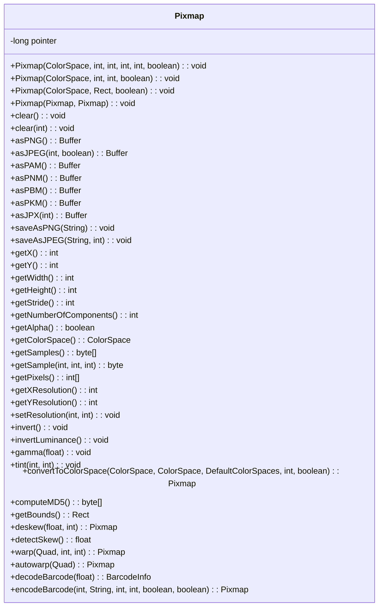
```mermaid
classDiagram
    class Pixmap {
        -long pointer
        +Pixmap(ColorSpace, int, int, int, int, boolean): void
        +Pixmap(ColorSpace, int, int, boolean): void
        +Pixmap(ColorSpace, Rect, boolean): void
        +Pixmap(Pixmap, Pixmap): void
        +clear(): void
        +clear(int): void
        +asPNG(): Buffer
        +asJPEG(int, boolean): Buffer
        +asPAM(): Buffer
        +asPNM(): Buffer
        +asPBM(): Buffer
        +asPKM(): Buffer
        +asJPX(int): Buffer
        +saveAsPNG(String): void
        +saveAsJPEG(String, int): void
        +getX(): int
        +getY(): int
        +getWidth(): int
        +getHeight(): int
        +getStride(): int
        +getNumberOfComponents(): int
        +getAlpha(): boolean
        +getColorSpace(): ColorSpace
        +getSamples(): byte[]
        +getSample(int, int, int): byte
        +getPixels(): int[]
        +getXResolution(): int
        +getYResolution(): int
        +setResolution(int, int): void
        +invert(): void
        +invertLuminance(): void
        +gamma(float): void
        +tint(int, int): void
        +convertToColorSpace(ColorSpace, ColorSpace, DefaultColorSpaces, int, boolean): Pixmap
        +computeMD5(): byte[]
        +getBounds(): Rect
        +deskew(float, int): Pixmap
        +detectSkew(): float
        +warp(Quad, int, int): Pixmap
        +autowarp(Quad): Pixmap
        +decodeBarcode(float): BarcodeInfo
        +encodeBarcode(int, String, int, int, boolean, boolean): Pixmap
    }
```

### PDF Features

The PDF features subsystem provides specialized functionality for working with PDF documents, including form handling, annotations, and advanced PDF-specific operations.

#### PDFDocument Class

The `PDFDocument` class extends the base Document class with PDF-specific functionality including form handling, digital signatures, and document manipulation.

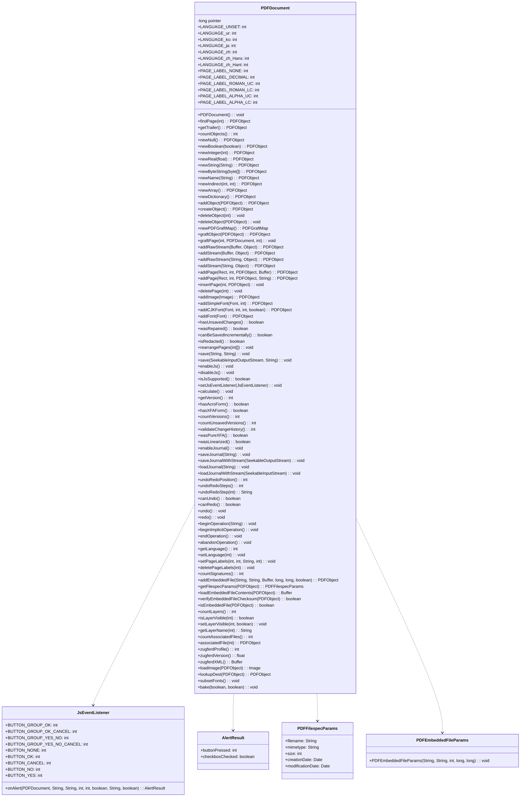
```mermaid
classDiagram
    class PDFDocument {
        -long pointer
        +LANGUAGE_UNSET: int
        +LANGUAGE_ur: int
        +LANGUAGE_ko: int
        +LANGUAGE_ja: int
        +LANGUAGE_zh: int
        +LANGUAGE_zh_Hans: int
        +LANGUAGE_zh_Hant: int
        +PAGE_LABEL_NONE: int
        +PAGE_LABEL_DECIMAL: int
        +PAGE_LABEL_ROMAN_UC: int
        +PAGE_LABEL_ROMAN_LC: int
        +PAGE_LABEL_ALPHA_UC: int
        +PAGE_LABEL_ALPHA_LC: int
        +PDFDocument(): void
        +findPage(int): PDFObject
        +getTrailer(): PDFObject
        +countObjects(): int
        +newNull(): PDFObject
        +newBoolean(boolean): PDFObject
        +newInteger(int): PDFObject
        +newReal(float): PDFObject
        +newString(String): PDFObject
        +newByteString(byte[]): PDFObject
        +newName(String): PDFObject
        +newIndirect(int, int): PDFObject
        +newArray(): PDFObject
        +newDictionary(): PDFObject
        +addObject(PDFObject): PDFObject
        +createObject(): PDFObject
        +deleteObject(int): void
        +deleteObject(PDFObject): void
        +newPDFGraftMap(): PDFGraftMap
        +graftObject(PDFObject): PDFObject
        +graftPage(int, PDFDocument, int): void
        +addRawStream(Buffer, Object): PDFObject
        +addStream(Buffer, Object): PDFObject
        +addRawStream(String, Object): PDFObject
        +addStream(String, Object): PDFObject
        +addPage(Rect, int, PDFObject, Buffer): PDFObject
        +addPage(Rect, int, PDFObject, String): PDFObject
        +insertPage(int, PDFObject): void
        +deletePage(int): void
        +addImage(Image): PDFObject
        +addSimpleFont(Font, int): PDFObject
        +addCJKFont(Font, int, int, boolean): PDFObject
        +addFont(Font): PDFObject
        +hasUnsavedChanges(): boolean
        +wasRepaired(): boolean
        +canBeSavedIncrementally(): boolean
        +isRedacted(): boolean
        +rearrangePages(int[]): void
        +save(String, String): void
        +save(SeekableInputOutputStream, String): void
        +enableJs(): void
        +disableJs(): void
        +isJsSupported(): boolean
        +setJsEventListener(JsEventListener): void
        +calculate(): void
        +getVersion(): int
        +hasAcroForm(): boolean
        +hasXFAForm(): boolean
        +countVersions(): int
        +countUnsavedVersions(): int
        +validateChangeHistory(): int
        +wasPureXFA(): boolean
        +wasLinearized(): boolean
        +enableJournal(): void
        +saveJournal(String): void
        +saveJournalWithStream(SeekableOutputStream): void
        +loadJournal(String): void
        +loadJournalWithStream(SeekableInputStream): void
        +undoRedoPosition(): int
        +undoRedoSteps(): int
        +undoRedoStep(int): String
        +canUndo(): boolean
        +canRedo(): boolean
        +undo(): void
        +redo(): void
        +beginOperation(String): void
        +beginImplicitOperation(): void
        +endOperation(): void
        +abandonOperation(): void
        +getLanguage(): int
        +setLanguage(int): void
        +setPageLabels(int, int, String, int): void
        +deletePageLabels(int): void
        +countSignatures(): int
        +addEmbeddedFile(String, String, Buffer, long, long, boolean): PDFObject
        +getFilespecParams(PDFObject): PDFFilespecParams
        +loadEmbeddedFileContents(PDFObject): Buffer
        +verifyEmbeddedFileChecksum(PDFObject): boolean
        +isEmbeddedFile(PDFObject): boolean
        +countLayers(): int
        +isLayerVisible(int): boolean
        +setLayerVisible(int, boolean): void
        +getLayerName(int): String
        +countAssociatedFiles(): int
        +associatedFile(int): PDFObject
        +zugferdProfile(): int
        +zugferdVersion(): float
        +zugferdXML(): Buffer
        +loadImage(PDFObject): Image
        +lookupDest(PDFObject): PDFObject
        +subsetFonts(): void
        +bake(boolean, boolean): void
    }
    
    class JsEventListener {
        +BUTTON_GROUP_OK: int
        +BUTTON_GROUP_OK_CANCEL: int
        +BUTTON_GROUP_YES_NO: int
        +BUTTON_GROUP_YES_NO_CANCEL: int
        +BUTTON_NONE: int
        +BUTTON_OK: int
        +BUTTON_CANCEL: int
        +BUTTON_NO: int
        +BUTTON_YES: int
        +onAlert(PDFDocument, String, String, int, int, boolean, String, boolean): AlertResult
    }
    
    class AlertResult {
        +buttonPressed: int
        +checkboxChecked: boolean
    }
    
    class PDFFilespecParams {
        +filename: String
        +mimetype: String
        +size: int
        +creationDate: Date
        +modificationDate: Date
    }
    
    class PDFEmbeddedFileParams {
        +PDFEmbeddedFileParams(String, String, int, long, long): void
    }
    
    PDFDocument ..> JsEventListener
    PDFDocument ..> AlertResult
    PDFDocument ..> PDFFilespecParams
    PDFDocument ..> PDFEmbeddedFileParams
```

#### PDFPage Class

The `PDFPage` class extends the base Page class with PDF-specific page operations including annotation management, form widget handling, and redaction capabilities.

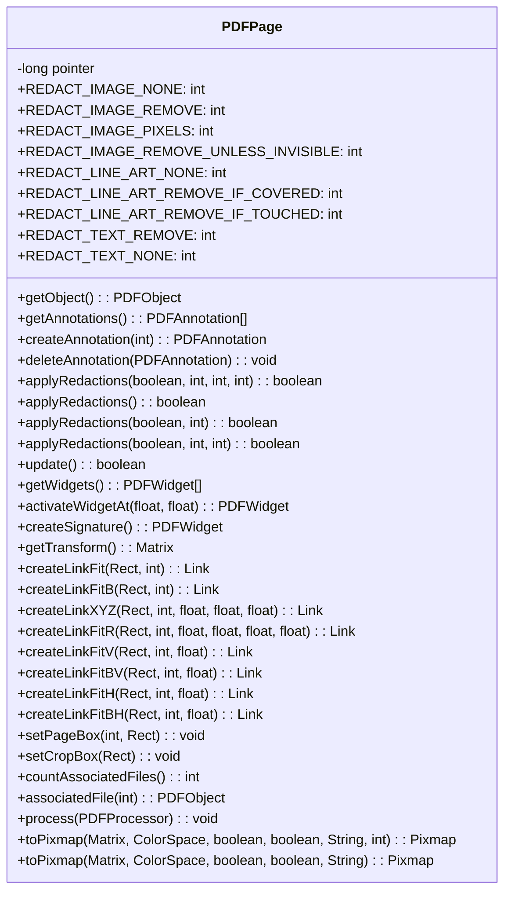
```mermaid
classDiagram
    class PDFPage {
        -long pointer
        +REDACT_IMAGE_NONE: int
        +REDACT_IMAGE_REMOVE: int
        +REDACT_IMAGE_PIXELS: int
        +REDACT_IMAGE_REMOVE_UNLESS_INVISIBLE: int
        +REDACT_LINE_ART_NONE: int
        +REDACT_LINE_ART_REMOVE_IF_COVERED: int
        +REDACT_LINE_ART_REMOVE_IF_TOUCHED: int
        +REDACT_TEXT_REMOVE: int
        +REDACT_TEXT_NONE: int
        +getObject(): PDFObject
        +getAnnotations(): PDFAnnotation[]
        +createAnnotation(int): PDFAnnotation
        +deleteAnnotation(PDFAnnotation): void
        +applyRedactions(boolean, int, int, int): boolean
        +applyRedactions(): boolean
        +applyRedactions(boolean, int): boolean
        +applyRedactions(boolean, int, int): boolean
        +update(): boolean
        +getWidgets(): PDFWidget[]
        +activateWidgetAt(float, float): PDFWidget
        +createSignature(): PDFWidget
        +getTransform(): Matrix
        +createLinkFit(Rect, int): Link
        +createLinkFitB(Rect, int): Link
        +createLinkXYZ(Rect, int, float, float, float): Link
        +createLinkFitR(Rect, int, float, float, float, float): Link
        +createLinkFitV(Rect, int, float): Link
        +createLinkFitBV(Rect, int, float): Link
        +createLinkFitH(Rect, int, float): Link
        +createLinkFitBH(Rect, int, float): Link
        +setPageBox(int, Rect): void
        +setCropBox(Rect): void
        +countAssociatedFiles(): int
        +associatedFile(int): PDFObject
        +process(PDFProcessor): void
        +toPixmap(Matrix, ColorSpace, boolean, boolean, String, int): Pixmap
        +toPixmap(Matrix, ColorSpace, boolean, boolean, String): Pixmap
    }
```

#### PDFAnnotation Class

The `PDFAnnotation` class provides comprehensive support for PDF annotations including text markup, geometric shapes, and interactive elements.


```mermaid
classDiagram
    class PDFAnnotation {
        -long pointer
        +TYPE_TEXT: int
        +TYPE_LINK: int
        +TYPE_FREE_TEXT: int
        +TYPE_LINE: int
        +TYPE_SQUARE: int
        +TYPE_CIRCLE: int
        +TYPE_POLYGON: int
        +TYPE_POLY_LINE: int
        +TYPE_HIGHLIGHT: int
        +TYPE_UNDERLINE: int
        +TYPE_SQUIGGLY: int
        +TYPE_STRIKE_OUT: int
        +TYPE_REDACT: int
        +TYPE_STAMP: int
        +TYPE_CARET: int
        +TYPE_INK: int
        +TYPE_POPUP: int
        +TYPE_FILE_ATTACHMENT: int
        +TYPE_SOUND: int
        +TYPE_MOVIE: int
        +TYPE_RICH_MEDIA: int
        +TYPE_WIDGET: int
        +TYPE_SCREEN: int
        +TYPE_PRINTER_MARK: int
        +TYPE_TRAP_NET: int
        +TYPE_WATERMARK: int
        +TYPE_3D: int
        +TYPE_PROJECTION: int
        +TYPE_UNKNOWN: int
        +run(Device, Matrix, Cookie): void
        +toPixmap(Matrix, ColorSpace, boolean): Pixmap
        +getBounds(): Rect
        +toDisplayList(): DisplayList
        +getType(): int
        +getFlags(): int
        +setFlags(int): void
        +getContents(): String
        +setContents(String): void
        +hasRichContents(): boolean
        +getRichContents(): String
        +setRichContents(String, String): void
        +hasRichDefaults(): boolean
        +getRichDefaults(): String
        +setRichDefaults(String): void
        +getColor(): float[]
        +setColor(float[]): void
        +getOpacity(): float
        +setOpacity(float): void
        +getCreationDate(): Date
        +setCreationDate(Date): void
        +getModificationDate(): Date
        +setModificationDate(Date): void
        +hasRect(): boolean
        +getRect(): Rect
        +setRect(Rect): void
        +hasInteriorColor(): boolean
        +getInteriorColor(): float[]
        +setInteriorColor(float[]): void
        +hasAuthor(): boolean
        +getAuthor(): String
        +setAuthor(String): void
        +hasLineEndingStyles(): boolean
        +getLineEndingStyles(): int[]
        +setLineEndingStyles(int, int): void
        +setLineEndingStyles(int[]): void
        +hasBorder(): boolean
        +getBorderStyle(): int
        +setBorderStyle(int): void
        +getBorderWidth(): float
        +setBorderWidth(float): void
        +getBorderDashCount(): int
        +getBorderDashItem(int): float
        +clearBorderDash(): void
        +addBorderDashItem(float): void
        +setBorderDashPattern(float[]): void
        +hasBorderEffect(): boolean
        +getBorderEffect(): int
        +setBorderEffect(int): void
        +getBorderEffectIntensity(): float
        +setBorderEffectIntensity(float): void
        +hasQuadPoints(): boolean
        +getQuadPointCount(): int
        +getQuadPoint(int): Quad
        +clearQuadPoints(): void
        +addQuadPoint(Quad): void
        +getQuadPoints(): Quad[]
        +setQuadPoints(Quad[]): void
        +hasVertices(): boolean
        +getVertexCount(): int
        +getVertex(int): Point
        +clearVertices(): void
        +addVertex(float, float): void
        +addVertex(Point): void
        +getVertices(): Point[]
        +setVertices(Point[]): void
        +hasInkList(): boolean
        +getInkListCount(): int
        +getInkListStrokeCount(int): int
        +getInkListStrokeVertex(int, int): Point
        +clearInkList(): void
        +addInkListStroke(): void
        +addInkListStrokeVertex(float, float): void
        +addInkListStrokeVertex(Point): void
        +addInkList(Point[]): void
        +setInkList(Point[][]): void
        +getInkList(): Point[][]
        +hasCallout(): boolean
        +getCalloutStyle(): int
        +setCalloutStyle(int): void
        +getCalloutPoint(): Point
        +setCalloutPoint(Point): void
        +getCalloutLine(): Point[]
        +setCalloutLineNative(int, Point, Point, Point): void
        +setCalloutLine(): void
        +setCalloutLine(Point[]): void
        +hasIcon(): boolean
        +getIcon(): String
        +setIcon(String): void
        +hasPopup(): boolean
        +getPopup(): Rect
        +setPopup(Rect): void
        +hasOpen(): boolean
        +getIsOpen(): boolean
        +setIsOpen(boolean): void
        +hasLine(): boolean
        +getLine(): Point[]
        +setLine(Point, Point): void
        +getLineLeader(): float
        +setLineLeader(float): void
        +getLineLeaderExtension(): float
        +setLineLeaderExtension(float): void
        +getLineLeaderOffset(): float
        +setLineLeaderOffset(float): void
        +getLineCaption(): boolean
        +setLineCaption(boolean): void
        +getLineCaptionOffset(): Point
        +setLineCaptionOffset(Point): void
        +hasFilespec(): boolean
        +setFilespec(PDFObject): void
        +getFilespec(): PDFObject
        +hasIntent(): boolean
        +getIntent(): int
        +setIntent(int): void
        +eventEnter(): void
        +eventExit(): void
        +eventDown(): void
        +eventUp(): void
        +eventFocus(): void
        +eventBlur(): void
        +requestSynthesis(): void
        +requestResynthesis(): void
        +update(): boolean
        +getHot(): boolean
        +setHot(boolean): void
        +getObject(): PDFObject
        +getLanguage(): int
        +setLanguage(int): void
        +hasQuadding(): boolean
        +getQuadding(): int
        +setQuadding(int): void
        +hasDefaultAppearance(): boolean
        +getDefaultAppearance(): DefaultAppearance
        +setDefaultAppearance(String, float, float[]): void
        +setAppearance(String, String, Matrix, Rect, PDFObject, Buffer): void
        +setAppearance(String, Matrix, Rect, PDFObject, Buffer): void
        +setAppearance(String, Rect, PDFObject, Buffer): void
        +setAppearance(Matrix, Rect, PDFObject, Buffer): void
        +setAppearance(Rect, PDFObject, Buffer): void
        +setAppearance(String, String, Matrix, DisplayList): void
        +setAppearance(String, Matrix, DisplayList): void
        +setAppearance(String, DisplayList): void
        +setAppearance(Matrix, DisplayList): void
        +setAppearance(DisplayList): void
        +setAppearance(Image): void
        +getStampImageObject(): PDFObject
        +setStampImageObject(PDFObject): void
        +setStampImage(Image): void
        +getHiddenForEditing(): boolean
        +setHiddenForEditing(boolean): void
        +applyRedaction(boolean): boolean
        +applyRedaction(boolean, int): boolean
        +applyRedaction(boolean, int, int): boolean
        +applyRedaction(boolean, int, int, int): boolean
        +process(PDFProcessor): void
    }
```

#### PDFWidget Class

The `PDFWidget` class extends PDFAnnotation to provide specialized support for interactive form widgets including text fields, buttons, and signature fields.


```mermaid
classDiagram
    class PDFWidget {
        +TYPE_UNKNOWN: int
        +TYPE_BUTTON: int
        +TYPE_CHECKBOX: int
        +TYPE_COMBOBOX: int
        +TYPE_LISTBOX: int
        +TYPE_RADIOBUTTON: int
        +TYPE_SIGNATURE: int
        +TYPE_TEXT: int
        +TX_FORMAT_NONE: int
        +TX_FORMAT_NUMBER: int
        +TX_FORMAT_SPECIAL: int
        +TX_FORMAT_DATE: int
        +TX_FORMAT_TIME: int
        +FIELD_IS_READ_ONLY: int
        +FIELD_IS_REQUIRED: int
        +FIELD_IS_NO_EXPORT: int
        +TX_FIELD_IS_MULTILINE: int
        +TX_FIELD_IS_PASSWORD: int
        +TX_FIELD_IS_COMB: int
        +BTN_FIELD_IS_NO_TOGGLE_TO_OFF: int
        +BTN_FIELD_IS_RADIO: int
        +BTN_FIELD_IS_PUSHBUTTON: int
        +CH_FIELD_IS_COMBO: int
        +CH_FIELD_IS_EDIT: int
        +CH_FIELD_IS_SORT: int
        +CH_FIELD_IS_MULTI_SELECT: int
        +SIGNATURE_SHOW_LABELS: int
        +SIGNATURE_SHOW_DN: int
        +SIGNATURE_SHOW_DATE: int
        +SIGNATURE_SHOW_TEXT_NAME: int
        +SIGNATURE_SHOW_GRAPHIC_NAME: int
        +SIGNATURE_SHOW_LOGO: int
        +SIGNATURE_DEFAULT_APPEARANCE: int
        +SIGNATURE_ERROR_OKAY: int
        +SIGNATURE_ERROR_NO_SIGNATURES: int
        +SIGNATURE_ERROR_NO_CERTIFICATE: int
        +SIGNATURE_ERROR_DIGEST_FAILURE: int
        +SIGNATURE_ERROR_SELF_SIGNED: int
        +SIGNATURE_ERROR_SELF_SIGNED_IN_CHAIN: int
        +SIGNATURE_ERROR_NOT_TRUSTED: int
        +SIGNATURE_ERROR_NOT_SIGNED: int
        +SIGNATURE_ERROR_UNKNOWN: int
        +getFieldType(): int
        +getFieldFlags(): int
        +isReadOnly(): boolean
        +getValue(): String
        +setValue(String): boolean
        +getLabel(): String
        +getName(): String
        +isButton(): boolean
        +isPushButton(): boolean
        +isCheckbox(): boolean
        +isRadioButton(): boolean
        +toggle(): boolean
        +isText(): boolean
        +isMultiline(): boolean
        +isPassword(): boolean
        +isComb(): boolean
        +getMaxLen(): int
        +getTextFormat(): int
        +setTextValue(String): boolean
        +getEditingState(): boolean
        +setEditingState(boolean): void
        +textQuads(): Quad[]
        +setEditing(boolean): void
        +isEditing(): boolean
        +startEditing(): void
        +cancelEditing(): void
        +commitEditing(String): boolean
        +isChoice(): boolean
        +isComboBox(): boolean
        +isListBox(): boolean
        +getOptions(): String[]
        +setChoiceValue(String): boolean
        +previewSignature(int, int, int, PKCS7Signer, int, Image, String, String): Pixmap
        +previewSignature(int, int, int, PKCS7Signer, Image): Pixmap
        +previewSignature(int, int, PKCS7Signer, int, Image, String, String): Pixmap
        +previewSignature(int, int, PKCS7Signer, Image): Pixmap
        +previewSignature(int, int, PKCS7Signer): Pixmap
        +previewSignature(float, PKCS7Signer, int, Image, String, String): Pixmap
        +previewSignature(float, PKCS7Signer, Image): Pixmap
        +previewSignature(float, PKCS7Signer): Pixmap
        +sign(PKCS7Signer, int, Image, String, String): boolean
        +sign(PKCS7Signer, Image): boolean
        +sign(PKCS7Signer): boolean
        +checkCertificate(PKCS7Verifier): int
        +checkDigest(PKCS7Verifier): int
        +incrementalChangeSinceSigning(): boolean
        +incrementalChangeAfterSigning(): boolean
        +verify(PKCS7Verifier): boolean
        +getDistinguishedName(PKCS7Verifier): PKCS7DistinguishedName
        +getSignatory(PKCS7Verifier): String
        +incrementalChangesSinceSigning(): boolean
        +validateSignature(): int
        +clearSignature(): void
        +isSigned(): boolean
        +layoutTextWidget(): TextWidgetLayout
    }
    
    class TextWidgetLayout {
        +matrix: Matrix
        +invMatrix: Matrix
        +lines: TextWidgetLineLayout[]
    }
    
    class TextWidgetLineLayout {
        +x: float
        +y: float
        +fontSize: float
        +index: int
        +rect: Rect
        +chars: TextWidgetCharLayout[]
    }
    
    class TextWidgetCharLayout {
        +x: float
        +advance: float
        +index: int
        +rect: Rect
    }
    
    PDFWidget ..> TextWidgetLayout
    TextWidgetLayout ..> TextWidgetLineLayout
    TextWidgetLineLayout ..> TextWidgetCharLayout
```

### Content Extraction

The content extraction subsystem provides functionality for extracting text, images, and structured content from documents.

#### StructuredText Class

The `StructuredText` class represents document content in a structured format that preserves reading order and layout information.

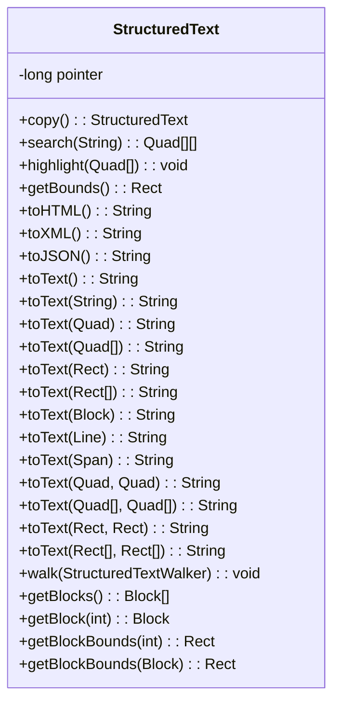
```mermaid
classDiagram
    class StructuredText {
        -long pointer
        +copy(): StructuredText
        +search(String): Quad[][]
        +highlight(Quad[]): void
        +getBounds(): Rect
        +toHTML(): String
        +toXML(): String
        +toJSON(): String
        +toText(): String
        +toText(String): String
        +toText(Quad): String
        +toText(Quad[]): String
        +toText(Rect): String
        +toText(Rect[]): String
        +toText(Block): String
        +toText(Line): String
        +toText(Span): String
        +toText(Quad, Quad): String
        +toText(Quad[], Quad[]): String
        +toText(Rect, Rect): String
        +toText(Rect[], Rect[]): String
        +walk(StructuredTextWalker): void
        +getBlocks(): Block[]
        +getBlock(int): Block
        +getBlockBounds(int): Rect
        +getBlockBounds(Block): Rect
    }
```

### Graphics Primitives

The graphics primitives subsystem provides fundamental geometric objects and operations used throughout the rendering pipeline.

#### Path Class

The `Path` class represents vector paths used for drawing operations and clipping.

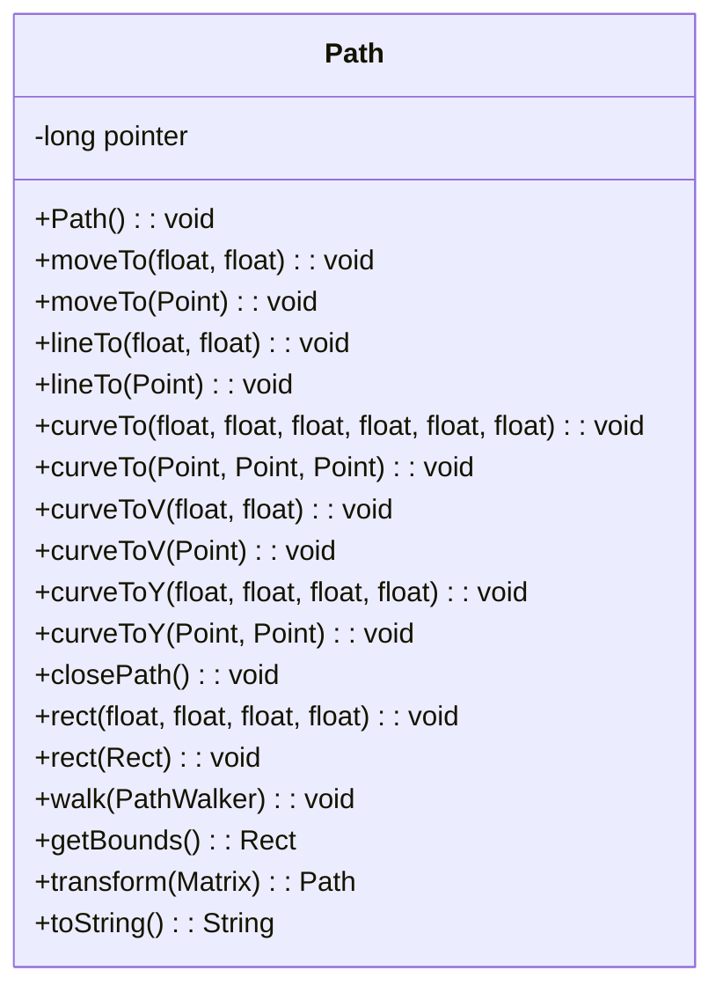
```mermaid
classDiagram
    class Path {
        -long pointer
        +Path(): void
        +moveTo(float, float): void
        +moveTo(Point): void
        +lineTo(float, float): void
        +lineTo(Point): void
        +curveTo(float, float, float, float, float, float): void
        +curveTo(Point, Point, Point): void
        +curveToV(float, float): void
        +curveToV(Point): void
        +curveToY(float, float, float, float): void
        +curveToY(Point, Point): void
        +closePath(): void
        +rect(float, float, float, float): void
        +rect(Rect): void
        +walk(PathWalker): void
        +getBounds(): Rect
        +transform(Matrix): Path
        +toString(): String
    }
```

#### Geometric Objects

The module provides several geometric primitive classes for representing points, rectangles, and quadrilaterals.

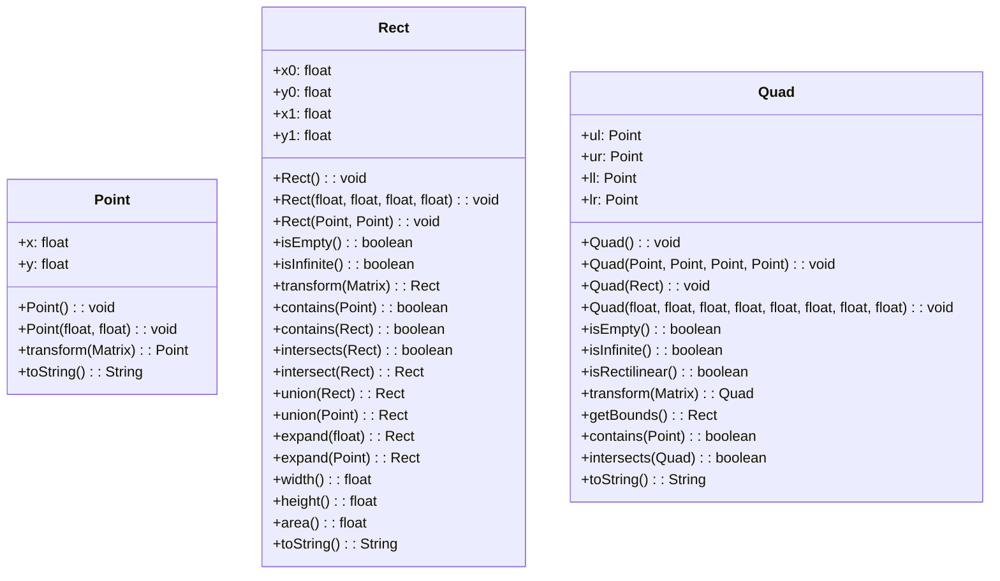
```mermaid
classDiagram
    class Point {
        +x: float
        +y: float
        +Point(): void
        +Point(float, float): void
        +transform(Matrix): Point
        +toString(): String
    }
    
    class Rect {
        +x0: float
        +y0: float
        +x1: float
        +y1: float
        +Rect(): void
        +Rect(float, float, float, float): void
        +Rect(Point, Point): void
        +isEmpty(): boolean
        +isInfinite(): boolean
        +transform(Matrix): Rect
        +contains(Point): boolean
        +contains(Rect): boolean
        +intersects(Rect): boolean
        +intersect(Rect): Rect
        +union(Rect): Rect
        +union(Point): Rect
        +expand(float): Rect
        +expand(Point): Rect
        +width(): float
        +height(): float
        +area(): float
        +toString(): String
    }
    
    class Quad {
        +ul: Point
        +ur: Point
        +ll: Point
        +lr: Point
        +Quad(): void
        +Quad(Point, Point, Point, Point): void
        +Quad(Rect): void
        +Quad(float, float, float, float, float, float, float, float): void
        +isEmpty(): boolean
        +isInfinite(): boolean
        +isRectilinear(): boolean
        +transform(Matrix): Quad
        +getBounds(): Rect
        +contains(Point): boolean
        +intersects(Quad): boolean
        +toString(): String
    }
```

### I/O and Streams

The I/O and streams subsystem provides comprehensive support for reading and writing document data through various interfaces.

#### Buffer Class

The `Buffer` class provides efficient data storage and manipulation capabilities for document content.

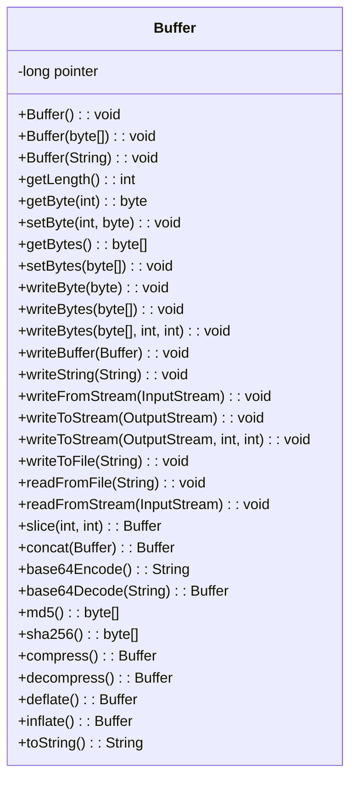
```mermaid
classDiagram
    class Buffer {
        -long pointer
        +Buffer(): void
        +Buffer(byte[]): void
        +Buffer(String): void
        +getLength(): int
        +getByte(int): byte
        +setByte(int, byte): void
        +getBytes(): byte[]
        +setBytes(byte[]): void
        +writeByte(byte): void
        +writeBytes(byte[]): void
        +writeBytes(byte[], int, int): void
        +writeBuffer(Buffer): void
        +writeString(String): void
        +writeFromStream(InputStream): void
        +writeToStream(OutputStream): void
        +writeToStream(OutputStream, int, int): void
        +writeToFile(String): void
        +readFromFile(String): void
        +readFromStream(InputStream): void
        +slice(int, int): Buffer
        +concat(Buffer): Buffer
        +base64Encode(): String
        +base64Decode(String): Buffer
        +md5(): byte[]
        +sha256(): byte[]
        +compress(): Buffer
        +decompress(): Buffer
        +deflate(): Buffer
        +inflate(): Buffer
        +toString(): String
    }
```

#### Stream Classes

The module provides several stream classes for efficient data handling and processing.

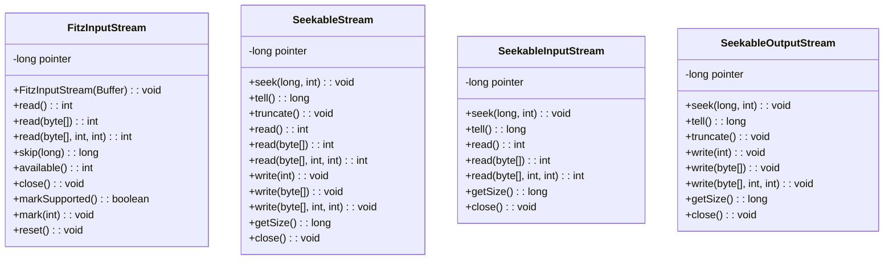
```mermaid
classDiagram
    class FitzInputStream {
        -long pointer
        +FitzInputStream(Buffer): void
        +read(): int
        +read(byte[]): int
        +read(byte[], int, int): int
        +skip(long): long
        +available(): int
        +close(): void
        +markSupported(): boolean
        +mark(int): void
        +reset(): void
    }
    
    class SeekableStream {
        -long pointer
        +seek(long, int): void
        +tell(): long
        +truncate(): void
        +read(): int
        +read(byte[]): int
        +read(byte[], int, int): int
        +write(int): void
        +write(byte[]): void
        +write(byte[], int, int): void
        +getSize(): long
        +close(): void
    }
    
    class SeekableInputStream {
        -long pointer
        +seek(long, int): void
        +tell(): long
        +read(): int
        +read(byte[]): int
        +read(byte[], int, int): int
        +getSize(): long
        +close(): void
    }
    
    class SeekableOutputStream {
        -long pointer
        +seek(long, int): void
        +tell(): long
        +truncate(): void
        +write(int): void
        +write(byte[]): void
        +write(byte[], int, int): void
        +getSize(): long
        +close(): void
    }
```

### Security and Signatures

The security and signatures subsystem provides comprehensive support for digital signatures, certificate validation, and document security operations.

#### PKCS7Signer Class

The `PKCS7Signer` class provides the interface for implementing digital signature creation and management.

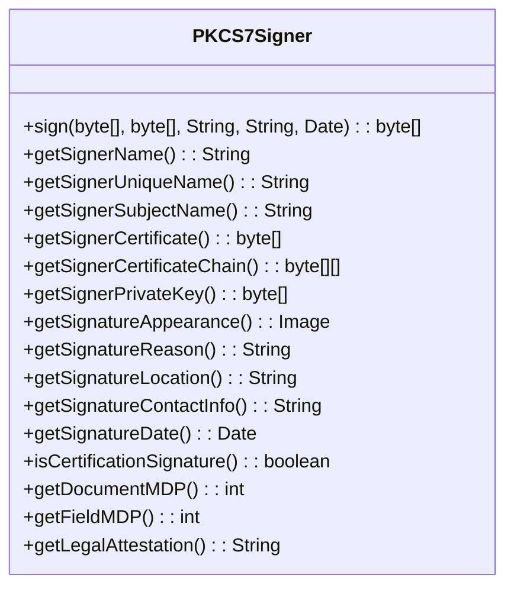
```mermaid
classDiagram
    class PKCS7Signer {
        +sign(byte[], byte[], String, String, Date): byte[]
        +getSignerName(): String
        +getSignerUniqueName(): String
        +getSignerSubjectName(): String
        +getSignerCertificate(): byte[]
        +getSignerCertificateChain(): byte[][]
        +getSignerPrivateKey(): byte[]
        +getSignatureAppearance(): Image
        +getSignatureReason(): String
        +getSignatureLocation(): String
        +getSignatureContactInfo(): String
        +getSignatureDate(): Date
        +isCertificationSignature(): boolean
        +getDocumentMDP(): int
        +getFieldMDP(): int
        +getLegalAttestation(): String
    }
```

#### PKCS7Verifier Class

The `PKCS7Verifier` class provides the interface for implementing digital signature verification and certificate validation.

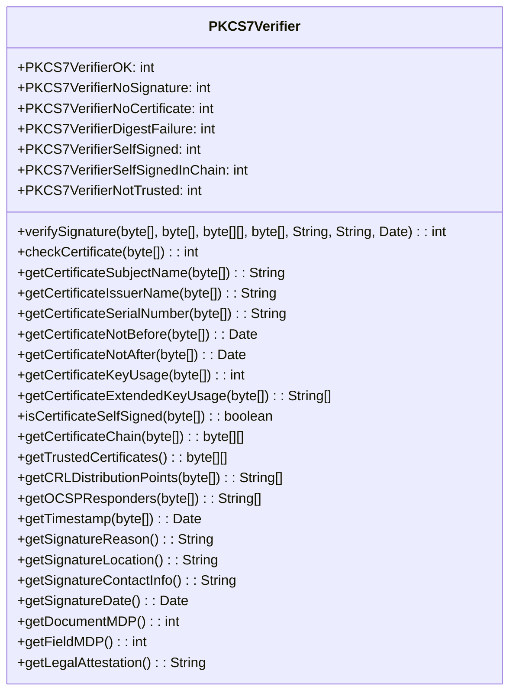
```mermaid
classDiagram
    class PKCS7Verifier {
        +PKCS7VerifierOK: int
        +PKCS7VerifierNoSignature: int
        +PKCS7VerifierNoCertificate: int
        +PKCS7VerifierDigestFailure: int
        +PKCS7VerifierSelfSigned: int
        +PKCS7VerifierSelfSignedInChain: int
        +PKCS7VerifierNotTrusted: int
        +verifySignature(byte[], byte[], byte[][], byte[], String, String, Date): int
        +checkCertificate(byte[]): int
        +getCertificateSubjectName(byte[]): String
        +getCertificateIssuerName(byte[]): String
        +getCertificateSerialNumber(byte[]): String
        +getCertificateNotBefore(byte[]): Date
        +getCertificateNotAfter(byte[]): Date
        +getCertificateKeyUsage(byte[]): int
        +getCertificateExtendedKeyUsage(byte[]): String[]
        +isCertificateSelfSigned(byte[]): boolean
        +getCertificateChain(byte[]): byte[][]
        +getTrustedCertificates(): byte[][]
        +getCRLDistributionPoints(byte[]): String[]
        +getOCSPResponders(byte[]): String[]
        +getTimestamp(byte[]): Date
        +getSignatureReason(): String
        +getSignatureLocation(): String
        +getSignatureContactInfo(): String
        +getSignatureDate(): Date
        +getDocumentMDP(): int
        +getFieldMDP(): int
        +getLegalAttestation(): String
    }
```

#### PKCS7DistinguishedName Class

The `PKCS7DistinguishedName` class represents X.500 distinguished names used in digital certificates.

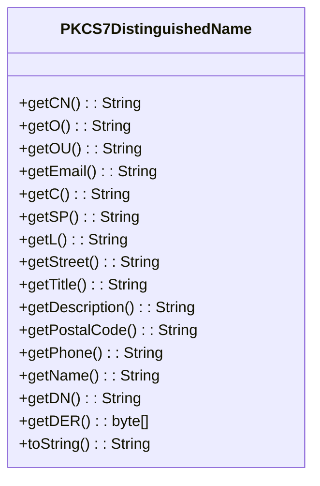
```mermaid
classDiagram
    class PKCS7DistinguishedName {
        +getCN(): String
        +getO(): String
        +getOU(): String
        +getEmail(): String
        +getC(): String
        +getSP(): String
        +getL(): String
        +getStreet(): String
        +getTitle(): String
        +getDescription(): String
        +getPostalCode(): String
        +getPhone(): String
        +getName(): String
        +getDN(): String
        +getDER(): byte[]
        +toString(): String
    }
```

## Data Flow Architecture

The MuPDF Java Bindings module implements a sophisticated data flow architecture that efficiently processes documents from loading through rendering and extraction.

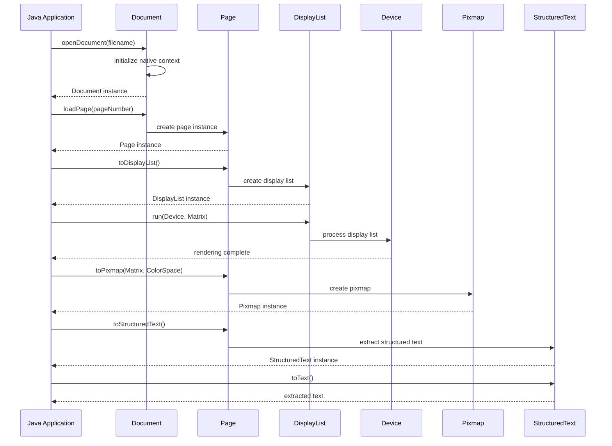
```mermaid
sequenceDiagram
    participant App as Java Application
    participant Doc as Document
    participant Page as Page
    participant DL as DisplayList
    participant Dev as Device
    participant Pix as Pixmap
    participant ST as StructuredText
    
    App->>Doc: openDocument(filename)
    Doc->>Doc: initialize native context
    Doc-->>App: Document instance
    
    App->>Doc: loadPage(pageNumber)
    Doc->>Page: create page instance
    Page-->>App: Page instance
    
    App->>Page: toDisplayList()
    Page->>DL: create display list
    DL-->>App: DisplayList instance
    
    App->>DL: run(Device, Matrix)
    DL->>Dev: process display list
    Dev-->>App: rendering complete
    
    App->>Page: toPixmap(Matrix, ColorSpace)
    Page->>Pix: create pixmap
    Pix-->>App: Pixmap instance
    
    App->>Page: toStructuredText()
    Page->>ST: extract structured text
    ST-->>App: StructuredText instance
    
    App->>ST: toText()
    ST-->>App: extracted text
```

## Integration with Other Modules

The MuPDF Java Bindings module integrates with several other modules in the system to provide comprehensive document processing capabilities.

### Integration with mupdf_wrap_scripts

The module relies on the [mupdf_wrap_scripts](mupdf_wrap_scripts.md) module for code generation and wrapper functionality. The wrap scripts analyze the MuPDF C API and generate the necessary Java bindings automatically.

```mermaid
graph LR
    subgraph "mupdf_wrap_scripts"
        WRAP[mupdf.scripts.wrap.__main__]
        CLASSES[mupdf.scripts.wrap.classes]
        PARSE[mupdf.scripts.wrap.parse]
        STATE[mupdf.scripts.wrap.state]
    end
    
    subgraph "mupdf_java_bindings"
        JAVA[Java Bindings]
    end
    
    WRAP --> JAVA
    CLASSES --> JAVA
    PARSE --> JAVA
    STATE --> JAVA
```

### Integration with engines

The module is used by the [engines](engines.md) module to provide document processing capabilities for various document formats.

```mermaid
graph LR
    subgraph "mupdf_java_bindings"
        DOC[Document]
        PDF[PDFDocument]
        PAGE[Page]
        RENDER[Rendering System]
    end
    
    subgraph "engines"
        MUPDF[src.EngineMupdf]
        DJVU[src.EngineDjVu]
        EBOOK[src.EngineEbook]
    end
    
    DOC --> MUPDF
    PDF --> MUPDF
    PAGE --> MUPDF
    RENDER --> MUPDF
    
    MUPDF --> DJVU
    MUPDF --> EBOOK
```

### Integration with utils

The module utilizes utility functions from the [utils](utils.md) module for various supporting operations.

```mermaid
graph LR
    subgraph "utils"
        ARCHIVE[src.utils.Archive]
        DICT[src.utils.Dict]
        STRFORMAT[src.utils.StrFormat]
        JSON[src.utils.JsonParser]
    end
    
    subgraph "mupdf_java_bindings"
        JAVA[Java Bindings]
        BUFFER[Buffer Operations]
        METADATA[Metadata Handling]
        CONFIG[Configuration]
    end
    
    ARCHIVE --> BUFFER
    DICT --> METADATA
    STRFORMAT --> CONFIG
    JSON --> CONFIG
    
    BUFFER --> JAVA
    METADATA --> JAVA
    CONFIG --> JAVA
```

## Process Flows

### Document Loading and Rendering Process

```mermaid
flowchart TD
    Start([Start]) --> Init[Initialize Context]
    Init --> LoadDoc[Load Document]
    
    LoadDoc --> CheckPass{Needs Password?}
    CheckPass -->|Yes| AuthPass[Authenticate Password]
    CheckPass -->|No| LoadPage[Load Page]
    
    AuthPass --> AuthSuccess{Authentication Successful?}
    AuthSuccess -->|Yes| LoadPage
    AuthSuccess -->|No| ErrorPass[Password Error]
    
    LoadPage --> RenderChoice{Render Method?}
    RenderChoice -->|Pixmap| ToPixmap[Convert to Pixmap]
    RenderChoice -->|Display List| ToDL[Convert to DisplayList]
    RenderChoice -->|Device| RunDevice[Run on Device]
    
    ToPixmap --> ApplyMatrix[Apply Transformation]
    ToDL --> ApplyMatrix
    RunDevice --> ApplyMatrix
    
    ApplyMatrix --> ColorSpace[Set Color Space]
    ColorSpace --> Alpha[Set Alpha Channel]
    Alpha --> RenderComplete[Rendering Complete]
    
    ErrorPass --> End([End])
    RenderComplete --> End
```

### PDF Form Processing Flow

```mermaid
flowchart TD
    Start([Start]) --> LoadPDF[Load PDF Document]
    LoadPDF --> CheckForm{Has Form?}
    CheckForm -->|Yes| GetWidgets[Get Form Widgets]
    CheckForm -->|No| NoForm[No Form Processing]
    
    GetWidgets --> WidgetLoop[For Each Widget]
    WidgetLoop --> WidgetType{Widget Type?}
    
    WidgetType -->|Text| ProcessText[Process Text Widget]
    WidgetType -->|Button| ProcessButton[Process Button Widget]
    WidgetType -->|Choice| ProcessChoice[Process Choice Widget]
    WidgetType -->|Signature| ProcessSig[Process Signature Widget]
    
    ProcessText --> GetValue[Get Text Value]
    ProcessButton --> GetState[Get Button State]
    ProcessChoice --> GetSelection[Get Selection]
    
    GetValue --> SetValue[Set Text Value]
    GetState --> SetState[Set Button State]
    GetSelection --> SetSelection[Set Selection]
    
    VerifySig --> CheckDigest[Check Digest]
    CheckDigest --> DigestValid{Digest Valid?}
    
    DigestValid -->|Yes| CheckCert[Check Certificate]
    DigestValid -->|No| DigestInvalid[Digest Invalid]
    
    CheckCert --> CertValid{Certificate Valid?}
    CertValid -->|Yes| CheckTrust{Check Trust Chain}
    CertValid -->|No| CertInvalid[Certificate Invalid]
    
    CheckTrust --> TrustValid{Trust Chain Valid?}
    TrustValid -->|Yes| CheckChanges[Check for Changes]
    TrustValid -->|No| TrustInvalid[Trust Chain Invalid]
    
    CheckChanges --> Changes{Incremental Changes?}
    Changes -->|Yes| Changed[Document Changed]
    Changes -->|No| Unchanged[Document Unchanged]
    
    DigestInvalid --> SigInvalid[Signature Invalid]
    CertInvalid --> SigInvalid
    TrustInvalid --> SigInvalid
    Changed --> SigInvalid
    
    Unsigned --> SigLoop
    SigInvalid --> SigLoop
    Unchanged --> SigValid[Signature Valid]
    SigValid --> SigLoop
    
    SigLoop --> MoreSigs{More Signatures?}
    MoreSigs -->|Yes| SigLoop
    MoreSigs -->|No| SigComplete[Signature Verification Complete]
    
    NoSig --> SigComplete
    SigComplete --> End([End])
```

### Digital Signature Verification Process

```mermaid
flowchart TD
    Start([Start]) --> LoadDoc[Load PDF Document]
    LoadDoc --> CheckSig{Has Signatures?}
    CheckSig -->|Yes| GetSigCount[Get Signature Count]
    CheckSig -->|No| NoSig[No Signatures Found]
    
    GetSigCount --> SigLoop[For Each Signature]
    SigLoop --> GetWidget[Get Signature Widget]
    GetWidget --> IsSigned{Is Signed?}
    
    IsSigned -->|Yes| GetSigner[Get Signer Information]
    IsSigned -->|No| Unsigned[Mark Unsigned]
    
    GetSigner --> CheckDigest[Check Digest]
    CheckDigest --> DigestValid{Digest Valid?}
    
    DigestValid -->|Yes| CheckCert[Check Certificate]
    DigestValid -->|No| DigestInvalid[Digest Invalid]
    
    CheckCert --> CertValid{Certificate Valid?}
    CertValid -->|Yes| CheckTrust{Check Trust Chain}
    CertValid -->|No| CertInvalid[Certificate Invalid]
    
    CheckTrust --> TrustValid{Trust Chain Valid?}
    TrustValid -->|Yes| CheckChanges[Check for Changes]
    TrustValid -->|No| TrustInvalid[Trust Chain Invalid]
    
    CheckChanges --> Changes{Incremental Changes?}
    Changes -->|Yes| Changed[Document Changed]
    Changes -->|No| Unchanged[Document Unchanged]
    
    DigestInvalid --> SigInvalid[Signature Invalid]
    CertInvalid --> SigInvalid
    TrustInvalid --> SigInvalid
    Changed --> SigInvalid
    
    Unsigned --> SigLoop
    SigInvalid --> SigLoop
    Unchanged --> SigValid[Signature Valid]
    SigValid --> SigLoop
    
    SigLoop --> MoreSigs{More Signatures?}
    MoreSigs -->|Yes| SigLoop
    MoreSigs -->|No| SigComplete[Signature Verification Complete]
    
    NoSig --> SigComplete
    SigComplete --> End([End])
```

## Key Features and Capabilities

### Document Format Support

The MuPDF Java Bindings module supports a comprehensive range of document formats:

- **PDF**: Full support including forms, annotations, digital signatures, and advanced PDF features
- **XPS**: Microsoft XML Paper Specification documents
- **EPUB**: Electronic publication format with reflowable text
- **FictionBook**: FB2 format support
- **Comic Book Archive**: CBZ and CBR formats
- **Image Formats**: Various raster image formats including JPEG, PNG, TIFF, and more

### Rendering Capabilities

The module provides multiple rendering approaches to suit different use cases:

- **Direct Rendering**: Render directly to pixmaps for immediate display
- **Display List Rendering**: Create reusable display lists for efficient repeated rendering
- **Device Rendering**: Custom device implementations for specialized rendering needs
- **Progressive Rendering**: Support for progressive rendering of large documents

### Text Extraction and Search

Comprehensive text processing capabilities include:

- **Structured Text Extraction**: Preserve document structure and reading order
- **Plain Text Extraction**: Simple text extraction without formatting
- **HTML/XML Export**: Export document content in markup formats
- **Full-Text Search**: Search across document content with hit highlighting
- **Text Selection**: Support for text selection and copying

### Interactive Features

Rich interactive capabilities for PDF documents:

- **Form Widgets**: Complete support for AcroForm and XFA forms
- **Annotations**: Create, modify, and manage all PDF annotation types
- **Digital Signatures**: Sign and verify digital signatures with certificate validation
- **JavaScript**: Support for PDF JavaScript execution
- **Bookmarks and Links**: Navigation support with bookmarks and hyperlinks

### Security Features

Comprehensive security and compliance features:

- **Digital Signatures**: PKCS#7 signature support with certificate validation
- **Document Encryption**: Support for password-protected documents
- **Permission Management**: Fine-grained control over document permissions
- **Redaction**: Secure document redaction capabilities
- **Certificate Management**: X.509 certificate handling and validation

## Performance Considerations

The MuPDF Java Bindings module is designed with performance in mind, implementing several optimization strategies:

### Memory Management

- **Native Memory Handling**: Efficient management of native memory through proper cleanup
- **Object Pooling**: Reuse of display lists and other renderable objects
- **Streaming Operations**: Support for streaming to handle large documents efficiently

### Caching Strategies

- **Display List Caching**: Reuse of display lists for repeated rendering operations
- **Pixmap Caching**: Efficient pixmap management for frequently accessed content
- **Font Caching**: Optimized font loading and caching for text rendering

### Multi-threading Support

- **Thread-Safe Operations**: Safe concurrent access to document content
- **Background Rendering**: Support for background rendering operations
- **Progressive Loading**: Progressive document loading for large files

## Error Handling and Recovery

The module implements comprehensive error handling and recovery mechanisms:

### Exception Handling

- **Native Exception Translation**: Proper translation of native exceptions to Java exceptions
- **Graceful Degradation**: Graceful handling of corrupted or partially invalid documents
- **Resource Cleanup**: Proper cleanup of native resources in error conditions

### Document Recovery

- **Corrupted Document Handling**: Ability to work with partially corrupted documents
- **Incremental Loading**: Support for incremental document loading and repair
- **Validation**: Document validation and integrity checking

## Best Practices and Usage Guidelines

### Resource Management

Always ensure proper cleanup of native resources:

```java
// Use try-with-resources or explicit cleanup
document.destroy();
page.destroy();
pixmap.destroy();
```

### Performance Optimization

- **Reuse Display Lists**: Create display lists once and reuse for multiple renderings
- **Batch Operations**: Batch multiple operations to reduce native call overhead
- **Use Accelerators**: Enable document accelerators for improved performance

### Memory Management

- **Monitor Native Memory**: Be aware of native memory usage for large documents
- **Release Resources**: Explicitly release resources when no longer needed
- **Use Streaming**: Use streaming operations for large documents

### Error Handling

- **Check Return Values**: Always check return values for critical operations
- **Handle Exceptions**: Implement proper exception handling for document operations
- **Validate Input**: Validate input parameters before calling native methods

## Conclusion

The MuPDF Java Bindings module provides a comprehensive, high-performance solution for document processing in Java applications. Its rich feature set, robust architecture, and extensive format support make it an ideal choice for applications requiring sophisticated document handling capabilities. The module's careful design ensures both ease of use and optimal performance, while its integration with the broader MuPDF ecosystem provides access to cutting-edge document processing technology.

The modular architecture allows developers to use only the components they need, while the comprehensive API provides fine-grained control over document processing operations. Whether building a simple document viewer or a complex document management system, the MuPDF Java Bindings module provides the tools and capabilities necessary for success.