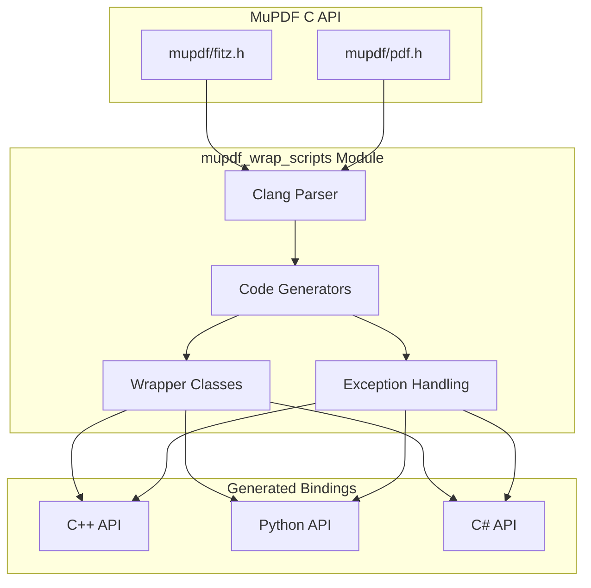
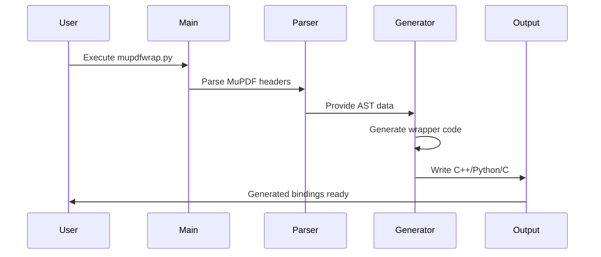

# MuPDF Wrap Scripts Module Documentation

## Overview

The `mupdf_wrap_scripts` module is a comprehensive code generation system that creates C++, Python, and C# language bindings for the MuPDF library. This module serves as the bridge between MuPDF's C API and higher-level programming languages, enabling developers to use MuPDF functionality in their preferred language environments.

## Purpose and Core Functionality

The primary purpose of this module is to:
- **Generate Language Bindings**: Automatically create C++, Python, and C# wrappers for MuPDF's C API
- **Provide Type Safety**: Convert C-style error handling to language-appropriate exception mechanisms
- **Enable Cross-Language Compatibility**: Allow MuPDF functionality to be used across different programming ecosystems
- **Maintain Performance**: Generate efficient bindings that minimize overhead

## Architecture Overview



## Module Structure

The module is organized into several key sub-modules:

### Core Components

1. **[jlib](jlib.md)** - Utility library providing logging, system operations, and helper functions
2. **[wrap/__main__.py](wrap_main.md)** - Main entry point and command-line interface for the wrapper generator
3. **[wrap/classes.py](wrap_classes.md)** - Class customization system for wrapper generation
4. **[wrap/cpp.py](wrap_cpp.md)** - C++ code generation engine
5. **[wrap/parse.py](wrap_parse.md)** - Clang-based parser for MuPDF headers
6. **[wrap/state.py](wrap_state.md)** - Global state management and configuration

Each sub-module is documented in detail in its respective documentation file, providing comprehensive information about their architecture, components, and usage patterns.

### Data Flow



## Key Features

### 1. Automatic Wrapper Generation
- Parses MuPDF C headers using Clang Python bindings
- Identifies functions, structs, and enums suitable for wrapping
- Generates corresponding wrapper classes and methods

### 2. Memory Management
- Automatic reference counting for MuPDF objects
- Integration with language-specific garbage collection
- Prevention of memory leaks through proper cleanup

### 3. Exception Handling
- Conversion of MuPDF's setjmp/longjmp error handling to C++ exceptions
- Language-specific exception propagation (Python exceptions, C# exceptions)
- Comprehensive error reporting and debugging support

### 4. Type Safety
- Strong typing for all wrapper interfaces
- Automatic type conversions where appropriate
- Compile-time type checking

### 5. Cross-Platform Support
- Windows, Linux, macOS compatibility
- Platform-specific optimizations and workarounds
- Consistent API across all platforms

## Build Process

The module supports a multi-stage build process:

1. **Parse Stage**: Analyze MuPDF headers and extract API information
2. **Generate Stage**: Create C++ wrapper source code
3. **Compile Stage**: Build shared libraries for each target language
4. **Test Stage**: Validate generated bindings with test suites

## Integration Points

### With MuPDF Core
- Direct integration with MuPDF's C API
- No modifications required to MuPDF source code
- Version compatibility checking

### With External Tools
- SWIG integration for Python and C# bindings
- CMake build system integration
- Package manager compatibility (pip, NuGet)

## Usage Examples

### Command Line Interface
```bash
# Generate all bindings
./scripts/mupdfwrap.py -b all

# Generate C++ bindings only
./scripts/mupdfwrap.py -b 0

# Test generated Python bindings
./scripts/mupdfwrap.py --test-python
```

### Generated C++ Usage
```cpp
#include "mupdf/classes.h"

mupdf::FzDocument doc("document.pdf");
mupdf::FzPage page = doc.load_page(0);
mupdf::FzPixmap pixmap = page.to_pixmap();
```

### Generated Python Usage
```python
import mupdf

doc = mupdf.Document("document.pdf")
page = doc.load_page(0)
pixmap = page.to_pixmap()
```

## Configuration Options

The module provides extensive configuration through:
- Command-line arguments
- Environment variables
- Build directory specifications
- Custom class definitions

## Performance Considerations

- Minimal runtime overhead
- Efficient memory management
- Optimized for production use
- Optional debug builds with additional checks

## Dependencies

- **Clang Python**: For parsing C headers
- **SWIG**: For Python and C# binding generation
- **C++ Compiler**: For building wrapper libraries
- **Python 3.6+**: For running the wrapper generator

## Error Handling and Debugging

The module includes comprehensive debugging support:
- Runtime reference counting validation
- Function call tracing
- Exception propagation tracking
- Memory leak detection

## Future Enhancements

- Support for additional programming languages
- Improved performance optimizations
- Enhanced debugging capabilities
- Better integration with modern build systems

## Related Documentation

- [MuPDF Core Library](mupdf_core.md)
- [Java Bindings](mupdf_java_bindings.md)
- [Gumbo Parser](gumbo_parser.md)
- [Metadata System](metadata.md)