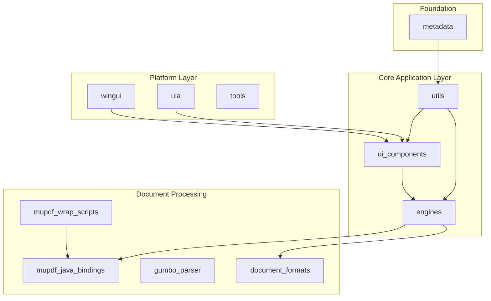
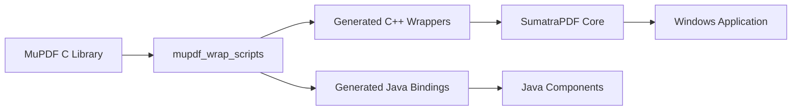

# SumatraPDF Reader Repository Overview

## Purpose

SumatraPDF is a lightweight, open-source document reader for Windows that supports multiple document formats including PDF, ePub, Mobi, XPS, DjVu, CHM, CBZ, and CBR. The repository provides a complete document viewing solution with a focus on speed, simplicity, and minimal resource usage.

## Architecture

The repository follows a modular architecture with clear separation of concerns:

## Core Modules

### 1. **UI Components** (`ui_components`)
Comprehensive user interface framework providing:
- Main window management and document display
- Command palette with fuzzy search capabilities
- Dialog system for user interactions
- Toolbar and menu systems
- Annotation editing interface
- Home page with document thumbnails
- Print system integration
- Update checking mechanism

### 2. **Engines** (`engines`)
Document processing layer with format-specific engines:
- **EngineMupdf**: PDF, XPS, and eBook formats via MuPDF
- **EngineDjVu**: DjVu document support
- **EngineEbook**: Base for reflowable formats (EPUB, FB2, MOBI, CHM, HTML, TXT, PDB)
- **EngineImages**: Image files and comic book archives (CBZ, CBR, CB7, CBT)
- **EnginePs**: PostScript via Ghostscript conversion

### 3. **Utils** (`utils`)
Foundation utilities providing:
- Multi-format archive handling (ZIP, RAR, 7Z, TAR)
- Image processing (AVIF, TGA readers)
- High-performance data structures (dictionaries, string vectors)
- File system services (file watching, type detection)
- Text processing (formatting, JSON parsing)
- Compression and threading utilities

### 4. **MuPDF Integration** (`mupdf_java_bindings` & `mupdf_wrap_scripts`)
Complete MuPDF library integration:
- Java language bindings for document processing
- Automatic wrapper generation for C++, Python, C#
- Comprehensive PDF features (forms, annotations, digital signatures)
- Rendering pipeline with display lists and pixmaps
- Content extraction and text search
- Security and signature verification

### 5. **Document Formats** (`document_formats`)
Specialized format support:
- **CHM Support**: Microsoft Compiled HTML Help files
- **Mobi Support**: Mobipocket eBook format with compression
- **PDF Sync**: LaTeX/PDF synchronization for forward/inverse search

### 6. **Platform Layer** (`wingui`, `uia`, `tools`)
Windows-specific functionality:
- **Wingui**: Windows GUI framework with HTML rendering (IE/WebView2)
- **UIA**: UI Automation support for accessibility tools
- **Tools**: Archive creation and plugin testing utilities

### 7. **Metadata System** (`metadata`)
Type system foundation providing:
- Strongly-typed metadata definitions
- C++ type mapping and validation
- Configuration management
- Code generation support

## Key Features

### Document Support
- 20+ document formats including PDF, EPUB, MOBI, XPS, DjVu, CHM, CBZ, CBR
- Multi-format archive support (ZIP, RAR, 7Z, TAR)
- Image formats (PNG, JPEG, GIF, TIFF, BMP, TGA, WebP, JP2, HEIC, AVIF)

### Rendering Capabilities
- Hardware-accelerated rendering via MuPDF
- Display list caching for performance
- Zoom, rotation, and coordinate transformation
- Text extraction with coordinate mapping
- Search functionality with hit highlighting

### User Interface
- Tabbed document interface
- Command palette with fuzzy search
- Customizable toolbar and menus
- Annotation editing for PDFs
- Table of contents navigation
- Bookmark management
- Print support

### Accessibility
- Full UI Automation support
- Screen reader compatibility
- Keyboard navigation
- High contrast mode support

### Security
- Digital signature verification (PKCS#7)
- Document encryption support
- Certificate validation
- Secure redaction capabilities

## Development Architecture

The repository uses a hybrid C++/Java architecture with automatic code generation:

## Build System

- CMake-based build system
- Multi-language support (C++, Java, Python, C#)
- Cross-platform compatibility (Windows primary)
- Automated wrapper generation
- Comprehensive testing framework

## Performance Characteristics

- Lightweight memory footprint
- Fast document loading
- Efficient caching strategies
- Multi-threading support
- Streaming for large documents
- GPU acceleration where available

This architecture provides a robust, extensible foundation for document viewing while maintaining the simplicity and speed that characterizes SumatraPDF.