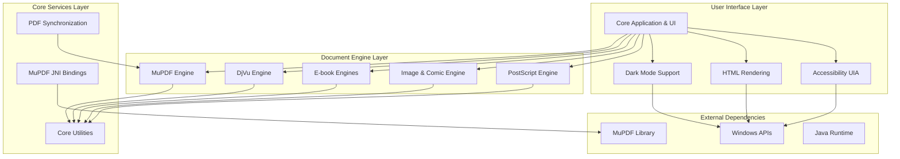

# SumatraPDF Reader Repository Overview

## Purpose

SumatraPDF is a lightweight, open-source document viewer for Windows that supports multiple document formats including PDF, EPUB, MOBI, CBZ/CBR, XPS, DjVu, and CHM files. The repository contains the complete source code for the application, providing a fast, minimal, and portable document reading experience with a focus on simplicity and performance.

## End-to-End Architecture

```mermaid
graph TB
    subgraph "User Interface Layer"
        UI[Core Application & UI]
        DM[Dark Mode Support]
        HTML[HTML Rendering]
        UIA[Accessibility UIA]
    end
    
    subgraph "Document Engine Layer"
        MUPDF[MuPDF Engine]
        DJVU[DjVu Engine]
        EBOOK[E-book Engines]
        IMAGE[Image & Comic Engine]
        PS[PostScript Engine]
    end
    
    subgraph "Core Services Layer"
        UTILS[Core Utilities]
        SYNC[PDF Synchronization]
        JNI[MuPDF JNI Bindings]
    end
    
    subgraph "External Dependencies"
        MUPDF_LIB[MuPDF Library]
        WINDOWS[Windows APIs]
        JAVA[Java Runtime]
    end
    
    UI --> MUPDF
    UI --> DJVU
    UI --> EBOOK
    UI --> IMAGE
    UI --> PS
    
    MUPDF --> UTILS
    DJVU --> UTILS
    EBOOK --> UTILS
    IMAGE --> UTILS
    PS --> UTILS
    
    SYNC --> MUPDF
    JNI --> MUPDF_LIB
    
    DM --> WINDOWS
    HTML --> WINDOWS
    UIA --> WINDOWS
    
    UI --> DM
    UI --> HTML
    UI --> UIA
```

## Core Modules Documentation

### 1. Core Application and UI Module
**Path**: `src/`
- **Purpose**: Central application framework providing main window management, UI components, document navigation, and application services
- **Key Components**: MainWindow, Toolbar, Menu System, Command Palette, Search & Find, Print System
- **Documentation**: [core_application_and_ui.md](core_application_and_ui.md)

### 2. Document Engine Modules

#### MuPDF Engine Integration
**Path**: `src/`
- **Purpose**: Primary document rendering engine supporting PDF, XPS, CBZ, and e-book formats
- **Key Components**: Page rendering, annotation management, text extraction, link processing
- **Documentation**: [mupdf_engine_integration.md](mupdf_engine_integration.md)

#### DjVu Engine Integration
**Path**: `src/`
- **Purpose**: Specialized engine for DjVu document format support
- **Key Components**: Page navigation, document parsing, format-specific features
- **Documentation**: [djvu_engine_integration.md](djvu_engine_integration.md)

#### E-book Engines
**Path**: `src/`
- **Purpose**: Support for EPUB, FictionBook2, Mobi, CHM, and other e-book formats
- **Key Components**: Format-specific engines, HTML rendering, TOC generation
- **Documentation**: [ebook_engines.md](ebook_engines.md)

#### Image and Comic Book Engine
**Path**: `src/EngineImages.cpp`
- **Purpose**: Rendering support for image files and comic book archives (CBZ, CBR, CB7, CBT)
- **Key Components**: Image caching, archive handling, metadata parsing
- **Documentation**: [image_and_comic_book_engine.md](image_and_comic_book_engine.md)

#### PostScript Engine
**Path**: `src/EnginePs.cpp`
- **Purpose**: PostScript document rendering support
- **Key Components**: PS document processing, rendering pipeline
- **Documentation**: [postscript_engine.md](postscript_engine.md)

### 3. Support Modules

#### PDF Synchronization
**Path**: `src/PdfSync.cpp`
- **Purpose**: Bidirectional synchronization between PDF documents and LaTeX source files
- **Key Components**: SyncTeX support, forward/inverse search, coordinate mapping
- **Documentation**: [pdf_synchronization.md](pdf_synchronization.md)

#### Windows Dark Mode
**Path**: `ext/darkmodelib/src/`
- **Purpose**: Comprehensive dark mode support for Windows 10/11
- **Key Components**: Theme management, control styling, system integration
- **Documentation**: [windows_dark_mode.md](windows_dark_mode.md)

#### HTML Rendering Components
**Path**: `src/wingui/`
- **Purpose**: HTML content rendering using MSHTML and WebView2 engines
- **Key Components**: CHM document support, protocol handling, modern web standards
- **Documentation**: [html_rendering_components.md](html_rendering_components.md)

#### Accessibility UIA Provider
**Path**: `src/uia/`
- **Purpose**: UI Automation support for screen readers and assistive technologies
- **Key Components**: Document provider, text range management, navigation support
- **Documentation**: [accessibility_uia_provider.md](accessibility_uia_provider.md)

#### Core Utilities
**Path**: `src/utils/`
- **Purpose**: Fundamental utility services and data structures
- **Key Components**: File watching, data structures, parsing utilities, archive handling
- **Documentation**: [core_utilities.md](core_utilities.md)

#### MuPDF Fitz JNI Bindings
**Path**: `mupdf/platform/java/src/com/artifex/mupdf/fitz/`
- **Purpose**: Java Native Interface bindings for MuPDF library
- **Key Components**: Context management, document handling, rendering, PDF features
- **Documentation**: [mupdf_fitz_jni_bindings.md](mupdf_fitz_jni_bindings.md)

## Key Features

- **Multi-format Support**: PDF, EPUB, MOBI, XPS, DjVu, CHM, CBZ/CBR, and image formats
- **Lightweight Design**: Fast startup, minimal memory footprint, portable executable
- **Advanced Features**: Tabbed interface, bookmarks, annotations, search, printing
- **Accessibility**: Screen reader support, keyboard navigation, high contrast mode
- **Customization**: Themes, keyboard shortcuts, external viewer integration
- **Performance**: Efficient caching, lazy loading, multi-threading support

## Development Architecture

The repository follows a modular architecture with clear separation of concerns:

- **Document Engines**: Pluggable engines for different formats
- **UI Layer**: Windows-native UI with theming support
- **Core Services**: Shared utilities and system integration
- **External Bindings**: Java and other language interfaces

This design enables maintainability, extensibility, and performance optimization while providing a consistent user experience across all supported document formats.