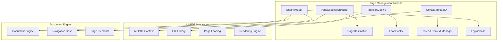
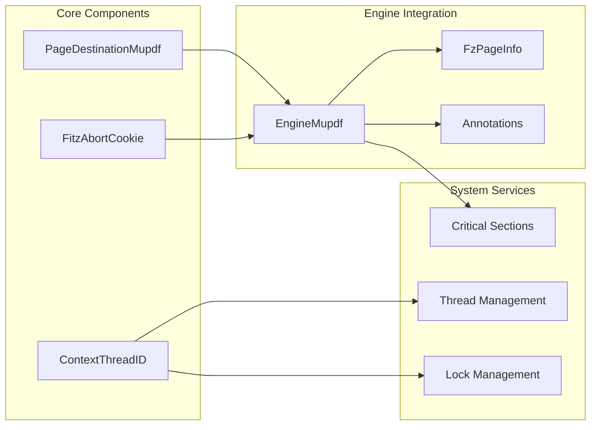
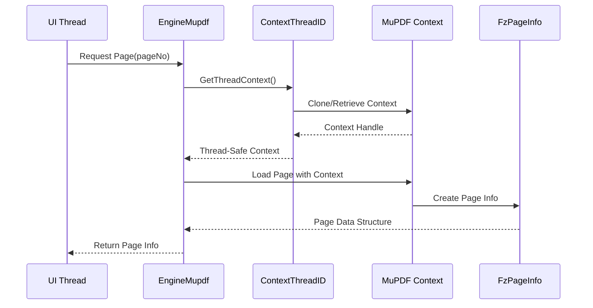
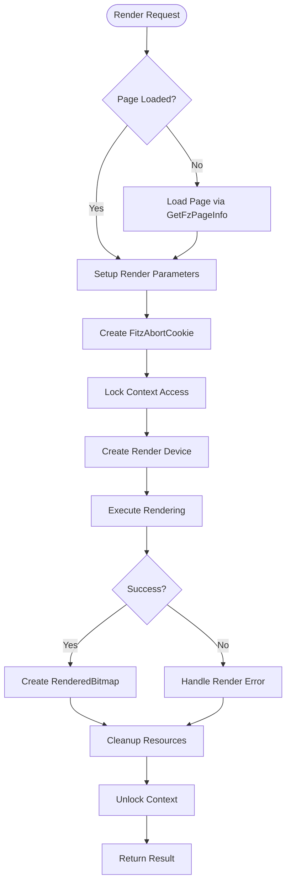
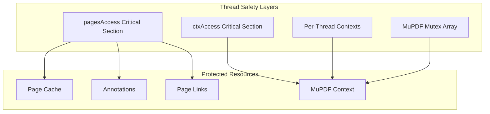

# Page Management Module Documentation

## Introduction

The page_management module is a core component of the SumatraPDF document rendering system, responsible for managing document pages, their content, and interactions within the MuPDF engine integration. This module provides the foundational infrastructure for page-level operations including rendering, text extraction, link processing, and annotation management.

## Module Overview

The page_management module serves as the bridge between the MuPDF library and SumatraPDF's document engine architecture. It encapsulates complex PDF page operations, providing a unified interface for handling various document formats while maintaining thread safety and performance optimization.

## Core Components

### 1. PageDestinationMupdf

**Purpose**: Represents navigation destinations within PDF documents, handling both internal links and outline entries.

**Key Features**:
- Manages link destinations and outline navigation
- Supports external URL detection and handling
- Provides coordinate-based navigation
- Handles file-based links with path resolution

**Architecture Integration**:
- Implements the `IPageDestination` interface
- Integrates with the document navigation system
- Supports both explicit links and document outlines

### 2. FitzAbortCookie

**Purpose**: Provides cancellation mechanism for long-running MuPDF operations.

**Key Features**:
- Implements the `AbortCookie` interface
- Enables graceful operation cancellation
- Thread-safe abort signaling
- Integrates with MuPDF's cookie system

**Usage Context**:
- Page rendering operations
- Text extraction processes
- Document loading procedures

### 3. ContextThreadID

**Purpose**: Manages per-thread MuPDF contexts for thread-safe operations.

**Key Features**:
- Thread-specific context management
- Context cloning and lifecycle management
- Engine-context association
- Thread ID tracking

**Thread Safety**:
- Prevents context conflicts in multi-threaded environments
- Enables concurrent page operations
- Maintains context isolation

## Architecture and Design

### Module Architecture

### Component Relationships

## Data Flow and Processing

### Page Loading Flow

### Rendering Process Flow

## Key Functional Areas

### 1. Page Navigation and Destinations

The module provides comprehensive support for document navigation through the `PageDestinationMupdf` class, which handles:

- **Internal Links**: PDF internal navigation links
- **External URLs**: Web and file system links
- **Outline Navigation**: Table of contents and bookmarks
- **Named Destinations**: PDF named destination support

### 2. Thread-Safe Context Management

The `ContextThreadID` system ensures thread safety by:

- **Per-Thread Contexts**: Maintaining separate MuPDF contexts for each thread
- **Context Lifecycle**: Managing context creation, cloning, and destruction
- **Thread Association**: Tracking which engine instance belongs to which thread
- **Resource Isolation**: Preventing cross-thread resource conflicts

### 3. Operation Cancellation

The `FitzAbortCookie` mechanism provides:

- **Graceful Cancellation**: Allows interruption of long-running operations
- **Thread-Safe Signaling**: Safe abort communication across threads
- **Resource Cleanup**: Proper cleanup of partial operations
- **User Responsiveness**: Maintains UI responsiveness during operations

### 4. Page Content Management

The module handles various page content types:

- **Text Content**: Extraction and processing of page text
- **Image Elements**: Detection and rendering of embedded images
- **Link Elements**: Processing of hyperlinks and navigation elements
- **Annotations**: Management of PDF annotations and comments

## Integration with Document Engine

### EngineMupdf Integration

The page_management components are integral to the `EngineMupdf` class, providing:

- **Page Lifecycle Management**: Loading, caching, and unloading pages
- **Content Extraction**: Text, images, and metadata extraction
- **Rendering Services**: High-quality page rendering with various targets
- **Annotation Support**: Full PDF annotation lifecycle management

### Thread Safety Architecture

## Performance Considerations

### 1. Context Management Optimization

- **Context Pooling**: Reuse of thread contexts to minimize allocation overhead
- **Lazy Loading**: Pages and resources loaded on-demand
- **Caching Strategy**: Intelligent caching of page information and content

### 2. Memory Management

- **Resource Cleanup**: Systematic cleanup of MuPDF resources
- **Memory Mapping**: Efficient handling of large documents
- **Stream Management**: Optimized stream handling for various file formats

### 3. Concurrent Access

- **Lock Hierarchy**: Well-defined lock ordering to prevent deadlocks
- **Minimal Lock Scope**: Reducing lock contention through careful scope management
- **Non-blocking Operations**: Providing non-blocking alternatives where possible

## Error Handling and Recovery

### 1. MuPDF Error Integration

The module integrates with MuPDF's error handling system through:

- **Error Callbacks**: Custom error reporting and logging
- **Exception Handling**: C++ exception integration with MuPDF's setjmp/longjmp
- **Graceful Degradation**: Continued operation despite partial failures

### 2. Resource Recovery

- **Context Recovery**: Restoration of corrupted contexts
- **Page Reload**: Automatic retry of failed page loads
- **Memory Cleanup**: Systematic cleanup in error conditions

## Dependencies and Interactions

### Internal Dependencies

- **[EngineBase](engine_base.md)**: Base document engine interface
- **[Annotation](annotation.md)**: Annotation management system
- **[Document Navigation](document_navigation.md)**: Navigation and destination handling

### External Dependencies

- **MuPDF Library**: Core PDF processing engine
- **Windows GDI**: Bitmap rendering and display
- **Critical Sections**: Thread synchronization primitives

### Related Modules

- **[MuPDF Engine Integration](mupdf_engine_integration.md)**: Parent module containing page_management
- **[Document Controller](document_controller.md)**: Higher-level document management
- **[Rendering System](rendering_system.md)**: Page rendering coordination

## Configuration and Customization

### 1. Layout Configuration

The module supports various layout options:

- **Page Sizes**: A4, A5, and custom page dimensions
- **Font Settings**: Configurable font sizes for different document types
- **Display DPI**: Adaptable resolution settings

### 2. Feature Flags

- **Linearization Support**: Handling of linearized PDF files
- **Annotation Processing**: Enable/disable annotation features
- **Text Extraction**: Configurable text processing options

## Future Enhancements

### 1. Performance Optimizations

- **Parallel Rendering**: Multi-threaded page rendering
- **Predictive Loading**: Intelligent pre-loading of likely-to-be-accessed pages
- **Memory Pool**: Custom memory allocation for frequently used objects

### 2. Feature Extensions

- **Advanced Navigation**: Enhanced bookmark and outline support
- **Content Analysis**: Intelligent content extraction and analysis
- **Accessibility**: Improved support for accessibility features

## Conclusion

The page_management module represents a critical component of the SumatraPDF architecture, providing robust, thread-safe, and efficient page-level operations. Its design emphasizes performance, reliability, and extensibility while maintaining clean integration with both the MuPDF library and the broader SumatraPDF application framework.

The module's comprehensive approach to thread safety, error handling, and resource management makes it suitable for handling complex document processing scenarios while maintaining responsive user interaction. Through careful abstraction and encapsulation, it provides a clean interface that hides the complexity of the underlying MuPDF operations while exposing powerful functionality to the rest of the application.