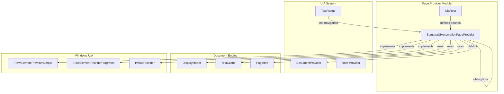
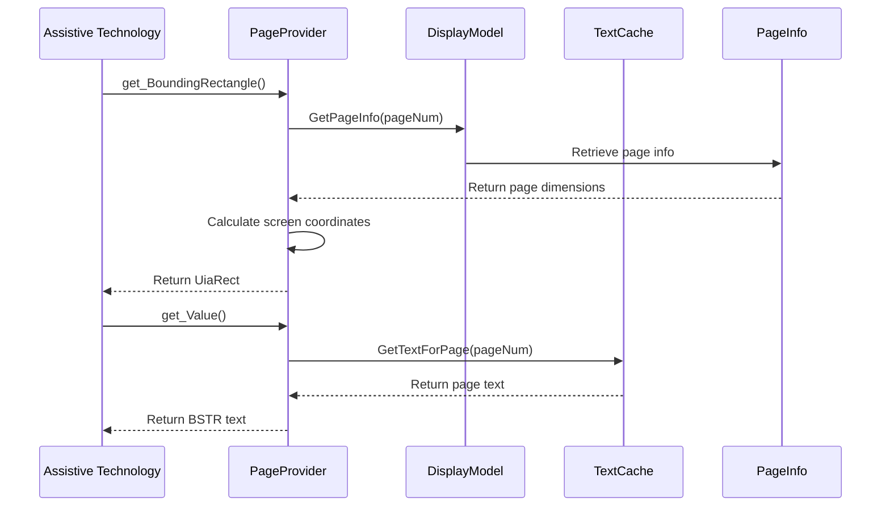
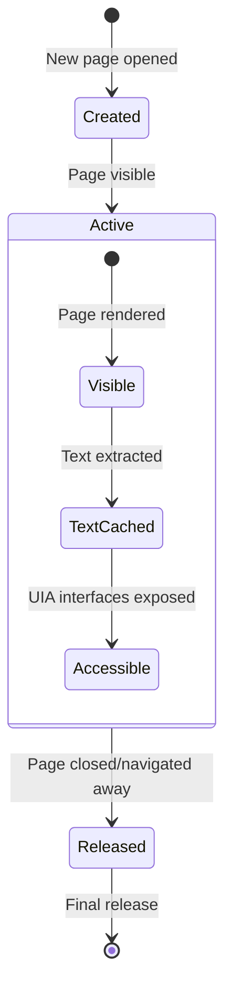

# Page Provider Module Documentation

## Introduction

The page_provider module is a critical component of the UI Automation (UIA) system in SumatraPDF, responsible for providing accessibility support for individual document pages. It implements the IRawElementProviderSimple, IRawElementProviderFragment, and IValueProvider interfaces to enable screen readers and other assistive technologies to interact with document pages programmatically.

## Module Overview

The page_provider module serves as the bridge between SumatraPDF's document rendering engine and the Windows UI Automation framework. Each page in a document gets its own PageProvider instance, which exposes page-specific information such as bounding rectangles, text content, and navigation relationships to accessibility tools.

## Core Architecture

### Component Structure

### Key Components

#### SumatraUIAutomationPageProvider
The main class that implements the UIA provider interfaces for individual pages. It manages:
- Page navigation (previous/next siblings)
- Bounding rectangle calculations
- Text content exposure
- Runtime identification
- Reference counting for COM lifecycle management

#### UiaRect
A structure that defines the bounding rectangle of a page element in screen coordinates, used for hit-testing and screen reader focus management.

## Interface Implementation

### IRawElementProviderSimple
Provides basic element information and pattern support:
- `GetPropertyValue()`: Returns page name and pattern availability
- `GetPatternProvider()`: Exposes Value pattern for text content
- `get_HostRawElementProvider()`: Returns null (server-side provider)
- `get_ProviderOptions()`: Indicates server-side provider

### IRawElementProviderFragment
Enables navigation within the UIA tree structure:
- `Navigate()`: Moves between parent (DocumentProvider) and siblings
- `GetRuntimeId()`: Generates unique identifiers for each page
- `get_BoundingRectangle()`: Calculates page position on screen
- `get_FragmentRoot()`: Delegates to parent DocumentProvider

### IValueProvider
Exposes page text content to accessibility tools:
- `get_Value()`: Returns page text content from cache
- `get_IsReadOnly()`: Always returns TRUE (read-only content)
- `SetValue()`: Returns E_ACCESSDENIED (cannot modify)

## Data Flow Architecture

## Integration with Document System

### Page Lifecycle Management

### Sibling Navigation

Pages are linked together in a doubly-linked list structure, allowing sequential navigation:
- `sibling_prev`: Pointer to previous page provider
- `sibling_next`: Pointer to next page provider
- Navigation respects document boundaries and page availability

## Dependencies

### Internal Dependencies
- **[DisplayModel](display_model.md)**: Provides page rendering information and text cache access
- **[DocumentProvider](document_provider.md)**: Parent provider that owns page providers
- **[TextCache](text_cache.md)**: Stores extracted text content for accessibility
- **[Settings](settings.md)**: Application configuration and preferences

### External Dependencies
- **UIAutomationCore.h**: Windows UIA framework interfaces
- **OleAcc.h**: Microsoft Active Accessibility support
- **WinUtil.h**: Windows utility functions for coordinate calculations

## Error Handling

The module implements comprehensive error handling:
- **Null pointer checks**: All interface methods validate input parameters
- **Released state validation**: Prevents operations on released providers
- **Page availability checks**: Handles cases where page info is unavailable
- **Memory allocation failures**: Graceful handling of SafeArray operations
- **COM reference counting**: Thread-safe increment/decrement operations

## Performance Considerations

### Optimization Strategies
- **Lazy text extraction**: Text content is cached and only extracted when needed
- **Bounding rectangle caching**: Screen coordinates calculated on-demand
- **Reference counting**: Efficient memory management through COM lifecycle
- **Runtime ID generation**: Fast identification using window handle and page number

### Memory Management
- Each PageProvider maintains a reference to its DisplayModel
- Text content is shared through the TextCache to avoid duplication
- Sibling links are maintained without circular references
- Proper cleanup when pages are released or documents closed

## Accessibility Features

### Screen Reader Support
- **Text content exposure**: Full page text available through IValueProvider
- **Spatial navigation**: Bounding rectangles enable screen reader focus
- **Sequential access**: Previous/next page navigation for document traversal
- **Runtime identification**: Unique IDs for consistent screen reader experience

### Keyboard Navigation
- Integration with document-level keyboard handling
- Focus management through UIA fragment navigation
- Support for standard accessibility shortcuts

## Security Considerations

- **Read-only enforcement**: Attempts to modify page content are rejected
- **Access validation**: Proper error returns for unauthorized operations
- **Memory safety**: Bounds checking and null pointer validation
- **COM security**: Proper interface querying and reference counting

## Future Enhancements

Potential improvements to the page_provider module:
- **Text range support**: Integration with [TextRange](text_range.md) for granular text selection
- **Annotation exposure**: Making PDF annotations accessible through UIA
- **Image descriptions**: Alt-text support for document images
- **Table navigation**: Enhanced support for tabular content accessibility

## Related Documentation

- [Document Provider](document_provider.md) - Parent provider that manages page providers
- [Text Range](text_range.md) - Text selection and navigation within pages
- [Display Model](display_model.md) - Core document rendering and page information
- [UIA Constants](uia_constants.md) - UIA-specific constants and definitions