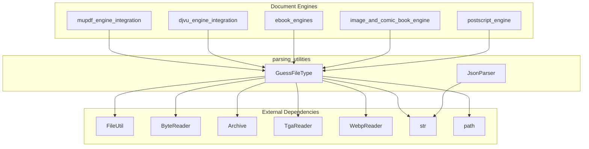
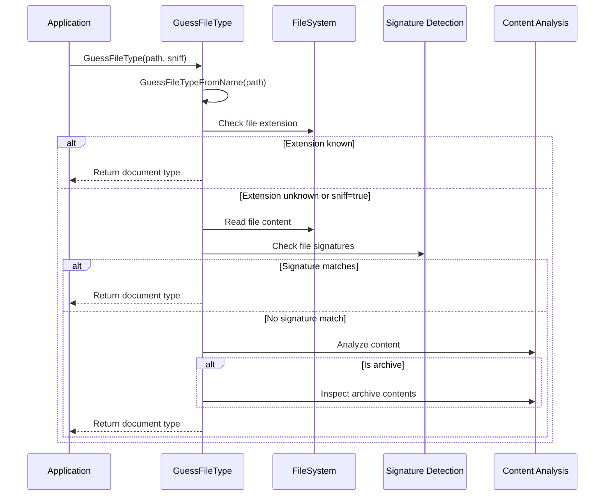
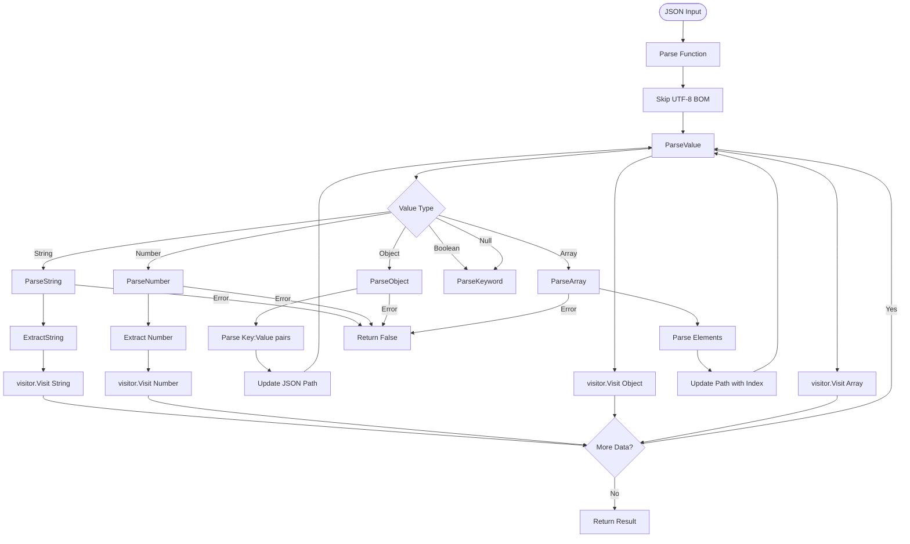

# Parsing Utilities Module

## Introduction

The parsing_utilities module provides essential file type detection and JSON parsing capabilities for the SumatraPDF application. This module serves as a foundational component that enables the application to identify various document formats and parse configuration data, supporting the core functionality of opening and processing different file types.

## Module Overview

The parsing_utilities module is part of the core_utilities parent module and contains two primary components:

- **File Type Detection**: Identifies document formats through file signatures, extensions, and content analysis
- **JSON Parsing**: Provides a lightweight JSON parser for configuration and data exchange

## Core Components

### 1. File Type Detection (GuessFileType)

**Component**: `src.utils.GuessFileType.FileSig`

The file type detection system provides comprehensive format identification through multiple detection methods:

#### Detection Methods

1. **Extension-based Detection**: Maps file extensions to document types
2. **Signature-based Detection**: Analyzes file headers and magic bytes
3. **Content-based Detection**: Examines file contents for format-specific patterns
4. **Archive Analysis**: Inspects archive contents for embedded document types

#### Supported Formats

**Documents**: PDF, XPS, DjVu, CHM, EPUB, MOBI, PalmDoc, FB2
**Images**: PNG, JPEG, GIF, TIFF, BMP, TGA, JXR, WebP, JP2, HEIC, AVIF
**Archives**: ZIP, RAR, 7Z, TAR, CBZ, CBR, CB7, CBT
**Web**: HTML, SVG
**Text**: TXT, JSON, XML, NFO

#### File Signature Detection

The system uses byte signatures at specific offsets to identify formats:

```cpp
struct FileSig {
    size_t offset;      // Byte offset to check
    const char* sig;    // Signature bytes
    size_t sigLen;      // Signature length
    Kind kind;          // Document type
};
```

Key signatures include:
- **PDF**: `%PDF-` pattern anywhere in first 8KB
- **ZIP**: `PK\x03\x04` at offset 0
- **PNG**: `\x89PNG\x0D\x0A\x1A\x0A` at offset 0
- **JPEG**: `\xFF\xD8` at offset 0
- **RAR**: `Rar!\x1A\x07\x00` at offset 0

#### Archive Content Analysis

For archive formats, the system can inspect contents to determine specific document types:
- **EPUB**: Checks for `META-INF/container.xml` or `mimetype` file
- **XPS**: Looks for `_rels/.rels` relationships
- **FB2**: Searches for single `.fb2` file within archive

### 2. JSON Parser (JsonParser)

**Component**: `src.utils.JsonParser.ParseArgs`

A lightweight, streaming JSON parser that processes JSON data using a visitor pattern.

#### Architecture

The parser uses a recursive descent approach with the following components:

```cpp
class ParseArgs {
    str::Str path;          // Current JSON path (e.g., "/config/theme")
    bool canceled;          // Cancellation flag
    ValueVisitor* visitor;  // Visitor interface for data handling
};
```

#### Supported JSON Types

- **Objects**: `{ "key": "value" }`
- **Arrays**: `[ "item1", "item2" ]`
- **Strings**: `"text with escape sequences"`
- **Numbers**: `42`, `3.14`, `1.23e-4`
- **Booleans**: `true`, `false`
- **Null**: `null`

#### Visitor Pattern

The parser implements a visitor pattern where `ValueVisitor` receives callbacks for each JSON value:

```cpp
bool Visit(const char* path, const char* value, Type type);
```

Path format examples:
- Root object: `/`
- Nested property: `/config/theme`
- Array element: `/items[0]`
- Deep nesting: `/data/users[2]/name`

#### Features

- **UTF-8 Support**: Handles Unicode escape sequences (`\uXXXX`)
- **Streaming**: Processes large JSON files without loading entire content
- **Error Handling**: Returns false on parse errors
- **BOM Support**: Skips UTF-8 Byte Order Mark
- **Escape Sequences**: Supports standard JSON escapes (`\n`, `\t`, `\r`, etc.)

## Architecture

### Component Relationships



### Data Flow



### JSON Parsing Flow



## Integration with Other Modules

### Document Engine Integration

The parsing_utilities module is essential for document engine initialization:

1. **[mupdf_engine_integration](mupdf_engine_integration.md)**: Uses file type detection to determine if MuPDF should handle PDF, XPS, or image formats
2. **[djvu_engine_integration](djvu_engine_integration.md)**: Identifies DjVu documents through extension and signature detection
3. **[ebook_engines](ebook_engines.md)**: Detects EPUB, MOBI, CHM, and FB2 formats for specialized ebook processing
4. **[image_and_comic_book_engine](image_and_comic_book_engine.md)**: Identifies image formats and comic book archives (CBZ, CBR)
5. **[postscript_engine](postscript_engine.md)**: Detects PostScript files through content analysis

### Configuration Management

The JSON parser is used throughout the application for:
- **Settings Storage**: Parsing user preferences and configuration files
- **Theme Management**: Loading UI theme definitions
- **Plugin Configuration**: Processing plugin metadata and settings
- **Document Metadata**: Parsing embedded JSON data in documents

## Usage Examples

### File Type Detection

```cpp
// Simple extension-based detection
Kind kind = GuessFileType("document.pdf", false);
if (kind == kindFilePDF) {
    // Handle PDF document
}

// Content-based detection with archive inspection
Kind kind = GuessFileType("archive.cbz", true);
if (kind == kindFileCbz) {
    // Handle comic book archive
}

// Detect embedded PDF streams
Kind kind = GuessFileType("base.pdf:123", false);
if (kind == kindFilePDF) {
    // Handle embedded PDF
}
```

### JSON Parsing

```cpp
class ConfigVisitor : public ValueVisitor {
    bool Visit(const char* path, const char* value, Type type) override {
        if (str::Eq(path, "/theme/name") && type == Type::String) {
            SetTheme(value);
        } else if (str::Eq(path, "/window/width") && type == Type::Number) {
            int width = atoi(value);
            SetWindowWidth(width);
        }
        return true; // Continue parsing
    }
};

const char* jsonData = R"({
    "theme": {
        "name": "dark",
        "accent": "blue"
    },
    "window": {
        "width": 1024,
        "height": 768
    }
})";

ConfigVisitor visitor;
bool success = json::Parse(jsonData, &visitor);
```

## Error Handling

### File Type Detection Errors

- **Null Return**: Indicates unknown file type or detection failure
- **Extension Fallback**: When content detection fails, falls back to extension
- **Archive Errors**: Gracefully handles corrupted archives

### JSON Parsing Errors

- **Syntax Errors**: Returns false on malformed JSON
- **Memory Errors**: Handles allocation failures gracefully
- **Invalid Escapes**: Fails on invalid escape sequences
- **Number Format**: Validates numeric format compliance

## Performance Considerations

### File Type Detection

- **Signature Cache**: File signatures are pre-compiled for fast lookup
- **Limited Reading**: Reads maximum 2KB for content detection
- **Early Exit**: Stops at first successful detection
- **Extension Priority**: Checks extensions first for performance

### JSON Parsing

- **Streaming Design**: Processes data without full memory load
- **Path Optimization**: Efficient path building and management
- **Visitor Control**: Allows early termination via visitor return value
- **No Allocation**: Minimal dynamic allocation during parsing

## Security Considerations

### File Type Detection

- **Content Sniffing**: Prevents execution of disguised files
- **Archive Validation**: Validates archive structure before processing
- **Path Traversal**: Sanitizes file paths to prevent directory traversal
- **Buffer Limits**: Enforces maximum read sizes to prevent DoS

### JSON Parsing

- **Depth Limits**: Prevents stack overflow from deeply nested JSON
- **String Length**: Validates string lengths to prevent memory exhaustion
- **Number Range**: Handles numeric overflow gracefully
- **Path Length**: Manages path string growth to prevent excessive memory use

## Testing and Validation

The module includes verification mechanisms:

```cpp
// Extension mapping verification
static bool gDidVerifyExtsMatch = false;
static void VerifyExtsMatch() {
    if (gDidVerifyExtsMatch) {
        return;
    }
    ReportIf(kindFileEpub != GetKindByFileExt("foo.epub"));
    ReportIf(kindFileJp2 != GetKindByFileExt("foo.JP2"));
    gDidVerifyExtsMatch = true;
}
```

This ensures that file extension mappings are correctly configured and prevents runtime errors due to misconfiguration.

## Future Enhancements

Potential improvements to the module include:

1. **Additional Format Support**: Expanding support for new document and image formats
2. **Enhanced Archive Detection**: Improving detection of complex archive structures
3. **JSON Schema Validation**: Adding JSON schema validation capabilities
4. **Performance Optimization**: Implementing caching for frequently detected files
5. **Machine Learning**: Using ML for more accurate file type detection
6. **Async Parsing**: Adding asynchronous JSON parsing for large files

## Conclusion

The parsing_utilities module provides critical infrastructure for the SumatraPDF application, enabling robust file type detection and configuration parsing. Its efficient design and comprehensive format support make it an essential component for document processing workflows. The module's clean architecture and well-defined interfaces facilitate easy integration with other components while maintaining high performance and reliability.