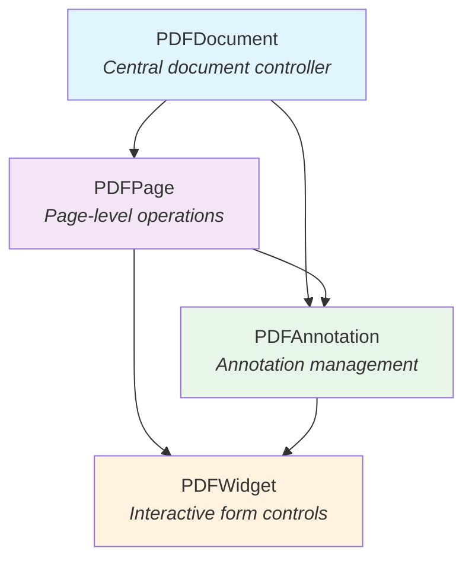
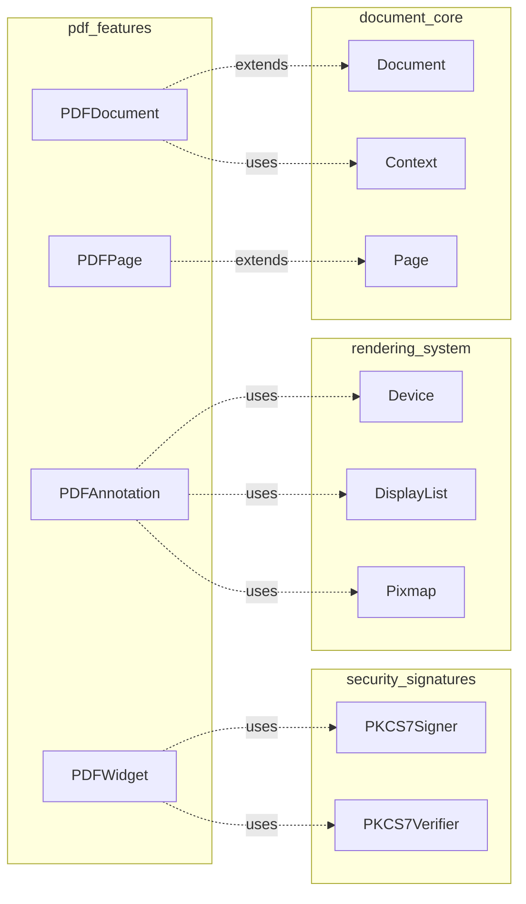
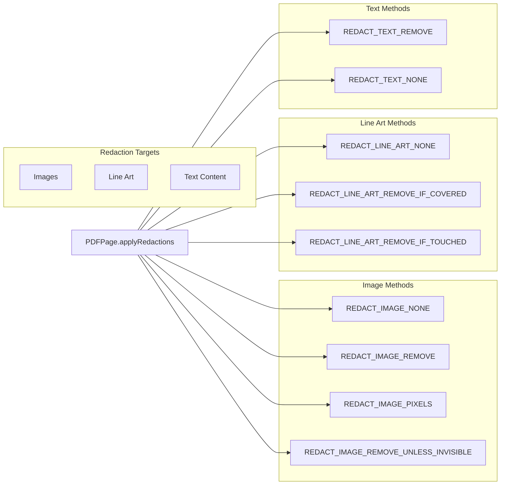
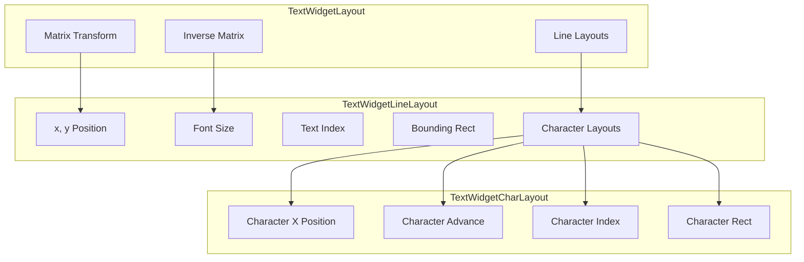
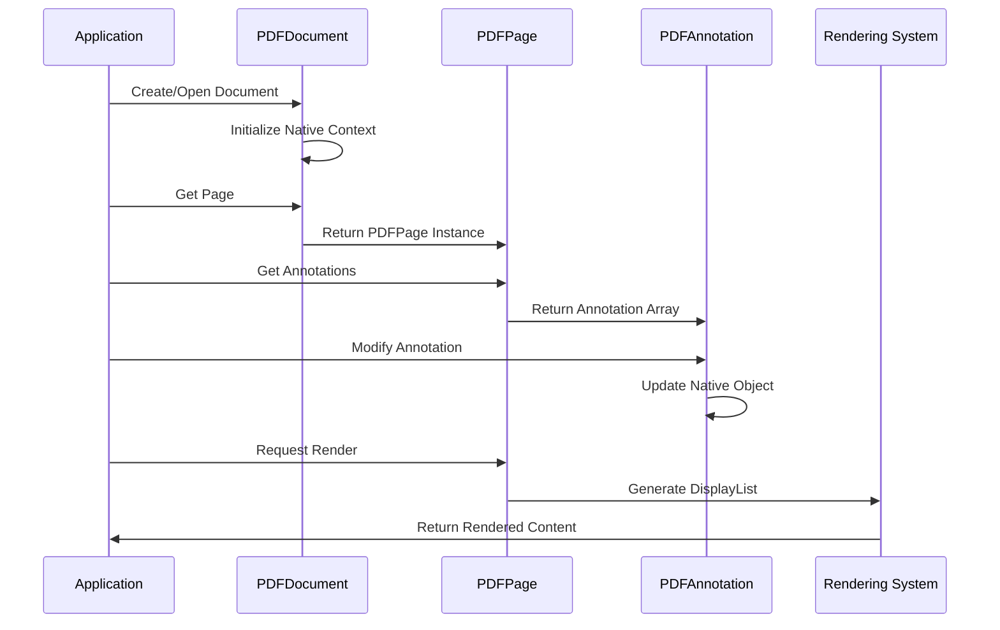
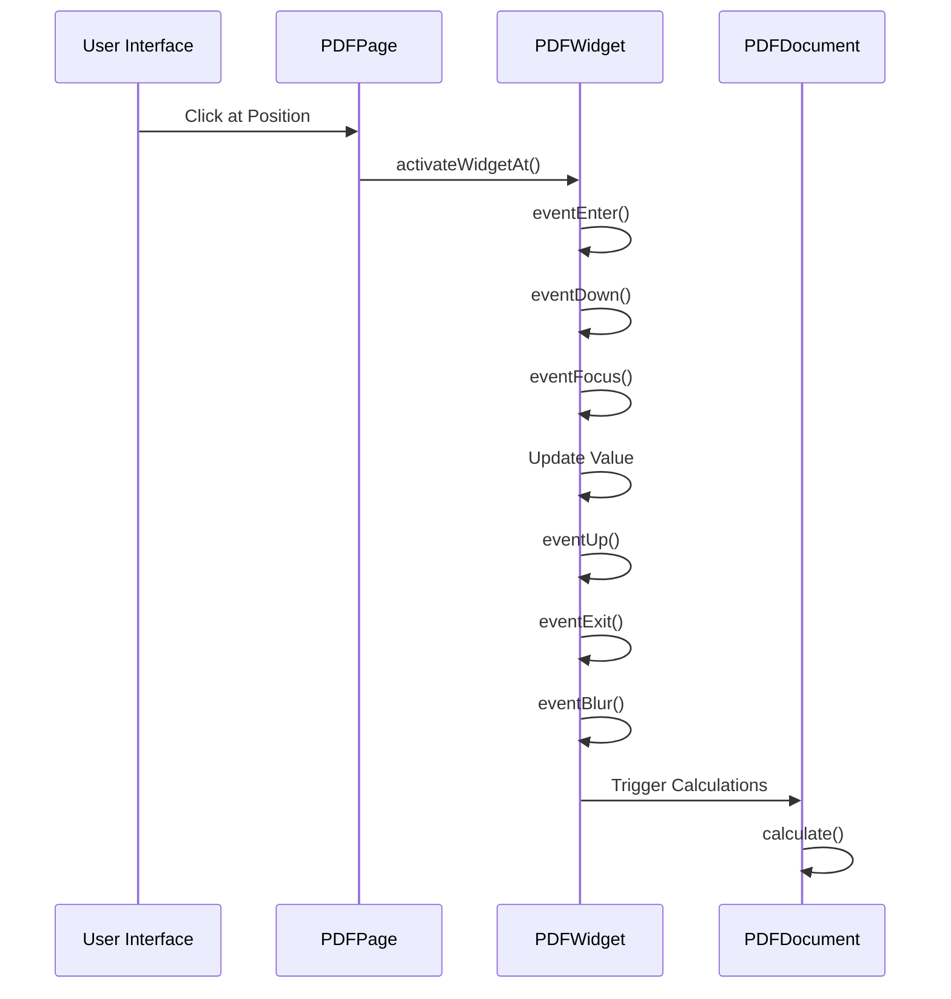

# PDF Features Module Documentation

## Introduction

The `pdf_features` module provides comprehensive PDF-specific functionality within the MuPDF Java bindings ecosystem. This module extends the core document handling capabilities with specialized PDF features including form widgets, annotations, digital signatures, document manipulation, and advanced PDF operations. It serves as the primary interface for PDF-specific operations that go beyond basic document viewing and rendering.

## Module Architecture

The pdf_features module is built around four core components that work together to provide a complete PDF manipulation framework:

### Core Components Overview



### Module Dependencies



## Component Details

### PDFDocument - Central Document Controller

The `PDFDocument` class serves as the primary entry point for PDF-specific operations. It extends the base `Document` class and provides comprehensive PDF manipulation capabilities.

#### Key Responsibilities:
- **Document Structure Management**: Page insertion, deletion, and rearrangement
- **Object Management**: PDF object creation, manipulation, and deletion
- **Form Handling**: AcroForm and XFA form detection and management
- **Digital Operations**: Signature management, encryption, and security
- **Content Manipulation**: Stream creation, image embedding, font management
- **Advanced Features**: Layer management, embedded files, page labels

#### Architecture Integration:

```mermaid
graph TD
    PDFDocument[PDFDocument]
    
    subgraph "Document Operations"
        DO1[Page Management]
        DO2[Object Creation]
        DO3[Stream Handling]
        DO4[Font Management]
    end
    
    subgraph "Form & Security"
        FS1[AcroForm Detection]
        FS2[XFA Form Support]
        FS3[Digital Signatures]
        FS4[Encryption]
    end
    
    subgraph "Advanced Features"
        AF1[Layer Control]
        AF2[Embedded Files]
        AF3[Page Labels]
        AF4[Version Management]
    end
    
    PDFDocument --> DO1
    PDFDocument --> DO2
    PDFDocument --> DO3
    PDFDocument --> DO4
    PDFDocument --> FS1
    PDFDocument --> FS2
    PDFDocument --> FS3
    PDFDocument --> FS4
    PDFDocument --> AF1
    PDFDocument --> AF2
    PDFDocument --> AF3
    PDFDocument --> AF4
```



#### JavaScript Integration:
The PDFDocument provides comprehensive JavaScript support for interactive PDF features:
- Event listener management for PDF JavaScript operations
- Alert handling with customizable button configurations
- Form field calculation triggering

### PDFPage - Page-Level Operations

The `PDFPage` class extends the base `Page` class with PDF-specific page operations and annotations management.

#### Key Capabilities:
- **Annotation Management**: Create, delete, and manipulate PDF annotations
- **Widget Interaction**: Form field widget handling and activation
- **Redaction Support**: Advanced redaction with multiple content type handling
- **Link Creation**: Various link destination types (Fit, XYZ, FitR, etc.)
- **Page Processing**: Custom PDF processor integration

#### Redaction System:



### PDFAnnotation - Annotation Management

The `PDFAnnotation` class provides comprehensive annotation handling with support for all standard PDF annotation types.

#### Annotation Type System:

```mermaid
graph TD
    Annotation[PDFAnnotation Types]
    
    subgraph "Text Annotations"
        TA1[TYPE_TEXT]
        TA2[TYPE_FREE_TEXT]
        TA3[TYPE_HIGHLIGHT]
        TA4[TYPE_UNDERLINE]
        TA5[TYPE_SQUIGGLY]
        TA6[TYPE_STRIKE_OUT]
    end
    
    subgraph "Shape Annotations"
        SA1[TYPE_LINE]
        SA2[TYPE_SQUARE]
        SA3[TYPE_CIRCLE]
        SA4[TYPE_POLYGON]
        SA5[TYPE_POLY_LINE]
    end
    
    subgraph "Interactive Annotations"
        IA1[TYPE_LINK]
        IA2[TYPE_WIDGET]
        IA3[TYPE_POPUP]
        IA4[TYPE_SCREEN]
    end
    
    subgraph "Media Annotations"
        MA1[TYPE_FILE_ATTACHMENT]
        MA2[TYPE_SOUND]
        MA3[TYPE_MOVIE]
        MA4[TYPE_RICH_MEDIA]
        MA5[TYPE_3D]
    end
    
    subgraph "Specialized"
        SP1[TYPE_REDACT]
        SP2[TYPE_STAMP]
        SP3[TYPE_CARET]
        SP4[TYPE_INK]
    end
    
    Annotation --> TA1
    Annotation --> TA2
    Annotation --> TA3
    Annotation --> TA4
    Annotation --> TA5
    Annotation --> TA6
    Annotation --> SA1
    Annotation --> SA2
    Annotation --> SA3
    Annotation --> SA4
    Annotation --> SA5
    Annotation --> IA1
    Annotation --> IA2
    Annotation --> IA3
    Annotation --> IA4
    Annotation --> MA1
    Annotation --> MA2
    Annotation --> MA3
    Annotation --> MA4
    Annotation --> MA5
    Annotation --> SP1
    Annotation --> SP2
    Annotation --> SP3
    Annotation --> SP4
```



#### Visual Properties Management:
- **Color System**: Support for border and interior colors with float arrays
- **Border Styling**: Multiple border styles (solid, dashed, beveled, inset, underline)
- **Line Endings**: Comprehensive line ending styles for line annotations
- **Opacity Control**: Alpha transparency support for all annotation types
- **Appearance Streams**: Custom appearance generation and management

#### Advanced Features:
- **Quad Points**: Support for text markup annotations with arbitrary quadrilaterals
- **Ink Lists**: Freehand drawing support with multi-stroke ink annotations
- **Callout Lines**: Specialized callout annotation support with customizable lines
- **Rich Text**: HTML-style rich text content for free text annotations

### PDFWidget - Interactive Form Controls

The `PDFWidget` class extends `PDFAnnotation` to provide comprehensive form field functionality, representing interactive elements in PDF forms.

#### Widget Type Hierarchy:

```mermaid
graph TD
    Widget[PDFWidget]
    
    subgraph "Button Widgets"
        BW1[TYPE_BUTTON]
        BW2[TYPE_CHECKBOX]
        BW3[TYPE_RADIOBUTTON]
    end
    
    subgraph "Text Widgets"
        TW1[TYPE_TEXT]
        TW2[TX_FIELD_IS_MULTILINE]
        TW3[TX_FIELD_IS_PASSWORD]
        TW4[TX_FIELD_IS_COMB]
    end
    
    subgraph "Choice Widgets"
        CW1[TYPE_COMBOBOX]
        CW2[TYPE_LISTBOX]
        CW3[CH_FIELD_IS_COMBO]
        CW4[CH_FIELD_IS_EDIT]
        CW5[CH_FIELD_IS_SORT]
        CW6[CH_FIELD_IS_MULTI_SELECT]
    end
    
    subgraph "Signature Widgets"
        SW1[TYPE_SIGNATURE]
        SW2[PKCS7Signer Integration]
        SW3[Digital Signature Validation]
    end
    
    Widget --> BW1
    Widget --> BW2
    Widget --> BW3
    Widget --> TW1
    Widget --> TW2
    Widget --> TW3
    Widget --> TW4
    Widget --> CW1
    Widget --> CW2
    Widget --> CW3
    Widget --> CW4
    Widget --> CW5
    Widget --> CW6
    Widget --> SW1
    Widget --> SW2
    Widget --> SW3
```



#### Text Widget Layout System:



#### Digital Signature Integration:
The PDFWidget class provides comprehensive digital signature support:
- **Signature Creation**: PKCS#7 signature generation with custom appearance
- **Signature Validation**: Certificate chain validation and digest verification
- **Visual Customization**: Configurable signature appearance with logos, text, and graphics
- **Multiple Formats**: Support for various signature standards and compliance requirements

## Data Flow Architecture

### Document Processing Flow



### Form Interaction Flow



## Integration with Other Modules

### Document Core Integration
The pdf_features module builds upon the [document_core](document_core.md) module, extending basic document functionality with PDF-specific features:
- **PDFDocument** extends **Document** with PDF-specific operations
- **PDFPage** extends **Page** with annotation and widget support
- Both classes maintain compatibility with the base document interface

### Rendering System Integration
Integration with the [rendering_system](rendering_system.md) enables visual representation of PDF features:
- **PDFAnnotation** can render to **Device**, **DisplayList**, and **Pixmap**
- **PDFPage** supports custom **PDFProcessor** for specialized rendering
- Appearance streams integrate with the display list system

### Security and Signatures Integration
The [security_signatures](security_signatures.md) module provides cryptographic functionality:
- **PDFWidget** integrates with **PKCS7Signer** for signature creation
- **PKCS7Verifier** enables signature validation and certificate checking
- **PKCS7DistinguishedName** provides certificate information extraction

## Advanced Features

### Layer Management
PDFDocument provides comprehensive layer (Optional Content Group) support:
- Layer visibility control
- Layer enumeration and naming
- Layer state management across document operations

### Embedded File Support
Complete embedded file management system:
- File attachment with metadata preservation
- MIME type detection and validation
- Checksum verification for data integrity
- Stream-based file operations for memory efficiency

### Page Label System
Advanced page numbering and labeling:
- Multiple numbering styles (decimal, Roman, alphabetic)
- Custom prefixes and starting numbers
- Per-page label customization
- Automatic label formatting

### Journal and Undo System
Comprehensive change tracking:
- Operation-based journaling
- Undo/redo functionality with step enumeration
- Journal persistence to files and streams
- Implicit and explicit operation grouping

## Usage Patterns

### Basic Document Operations
```java
// Document creation and manipulation
PDFDocument doc = new PDFDocument();
PDFPage page = (PDFPage) doc.loadPage(0);
PDFAnnotation[] annotations = page.getAnnotations();
```

### Form Field Interaction
```java
// Widget interaction and form processing
PDFWidget[] widgets = page.getWidgets();
for (PDFWidget widget : widgets) {
    if (widget.isText()) {
        widget.setTextValue("New Value");
    }
}
```

### Annotation Management
```java
// Annotation creation and modification
PDFAnnotation annot = page.createAnnotation(PDFAnnotation.TYPE_HIGHLIGHT);
annot.setColor(new float[]{1.0f, 1.0f, 0.0f}); // Yellow
annot.setQuadPoints(quadArray);
```

### Digital Signature Operations
```java
// Digital signature creation and validation
PDFWidget signatureWidget = page.createSignature();
PKCS7Signer signer = new PKCS7Signer();
boolean success = signatureWidget.sign(signer);
```

## Performance Considerations

### Memory Management
- Native resource cleanup through finalizers
- Explicit destroy() methods for immediate cleanup
- Context initialization handled automatically

### Processing Optimization
- Stream-based operations for large files
- Incremental saving support for minimal I/O
- Display list caching for repeated rendering

### Thread Safety
- Context initialization synchronization
- Native method thread safety handled by MuPDF core
- Document-level locking for concurrent access

## Error Handling

### Exception Strategy
- Native errors converted to Java exceptions
- Validation methods return boolean status
- Detailed error information through native error reporting

### Validation Patterns
- Form field validation before value setting
- Signature validation with detailed status reporting
- Document integrity checking before operations

## Future Enhancements

### Planned Features
- Enhanced JavaScript API coverage
- Additional signature formats and standards
- Improved rich text editing capabilities
- Advanced form field calculation support

### Extensibility Points
- Custom annotation types through extension points
- Plugin architecture for specialized processing
- Custom appearance stream generation
- Third-party signature provider integration

This documentation provides a comprehensive overview of the pdf_features module, its architecture, and integration points within the larger MuPDF Java bindings ecosystem. The module serves as the primary interface for PDF-specific operations while maintaining compatibility with the broader document processing framework.