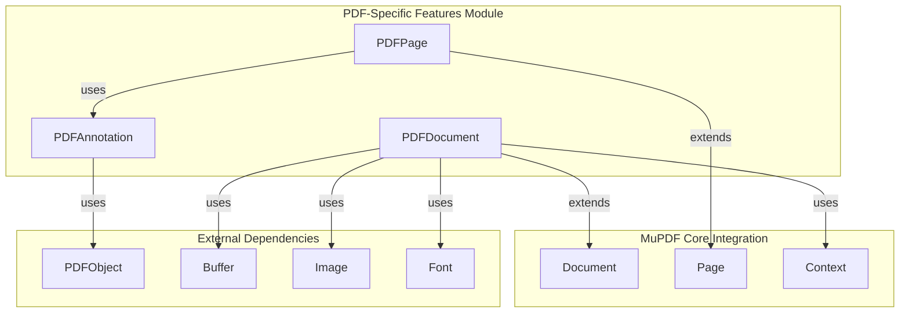
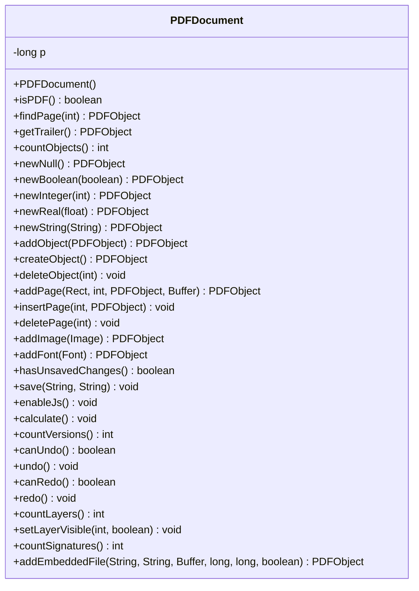
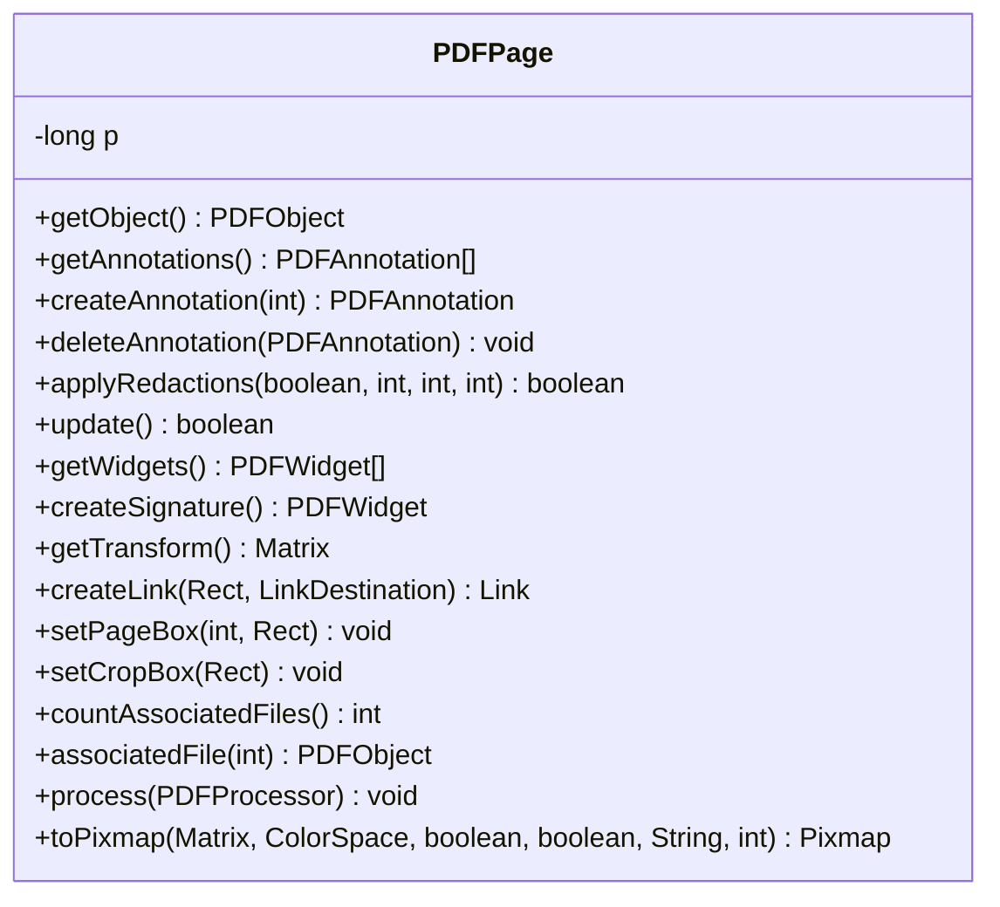
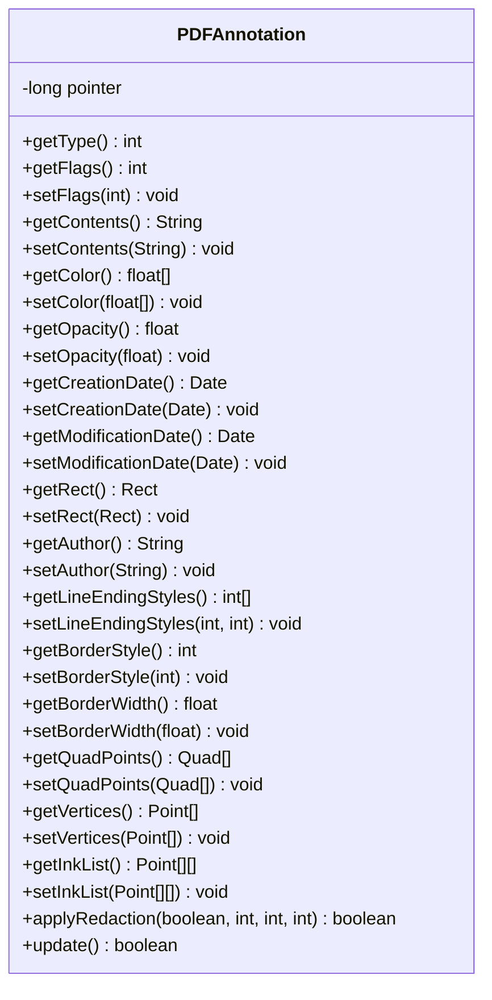
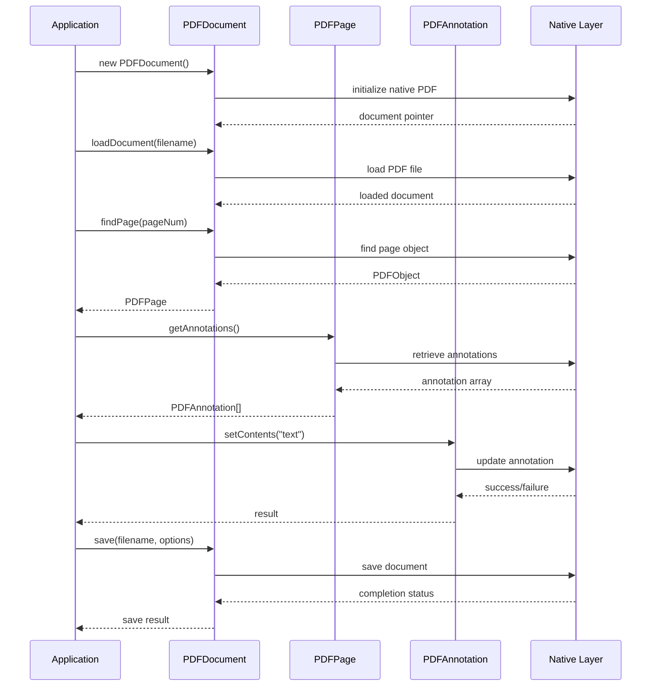
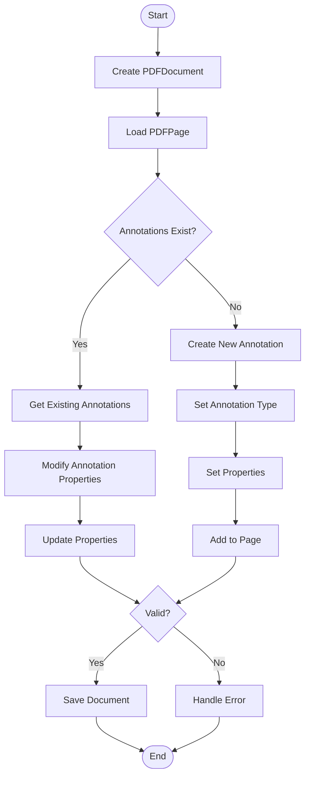
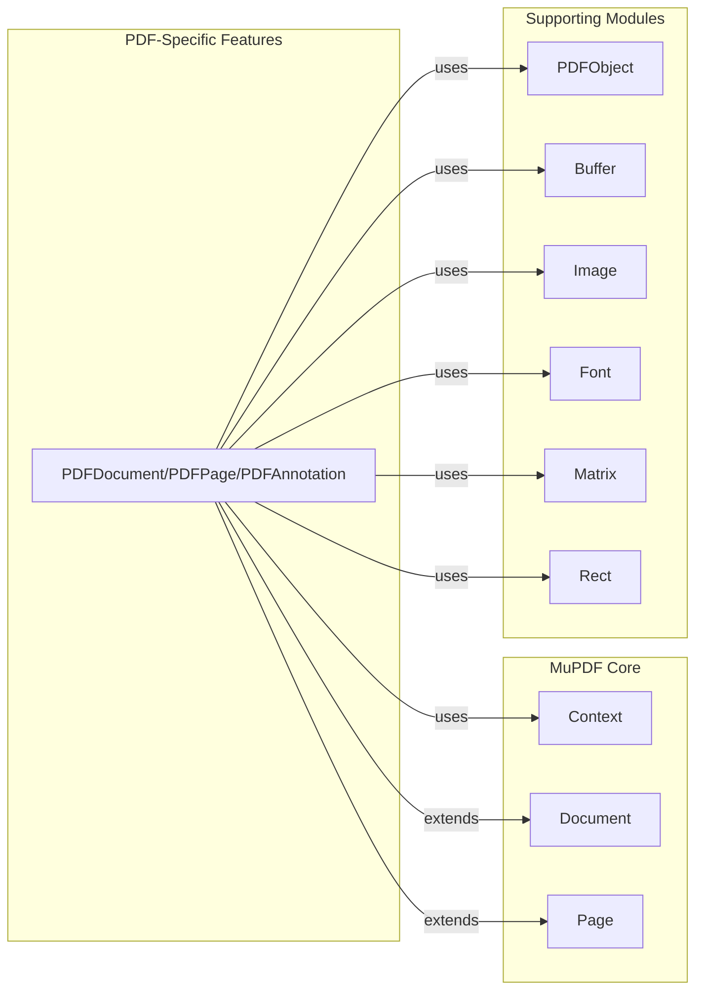

# PDF-Specific Features Module Documentation

## Introduction

The PDF-Specific Features module provides comprehensive Java bindings for PDF document manipulation and annotation management within the MuPDF framework. This module extends the core MuPDF functionality with specialized PDF operations including document creation, annotation handling, form field management, redaction capabilities, and advanced PDF-specific features like JavaScript support, digital signatures, and layer management.

## Architecture Overview

The module is built around three core components that work together to provide a complete PDF manipulation API:

### Core Components

1. **PDFDocument** - The central document management class that handles PDF file operations, metadata, and document-level features
2. **PDFPage** - Page-specific operations including annotation management, redaction, and page transformations  
3. **PDFAnnotation** - Comprehensive annotation creation, modification, and property management

### Module Relationships



## Component Architecture

### PDFDocument Class

The PDFDocument class serves as the primary interface for PDF document operations, extending the base Document class with PDF-specific functionality.



#### Key Features:
- **Document Creation & Manipulation**: Create new PDF objects, pages, and manage document structure
- **JavaScript Support**: Enable/disable JavaScript execution with event listener support
- **Undo/Redo System**: Complete operation history management with journal support
- **Layer Management**: Control PDF layer visibility and properties
- **Digital Signatures**: Signature counting and validation capabilities
- **Embedded Files**: Attach and manage embedded file attachments
- **Form Support**: Detect and interact with AcroForm and XFA forms

### PDFPage Class

The PDFPage class extends the base Page class with PDF-specific page operations and annotation management.



#### Key Features:
- **Annotation Management**: Create, modify, and delete PDF annotations
- **Redaction Support**: Apply redactions with configurable image, line art, and text handling
- **Form Widgets**: Manage interactive form fields and signature creation
- **Link Creation**: Create various types of hyperlinks with different destination styles
- **Page Processing**: Process pages through custom PDF processors
- **Associated Files**: Handle file attachments associated with specific pages

### PDFAnnotation Class

The PDFAnnotation class provides comprehensive annotation manipulation capabilities with support for all standard PDF annotation types.



#### Annotation Types Supported:
- **Text Annotations**: Text, highlight, underline, squiggly, strikeout
- **Shape Annotations**: Square, circle, line, polygon, polyline
- **Markup Annotations**: Free text, caret, stamp, ink
- **Interactive Annotations**: Link, widget, screen, file attachment
- **Specialized Annotations**: Sound, movie, rich media, 3D, redaction

## Data Flow Architecture

### Document Processing Flow



### Annotation Management Flow



## Integration with MuPDF Framework

### Dependency Relationships

The PDF-Specific Features module integrates with several other modules in the system:



### External Module References

- **[mupdf_engine_integration](mupdf_engine_integration.md)**: Core MuPDF engine integration providing the underlying PDF processing capabilities
- **[core_utilities](core_utilities.md)**: Utility functions for file handling, data structures, and parsing operations
- **[core_application_and_ui](core_application_and_ui.md)**: User interface components that may interact with PDF features

## Advanced Features

### JavaScript Integration

The module provides comprehensive JavaScript support for PDF documents:

```java
// Enable JavaScript execution
pdfDocument.enableJs();

// Set up event listener for JavaScript alerts
pdfDocument.setJsEventListener(new PDFDocument.JsEventListener() {
    @Override
    public AlertResult onAlert(PDFDocument doc, String title, String message, 
                               int iconType, int buttonGroupType, boolean hasCheckbox, 
                               String checkboxMessage, boolean checkboxState) {
        // Handle JavaScript alert
        AlertResult result = new AlertResult();
        result.buttonPressed = BUTTON_OK;
        return result;
    }
});

// Calculate form fields
pdfDocument.calculate();
```

### Undo/Redo System

Complete operation history management with journal support:

```java
// Enable journaling
pdfDocument.enableJournal();

// Begin operation
pdfDocument.beginOperation("Add Annotation");

// Perform operations...

// End operation
pdfDocument.endOperation();

// Undo last operation
if (pdfDocument.canUndo()) {
    pdfDocument.undo();
}

// Save journal for later use
pdfDocument.saveJournal("journal.mjlog");
```

### Digital Signatures and Security

```java
// Count digital signatures
int signatureCount = pdfDocument.countSignatures();

// Verify document integrity
boolean wasRepaired = pdfDocument.wasRepaired();

// Check if document can be saved incrementally
boolean canIncrementalSave = pdfDocument.canBeSavedIncrementally();
```

### Layer Management

```java
// Get layer count
int layerCount = pdfDocument.countLayers();

// Control layer visibility
for (int i = 0; i < layerCount; i++) {
    String layerName = pdfDocument.getLayerName(i);
    boolean isVisible = pdfDocument.isLayerVisible(i);
    
    // Toggle visibility
    pdfDocument.setLayerVisible(i, !isVisible);
}
```

## Error Handling and Validation

### Document Validation

```java
// Check document version and compatibility
int version = pdfDocument.getVersion();
int versions = pdfDocument.countVersions();

// Validate change history
int validationResult = pdfDocument.validateChangeHistory();

// Check for unsaved changes
boolean hasChanges = pdfDocument.hasUnsavedChanges();
```

### Annotation Validation

```java
// Validate annotation properties
boolean hasRect = annotation.hasRect();
boolean hasAuthor = annotation.hasAuthor();
boolean hasColor = annotation.hasInteriorColor();

// Check annotation flags
int flags = annotation.getFlags();
boolean isInvisible = (flags & PDFAnnotation.IS_INVISIBLE) != 0;
boolean isReadOnly = (flags & PDFAnnotation.IS_READ_ONLY) != 0;
```

## Performance Considerations

### Memory Management

- **Native Resource Management**: All classes properly manage native resources through finalization
- **Object Pooling**: Consider reusing PDF objects for batch operations
- **Stream Processing**: Use streaming APIs for large document operations

### Optimization Strategies

1. **Batch Operations**: Group multiple annotations changes into single operations
2. **Incremental Saves**: Use incremental saving for large documents when possible
3. **Lazy Loading**: Annotations and page content are loaded on demand
4. **Native Processing**: Complex operations are performed in native code for performance

## Security Considerations

### Document Security

- **JavaScript Execution**: Carefully validate JavaScript execution context
- **Embedded Files**: Scan embedded files for security threats
- **Digital Signatures**: Verify signature validity before trusting document content

### Access Control

- **Annotation Permissions**: Respect document annotation permissions
- **Form Field Access**: Control access to sensitive form data
- **Layer Security**: Consider layer visibility in security contexts

## Best Practices

### Document Handling

1. **Always validate document type** before performing PDF-specific operations
2. **Check for unsaved changes** before closing documents
3. **Use try-with-resources** for document streams and related resources
4. **Implement proper error handling** for native operations

### Annotation Management

1. **Validate annotation types** before setting type-specific properties
2. **Check for required properties** before applying changes
3. **Use batch operations** for multiple annotation modifications
4. **Test redaction thoroughly** before applying to production documents

### Performance Optimization

1. **Enable journaling** for complex editing operations
2. **Use incremental saves** for large documents
3. **Process pages in batches** for bulk operations
4. **Leverage native processing** for complex transformations

This comprehensive documentation provides developers with the knowledge needed to effectively utilize the PDF-Specific Features module for advanced PDF manipulation tasks within the MuPDF framework.