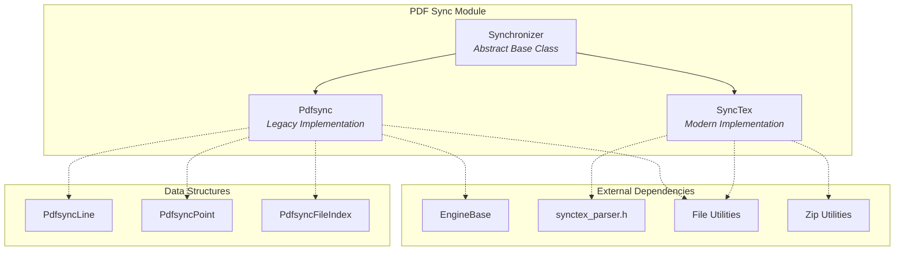
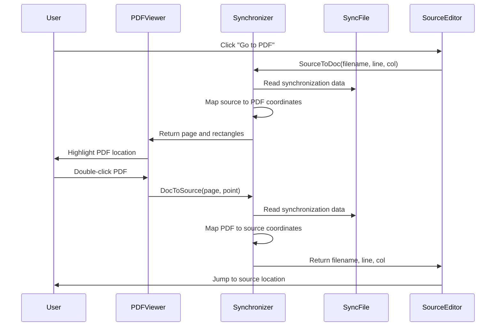
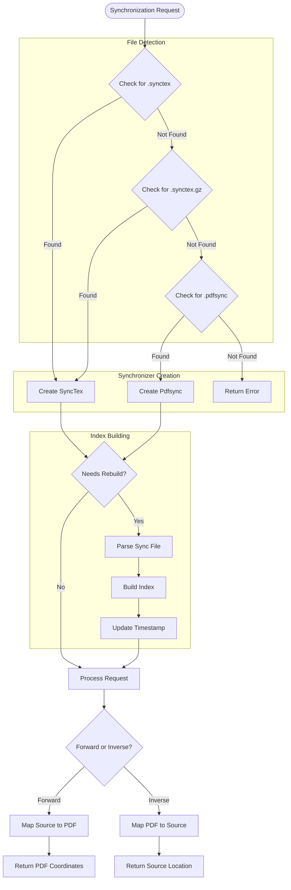
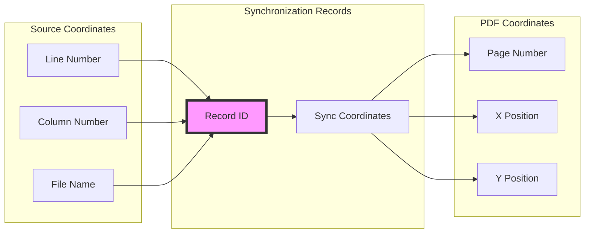
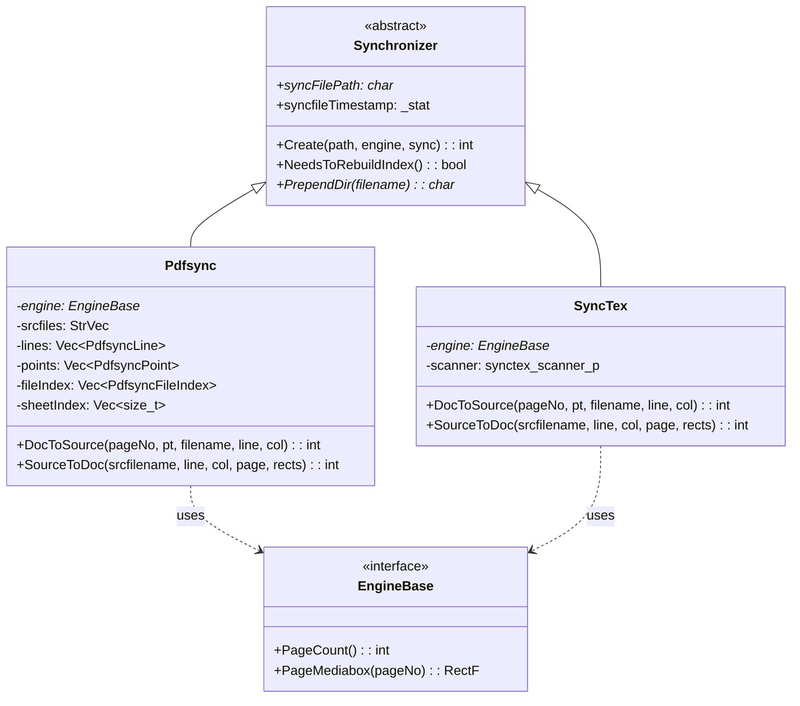

# PDF Sync Module Documentation

## Introduction

The PDF Sync module provides bidirectional synchronization between PDF documents and their source files, enabling seamless navigation between compiled PDF output and the original LaTeX source code. This functionality is essential for LaTeX editors and PDF viewers that support forward and inverse search operations.

The module implements two synchronization protocols:
- **PDFSync**: Legacy synchronization based on `.pdfsync` files
- **SyncTeX**: Modern synchronization based on `.synctex` files (compressed or uncompressed)

## Architecture Overview



## Core Components

### Synchronizer (Abstract Base Class)

The `Synchronizer` class serves as the abstract base for all synchronization implementations, providing common functionality for file management and timestamp checking.

**Key Responsibilities:**
- File path management and directory resolution
- Timestamp-based change detection
- Index rebuilding coordination
- Common utility functions

**Core Methods:**
- `Create()`: Factory method for creating appropriate synchronizer instances
- `NeedsToRebuildIndex()`: Determines if synchronization data needs refreshing
- `PrependDir()`: Resolves relative file paths to absolute paths

### Pdfsync Implementation

The `Pdfsync` class implements synchronization using the legacy PDFSync format, which generates `.pdfsync` files during LaTeX compilation.

**Key Features:**
- Custom binary format parsing
- Coordinate system transformation
- Multi-file source support
- Record-based mapping system

**Data Structures:**
- `PdfsyncLine`: Maps source file locations to synchronization records
- `PdfsyncPoint`: Maps PDF coordinates to synchronization records
- `PdfsyncFileIndex`: Indexes line mappings by source file

### SyncTex Implementation

The `SyncTex` class implements modern synchronization using the SyncTeX format, which is now the standard for LaTeX synchronization.

**Key Features:**
- Integration with `synctex_parser` library
- Compressed file support (`.synctex.gz`)
- UTF-8 and ANSI encoding support
- Robust error handling and logging

## Data Flow Architecture



## Synchronization Process Flow



## Coordinate System Handling

The module handles coordinate system transformations between PDF and source file coordinates:



## Error Handling and Recovery

The module implements comprehensive error handling for various synchronization scenarios:

**Error Codes:**
- `PDFSYNCERR_SUCCESS`: Operation completed successfully
- `PDFSYNCERR_INVALID_ARGUMENT`: Invalid parameters provided
- `PDFSYNCERR_SYNCFILE_NOTFOUND`: No synchronization file found
- `PDFSYNCERR_SYNCFILE_CANNOT_BE_OPENED`: Cannot read synchronization file
- `PDFSYNCERR_OUTOFMEMORY`: Memory allocation failed
- `PDFSYNCERR_INVALID_PAGE_NUMBER`: Invalid page number specified
- `PDFSYNCERR_NO_SYNC_AT_LOCATION`: No synchronization data at location
- `PDFSYNCERR_UNKNOWN_SOURCEFILE`: Source file not found in index
- `PDFSYNCERR_NORECORD_IN_SOURCEFILE`: No records for source file
- `PDFSYNCERR_NORECORD_FOR_THATLINE`: No records for specified line
- `PDFSYNCERR_NOSYNCPOINT_FOR_LINERECORD`: No PDF points for line record

## Integration with Document Engine

The synchronization module integrates with the document engine through the `EngineBase` interface:



## File Format Support

### PDFSync Format (.pdfsync)
- Legacy format used by older LaTeX distributions
- Custom binary format with specific parsing rules
- Supports multiple source files
- Coordinate system: 65781.76 units per PDF unit

### SyncTeX Format (.synctex/.synctex.gz)
- Modern standard format
- Compressed and uncompressed variants
- UTF-8 encoding support
- More accurate synchronization data
- Better error handling

## Performance Considerations

**Index Rebuilding:**
- Automatic detection of file changes via timestamp monitoring
- Lazy loading of synchronization data
- Efficient binary search for record lookup

**Memory Management:**
- Dynamic allocation of synchronization structures
- Automatic cleanup of temporary files
- Memory-efficient storage of coordinate mappings

**Coordinate Transformation:**
- Optimized coordinate conversion algorithms
- Caching of page media box information
- Efficient distance calculations for nearest-point searches

## Usage Examples

### Creating a Synchronizer
```cpp
Synchronizer* sync = nullptr;
int result = Synchronizer::Create(pdfPath, engine, &sync);
if (result == PDFSYNCERR_SUCCESS) {
    // Use synchronizer
    // ...
    delete sync;
}
```

### Forward Search (Source to PDF)
```cpp
int page;
Vec<Rect> rects;
int result = sync->SourceToDoc("main.tex", 42, 0, &page, rects);
if (result == PDFSYNCERR_SUCCESS) {
    // Highlight rectangles on page
    // ...
}
```

### Inverse Search (PDF to Source)
```cpp
AutoFreeStr filename;
int line, col;
Point pt = { 100, 200 };
int result = sync->DocToSource(1, pt, filename, &line, &col);
if (result == PDFSYNCERR_SUCCESS) {
    // Open filename at line, col
    // ...
}
```

## Dependencies

The PDF Sync module depends on several other system components:

- **[EngineBase](engine_base.md)**: Document engine interface for page information
- **[File Utilities](file_util.md)**: File I/O operations
- **[Zip Utilities](zip_util.md)**: Compressed file handling
- **[String Utilities](str_util.md)**: String manipulation and encoding
- **[Path Utilities](path_util.md)**: Path resolution and manipulation

## Related Modules

- **[Document Formats](document_formats.md)**: Parent module containing PDF sync functionality
- **[MuPDF Integration](mupdf_java_bindings.md)**: PDF rendering engine integration
- **[UI Components](ui_components.md)**: User interface for synchronization features

## Future Enhancements

Potential improvements to the PDF Sync module include:

1. **Performance Optimization**: Implement caching mechanisms for frequently accessed synchronization data
2. **Format Extensions**: Support for additional synchronization formats
3. **Error Recovery**: Enhanced error recovery mechanisms for corrupted sync files
4. **Multi-Document Support**: Synchronization across multiple PDF documents
5. **Real-time Updates**: Live synchronization updates during document editing