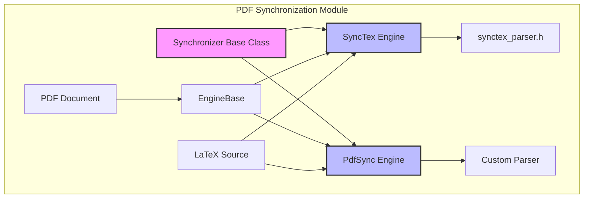
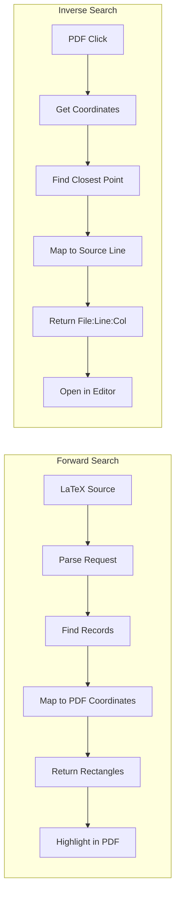
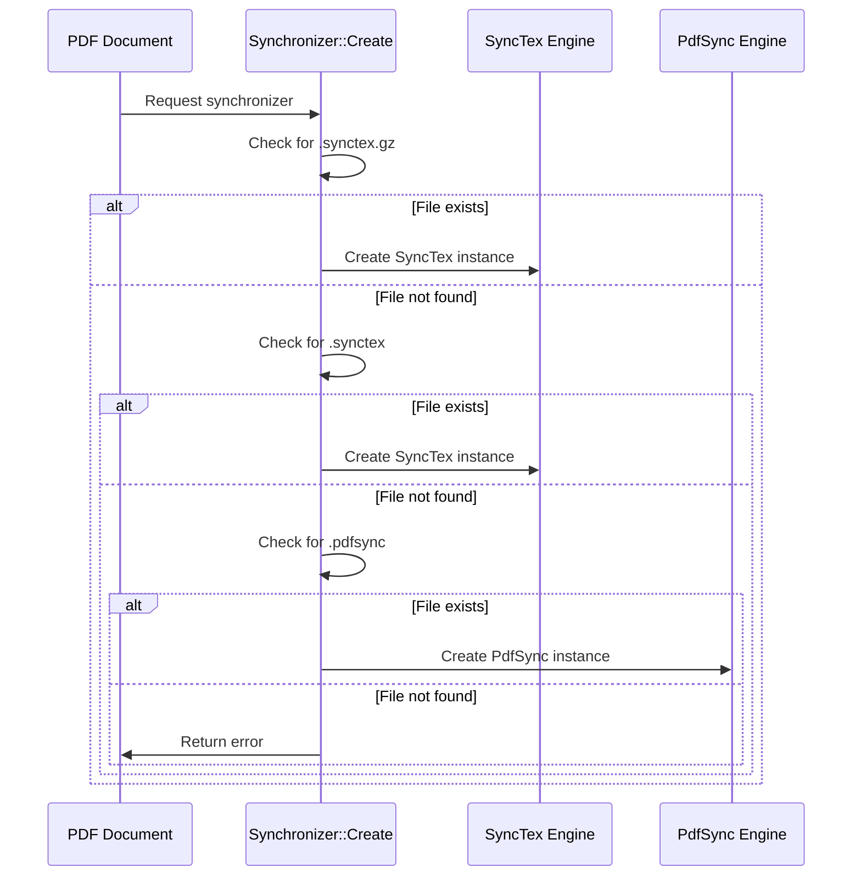
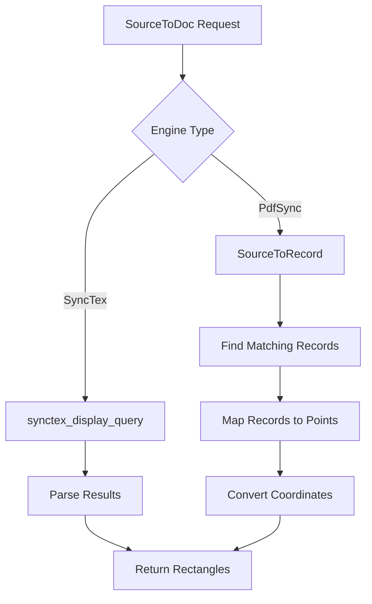
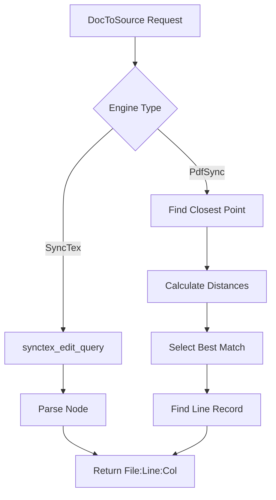
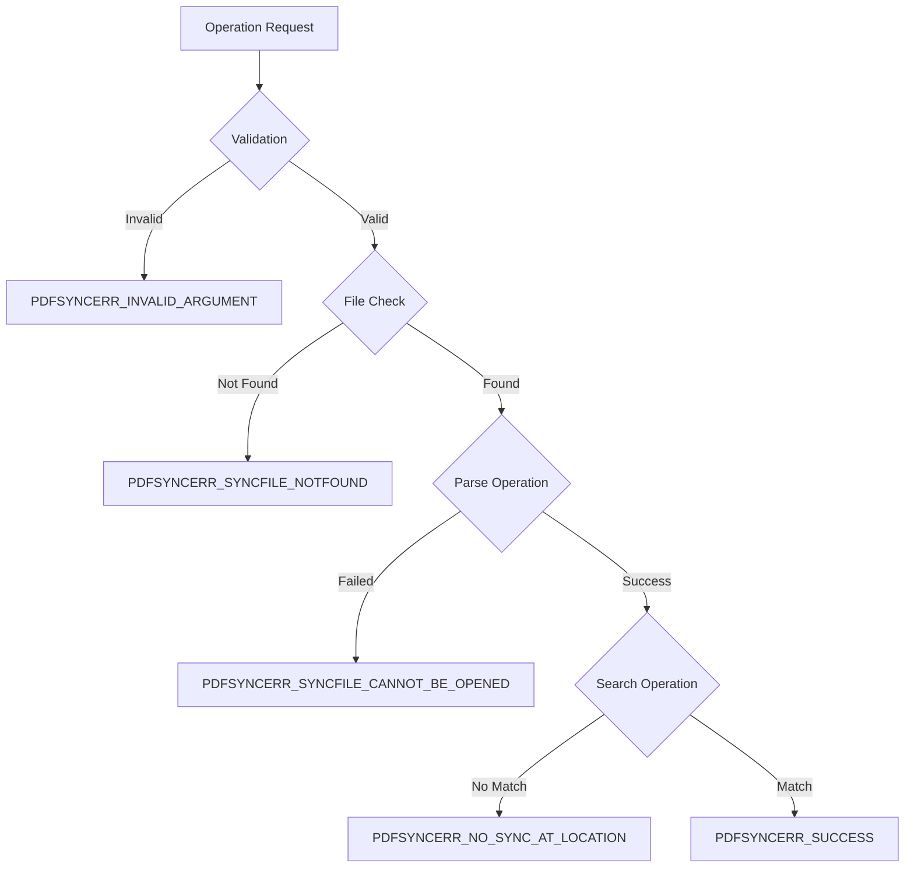
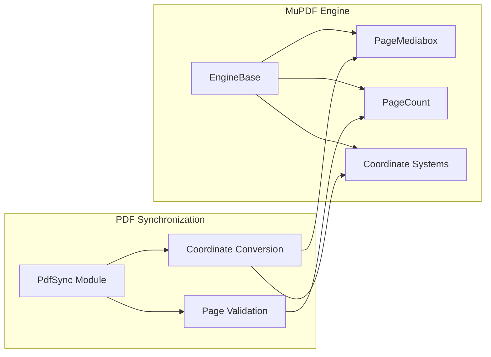

# PDF Synchronization Module

## Introduction

The PDF Synchronization module provides bidirectional synchronization between PDF documents and their corresponding LaTeX source files. This functionality enables seamless navigation between PDF output and source code, supporting both the legacy pdfsync format and the modern SyncTeX standard. The module is essential for LaTeX-based document workflows, allowing users to jump from PDF locations to source lines and vice versa.

## Architecture Overview

The module implements a dual-engine architecture that supports both synchronization formats through a common interface. The design separates the synchronization logic from the underlying file format parsers, providing a unified API for bidirectional navigation.



## Core Components

### Synchronizer Base Class
The abstract base class that defines the common interface for all synchronization engines. It handles file timestamp monitoring, path management, and factory method for creating appropriate synchronizer instances.

**Key Responsibilities:**
- File change detection and index rebuilding
- Path resolution and normalization
- Factory method for synchronizer creation
- Common utility functions

### SyncTex Engine
Implements synchronization using the modern SyncTeX format (.synctex files). This engine leverages the external synctex_parser library for parsing synchronization data.

**Features:**
- Support for both compressed (.synctex.gz) and uncompressed (.synctex) files
- UTF-8 and ANSI encoding support
- Integration with synctex_parser library
- Robust error handling and file decompression

### PdfSync Engine
Implements synchronization using the legacy pdfsync format (.pdfsync files). This engine uses a custom parser for the older synchronization format.

**Features:**
- Custom parser for pdfsync file format
- Support for file inclusion hierarchies
- Coordinate system transformation
- Record-based synchronization mapping

### Data Structures

#### PdfsyncLine
Represents a mapping between source file lines and synchronization records.
```cpp
struct PdfsyncLine {
    UINT record;    // Index for mapping lines to points
    size_t file;    // Index into source files array
    UINT line;      // Line number in source file
    UINT column;    // Column number (optional)
};
```

#### PdfsyncPoint
Represents a mapping between PDF coordinates and synchronization records.
```cpp
struct PdfsyncPoint {
    UINT record;    // Index for mapping points to lines
    UINT page;      // PDF page number
    UINT x, y;      // Coordinates on page
};
```

#### PdfsyncFileIndex
Manages indexing of lines within source files for efficient lookup.
```cpp
struct PdfsyncFileIndex {
    size_t start, end;  // Range of lines for a file
};
```

## Data Flow Architecture



## Component Interactions

### Synchronization File Discovery
The module automatically discovers synchronization files based on the PDF file location:



### Forward Search Process
Converts source file locations to PDF coordinates:



### Inverse Search Process
Converts PDF click locations to source file positions:



## Error Handling

The module implements comprehensive error handling with specific error codes:



## Integration with Document Engine

The module integrates with the [mupdf_engine_integration](mupdf_engine_integration.md) to provide coordinate system transformation and page management:



## File Format Support

### SyncTeX Format
- **File Extensions**: `.synctex`, `.synctex.gz`
- **Encoding**: UTF-8 (preferred) or ANSI
- **Compression**: Gzip support for compressed files
- **Parser**: External synctex_parser library

### PdfSync Format
- **File Extension**: `.pdfsync`
- **Encoding**: ANSI with custom escaping
- **Structure**: Record-based with file inclusion support
- **Parser**: Custom implementation

## Performance Considerations

### Index Rebuilding
- Automatic detection of file changes using timestamps
- Lazy loading of synchronization data
- Efficient binary search for record lookup
- Memory-mapped file access for large synchronization files

### Coordinate Transformation
- Cached page mediabox information
- Optimized distance calculations for inverse search
- Batch processing of multiple synchronization points
- Coordinate system normalization between PDF and synchronization formats

## Usage Patterns

### Forward Search (Source to PDF)
```cpp
// Typical workflow for highlighting source lines in PDF
int page;
Vec<Rect> rects;
int result = synchronizer->SourceToDoc("main.tex", 42, 0, &page, rects);
if (result == PDFSYNCERR_SUCCESS) {
    // Highlight rectangles on page
    engine->HighlightRegions(page, rects);
}
```

### Inverse Search (PDF to Source)
```cpp
// Typical workflow for jumping from PDF to source
AutoFreeStr filename;
int line, col;
int result = synchronizer->DocToSource(pageNo, clickPoint, filename, &line, &col);
if (result == PDFSYNCERR_SUCCESS) {
    // Open filename at line:col in editor
    OpenInEditor(filename, line, col);
}
```

## Dependencies

### Internal Dependencies
- [core_utilities](core_utilities.md) - File I/O, string manipulation, path utilities
- [mupdf_engine_integration](mupdf_engine_integration.md) - PDF engine interface and coordinate systems

### External Dependencies
- **synctex_parser.h** - SyncTeX file parsing library
- **zlib** - Gzip decompression for compressed SyncTeX files

## Configuration Constants

```cpp
#define MARK_SIZE 10                    // Size of forward search highlight marks
#define EPSILON_LINE 5                  // Maximum line number error tolerance
#define PDFSYNC_EPSILON_SQUARE 800      // Maximum distance^2 for point matching
#define PDFSYNC_EPSILON_Y 20            // Maximum vertical distance tolerance
```

## Future Enhancements

### Potential Improvements
- Support for additional synchronization formats
- Enhanced error recovery for corrupted synchronization files
- Performance optimization for large documents
- Integration with cloud-based synchronization services
- Support for multi-file LaTeX projects with complex inclusion hierarchies

### Extension Points
- Plugin architecture for custom synchronization formats
- Configurable tolerance parameters for fuzzy matching
- Integration with external editor protocols (LSP, DAP)
- Support for real-time synchronization updates

## Related Documentation

- [mupdf_engine_integration](mupdf_engine_integration.md) - PDF rendering and coordinate systems
- [core_utilities](core_utilities.md) - File handling and string utilities
- [document_navigation](document_navigation.md) - Document navigation components