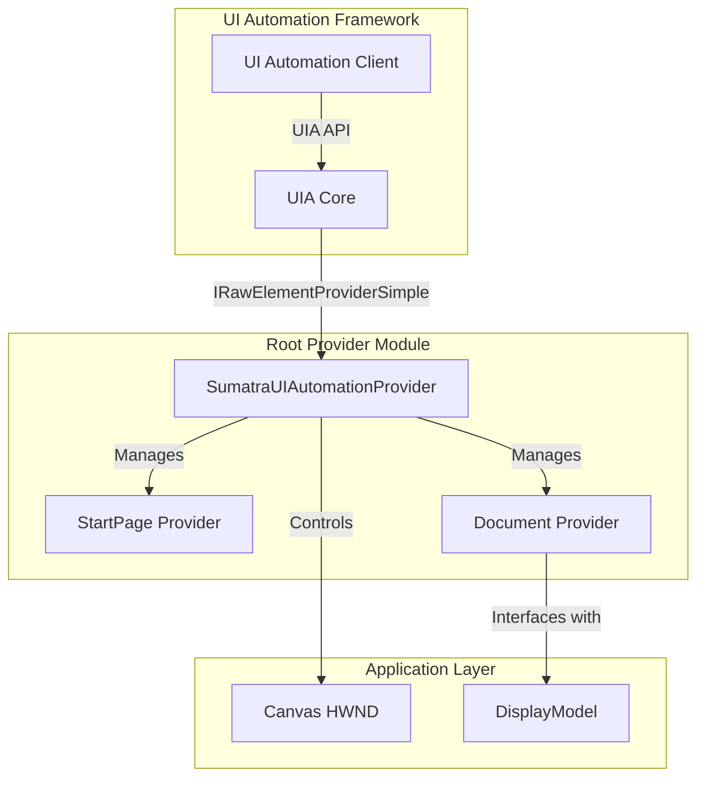
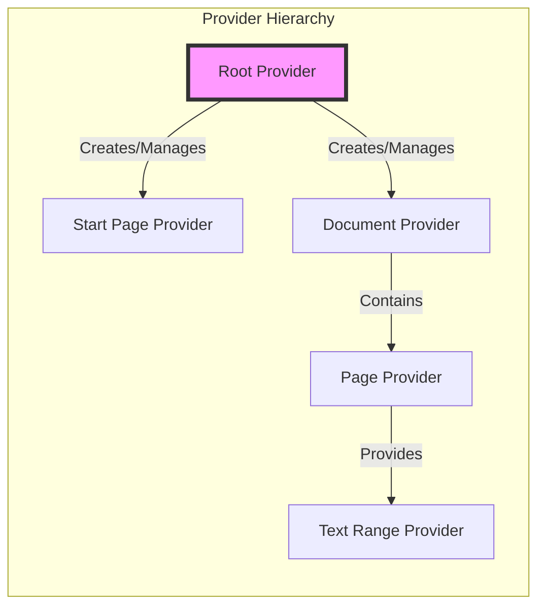
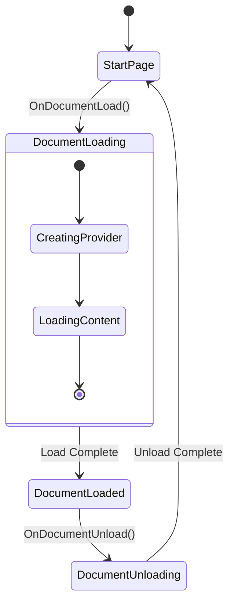
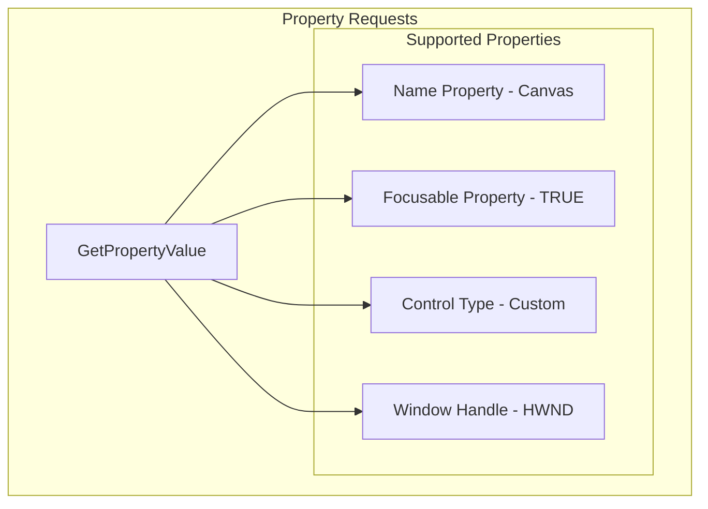
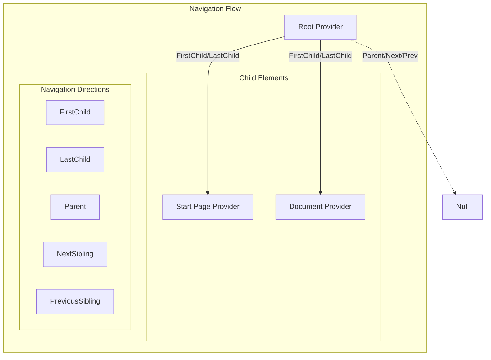
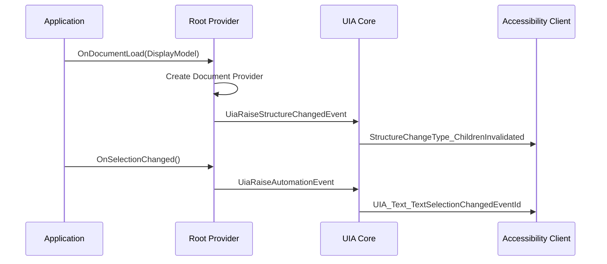
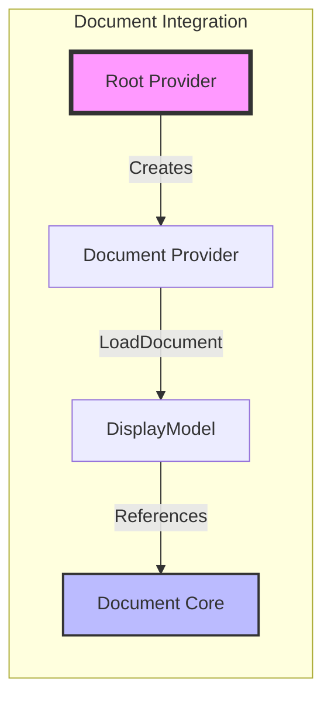
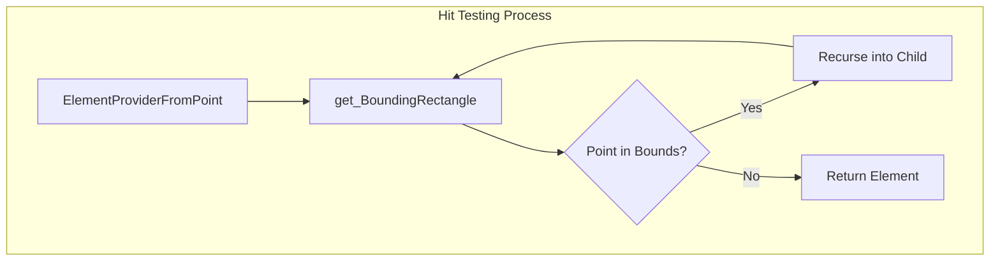

# Root Provider Module Documentation

## Introduction

The root_provider module serves as the foundation for UI Automation (UIA) support in the SumatraPDF application. It implements the core provider interface that enables accessibility tools and automation clients to interact with the document viewer's user interface. This module acts as the entry point for all UI automation requests, managing the hierarchical structure of UI elements and coordinating between different document states.

## Architecture Overview

The root provider implements the Microsoft UI Automation framework interfaces to expose the SumatraPDF application structure to accessibility tools. It serves as the primary fragment root that manages the document hierarchy and provides navigation capabilities for screen readers and other assistive technologies.

## Core Components

### SumatraUIAutomationProvider

The main provider class that implements the IRawElementProviderSimple, IRawElementProviderFragment, and IRawElementProviderFragmentRoot interfaces. This component serves as the central coordinator for all UI automation activities.

**Key Responsibilities:**
- Manages the lifecycle of document and start page providers
- Handles UI automation property requests
- Provides navigation between UI elements
- Coordinates focus management
- Implements hit testing for element selection

**Core Properties:**
- `refCount`: Reference counting for COM object lifecycle management
- `canvasHwnd`: Handle to the main canvas window
- `startpage`: Pointer to the start page provider
- `document`: Pointer to the document provider

## Component Relationships

## Document State Management

The root provider dynamically switches between different document states, managing the transition between the start page and loaded document views.

## UI Automation Interface Implementation

### Property Providers

The root provider exposes essential UI automation properties that describe the application window to accessibility tools:

### Navigation System

The provider implements hierarchical navigation that allows accessibility tools to traverse the UI structure:

## Event Handling

The root provider coordinates UI automation events to notify accessibility tools of changes in the application state:

## Integration with Document System

The root provider interfaces with the DisplayModel to provide access to document content:

## Hit Testing and Element Selection

The provider implements sophisticated hit testing to determine which UI element is at a given screen coordinate:

## Error Handling and Resource Management

The provider implements comprehensive error handling and resource management:

- **Reference Counting**: Proper COM object lifecycle management
- **Null Checks**: Extensive validation of pointers and parameters
- **Resource Cleanup**: Proper release of document providers and child elements
- **Error Codes**: Appropriate HRESULT return values for all operations

## Dependencies

The root provider module depends on several other system components:

- **[document_provider](document_provider.md)**: Provides document-specific UI automation functionality
- **[start_page_provider](start_page_provider.md)**: Handles UI automation for the start page
- **[wingui](wingui.md)**: Provides Windows GUI integration and HWND management
- **[utils](utils.md)**: Utilizes utility functions for base operations

## Usage Patterns

### Document Loading Flow

1. Application loads a document into DisplayModel
2. Root provider receives OnDocumentLoad notification
3. Document provider is created and initialized
4. UI automation events are raised to notify clients
5. Navigation now returns document elements

### Document Unloading Flow

1. Application unloads the current document
2. Root provider receives OnDocumentUnload notification
3. Document provider is released and cleaned up
4. UI automation events notify clients of structure change
5. Navigation returns to start page elements

## Accessibility Features

The root provider enables several accessibility features:

- **Screen Reader Support**: Exposes document structure and content
- **Keyboard Navigation**: Provides focus management and navigation
- **High Contrast Support**: Integrates with Windows accessibility settings
- **Text Selection**: Notifies clients of text selection changes
- **Document Structure**: Exposes hierarchical document organization

## Performance Considerations

- **Lazy Loading**: Document providers are created only when needed
- **Efficient Navigation**: O(1) navigation to first/last child elements
- **Minimal Overhead**: Lightweight event handling and property access
- **Resource Pooling**: Reuses provider instances where possible

## Security Considerations

- **Input Validation**: All parameters are validated before use
- **Access Control**: Respects Windows UIPI (User Interface Privilege Isolation)
- **Memory Safety**: Proper bounds checking and buffer management
- **COM Security**: Follows COM security best practices

This root provider module serves as the cornerstone of SumatraPDF's accessibility support, enabling users with disabilities to effectively interact with the document viewer through assistive technologies.