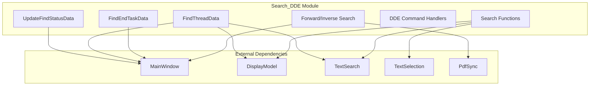
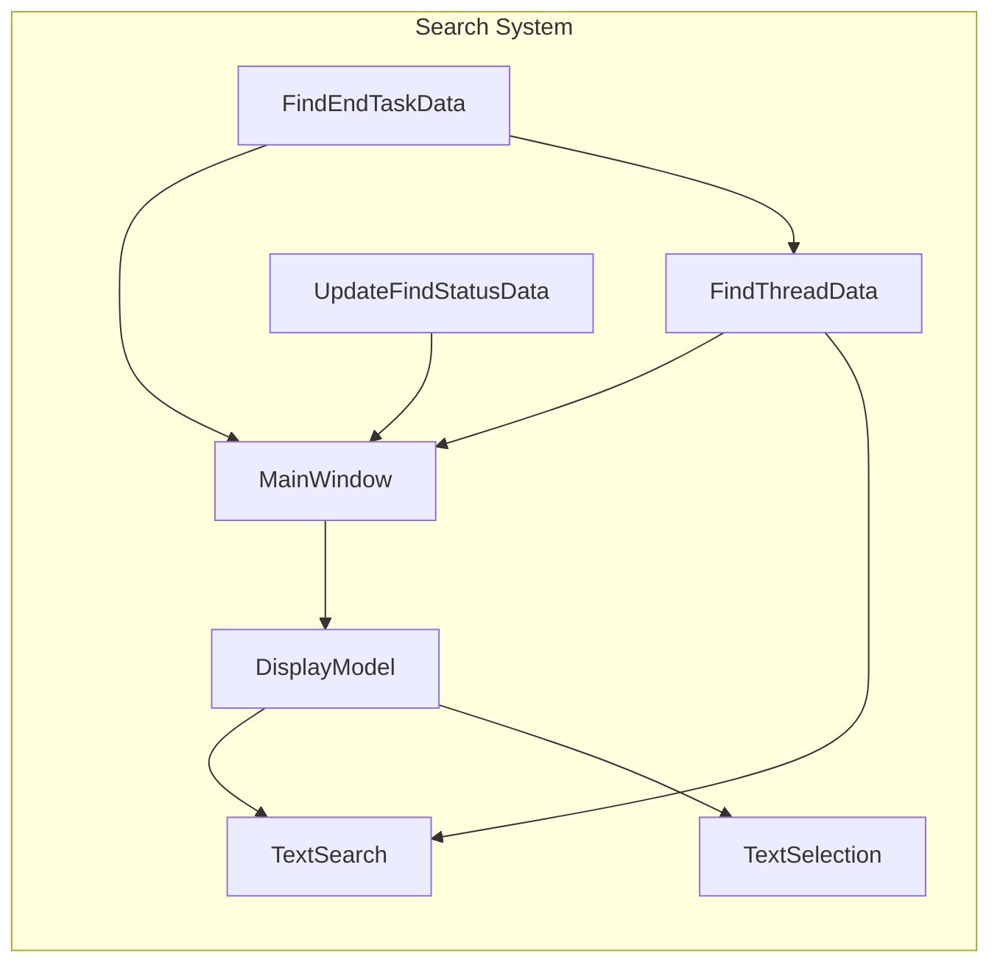
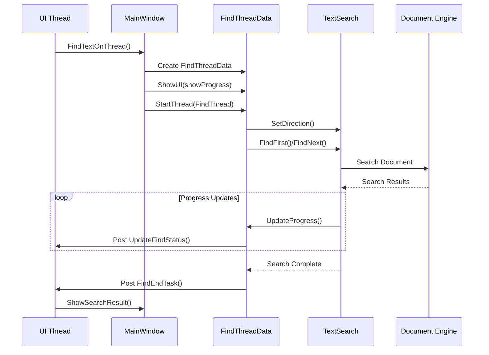
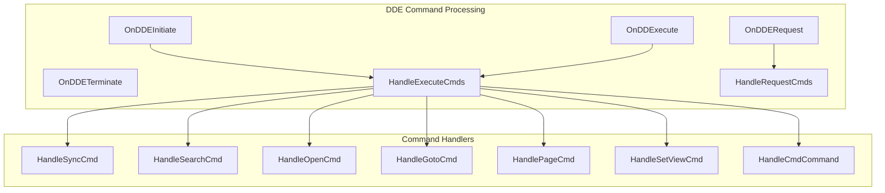
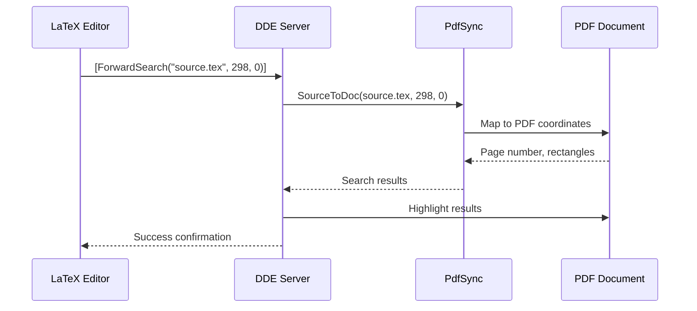
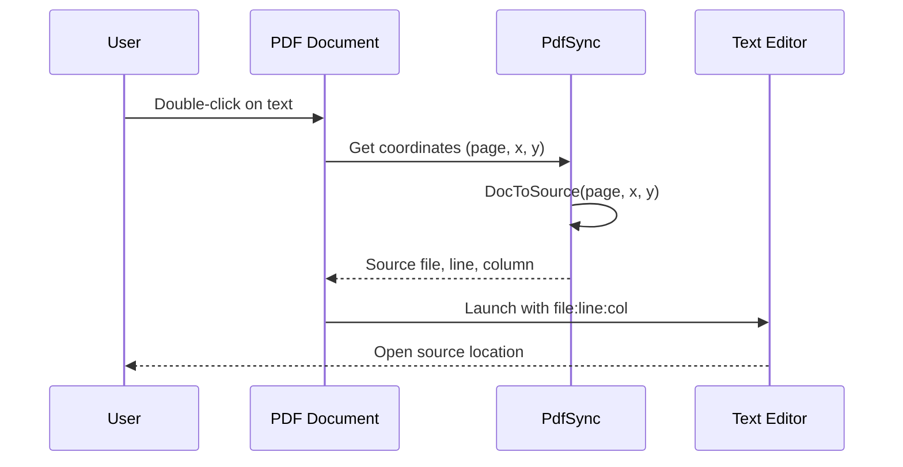

# Search and DDE Module Documentation

## Introduction

The `search_dde` module is a critical component of the SumatraPDF application that provides text search functionality and Dynamic Data Exchange (DDE) command processing capabilities. This module enables both interactive text searching within documents and programmatic control of the application through DDE commands, making it essential for integration with external applications like LaTeX editors.

## Module Overview

The search_dde module serves two primary purposes:

1. **Text Search Engine**: Provides comprehensive text search functionality across various document formats with support for case-sensitive/insensitive search, forward/backward navigation, and real-time search progress tracking.

2. **DDE Command Interface**: Implements a complete DDE server that allows external applications to control SumatraPDF through standardized commands, particularly useful for LaTeX editor integration and automation workflows.

## Architecture

### Core Components



### Component Relationships



## Search Functionality

### Search Architecture

The search system implements a multi-threaded architecture to provide responsive search functionality without blocking the user interface:



### Search Functions

#### Core Search Operations

- **`FindFirst()`**: Initiates a new search operation, copying selected text to the find bar if available
- **`FindNext()`**: Continues search in the forward direction
- **`FindPrev()`**: Searches in the backward direction
- **`FindSelection()`**: Searches for the currently selected text
- **`FindToggleMatchCase()`**: Toggles case-sensitive search mode

#### Search Thread Management

- **`FindTextOnThread()`**: Main entry point for asynchronous search operations
- **`FindThread()`**: Worker thread function that performs the actual search
- **`AbortFinding()`**: Cancels ongoing search operations
- **`UpdateSearchProgress()`**: Progress callback for search operations

### Search UI Integration

The search system integrates with the application's UI through:

- **Toolbar Integration**: Search controls are integrated into the main toolbar
- **Progress Notifications**: Real-time search progress via notification system
- **Result Highlighting**: Visual highlighting of search results in the document
- **Keyboard Shortcuts**: Support for standard search shortcuts (Ctrl+F, F3, etc.)

## DDE Command Interface

### DDE Architecture

The DDE system implements a comprehensive command interface for external application integration:



### DDE Command Types

#### Document Control Commands

- **`[Open("filepath")]`**: Opens a document with optional parameters
- **`[NewWindow]`**: Creates a new application window
- **`[GoToPage("filepath", page)]`**: Navigates to a specific page
- **`[GoToNamedDest("filepath", "destination")]`**: Jumps to a named destination
- **`[SetView("filepath", "viewmode", zoom)]`**: Sets display mode and zoom level

#### Search Commands

- **`[Search("filepath", "searchterm")]`**: Performs text search in a document
- **`[ForwardSearch("pdfpath", "sourcepath", line, col)]`**: Synchronization search

#### Information Commands

- **`[GetFileState("filepath")]`**: Retrieves document state information
- **`[CmdCommand]`**: Executes internal application commands

### Forward and Inverse Search

#### Forward Search (PDF Synchronization)

Forward search enables LaTeX editors to highlight corresponding locations in PDF output:



#### Inverse Search

Inverse search allows clicking in PDF to open the corresponding source location:



## Data Structures

### UpdateFindStatusData

```cpp
struct UpdateFindStatusData {
    MainWindow* win;    // Target window for status update
    int current;        // Current search progress
    int total;          // Total pages to search
};
```

### FindThreadData

```cpp
struct FindThreadData {
    MainWindow* win;                    // Window performing the search
    TextSearch::Direction direction;    // Search direction (Forward/Backward)
    bool wasModified;                   // Whether search text was modified
    AutoFreeWStr text;                  // Search text
    HANDLE thread;                      // Search thread handle
};
```

### FindEndTaskData

```cpp
struct FindEndTaskData {
    MainWindow* win;                    // Target window
    FindThreadData* ftd;                // Associated thread data
    TextSel* textSel;                   // Search results
    bool wasModifiedCanceled;           // Cancellation state
    bool loopedAround;                  // Whether search wrapped around
};
```

## Integration Points

### MainWindow Integration

The search_dde module integrates closely with the [MainWindow](main_window.md) system:

- **Search UI Controls**: Find edit box and toolbar buttons
- **Window State Management**: Search state per window
- **Document Navigation**: Page navigation based on search results
- **Focus Management**: Proper focus handling during search operations

### DisplayModel Integration

Search functionality relies on the [DisplayModel](display_model.md) for:

- **Text Extraction**: Access to document text content
- **Coordinate Mapping**: Screen-to-document coordinate conversion
- **Page Navigation**: Navigation to search result pages
- **Selection Management**: Text selection for search results

### Engine Integration

The module works with various document engines through the [Engine System](engines.md):

- **Text Search**: Engine-specific text search implementations
- **Document Access**: Unified interface for different document formats
- **Synchronization**: PDF synchronization support via PdfSync

## Error Handling

### Search Error Handling

- **Empty Results**: Graceful handling when no matches are found
- **Thread Cancellation**: Proper cleanup of cancelled search threads
- **Document State**: Validation of document loading state before search
- **UI Consistency**: Maintaining UI consistency during search operations

### DDE Error Handling

- **Command Parsing**: Robust parsing of DDE command strings
- **File Validation**: Verification of file existence and accessibility
- **Parameter Validation**: Validation of command parameters
- **Error Reporting**: Clear error messages for failed operations

## Performance Considerations

### Search Performance

- **Threading**: Background search to maintain UI responsiveness
- **Progress Tracking**: Real-time progress updates for long searches
- **Memory Management**: Efficient memory usage for large documents
- **Cancellation**: Support for cancelling long-running searches

### DDE Performance

- **Command Queuing**: Proper handling of rapid command sequences
- **State Management**: Efficient window and document state lookup
- **Response Time**: Minimal latency for DDE command processing

## Security Considerations

### DDE Security

- **Command Validation**: Validation of all DDE command parameters
- **File Access**: Restricted file access based on application settings
- **Process Launching**: Secure handling of external process launching
- **Input Sanitization**: Proper sanitization of file paths and command parameters

## Usage Examples

### Basic Search Operations

```cpp
// Find text in current document
FindTextOnThread(win, TextSearch::Direction::Forward, "search term", true, true);

// Find next occurrence
FindNext(win);

// Find previous occurrence
FindPrev(win);

// Toggle case sensitivity
FindToggleMatchCase(win);
```

### DDE Command Examples

```cpp
// Open a document
[Open("C:\\Documents\\file.pdf")]

// Search for text
[Search("C:\\Documents\\file.pdf", "search term")]

// Forward search for LaTeX synchronization
[ForwardSearch("C:\\Documents\\file.pdf", "C:\\Documents\\source.tex", 298, 0)]

// Navigate to page
[GoToPage("C:\\Documents\\file.pdf", 37)]
```

## Related Documentation

- [MainWindow System](main_window.md) - Window management and UI integration
- [DisplayModel](display_model.md) - Document display and navigation
- [TextSearch](text_search.md) - Text search engine implementation
- [TextSelection](text_selection.md) - Text selection and highlighting
- [PdfSync](pdf_sync.md) - PDF synchronization for LaTeX integration
- [Commands](commands.md) - Application command system
- [Notifications](notifications.md) - Progress and status notifications

## Conclusion

The search_dde module is a sophisticated component that provides essential search functionality and external application integration capabilities. Its multi-threaded architecture ensures responsive performance while the comprehensive DDE interface enables seamless integration with external tools, particularly LaTeX editing workflows. The module's design demonstrates careful attention to user experience, performance optimization, and robust error handling.