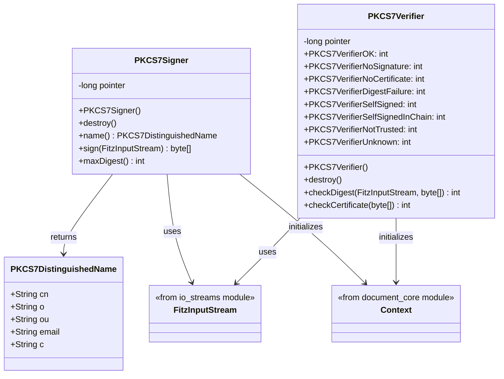
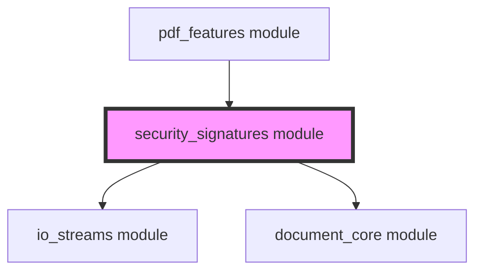
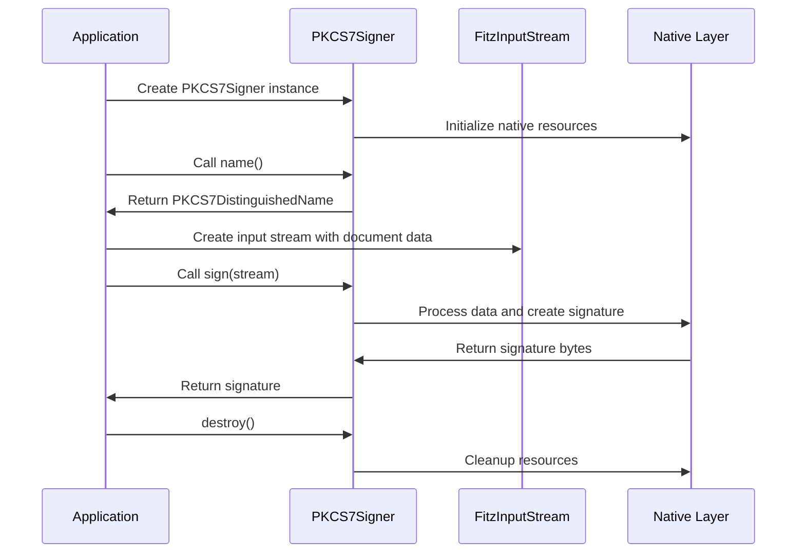
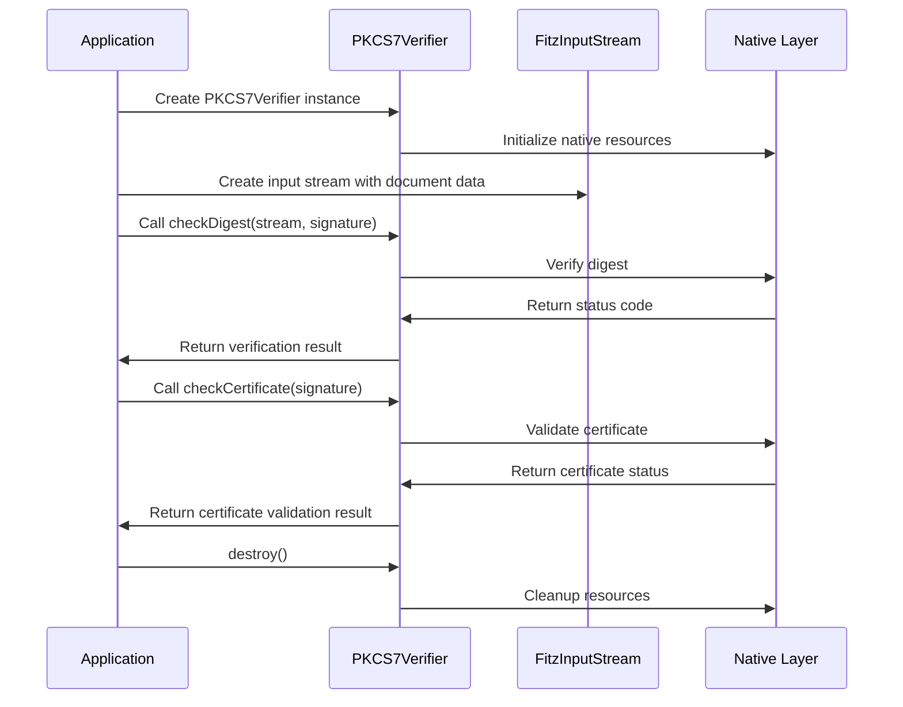

# Security Signatures Module Documentation

## Introduction

The security_signatures module provides cryptographic signature functionality for PDF documents within the MuPDF framework. This module implements PKCS#7 digital signature operations, enabling document signing, signature verification, and certificate management. It serves as a critical component for document authenticity and integrity validation in PDF workflows.

## Module Overview

The security_signatures module is part of the larger mupdf_java_bindings system and provides three core components:

- **PKCS7Signer**: Abstract base class for implementing digital signature creation
- **PKCS7Verifier**: Abstract base class for implementing signature verification  
- **PKCS7DistinguishedName**: Data structure for representing certificate holder information

## Architecture

### Component Structure



### Module Dependencies



## Core Components

### PKCS7Signer

The `PKCS7Signer` class is an abstract base class that defines the interface for creating digital signatures. It provides the foundation for implementing custom signing mechanisms within the MuPDF framework.

**Key Features:**
- Abstract interface for digital signature creation
- Native resource management through JNI
- Integration with FitzInputStream for data processing
- Certificate information retrieval via PKCS7DistinguishedName

**Methods:**
- `name()`: Returns the distinguished name of the signing certificate
- `sign(FitzInputStream)`: Creates a digital signature for the provided input stream
- `maxDigest()`: Returns the maximum digest size required for the signing operation

### PKCS7Verifier

The `PKCS7Verifier` class provides comprehensive signature verification capabilities with detailed status reporting. It supports multiple verification scenarios and provides specific error codes for different failure modes.

**Verification Status Codes:**
- `PKCS7VerifierOK` (0): Signature verification successful
- `PKCS7VerifierNoSignature` (1): No signature found in the document
- `PKCS7VerifierNoCertificate` (2): Certificate information missing
- `PKCS7VerifierDigestFailure` (3): Digest verification failed
- `PKCS7VerifierSelfSigned` (4): Self-signed certificate detected
- `PKCS7VerifierSelfSignedInChain` (5): Self-signed certificate in chain
- `PKCS7VerifierNotTrusted` (6): Certificate not trusted
- `PKCS7VerifierUnknown` (-1): Unknown verification error

**Methods:**
- `checkDigest(FitzInputStream, byte[])`: Verifies the signature digest against the document content
- `checkCertificate(byte[])`: Validates the signing certificate

### PKCS7DistinguishedName

The `PKCS7DistinguishedName` class provides a structured representation of certificate holder information, following X.500 distinguished name standards.

**Fields:**
- `cn`: Common name (typically the individual or entity name)
- `o`: Organization name
- `ou`: Organizational unit
- `email`: Email address of the certificate holder
- `c`: Country code

## Data Flow

### Signature Creation Process



### Signature Verification Process



## Integration with PDF Features

The security_signatures module integrates with the [pdf_features module](pdf_features.md) to provide digital signature functionality within PDF documents. This integration enables:

- Digital signing of PDF documents
- Signature validation in PDF workflows
- Certificate chain verification
- Timestamp validation

## Security Considerations

### Resource Management
Both `PKCS7Signer` and `PKCS7Verifier` implement proper resource management through:
- Native resource cleanup in finalizers
- Explicit `destroy()` methods for immediate resource release
- Context initialization on class loading

### Certificate Validation
The module provides comprehensive certificate validation with specific error codes for different validation failures, enabling applications to implement appropriate security policies.

### Thread Safety
The components are designed for use within the MuPDF threading model, with proper synchronization handled at the native layer.

## Usage Examples

### Basic Signature Creation
```java
// Implement custom signer
class MySigner extends PKCS7Signer {
    @Override
    public PKCS7DistinguishedName name() {
        PKCS7DistinguishedName dn = new PKCS7DistinguishedName();
        dn.cn = "John Doe";
        dn.o = "Example Corp";
        dn.email = "john@example.com";
        dn.c = "US";
        return dn;
    }
    
    @Override
    public byte[] sign(FitzInputStream stm) {
        // Implement signing logic
        return new byte[0];
    }
    
    @Override
    public int maxDigest() {
        return 256;
    }
}
```

### Signature Verification
```java
// Implement custom verifier
class MyVerifier extends PKCS7Verifier {
    @Override
    public int checkDigest(FitzInputStream stream, byte[] signature) {
        // Implement digest verification
        return PKCS7VerifierOK;
    }
    
    @Override
    public int checkCertificate(byte[] signature) {
        // Implement certificate validation
        return PKCS7VerifierOK;
    }
}
```

## Related Documentation

- [io_streams module](io_streams.md) - Input/output stream handling
- [document_core module](document_core.md) - Core document functionality
- [pdf_features module](pdf_features.md) - PDF-specific features and integration