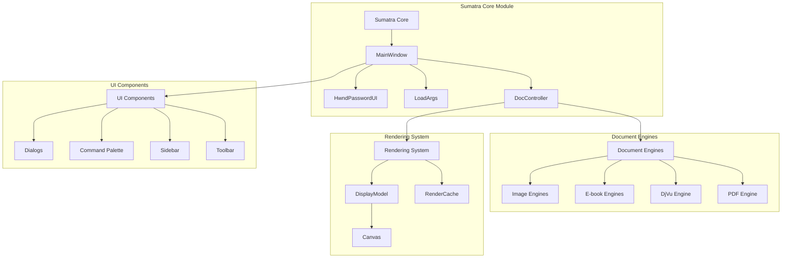
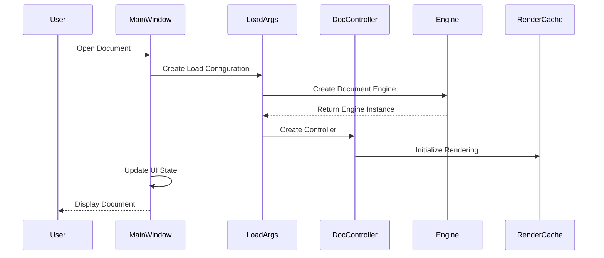
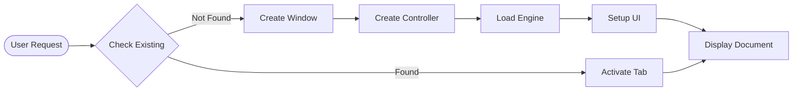
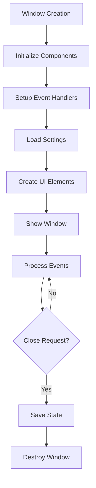

# Sumatra Core Module Documentation

## Introduction

The sumatra_core module serves as the central orchestrator of the SumatraPDF application, providing the main application logic, window management, document loading, and user interface coordination. This module acts as the glue that connects all other subsystems together, managing the overall application state and user interactions.

## Architecture Overview

The sumatra_core module follows a centralized architecture pattern where the `MainWindow` class serves as the primary coordinator for all application activities. The module integrates multiple subsystems including document engines, UI components, rendering systems, and file management.

## Core Components

### MainWindow Class
The central window management class that coordinates all application activities:
- Document loading and management
- UI state coordination
- Event handling and command processing
- Window lifecycle management
- Integration with rendering and display systems

### DocController Interface
Abstract interface for document control that provides:
- Page navigation and display
- Zoom and rotation operations
- Text selection and search
- Document properties access
- Integration with rendering engines

### LoadArgs Structure
Configuration object for document loading operations:
- File path and loading parameters
- Window and tab management flags
- Engine selection and configuration
- Display state preservation

### HwndPasswordUI Class
Password dialog implementation for encrypted documents:
- Password prompt interface
- Decryption key management
- File history integration
- Secure password handling

## Data Flow Architecture

## Component Interactions

### Document Loading Process

### Window Management Flow

## Key Features

### Multi-Format Document Support
The core module provides unified access to multiple document formats through the engine abstraction layer:
- PDF documents via MuPDF integration
- DjVu documents via DjVuLibre
- E-book formats (EPUB, MOBI, FB2)
- Image formats and comic books
- CHM help files
- PostScript documents

### Advanced UI Management
- Tabbed document interface with drag-and-drop support
- Customizable toolbar and sidebar components
- Full-screen and presentation modes
- Multi-language support with RTL layout capabilities
- Theme system with dark mode support

### Document State Management
- Persistent file history and bookmarks
- Per-document display settings preservation
- Annotation support with save capabilities
- Search and navigation state maintenance
- Session restoration on application restart

### Security and Restrictions
- Configurable policy restrictions for enterprise deployment
- Password-protected document support
- Safe file type validation
- Protocol restriction for external links
- Sandboxed plugin mode for embedded usage

## Integration Points

### Engine Integration
The core module integrates with various document engines through a common interface:
- [mupdf_java_bindings](mupdf_java_bindings.md) - PDF rendering and manipulation
- [engines](engines.md) - Specialized format engines
- [document_formats](document_formats.md) - Format-specific handling

### UI Component Integration
- [ui_components](ui_components.md) - User interface elements
- [wingui](wingui.md) - Windows-specific GUI components
- [uia](uia.md) - UI Automation accessibility support

### Utility Integration
- [utils](utils.md) - Common utility functions
- [metadata](metadata.md) - Document metadata handling
- [gumbo_parser](gumbo_parser.md) - HTML parsing for e-books

## Configuration and Settings

The module supports extensive configuration through:
- Global preferences system
- Per-document state storage
- Command-line argument processing
- INI-based restriction policies
- Theme and appearance customization

## Error Handling and Recovery

- Comprehensive error reporting and logging
- Graceful degradation for unsupported features
- Crash recovery and state preservation
- User-friendly error notifications
- Debug symbol management for crash analysis

## Performance Considerations

- Lazy loading of document content
- Predictive rendering for smooth navigation
- Memory-efficient caching strategies
- Background processing for non-blocking operations
- Optimized redraw and repaint mechanisms

## Security Features

- Input validation and sanitization
- Safe file type restrictions
- Protocol filtering for external links
- Password dialog security
- Restricted mode for locked-down environments

This documentation provides a comprehensive overview of the sumatra_core module's architecture and functionality. For detailed information about specific subsystems, please refer to the linked module documentation.