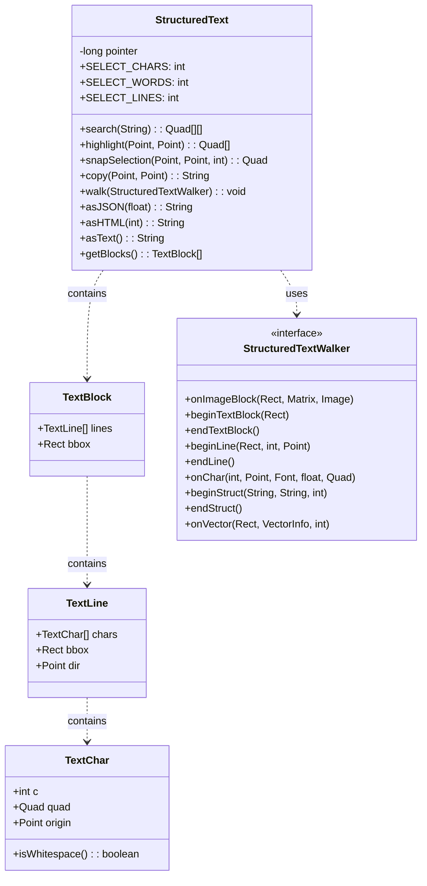
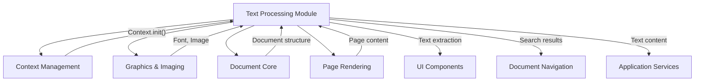
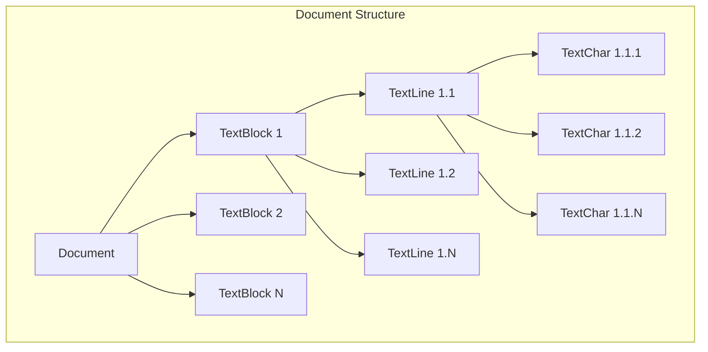
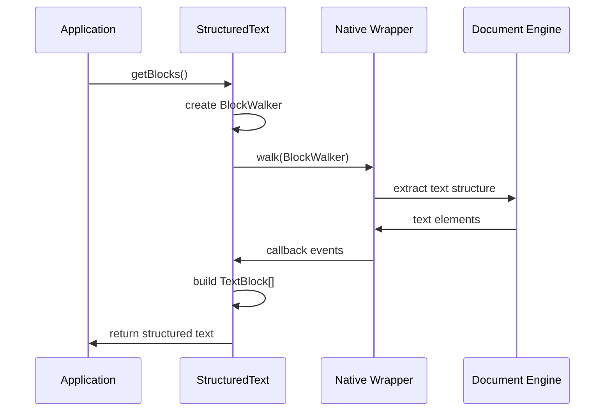
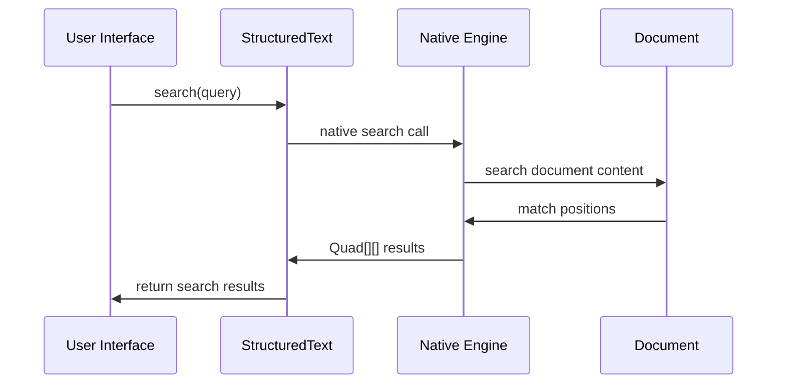

# Text Processing Module Documentation

## Introduction

The text_processing module provides structured text extraction and manipulation capabilities within the MuPDF Java bindings. It serves as a critical component for document content analysis, text selection, search functionality, and format conversion. The module bridges the gap between low-level PDF document structures and high-level text processing operations, enabling applications to extract meaningful text content from various document formats.

## Core Architecture

### Component Overview

The text_processing module centers around the `StructuredText` class, which represents document content in a hierarchical text structure. This class provides native methods for text extraction, search, selection, and format conversion while maintaining a Java-friendly interface for application developers.



### Module Dependencies

The text_processing module integrates with several other system components:



## Core Functionality

### Text Structure Representation

The module organizes document text in a three-level hierarchy:

1. **TextBlock**: Represents logical text blocks (paragraphs, columns)
2. **TextLine**: Contains individual lines within blocks
3. **TextChar**: Represents single characters with positioning information



### Text Selection Modes

The module supports three selection granularities:

- **SELECT_CHARS**: Character-level selection for precise text copying
- **SELECT_WORDS**: Word-level selection for natural text selection
- **SELECT_LINES**: Line-level selection for paragraph or line operations

### Key Operations

#### Text Search
```java
Quad[][] search(String needle)
```
Performs text search across the document and returns bounding quadrilaterals for all matches.

#### Text Selection
```java
Quad[] highlight(Point a, Point b)
Quad snapSelection(Point a, Point b, int mode)
String copy(Point a, Point b)
```
Enables text selection with different granularity modes and extracts selected text.

#### Format Conversion
```java
String asJSON(float scale)
String asHTML(int id)
String asText()
```
Converts structured text to different output formats for various use cases.

## Data Flow Architecture

### Text Extraction Process



### Search Operation Flow



## Integration Points

### Document Engine Integration

The text_processing module integrates with the [mupdf_engine_integration](mupdf_engine_integration.md) module through the Context management system. Text extraction operations require a properly initialized MuPDF context.

### UI Component Integration

Text selection and search results are consumed by [ui_components](ui_components.md) for rendering selection highlights and displaying search results in the user interface.

### Application Services Integration

The module provides text content to [application_services](application_services.md) for features like text copying, export functionality, and accessibility support.

## Usage Patterns

### Basic Text Extraction
```java
// Initialize context
Context.init();

// Extract structured text from document
StructuredText text = document.getStructuredText();
TextBlock[] blocks = text.getBlocks();

// Process text hierarchy
for (TextBlock block : blocks) {
    for (TextLine line : block.lines) {
        for (TextChar chr : line.chars) {
            // Process individual characters
        }
    }
}
```

### Text Search Implementation
```java
// Search for text
Quad[][] searchResults = text.search("search term");

// Process search results
for (Quad[] quads : searchResults) {
    // Each quad represents a text match location
    for (Quad quad : quads) {
        // Render highlight or process match
    }
}
```

### Format Conversion
```java
// Convert to different formats
String plainText = text.asText();
String htmlContent = text.asHTML();
String jsonData = text.asJSON(1.0f);
```

## Performance Considerations

### Memory Management
- The module uses native resources that must be properly released
- Call `destroy()` when StructuredText objects are no longer needed
- The native `finalize()` method handles resource cleanup

### Processing Efficiency
- Text extraction is performed on-demand to minimize memory usage
- Search operations are optimized for large documents
- Format conversion operations may be computationally intensive for complex documents

## Error Handling

The module relies on native code for core operations. Error conditions are typically handled through:
- Native exceptions propagated to Java
- Null return values for invalid operations
- Empty arrays for search operations with no results

## Future Enhancements

Potential areas for module expansion include:
- Advanced text analytics and natural language processing
- Multi-language text support and detection
- Enhanced accessibility features for screen readers
- Integration with external text processing libraries
- Performance optimizations for very large documents

## Related Documentation

- [mupdf_engine_integration](mupdf_engine_integration.md) - Core MuPDF engine integration
- [mupdf_fitz_jni_bindings](mupdf_fitz_jni_bindings.md) - JNI binding infrastructure
- [ui_components](ui_components.md) - User interface components that consume text data
- [document_navigation](document_navigation.md) - Document navigation features that use text search