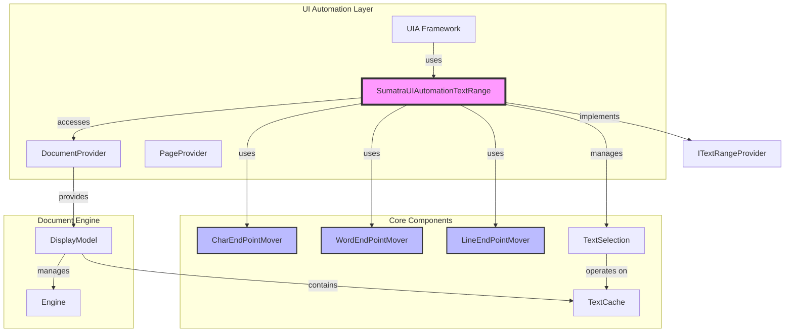
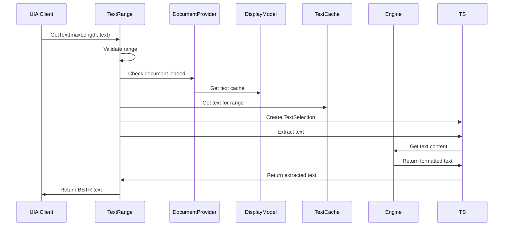
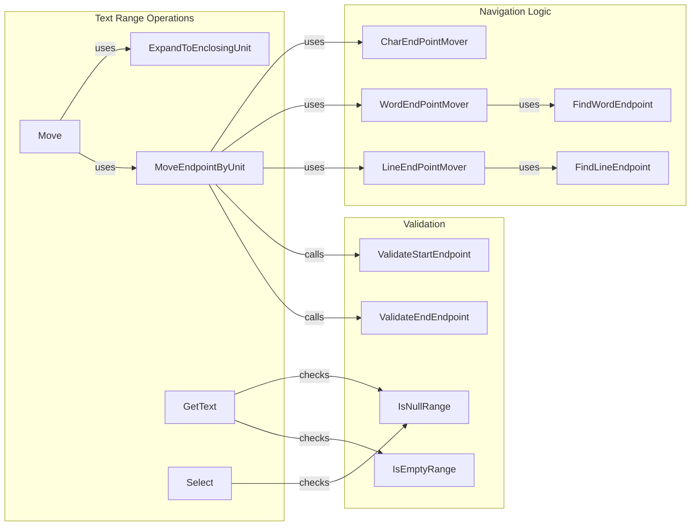
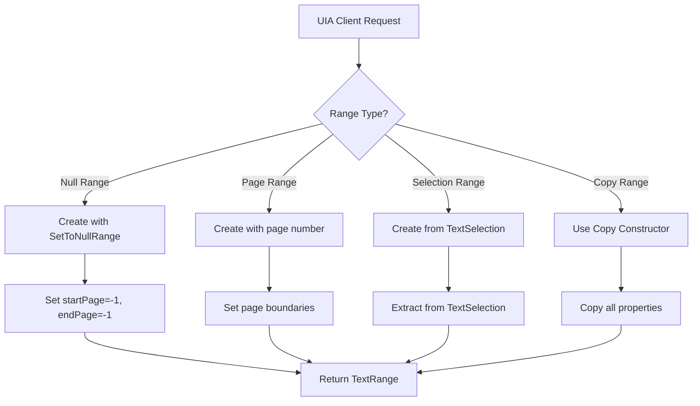
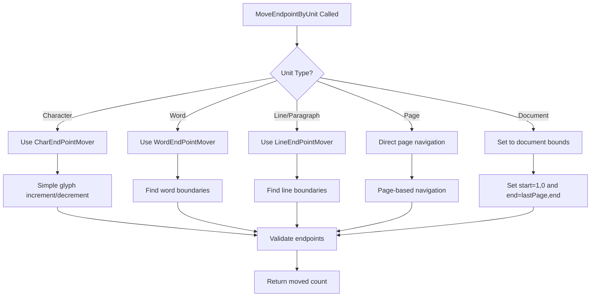

# Text Range Module Documentation

## Introduction

The text_range module provides UI Automation (UIA) text range functionality for SumatraPDF, enabling accessibility features and programmatic text manipulation. This module implements the `ITextRangeProvider` interface, which is a core component of Microsoft's UI Automation framework for text-based controls.

The module facilitates text selection, navigation, and manipulation at various granularities (character, word, line, paragraph, page, and document levels), making PDF documents accessible to screen readers and other assistive technologies.

## Architecture Overview

## Core Components

### SumatraUIAutomationTextRange

The main class that implements the `ITextRangeProvider` interface. It represents a range of text within a document and provides methods for text manipulation, navigation, and selection.

**Key Responsibilities:**
- Text range management (start/end positions across pages)
- Text unit navigation (character, word, line, paragraph, page, document)
- Text selection and extraction
- Coordinate validation and range normalization

**Constructor Variants:**
- Default constructor (creates null range)
- Page-specific constructor (entire page range)
- TextSelection-based constructor (from existing selection)
- Copy constructor

### Endpoint Movers

Specialized classes for navigating text at different granularities:

#### CharEndPointMover
- **Purpose**: Handles character-by-character navigation
- **Methods**: `NextEndpoint()`, `PrevEndpoint()`
- **Behavior**: Simple glyph increment/decrement

#### WordEndPointMover
- **Purpose**: Handles word-by-word navigation
- **Methods**: `NextEndpoint()`, `PrevEndpoint()`
- **Behavior**: Uses word boundary detection via `FindNextWordEndpoint()` and `FindPreviousWordEndpoint()`

#### LineEndPointMover
- **Purpose**: Handles line-by-line navigation
- **Methods**: `NextEndpoint()`, `PrevEndpoint()`
- **Behavior**: Uses line boundary detection via `FindNextLineEndpoint()` and `FindPreviousLineEndpoint()`

## Data Flow Architecture

## Component Interactions

## Process Flows

### Text Range Creation

### Text Navigation Process

## Key Dependencies

### Internal Dependencies
- **[DocumentProvider](document_provider.md)**: Provides document context and display model access
- **[PageProvider](page_provider.md)**: Manages page-level information
- **[TextSelection](text_selection.md)**: Handles text selection logic and text extraction
- **[DisplayModel](display_model.md)**: Provides access to text cache and page management

### External Dependencies
- **UI Automation Framework**: Implements `ITextRangeProvider` interface
- **Windows COM**: Uses SAFEARRAY, BSTR, and COM interface patterns
- **Text Cache**: Accesses cached text content for efficient navigation

## Text Unit Support

The module supports the following text units for navigation and selection:

| Unit | Description | Implementation |
|------|-------------|----------------|
| Character | Individual characters | Simple glyph navigation |
| Word | Word boundaries | Word character detection |
| Line | Line boundaries | Newline character detection |
| Paragraph | Same as line (PDF limitation) | Line boundary detection |
| Page | Entire pages | Page-based navigation |
| Document | Entire document | Document boundary navigation |
| Format | Not supported | Returns immediately |

## Error Handling

The module implements comprehensive error handling:

- **Null Pointer Checks**: All output parameters are validated
- **Document State Validation**: Checks if document is loaded before operations
- **Range Validation**: Ensures ranges are valid and non-overlapping
- **Memory Management**: Proper COM reference counting and memory allocation
- **Boundary Validation**: Prevents navigation beyond document limits

## Performance Considerations

- **Text Caching**: Leverages DisplayModel's text cache for efficient text access
- **Lazy Evaluation**: Text extraction only when needed via `GetText()`
- **Boundary Optimization**: Efficient word/line boundary detection algorithms
- **Memory Efficiency**: Minimal memory footprint for range objects

## Accessibility Integration

The text_range module is a critical component for accessibility support:

- **Screen Reader Support**: Provides text content to assistive technologies
- **Text Navigation**: Enables keyboard navigation for users with motor disabilities
- **Text Selection**: Supports programmatic text selection for automation tools
- **Bounding Rectangle Support**: Provides text positioning information (TODO: implementation)

## Future Enhancements

- **Bounding Rectangle Implementation**: Complete `GetBoundingRectangles()` method
- **Text Search**: Implement `FindText()` for text searching within ranges
- **Attribute Support**: Add text attribute support (font, color, style)
- **Multi-language Support**: Enhanced word boundary detection for complex scripts