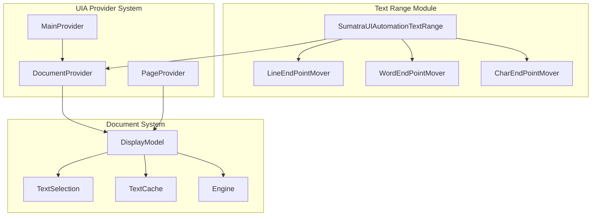
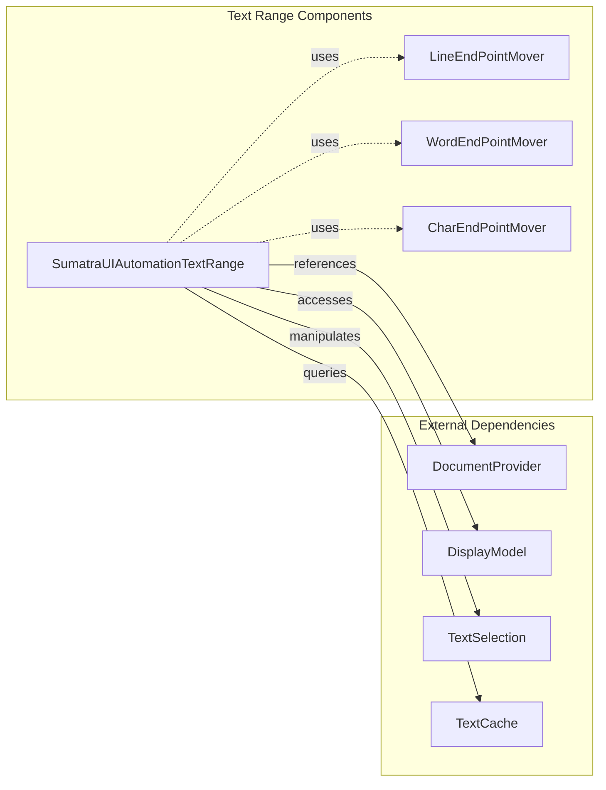
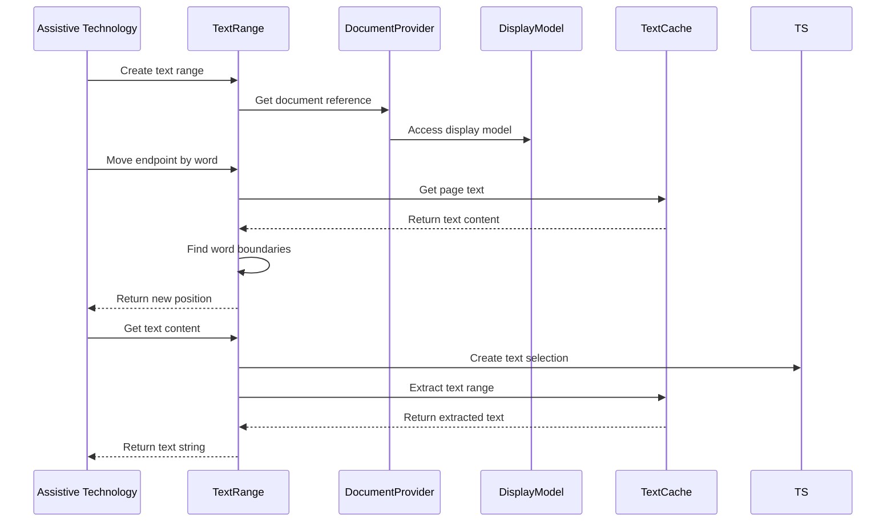
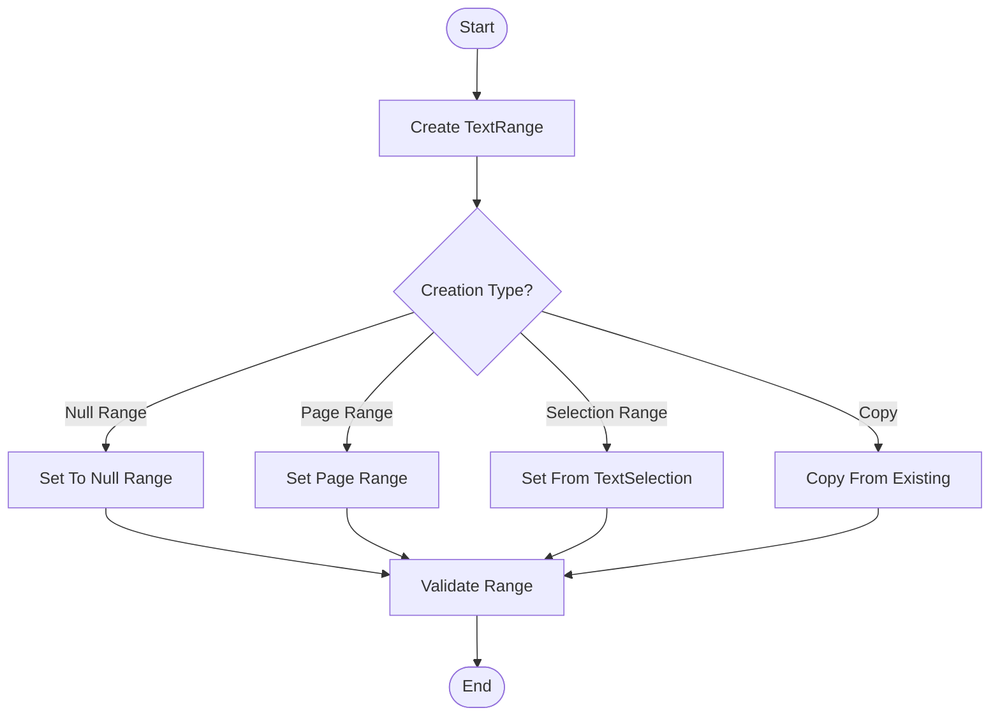
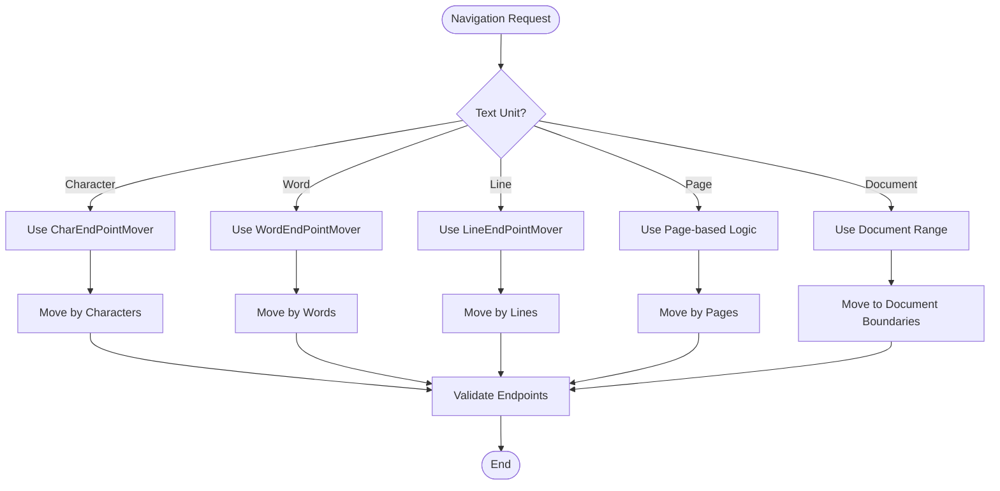

# Text Range Module Documentation

## Introduction

The text_range module provides accessibility support for text selection and manipulation in SumatraPDF through Microsoft UI Automation (UIA) interfaces. It implements the `ITextRangeProvider` interface to enable screen readers and other assistive technologies to interact with document text content programmatically.

## Module Overview

The text_range module is part of the accessibility_uia_provider module group and works in conjunction with the document_provider module to provide comprehensive text accessibility features. It enables users to navigate, select, and manipulate text within documents using various text units (characters, words, lines, paragraphs, pages, and the entire document).

## Core Components

### 1. SumatraUIAutomationTextRange
**Location**: `src/uia/TextRange.cpp`

The main class that implements the `ITextRangeProvider` interface, representing a range of text within a document. This class provides the core functionality for text range manipulation and navigation.

**Key Features:**
- Text range creation and cloning
- Endpoint manipulation and comparison
- Text unit navigation (character, word, line, paragraph, page, document)
- Text extraction and selection
- Bounding rectangle calculations
- Attribute support (basic implementation)

### 2. LineEndPointMover
**Location**: `src/uia/TextRange.cpp`

A specialized endpoint mover class that handles line-based navigation within text ranges.

**Responsibilities:**
- Navigate to previous/next line endpoints
- Handle line boundary detection using newline characters
- Support both forward and backward movement

### 3. WordEndPointMover
**Location**: `src/uia/TextRange.cpp`

A specialized endpoint mover class that handles word-based navigation within text ranges.

**Responsibilities:**
- Navigate to previous/next word endpoints
- Handle word boundary detection using character classification
- Support both forward and backward movement

### 4. CharEndPointMover
**Location**: `src/uia/TextRange.cpp`

A specialized endpoint mover class that handles character-based navigation within text ranges.

**Responsibilities:**
- Navigate to previous/next character positions
- Handle single-character movement
- Support both forward and backward movement

## Architecture


```mermaid
graph TB
    subgraph "Text Range Module"
        TR[SumatraUIAutomationTextRange]
        LEM[LineEndPointMover]
        WEM[WordEndPointMover]
        CEM[CharEndPointMover]
        
        TR --> LEM
        TR --> WEM
        TR --> CEM
    end
    
    subgraph "UIA Provider System"
        DP[DocumentProvider]
        PP[PageProvider]
        MP[MainProvider]
    end
    
    subgraph "Document System"
        DM[DisplayModel]
        TS[TextSelection]
        TC[TextCache]
        ENG[Engine]
    end
    
    TR --> DP
    DP --> DM
    DM --> TS
    DM --> TC
    DM --> ENG
    
    PP --> DM
    MP --> DP
```

## Component Relationships


```mermaid
graph LR
    subgraph "Text Range Components"
        TR[SumatraUIAutomationTextRange]
        LEM[LineEndPointMover]
        WEM[WordEndPointMover]
        CEM[CharEndPointMover]
    end
    
    subgraph "External Dependencies"
        DP[DocumentProvider]
        DM[DisplayModel]
        TS[TextSelection]
        TC[TextCache]
    end
    
    TR -.->|uses| LEM
    TR -.->|uses| WEM
    TR -.->|uses| CEM
    TR -->|references| DP
    TR -->|accesses| DM
    TR -->|manipulates| TS
    TR -->|queries| TC
```

## Data Flow


```mermaid
sequenceDiagram
    participant AT as Assistive Technology
    participant TR as TextRange
    participant DP as DocumentProvider
    participant DM as DisplayModel
    participant TC as TextCache
    
    AT->>TR: Create text range
    TR->>DP: Get document reference
    DP->>DM: Access display model
    
    AT->>TR: Move endpoint by word
    TR->>TC: Get page text
    TC-->>TR: Return text content
    TR->>TR: Find word boundaries
    TR-->>AT: Return new position
    
    AT->>TR: Get text content
    TR->>TS: Create text selection
    TR->>TC: Extract text range
    TC-->>TR: Return extracted text
    TR-->>AT: Return text string
```

## Process Flows

### Text Range Creation


```mermaid
graph TD
    Start([Start]) --> Create[Create TextRange]
    Create --> Type{Creation Type?}
    
    Type -->|Null Range| SetNull[Set To Null Range]
    Type -->|Page Range| SetPage[Set Page Range]
    Type -->|Selection Range| SetSelection[Set From TextSelection]
    Type -->|Copy| SetCopy[Copy From Existing]
    
    SetNull --> Validate[Validate Range]
    SetPage --> Validate
    SetSelection --> Validate
    SetCopy --> Validate
    
    Validate --> End([End])
```

### Text Navigation Process


```mermaid
graph TD
    Start([Navigation Request]) --> Unit{Text Unit?}
    
    Unit -->|Character| UseChar[Use CharEndPointMover]
    Unit -->|Word| UseWord[Use WordEndPointMover]
    Unit -->|Line| UseLine[Use LineEndPointMover]
    Unit -->|Page| UsePage[Use Page-based Logic]
    Unit -->|Document| UseDoc[Use Document Range]
    
    UseChar --> MoveChar[Move by Characters]
    UseWord --> MoveWord[Move by Words]
    UseLine --> MoveLine[Move by Lines]
    UsePage --> MovePage[Move by Pages]
    UseDoc --> MoveDoc[Move to Document Boundaries]
    
    MoveChar --> Validate[Validate Endpoints]
    MoveWord --> Validate
    MoveLine --> Validate
    MovePage --> Validate
    MoveDoc --> Validate
    
    Validate --> End([End])
```

## Key Features

### 1. Text Unit Support
The module supports navigation and manipulation at different text unit levels:
- **Character**: Individual character navigation
- **Word**: Word-based navigation with boundary detection
- **Line/Paragraph**: Line-based navigation using newline detection
- **Page**: Page-based navigation
- **Document**: Document-wide operations

### 2. Endpoint Management
- Start and end endpoint manipulation
- Endpoint comparison and validation
- Range normalization to maintain valid ordering

### 3. Text Extraction
- Extract text content from ranges
- Handle cross-page text selections
- Support text truncation for length-limited requests

### 4. Selection Integration
- Integration with existing text selection system
- Bidirectional synchronization between UIA ranges and internal selections

## Integration with Other Modules

### Document Provider Module
The text_range module works closely with the [document_provider](document_provider.md) module:
- References document provider for document access
- Uses document provider's display model for text operations
- Shares text cache and selection systems

### UIA Provider System
Part of the broader accessibility system that includes:
- [document_provider](document_provider.md) - Document-level accessibility
- Page providers for page-specific operations
- Main provider for application-level accessibility

### Text Selection System
Integrates with the internal text selection system:
- Uses `TextSelection` class for range operations
- Accesses `TextCache` for text content retrieval
- Synchronizes with display model for visual feedback

## Implementation Details

### Text Boundary Detection
- **Word boundaries**: Uses `isWordChar()` function to identify word characters
- **Line boundaries**: Uses newline character (`\n`) detection
- **Page boundaries**: Uses page count and glyph count validation

### Error Handling
- Null pointer validation for all interface methods
- Document state validation before operations
- Range validation to maintain consistency
- COM error code propagation

### Memory Management
- Reference counting for COM interface compliance
- Automatic cleanup on object destruction
- Safe array creation for return values

## Usage Examples

### Creating a Text Range
```cpp
// Create range for entire document
auto range = new SumatraUIAutomationTextRange(documentProvider);
range->SetToDocumentRange();

// Create range for specific page
auto pageRange = new SumatraUIAutomationTextRange(documentProvider, pageNumber);

// Create range from existing selection
auto selectionRange = new SumatraUIAutomationTextRange(documentProvider, textSelection);
```

### Navigating Text
```cpp
// Move by words
int moved;
range->Move(TextUnit_Word, 3, &moved); // Move forward 3 words

// Move endpoint by line
range->MoveEndpointByUnit(TextPatternRangeEndpoint_Start, TextUnit_Line, -1, &moved);
```

### Extracting Text
```cpp
BSTR text;
range->GetText(-1, &text); // Get all text in range
// Use text...
SysFreeString(text);
```

## Limitations and Future Enhancements

### Current Limitations
- Basic attribute support (returns "not supported" for most attributes)
- Limited text search functionality (not implemented)
- Bounding rectangle calculations not fully implemented
- No support for complex text formatting attributes

### Potential Enhancements
- Full text search implementation with case sensitivity options
- Complete bounding rectangle support for screen reader positioning
- Rich text attribute support (font, color, style information)
- Multi-language text boundary detection
- Performance optimizations for large documents

## Dependencies

### Internal Dependencies
- `DocumentProvider` - For document access and management
- `DisplayModel` - For text cache and page information
- `TextSelection` - For range-based text operations
- `TextCache` - For text content retrieval

### External Dependencies
- Windows UI Automation API
- COM interface support
- Standard C++ libraries
- SumatraPDF engine interfaces

This module is essential for providing accessibility support in SumatraPDF, enabling users with assistive technologies to effectively navigate and interact with document content.