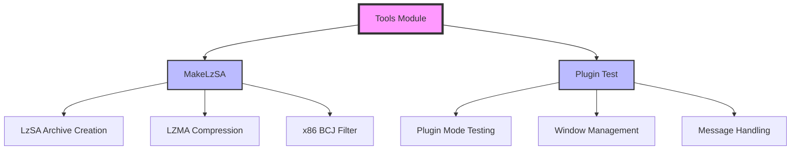

# Tools Module Documentation

## Overview

The tools module provides specialized utilities and helper applications for the SumatraPDF ecosystem. This module contains standalone tools that support the main application's functionality, including archive creation and plugin testing capabilities.

## Architecture



## Sub-modules

### MakeLzSA - LzSA Archive Creation Tool

**File**: `src/tools/MakeLzSA.cpp`
**Detailed Documentation**: [MakeLzSA.md](MakeLzSA.md)

The MakeLzSA tool creates compressed archives using the LzSA (LZMA Simple Archive) format. This format is optimized for installer payloads and uses LZMA compression with an x86 bytecode filter for optimal compression ratios on executable content.

**Key Features:**
- Creates LzSA archives with LZMA compression
- Applies x86 BCJ (Branch Call Jump) filter for better compression of executables
- Supports incremental archive updates by reusing previously compressed files
- Includes CRC32 verification for data integrity
- Handles both individual files and directory structures

**Core Components:**
- `ISzCrtAlloc`: Custom memory allocator for LZMA operations
- `Compress()`: Main compression function with BCJ filter support
- `AppendEntry()`: Handles individual file compression and metadata
- `CreateArchive()`: Creates archives from file lists
- `CreateArchiveFromDir()`: Creates archives from directory structures

**Archive Format:**
```
[Magic ID: 0x41537a4c (4 bytes)]
[File Count (4 bytes)]
[File Entries...]
[Header CRC32 (4 bytes)]
[Compressed Content]
```

Each file entry contains:
- Header size (4 bytes)
- Compressed size (4 bytes)
- Uncompressed size (4 bytes)
- CRC32 checksum (4 bytes)
- File modification time (8 bytes)
- File name (null-terminated)

### Plugin Test - Plugin Mode Testing Tool

**File**: `src/tools/plugin-test.cpp`
**Detailed Documentation**: [Plugin Test.md](Plugin%20Test.md)

The Plugin Test tool demonstrates how to host SumatraPDF as a plugin within another application. It provides a minimal example of the plugin integration pattern and serves as a testing framework for plugin functionality.

**Key Features:**
- Demonstrates plugin hosting pattern
- Handles window management and resizing
- Processes inter-process communication via WM_COPYDATA
- Manages external URL opening requests
- Provides error handling and fallback UI

**Core Components:**
- `PluginStartData`: Configuration structure for plugin initialization
- `PluginParentWndProc()`: Main window procedure handling plugin messages
- `GetSumatraExePath()`: Locates SumatraPDF executable

**Plugin Communication Protocol:**
- **Initialization**: SumatraPDF launched with `-plugin` argument
- **Window Management**: Automatic resizing via WM_SIZE messages
- **URL Handling**: External URL requests via WM_COPYDATA with magic value 0x4C5255
- **Cleanup**: Automatic cleanup on window destruction

## Usage Patterns

### MakeLzSA Usage

```bash
# Verify existing archive
MakeLzSA archive.lzsa

# Create archive from directory
MakeLzSA archive.lzsa source_directory

# Create archive from specific files
MakeLzSA archive.lzsa file1.txt file2.pdf

# Create archive with custom in-archive names
MakeLzSA archive.lzsa /absolute/path/file.txt:custom_name.txt
```

### Plugin Test Usage

```bash
# Basic plugin test
plugin-test.exe

# With specific SumatraPDF executable
plugin-test.exe C:\Path\To\SumatraPDF.exe

# With URL and document
plugin-test.exe C:\Path\To\SumatraPDF.exe http://example.com document.pdf
```

## Integration with Other Modules

The tools module integrates with several other system components:

- **[utils](utils.md)**: Uses archive utilities, file operations, and string handling
- **[wingui](wingui.md)**: Plugin test uses Windows GUI components for window management
- **Compression Libraries**: MakeLzSA uses LZMA SDK for compression operations

## Dependencies

### MakeLzSA Dependencies
- LZMA SDK (LzmaEnc.h, Bra.h)
- zlib (for CRC32 calculations)
- Utils module for file operations and string handling
- Windows API for file system operations

### Plugin Test Dependencies
- Windows API for window management and process creation
- Utils module for command line parsing and file utilities
- Shell API for external program execution

## Error Handling

Both tools implement comprehensive error handling:

- **File I/O Errors**: Graceful handling of missing files or permissions
- **Compression Failures**: Fallback to uncompressed storage if compression fails
- **Plugin Launch Failures**: Visual error messages when SumatraPDF cannot be started
- **Archive Validation**: CRC32 verification and format validation

## Performance Considerations

- **BCJ Filter**: Automatically applied for better compression of x86 executables
- **Incremental Updates**: Reuses previously compressed data when files haven't changed
- **Memory Management**: Efficient memory allocation with custom allocators
- **Process Isolation**: Plugin runs in separate process for stability

## Security Features

- **Path Validation**: Prevents directory traversal in archive names
- **Process Isolation**: Plugin mode runs SumatraPDF in separate process
- **URL Validation**: External URL handling with proper validation
- **Memory Safety**: Bounds checking and buffer overflow protection

This documentation provides a comprehensive overview of the tools module's functionality, architecture, and usage patterns. The tools serve as essential utilities for the SumatraPDF ecosystem, enabling archive management and plugin integration capabilities.