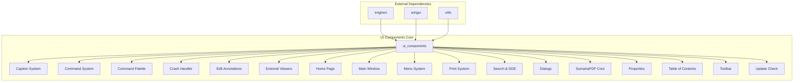
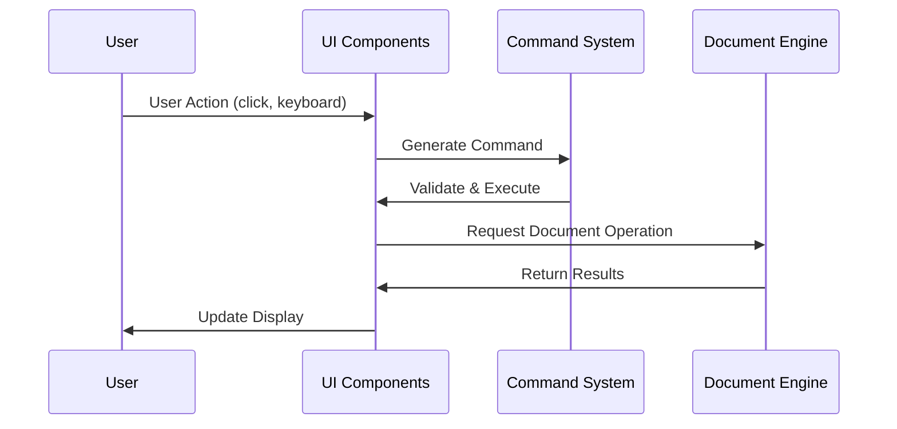

# UI Components Module Documentation

## Overview

The `ui_components` module is a comprehensive user interface framework for the SumatraPDF application. It provides a rich set of UI components, window management, and user interaction capabilities. The module serves as the primary interface layer between the application logic and the user, handling everything from basic controls to complex document viewing interfaces.

## Architecture

## Core Components

### 1. Caption System (`src.Caption`)
**Purpose**: Custom window caption implementation for modern Windows UI  
**Documentation**: [Caption System](caption_system.md)

**Key Components**:
- `ButtonInfo`: Manages caption button states and interactions
- Custom caption rendering with DWM composition support
- Window frame management and theming

**Features**:
- Custom caption buttons (minimize, maximize, close, menu)
- DWM composition integration
- Theme-aware rendering
- RTL layout support

### 2. Command System (`src.Commands`)
**Purpose**: Centralized command handling and execution framework  
**Documentation**: [Command System](command_system.md)

**Key Components**:
- `ArgSpec`: Command argument specifications
- `CustomCommand`: User-defined command extensions
- Command parsing and validation

**Features**:
- Extensible command architecture
- Argument type validation
- Command palette integration
- Custom command definitions

### 3. Command Palette (`src.CommandPalette`)
**Purpose**: Advanced command search and execution interface  
**Documentation**: [Command Palette](command_palette.md)

**Key Components**:
- `ItemDataCP`: Command palette item data
- `CommandPaletteBuildCtx`: Context-aware command filtering
- `ListBoxModelCP`: Data model for command display

**Features**:
- Fuzzy search across commands, tabs, and file history
- Context-aware command filtering
- Smart tab navigation
- Keyboard-driven interface

### 4. Crash Handler (`src.CrashHandler`)
**Purpose**: Application crash detection and reporting  
**Documentation**: [Crash Handler](crash_handler.md)

**Key Components**:
- `Derived`/`Base`: Crash handler inheritance hierarchy
- Symbol downloading and management
- Crash report generation and upload

**Features**:
- Automatic crash detection
- Symbol server integration
- Crash report upload
- Memory corruption handling

### 5. Edit Annotations (`src.EditAnnotations`)
**Purpose**: PDF annotation editing and management interface  
**Documentation**: [Edit Annotations](edit_annotations.md)

**Key Components**:
- `tm`: Annotation type management
- Comprehensive annotation property editing
- Real-time annotation preview

**Features**:
- Multi-format annotation support
- Property editing (color, size, content)
- Annotation creation and deletion
- Real-time document updates

### 6. External Viewers (`src.ExternalViewers`)
**Purpose**: Integration with external document viewers  
**Documentation**: [External Viewers](external_viewers.md)

**Key Components**:
- `ExternalViewerInfo`: External viewer configuration
- Viewer detection and management
- File type associations

**Features**:
- Automatic viewer detection
- Custom viewer configuration
- File type filtering
- Command-line integration

### 7. Home Page (`src.HomePage`)
**Purpose**: Application startup and document selection interface  
**Documentation**: [Home Page](home_page.md)

**Key Components**:
- `AboutLayoutInfoEl`: About dialog layout management
- `Promote`: Promotional content display
- `ThumbnailLayout`: Document thumbnail management
- `HomePageLayout`: Overall home page layout

**Features**:
- Frequently read documents
- Document thumbnails
- Promotional content
- Theme integration

### 8. Main Window (`src.MainWindow`)
**Purpose**: Primary application window management  
**Documentation**: [Main Window](main_window.md)

**Key Components**:
- `LinkHandler`: Document link and navigation handling
- Window state management
- Document loading and display

**Features**:
- Multi-document support
- Window state persistence
- Link navigation
- Document lifecycle management

### 9. Menu System (`src.Menu`)
**Purpose**: Application menu and context menu management  
**Documentation**: [Menu System](menu_system.md)

**Key Components**:
- `BuildMenuCtx`: Menu building context
- `MenuOwnerDrawInfo`: Custom menu rendering
- Dynamic menu generation

**Features**:
- Context-aware menu generation
- Custom menu rendering
- Internationalization support
- Permission-based menu filtering

### 10. Print System (`src.Print`)
**Purpose**: Document printing functionality  
**Documentation**: [Print System](print_system.md)

**Key Components**:
- `PaperSizeDesc`: Paper size definitions
- `UpdatePrintProgressData`: Print progress tracking
- Printer management and configuration

**Features**:
- Multi-format printing
- Print preview
- Paper size detection
- Print progress tracking

### 11. Search and DDE (`src.SearchAndDDE`)
**Purpose**: Document search and inter-process communication  
**Documentation**: [Search and DDE](search_dde.md)

**Key Components**:
- `UpdateFindStatusData`: Search status updates
- Text search functionality
- DDE command processing

**Features**:
- Advanced text search
- Search result highlighting
- DDE command interface
- Search progress tracking

### 12. Dialogs (`src.SumatraDialogs`)
**Purpose**: Application dialog management  
**Documentation**: [Dialogs](dialogs.md)

**Key Components**:
- `Dialog_GoToPage_Data`: Go-to-page dialog
- `Dialog_ChangeLanguage_Data`: Language selection
- `Dialog_Find_Data`: Find dialog
- `Dialog_AddFav_Data`: Add favorite dialog
- `Dialog_PdfAssociate_Data`: PDF association
- `Dialog_CustomZoom_Data`: Custom zoom
- `Dialog_GetPassword_Data`: Password input
- `DLGTEMPLATEEX`: Extended dialog templates

**Features**:
- Modal and modeless dialogs
- Input validation
- Theme integration
- Internationalization

### 13. SumatraPDF Core (`src.SumatraPDF`)
**Purpose**: Main application logic and coordination  
**Documentation**: [SumatraPDF Core](sumatra_core.md)

**Key Components**:
- `HwndPasswordUI`: Password input handling
- Application lifecycle management
- Document loading and display
- User preference management

**Features**:
- Multi-document support
- Plugin mode
- Restricted mode
- Session management

### 14. Properties (`src.SumatraProperties`)
**Purpose**: Document properties display and management  
**Documentation**: [Properties](properties.md)

**Key Components**:
- `Pos`: Property layout positioning
- Document metadata display
- Extended properties

**Features**:
- Document metadata display
- File properties
- Font information
- Permission information

### 15. Table of Contents (`src.TableOfContents`)
**Purpose**: Document navigation and outline display  
**Documentation**: [Table of Contents](table_of_contents.md)

**Key Components**:
- `VistorForPageNoData`: TOC navigation data
- Hierarchical document navigation
- Bookmark management

**Features**:
- Hierarchical navigation
- Bookmark integration
- Context menus
- RTL text support

### 16. Toolbar (`src.Toolbar`)
**Purpose**: Application toolbar and control interface  
**Documentation**: [Toolbar](toolbar.md)

**Key Components**:
- `ToolbarButtonInfo`: Toolbar button configuration
- Custom toolbar rendering
- Icon management

**Features**:
- Customizable toolbar
- SVG icon support
- Theme integration
- Dynamic button states

### 17. Update Check (`src.UpdateCheck`)
**Purpose**: Application update checking and installation  
**Documentation**: [Update Check](update_check.md)

**Key Components**:
- `UpdateInfo`: Update information management
- Automatic update checking
- Update download and installation

**Features**:
- Automatic update detection
- Version comparison
- Update download
- Silent installation

## Data Flow

## Integration Points

### With Document Engines
The UI components integrate with various document engines through the [engines](engines.md) module:
- PDF rendering via MuPDF
- CHM document display
- Image viewing
- E-book formats

### With Window Management
Integration with [wingui](wingui.md) for:
- Window creation and management
- Custom control rendering
- Theme and styling
- Event handling

### With Utilities
Leverages [utils](utils.md) for:
- File operations
- String processing
- Configuration management
- Internationalization

## Configuration and Customization

### Theme Support
The module provides comprehensive theme support:
- Dark mode integration
- Color scheme customization
- Icon theming
- Font scaling

### Internationalization
Full internationalization support:
- Multi-language UI
- RTL layout support
- Locale-specific formatting
- Translation management

### Accessibility
Accessibility features include:
- Keyboard navigation
- Screen reader support
- High contrast mode
- Customizable UI scaling

## Performance Considerations

### Rendering Optimization
- Double buffering for smooth rendering
- Lazy loading of UI components
- Efficient icon caching
- Optimized redraw strategies

### Memory Management
- Smart pointer usage
- Resource cleanup
- Memory pool allocation
- Leak detection

### Thread Safety
- UI thread isolation
- Background processing
- Thread-safe data structures
- Proper synchronization

## Error Handling

### User Feedback
- Comprehensive error messages
- Progress indicators
- Status notifications
- Recovery suggestions

### Logging
- Detailed operation logging
- Error tracking
- Performance metrics
- Debug information

## Security Considerations

### Input Validation
- Command validation
- File path sanitization
- User input filtering
- XSS prevention

### Permission Management
- Feature access control
- File system permissions
- Network access restrictions
- Registry access control

## Testing and Quality Assurance

### Unit Testing
- Component isolation
- Mock dependencies
- Automated test suites
- Regression testing

### Integration Testing
- End-to-end scenarios
- Cross-component testing
- Performance benchmarking
- User acceptance testing

## Future Enhancements

### Planned Features
- Enhanced touch support
- Improved accessibility
- Advanced theming
- Plugin architecture

### Performance Improvements
- GPU acceleration
- Memory optimization
- Startup time reduction
- Battery life optimization

## Conclusion

The `ui_components` module provides a comprehensive, extensible, and user-friendly interface framework for the SumatraPDF application. Its modular design allows for easy maintenance and enhancement while providing a rich set of features for document viewing and management. The module's integration with other system components ensures a cohesive and efficient user experience.