# UI Components Module Documentation

## Overview

The UI Components module is a comprehensive collection of user interface elements and controls that form the visual and interactive foundation of the SumatraPDF application. This module provides the essential building blocks for creating a rich, responsive user experience across the entire application.

The module encompasses toolbar management, menu systems, command interfaces, window chrome customization, and home page rendering. It serves as the primary interface layer between the user and the application's core functionality, handling everything from basic button interactions to complex command palettes and document navigation controls.

## Architecture

### Core Components Structure

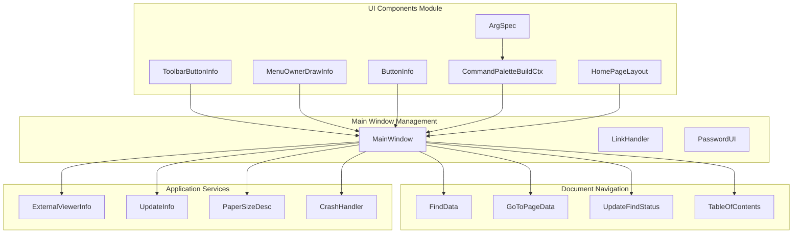
```mermaid
graph TB
    subgraph "UI Components Module"
        TB[ToolbarButtonInfo]
        MO[MenuOwnerDrawInfo]
        BI[ButtonInfo]
        AS[ArgSpec]
        CB[CommandPaletteBuildCtx]
        HPL[HomePageLayout]
    end
    
    subgraph "Main Window Management"
        MW[MainWindow]
        LH[LinkHandler]
        PW[PasswordUI]
    end
    
    subgraph "Document Navigation"
        FD[FindData]
        GD[GoToPageData]
        UF[UpdateFindStatus]
        TN[TableOfContents]
    end
    
    subgraph "Application Services"
        EV[ExternalViewerInfo]
        UI[UpdateInfo]
        PS[PaperSizeDesc]
        CH[CrashHandler]
    end
    
    TB --> MW
    MO --> MW
    BI --> MW
    AS --> CB
    CB --> MW
    HPL --> MW
    
    MW --> FD
    MW --> GD
    MW --> UF
    MW --> TN
    
    MW --> EV
    MW --> UI
    MW --> PS
    MW --> CH
```

### Component Dependencies

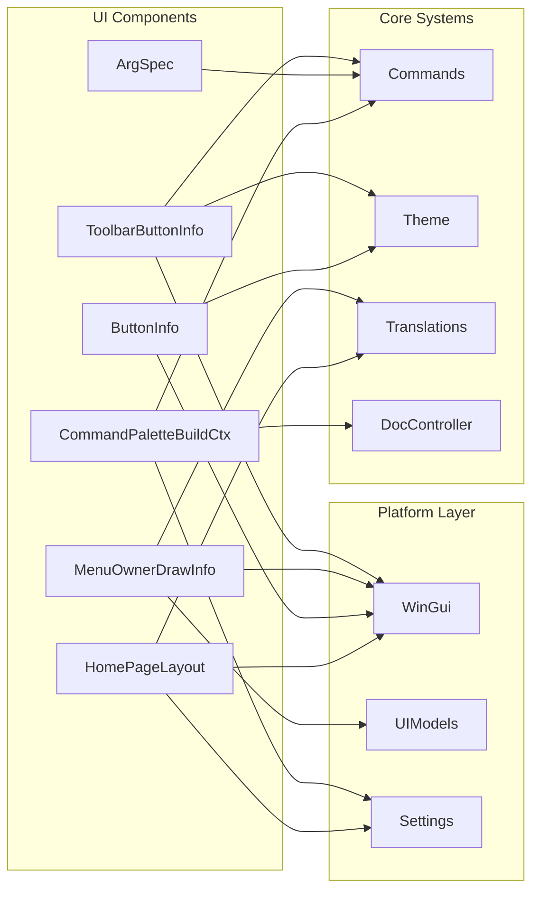
```mermaid
graph LR
    subgraph "UI Components"
        TB[ToolbarButtonInfo]
        MO[MenuOwnerDrawInfo]
        BI[ButtonInfo]
        AS[ArgSpec]
        CB[CommandPaletteBuildCtx]
        HPL[HomePageLayout]
    end
    
    subgraph "Core Systems"
        CMD[Commands]
        TH[Theme]
        TR[Translations]
        DC[DocController]
    end
    
    subgraph "Platform Layer"
        WG[WinGui]
        UM[UIModels]
        ST[Settings]
    end
    
    TB --> CMD
    TB --> TH
    TB --> WG
    
    MO --> TR
    MO --> WG
    MO --> UM
    
    BI --> WG
    BI --> TH
    
    AS --> CMD
    
    CB --> CMD
    CB --> DC
    CB --> ST
    
    HPL --> WG
    HPL --> ST
    HPL --> TR
```

## Component Details

### Toolbar System (ToolbarButtonInfo)

The toolbar system provides a comprehensive set of controls for document navigation and manipulation. The `ToolbarButtonInfo` structure serves as the foundation for all toolbar elements, defining the visual representation and behavior of each button.

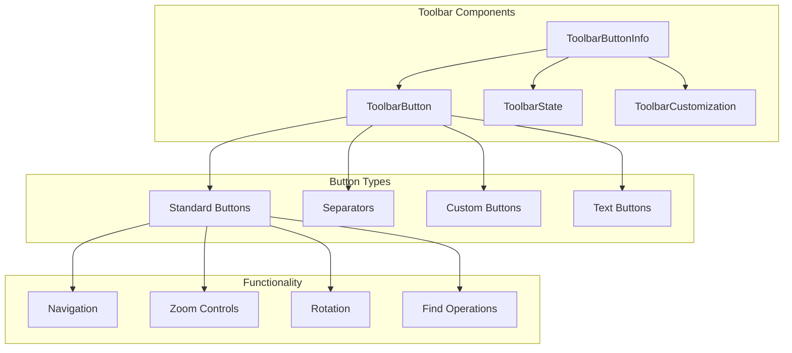
```mermaid
graph TD
    subgraph "Toolbar Components"
        TBI[ToolbarButtonInfo]
        TBB[ToolbarButton]
        TBS[ToolbarState]
        TBC[ToolbarCustomization]
    end
    
    subgraph "Button Types"
        STD[Standard Buttons]
        SEP[Separators]
        CUS[Custom Buttons]
        TXT[Text Buttons]
    end
    
    subgraph "Functionality"
        NAV[Navigation]
        ZOM[Zoom Controls]
        ROT[Rotation]
        FND[Find Operations]
    end
    
    TBI --> TBB
    TBI --> TBS
    TBI --> TBC
    
    TBB --> STD
    TBB --> SEP
    TBB --> CUS
    TBB --> TXT
    
    STD --> NAV
    STD --> ZOM
    STD --> ROT
    STD --> FND
```

The toolbar system supports dynamic button visibility based on document type and state. For instance, rotation controls are automatically hidden for CHM documents, while zoom controls adapt to the current document's capabilities. The system also handles custom toolbar buttons defined through user preferences, allowing for extensive personalization.

### Menu System (MenuOwnerDrawInfo)

The menu system implements a sophisticated owner-drawn architecture that provides complete control over menu appearance and behavior. The `MenuOwnerDrawInfo` structure manages the visual elements of menu items, including text rendering, icon display, and state management.

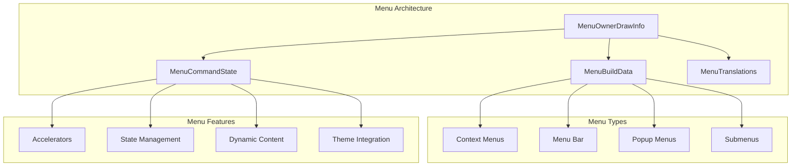
```mermaid
graph TD
    subgraph "Menu Architecture"
        MODI[MenuOwnerDrawInfo]
        MBD[MenuBuildData]
        MCS[MenuCommandState]
        MTR[MenuTranslations]
    end
    
    subgraph "Menu Types"
        CTX[Context Menus]
        MNB[Menu Bar]
        POP[Popup Menus]
        SUB[Submenus]
    end
    
    subgraph "Menu Features"
        ACC[Accelerators]
        STA[State Management]
        DIS[Dynamic Content]
        THM[Theme Integration]
    end
    
    MODI --> MBD
    MODI --> MCS
    MODI --> MTR
    
    MBD --> CTX
    MBD --> MNB
    MBD --> POP
    MBD --> SUB
    
    MCS --> ACC
    MCS --> STA
    MCS --> DIS
    MCS --> THM
```

The menu system dynamically adapts its content based on the current application state, document type, and user permissions. It supports complex scenarios such as disabling items based on document restrictions, hiding unavailable features, and updating menu content in real-time as the application state changes.

### Caption System (ButtonInfo)

The caption system provides custom window chrome functionality, replacing the standard Windows caption with a fully customizable interface. The `ButtonInfo` structure manages the state and appearance of caption buttons, including minimize, maximize, close, and custom menu buttons.

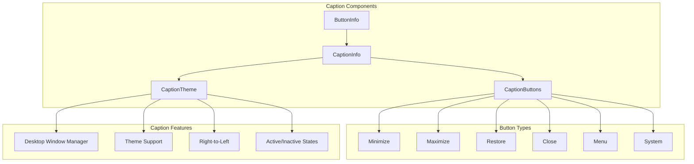
```mermaid
graph TD
    subgraph "Caption Components"
        BI[ButtonInfo]
        CI[CaptionInfo]
        CBT[CaptionButtons]
        CTH[CaptionTheme]
    end
    
    subgraph "Button Types"
        MIN[Minimize]
        MAX[Maximize]
        RES[Restore]
        CLO[Close]
        MEN[Menu]
        SYS[System]
    end
    
    subgraph "Caption Features"
        DWM[Desktop Window Manager]
        THM[Theme Support]
        RTL[Right-to-Left]
        ACT[Active/Inactive States]
    end
    
    BI --> CI
    CI --> CBT
    CI --> CTH
    
    CBT --> MIN
    CBT --> MAX
    CBT --> RES
    CBT --> CLO
    CBT --> MEN
    CBT --> SYS
    
    CTH --> DWM
    CTH --> THM
    CTH --> RTL
    CTH --> ACT
```

The caption system seamlessly integrates with Windows Desktop Window Manager (DWM) when available, providing native Aero Glass effects while maintaining custom functionality. It handles complex scenarios such as theme changes, high DPI displays, and different Windows versions with appropriate fallbacks.

### Command System (ArgSpec)

The command system provides a flexible framework for defining and executing application commands. The `ArgSpec` structure defines the parameter specifications for commands, enabling type-safe argument parsing and validation.

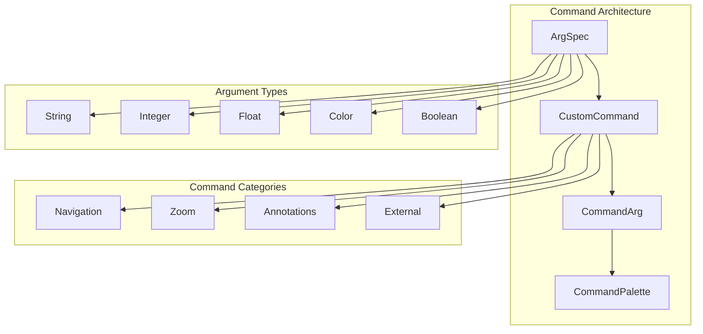
```mermaid
graph TD
    subgraph "Command Architecture"
        AS[ArgSpec]
        CC[CustomCommand]
        CA[CommandArg]
        CP[CommandPalette]
    end
    
    subgraph "Argument Types"
        STR[String]
        INT[Integer]
        FLT[Float]
        CLR[Color]
        BOOL[Boolean]
    end
    
    subgraph "Command Categories"
        NAV[Navigation]
        ZOM[Zoom]
        ANN[Annotations]
        EXT[External]
    end
    
    AS --> CC
    CC --> CA
    CA --> CP
    
    AS --> STR
    AS --> INT
    AS --> FLT
    AS --> CLR
    AS --> BOOL
    
    CC --> NAV
    CC --> ZOM
    CC --> ANN
    CC --> EXT
```

The command system supports both built-in and user-defined commands, with a sophisticated argument parsing system that handles type conversion, validation, and default values. It integrates with the command palette for discoverability and provides a consistent interface for executing operations throughout the application.

### Command Palette (CommandPaletteBuildCtx)

The command palette provides a powerful interface for discovering and executing application commands. The `CommandPaletteBuildCtx` structure manages the context for building command lists, filtering based on application state, and providing intelligent suggestions.

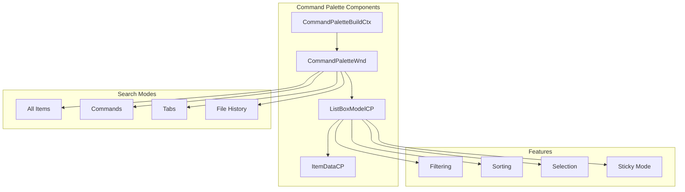
```mermaid
graph TD
    subgraph "Command Palette Components"
        CB[CommandPaletteBuildCtx]
        CPW[CommandPaletteWnd]
        LBM[ListBoxModelCP]
        ITC[ItemDataCP]
    end
    
    subgraph "Search Modes"
        ALL[All Items]
        CMD[Commands]
        TAB[Tabs]
        HST[File History]
    end
    
    subgraph "Features"
        FLT[Filtering]
        SRT[Sorting]
        SEL[Selection]
        STK[Sticky Mode]
    end
    
    CB --> CPW
    CPW --> LBM
    LBM --> ITC
    
    CPW --> ALL
    CPW --> CMD
    CPW --> TAB
    CPW --> HST
    
    LBM --> FLT
    LBM --> SRT
    LBM --> SEL
    LBM --> STK
```

The command palette implements fuzzy search capabilities, allowing users to find commands by typing partial names or descriptions. It supports multiple search modes, including command-specific searches, tab navigation, and file history access, with intelligent filtering based on the current application context.

### Home Page Layout (HomePageLayout)

The home page layout system manages the visual presentation of the application's start page, providing access to recently opened documents, application information, and promotional content. The `HomePageLayout` structure coordinates the arrangement of thumbnails, text elements, and interactive components.

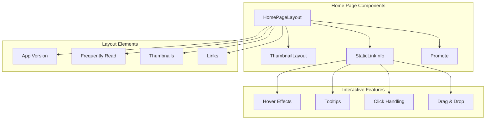
```mermaid
graph TD
    subgraph "Home Page Components"
        HPL[HomePageLayout]
        TL[ThumbnailLayout]
        SLI[StaticLinkInfo]
        PRO[Promote]
    end
    
    subgraph "Layout Elements"
        APP[App Version]
        FRR[Frequently Read]
        THM[Thumbnails]
        LNK[Links]
    end
    
    subgraph "Interactive Features"
        HVR[Hover Effects]
        TIP[Tooltips]
        CLK[Click Handling]
        DND[Drag & Drop]
    end
    
    HPL --> TL
    HPL --> SLI
    HPL --> PRO
    
    HPL --> APP
    HPL --> FRR
    HPL --> THM
    HPL --> LNK
    
    SLI --> HVR
    SLI --> TIP
    SLI --> CLK
    SLI --> DND
```

The home page system dynamically generates thumbnail previews of recently accessed documents, manages layout calculations for different screen sizes and orientations, and provides smooth transitions between different view states. It integrates with the file history system to provide quick access to frequently used documents.

## Data Flow

### User Interaction Flow

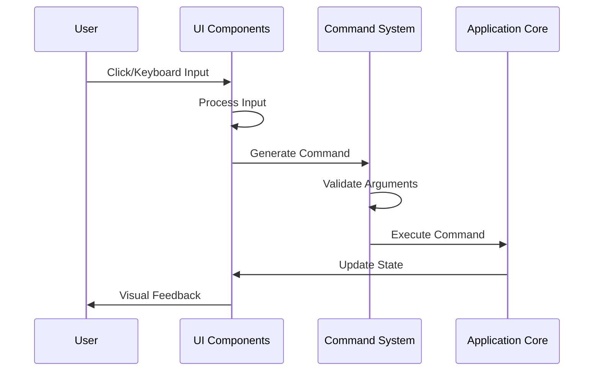
```mermaid
sequenceDiagram
    participant User
    participant UI as UI Components
    participant CMD as Command System
    participant APP as Application Core
    
    User->>UI: Click/Keyboard Input
    UI->>UI: Process Input
    UI->>CMD: Generate Command
    CMD->>CMD: Validate Arguments
    CMD->>APP: Execute Command
    APP->>UI: Update State
    UI->>User: Visual Feedback
```

### Menu System Flow

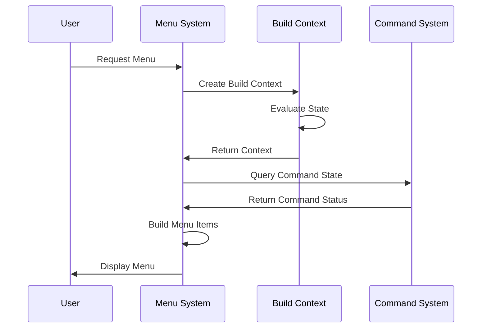
```mermaid
sequenceDiagram
    participant User
    participant MENU as Menu System
    participant CTX as Build Context
    participant CMD as Command System
    
    User->>MENU: Request Menu
    MENU->>CTX: Create Build Context
    CTX->>CTX: Evaluate State
    CTX->>MENU: Return Context
    MENU->>CMD: Query Command State
    CMD->>MENU: Return Command Status
    MENU->>MENU: Build Menu Items
    MENU->>User: Display Menu
```

### Command Palette Flow

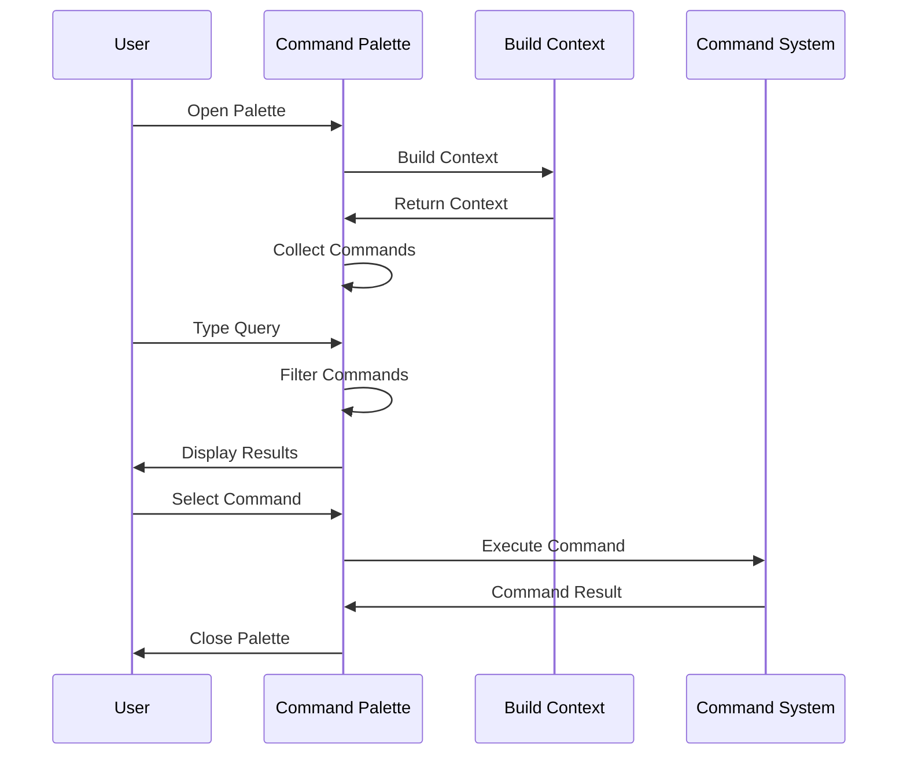
```mermaid
sequenceDiagram
    participant User
    participant CP as Command Palette
    participant CTX as Build Context
    participant CMD as Command System
    
    User->>CP: Open Palette
    CP->>CTX: Build Context
    CTX->>CP: Return Context
    CP->>CP: Collect Commands
    User->>CP: Type Query
    CP->>CP: Filter Commands
    CP->>User: Display Results
    User->>CP: Select Command
    CP->>CMD: Execute Command
    CMD->>CP: Command Result
    CP->>User: Close Palette
```

## Integration Points

### Main Window Integration

The UI Components module integrates seamlessly with the main window management system, providing the visual and interactive elements that users interact with daily. The toolbar system communicates with the document controller to enable and disable buttons based on the current document state, while the menu system provides access to all application features through a hierarchical structure.

The caption system works closely with the window management code to provide custom chrome functionality, handling window messages and drawing operations to create a cohesive visual experience. The integration ensures that all UI elements respond consistently to system events such as theme changes, DPI scaling, and window state modifications.

### Document Engine Integration

The UI Components module adapts its presentation based on the capabilities of the loaded document engine. Different document types (PDF, eBook, image files, etc.) have unique requirements and supported features, which the UI system reflects through dynamic button visibility, menu item availability, and command palette filtering.

The system queries document engines for their capabilities and adjusts the user interface accordingly. For example, annotation features are only available for document engines that support annotations, while rotation controls are hidden for formats that don't support page rotation.

### Settings and Preferences Integration

The UI Components module maintains close integration with the settings system to provide persistent customization options. Toolbar configurations, menu preferences, and command palette history are all stored and restored through the settings framework, ensuring that user customizations persist across application sessions.

The system also responds to runtime setting changes, updating the user interface immediately when preferences are modified. This includes theme changes, language switching, and accessibility option modifications, providing a responsive and adaptive user experience.

## Performance Considerations

### Rendering Optimization

The UI Components module implements several optimization strategies to ensure smooth performance across different hardware configurations. The toolbar system uses cached icon bitmaps and implements efficient redraw mechanisms to minimize painting operations. The menu system employs lazy loading techniques to build menu content only when needed, reducing initialization overhead.

The caption system optimizes drawing operations through double buffering and selective invalidation, ensuring that only changed regions are repainted. The command palette implements incremental search and result caching to provide responsive filtering even with large command sets.

### Memory Management

The module implements careful memory management practices to minimize resource usage and prevent memory leaks. Dynamic allocations are minimized through the use of object pools and cached resources. The toolbar system reuses button objects and icon resources, while the menu system implements efficient string management and cleanup procedures.

The command palette implements result caching and incremental filtering to reduce memory allocations during search operations. The home page system manages thumbnail resources efficiently, loading and unloading images based on visibility and user interaction patterns.

## Accessibility Features

### Keyboard Navigation

The UI Components module provides comprehensive keyboard navigation support across all interface elements. The toolbar system implements tab navigation and keyboard shortcuts for all major functions, while the menu system supports accelerator keys and keyboard mnemonics for efficient access to menu items.

The command palette is designed primarily for keyboard interaction, providing quick access to all application features through typed commands. The caption system supports keyboard shortcuts for window management operations, ensuring that users can control the application entirely through keyboard input if desired.

### Screen Reader Support

The module implements proper accessibility APIs to ensure compatibility with screen readers and other assistive technologies. All interactive elements include appropriate labels and descriptions, while dynamic content updates are announced through accessibility events.

The menu system provides detailed accessibility information for menu items, including state information and keyboard shortcuts. The toolbar system includes descriptive text for all buttons, and the command palette provides spoken feedback for search results and command execution.

## Internationalization

### Language Support

The UI Components module provides comprehensive internationalization support through the translation system. All user-visible text is externalized and can be translated into different languages without code modifications. The system supports complex text layout for right-to-left languages and implements proper text direction handling throughout the interface.

The menu system automatically adjusts text direction based on the selected language, while the toolbar system supports localized tooltips and button labels. The command palette includes translated command descriptions and supports searching in the user's preferred language.

### Cultural Adaptations

The module implements cultural adaptations beyond simple text translation, including appropriate date and number formatting, color scheme preferences, and layout adjustments for different cultural conventions. The system respects regional settings for items such as paper sizes and measurement units, ensuring that the interface feels natural to users from different cultural backgrounds.

## Error Handling

### Graceful Degradation

The UI Components module implements robust error handling to ensure that the application remains functional even when individual components encounter problems. The toolbar system continues to operate even if icon loading fails, displaying fallback text or default icons. The menu system handles missing translation strings gracefully, falling back to default text when translations are unavailable.

The command palette implements error recovery for malformed commands and continues to function even if individual commands fail to execute. The caption system provides fallback drawing routines for situations where theme information is unavailable or corrupted.

### User Feedback

The module provides appropriate user feedback for error conditions through status messages, dialog boxes, and visual indicators. The toolbar system displays status information for long-running operations, while the menu system provides feedback for unavailable or disabled features.

The command palette includes error handling for invalid commands and provides helpful suggestions when search queries don't match any available commands. The home page system handles missing thumbnails and corrupted file references gracefully, displaying appropriate placeholder content.

## Future Enhancements

### Planned Features

The UI Components module is designed for extensibility, with planned enhancements including support for additional input methods, improved accessibility features, and enhanced customization options. Future versions may include support for gesture-based navigation, voice commands, and advanced theming capabilities.

The system architecture supports the addition of new component types and interaction models without requiring major restructuring. Planned enhancements include improved touch support, enhanced high DPI handling, and integration with emerging accessibility technologies.

### Technology Updates

The module is designed to adapt to evolving technology platforms and user interface paradigms. The architecture supports migration to newer UI frameworks while maintaining backward compatibility and preserving user customizations. Future updates may include support for modern UI patterns such as ribbon interfaces, adaptive layouts, and cloud-based customization synchronization.

The system is built with modularity in mind, allowing individual components to be updated or replaced as technology evolves while maintaining overall system stability and user familiarity. This approach ensures that the UI Components module can continue to provide a modern, efficient user interface as technology and user expectations evolve over time.