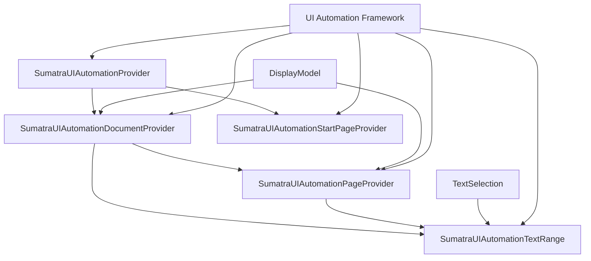
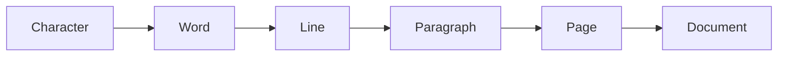
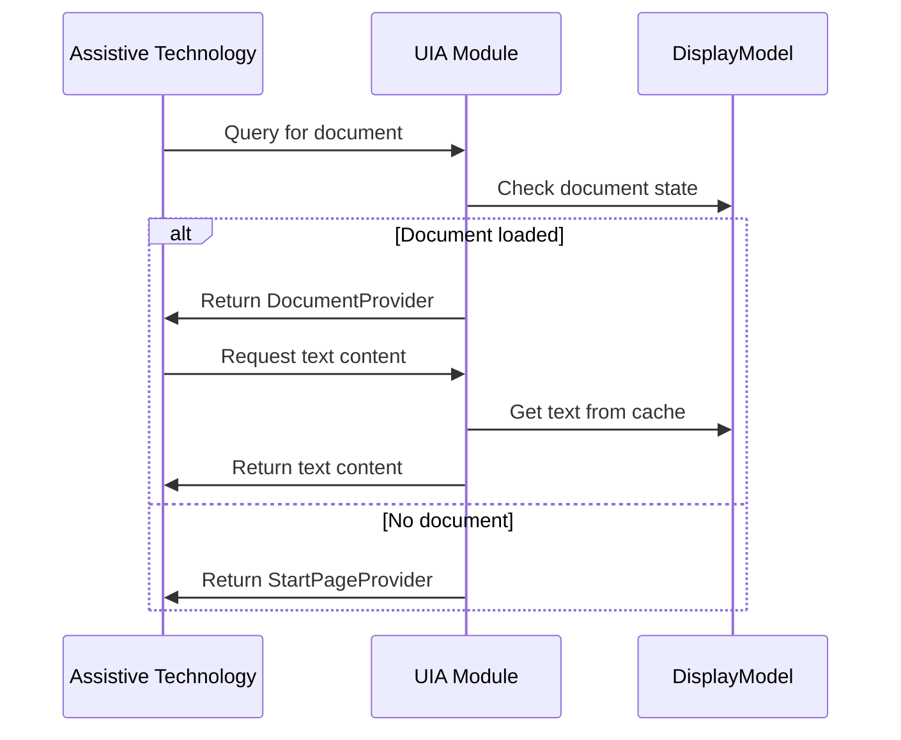

# UIA (UI Automation) Module Documentation

## Overview

The UIA (UI Automation) module provides Microsoft UI Automation support for SumatraPDF, enabling accessibility tools like screen readers to interact with the application. This module implements the UI Automation Provider interfaces that expose document content, structure, and interaction capabilities to assistive technologies.

## Purpose

The UIA module serves as the bridge between SumatraPDF's internal document representation and the Windows UI Automation framework. It enables:

- **Accessibility Support**: Allows screen readers and other assistive technologies to access document content
- **Text Navigation**: Provides programmatic text selection and navigation capabilities
- **Document Structure**: Exposes the hierarchical structure of documents (document → pages → text)
- **Automation Events**: Notifies assistive technologies about document changes and selections

## Architecture

### Core Components

#### 1. SumatraUIAutomationProvider (Root Provider)
- **Location**: `src/uia/Provider.cpp`
- **Role**: Main entry point for UI Automation, represents the canvas window
- **Responsibilities**:
  - Implements `IRawElementProviderFragmentRoot` interface
  - Manages document lifecycle (load/unload events)
  - Coordinates between start page and document providers
  - Handles hit-testing and focus management

#### 2. SumatraUIAutomationDocumentProvider
- **Location**: `src/uia/DocumentProvider.cpp`
- **Role**: Represents the loaded document
- **Responsibilities**:
  - Implements `ITextProvider` for text content access
  - Manages page providers as child elements
  - Provides document-level properties (name, text selection)
  - Handles document navigation and text ranges

#### 3. SumatraUIAutomationPageProvider
- **Location**: `src/uia/PageProvider.cpp`
- **Role**: Represents individual pages within a document
- **Responsibilities**:
  - Implements `IValueProvider` for page content
  - Provides page-specific properties and boundaries
  - Manages sibling navigation between pages
  - Exposes page text content to UI Automation

#### 4. SumatraUIAutomationStartPageProvider
- **Location**: `src/uia/StartPageProvider.cpp`
- **Role**: Represents the application's start page/welcome screen
- **Responsibilities**:
  - Provides basic properties for the start page
  - Acts as fallback when no document is loaded
  - Simple implementation with minimal functionality

#### 5. SumatraUIAutomationTextRange
- **Location**: `src/uia/TextRange.cpp`
- **Role**: Represents text selections and ranges within documents
- **Responsibilities**:
  - Implements `ITextRangeProvider` for text manipulation
  - Provides text navigation (character, word, line, page, document)
  - Supports text selection and extraction
  - Manages endpoint movement and range comparison

## Key Features

### Text Navigation Support
The module supports multiple levels of text navigation:

### UI Automation Pattern Support

| Component | TextPattern | ValuePattern | SelectionPattern |
|-----------|-------------|--------------|------------------|
| DocumentProvider | ✓ | ✗ | ✗ |
| PageProvider | ✗ | ✓ | ✗ |
| TextRange | ✓ | ✗ | ✓ |

### Event Handling
The module raises appropriate UI Automation events:
- `StructureChangeType_ChildrenInvalidated` - When documents load/unload
- `UIA_Text_TextSelectionChangedEventId` - When text selection changes

## Integration Points

### Dependencies
- **DisplayModel**: Provides document structure and page information
- **TextSelection**: Manages text selection state
- **TextCache**: Provides access to page text content
- **Engine Components**: For document content extraction

### External Interfaces
- **UI Automation Core**: Implements standard UI Automation interfaces
- **OleAcc**: Accessibility support
- **Windows SDK**: UI Automation API integration

## Usage Flow

## Implementation Details

### Memory Management
- Reference counting for COM objects
- Proper cleanup when documents are unloaded
- Safe array handling for UI Automation data

### Thread Safety
- Document operations are synchronized
- UI Automation calls are handled on appropriate threads
- Atomic operations for reference counting

### Error Handling
- Graceful degradation when documents are unavailable
- Proper HRESULT return codes for UI Automation
- Validation of input parameters

## Sub-modules

The UIA module consists of several specialized components:

- **[Document Provider](document_provider.md)**: Core document representation and text access
- **[Page Provider](page_provider.md)**: Individual page management and content exposure  
- **[Text Range](text_range.md)**: Text selection and navigation functionality
- **[Root Provider](root_provider.md)**: Main provider coordination and window integration

Each sub-module handles specific aspects of the UI Automation implementation while working together to provide comprehensive accessibility support.

### Document Provider
The [Document Provider](document_provider.md) implements the main document-level UI Automation interfaces, providing access to the entire document content, managing page providers as child elements, and supporting text selection and navigation at the document level.

### Page Provider  
The [Page Provider](page_provider.md) represents individual pages within documents, exposing page-specific content through the Value pattern and providing page boundaries for navigation purposes.

### Text Range
The [Text Range](text_range.md) component handles all text selection and manipulation operations, supporting multiple navigation units (character, word, line, page, document) and providing text extraction capabilities for assistive technologies.

### Root Provider
The [Root Provider](root_provider.md) serves as the main entry point for UI Automation clients, coordinating between different provider types and managing the overall accessibility tree structure.

## Related Modules

- **[DisplayModel](../display_model.md)**: Document display and page management
- **[TextSelection](../text_selection.md)**: Text selection functionality
- **[Engines](../engines.md)**: Document format support and content extraction

## Future Enhancements

Potential improvements to the UIA module:
- Enhanced text attribute support
- Better table and structured content exposure
- Improved navigation for complex documents
- Support for more UI Automation patterns
- Performance optimizations for large documents