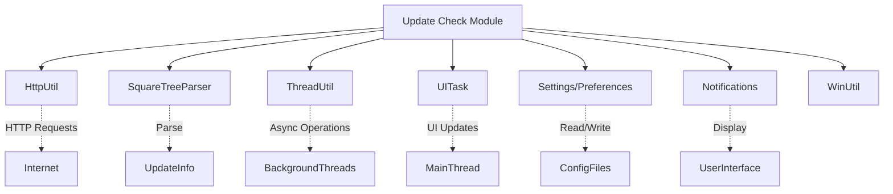
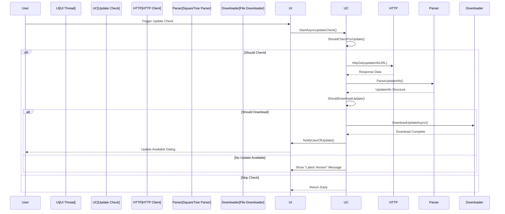
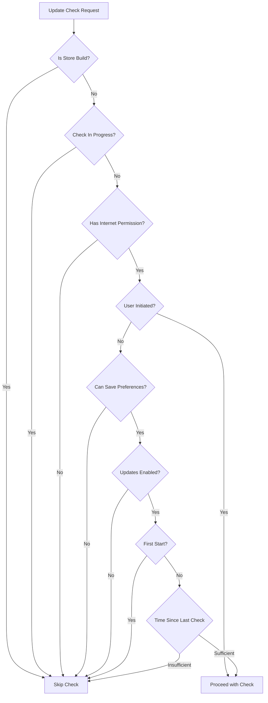
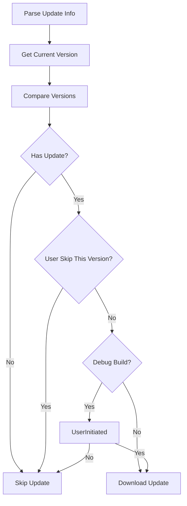
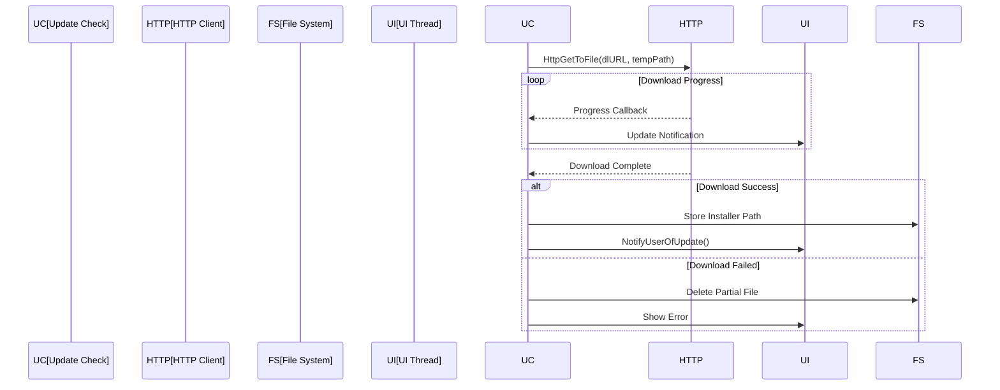
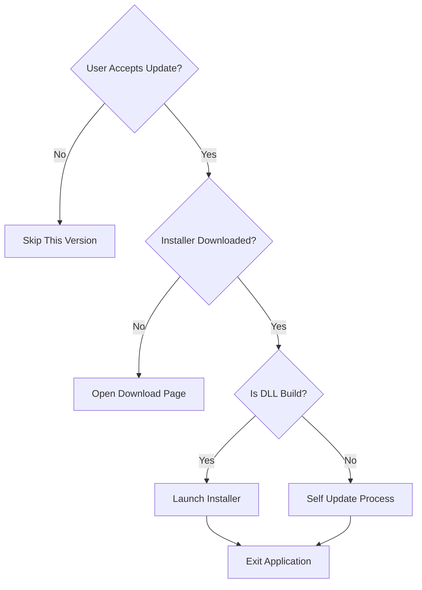
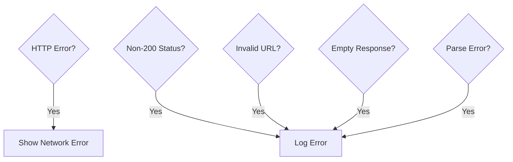
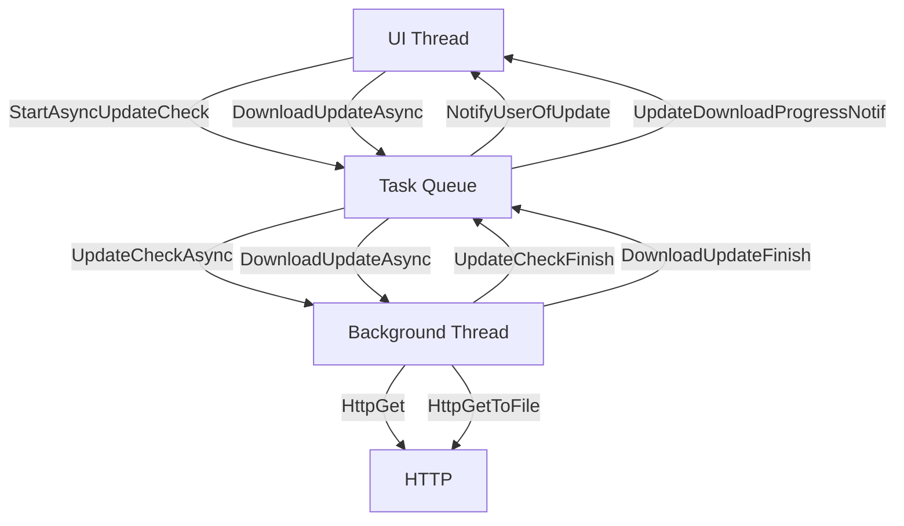

# Update Check Module Documentation

## Introduction

The update_check module is responsible for managing automatic and user-initiated software updates in SumatraPDF. It handles version checking, update notifications, and the download/installation process for new versions. The module ensures users stay current with the latest features and security updates while providing control over the update process.

## Core Architecture

### Primary Components

The module centers around the `UpdateInfo` structure which encapsulates all update-related information:

```cpp
struct UpdateInfo {
    HWND hwndParent = nullptr;
    const char* latestVer = nullptr;
    const char* installer64 = nullptr;
    const char* installerArm64 = nullptr;
    const char* installer32 = nullptr;
    const char* portable64 = nullptr;
    const char* portableArm64 = nullptr;
    const char* portable32 = nullptr;
    const char* dlURL = nullptr;
    const char* installerPath = nullptr;
};
```

### Update Information Format

Update information is retrieved from remote servers in a structured format:

```
[SumatraPDF]
Latest: 14276
Installer64: https://www.sumatrapdfreader.org/dl/prerel/14276/SumatraPDF-prerel-64-install.exe
Installer32: https://www.sumatrapdfreader.org/dl/prerel/14276/SumatraPDF-prerel-install.exe
PortableExe64: https://www.sumatrapdfreader.org/dl/prerel/14276/SumatraPDF-prerel-64.exe
PortableExe32: https://www.sumatrapdfreader.org/dl/prerel/14276/SumatraPDF-prerel.exe
PortableZip64: https://www.sumatrapdfreader.org/dl/prerel/14276/SumatraPDF-prerel-64.zip
PortableZip32: https://www.sumatrapdfreader.org/dl/prerel/14276/SumatraPDF-prerel.zip
```

## System Architecture

### Module Dependencies

The update_check module integrates with several other system components:



### Update Check Flow



## Update Check Logic

### Update Check Types

The module supports two types of update checks:

1. **Automatic Update Check**: Triggered periodically based on user preferences
2. **User-Initiated Update Check**: Triggered explicitly by user action

### Update Check Conditions



### Version Comparison Logic

The update check compares versions using a sophisticated comparison algorithm:



## Update Download and Installation

### Download Process



### Installation Process

The module supports two installation scenarios:

1. **DLL Build**: Launches installer with appropriate flags
2. **Portable Build**: Self-update mechanism with file replacement



## Error Handling and Fallbacks

### URL Fallback Strategy

The module implements a robust fallback mechanism for update server URLs:

1. **Primary URL**: Main update server (sumatrapdfreader.org)
2. **Secondary URL**: Backup server (Backblaze B2 storage)

### Error Scenarios



## Integration with Other Modules

### Settings and Preferences

The update_check module interacts with the [settings](settings.md) module to:
- Read update check preferences (`checkForUpdates`)
- Store last update check timestamp (`timeOfLastUpdateCheck`)
- Manage version skip preferences (`versionToSkip`)

### Notifications System

Integration with the [notifications](notifications.md) module provides:
- Progress notifications during download
- Update availability notifications
- Error notifications for failed checks

### UI Components

The module leverages [ui_components](ui_components.md) for:
- Update dialog presentation
- User interaction handling
- Progress indication

## Security Considerations

### Certificate and Network Security

- Uses HTTPS for all update communications
- Implements certificate validation
- Provides fallback for older Windows versions with limited cipher support
- Validates response format before parsing

### Update Verification

- Validates version strings before processing
- Checks URL authenticity
- Implements permission-based access control
- Provides user consent mechanisms

## Configuration and URLs

### Update URLs

```cpp
// Pre-release builds
constexpr const char* kUpdateInfoURL = "https://www.sumatrapdfreader.org/updatecheck-pre-release.txt";
constexpr const char* kUpdateInfoURL2 = "https://kjk-files.s3.us-west-001.backblazeb2.com/software/sumatrapdf/sumpdf-prerelease-update.txt";

// Release builds
constexpr const char* kUpdateInfoURL = "https://www.sumatrapdfreader.org/update-check-rel.txt";
constexpr const char* kUpdateInfoURL2 = "https://www.sumatrapdfreader.org/update-check-rel.txt";
```

### Download Page URLs

```cpp
// Pre-release builds
#define kWebisteDownloadPageURL "https://www.sumatrapdfreader.org/prerelease"

// Release builds
#define kWebisteDownloadPageURL "https://www.sumatrapdfreader.org/download-free-pdf-viewer"
```

## Threading Model

The update_check module implements a multi-threaded architecture:

1. **UI Thread**: Handles user interface updates and notifications
2. **Background Thread**: Performs HTTP requests and file downloads
3. **Task Queue**: Coordinates between threads using the UITask system



This architecture ensures responsive user interface while performing network operations and file downloads in the background.