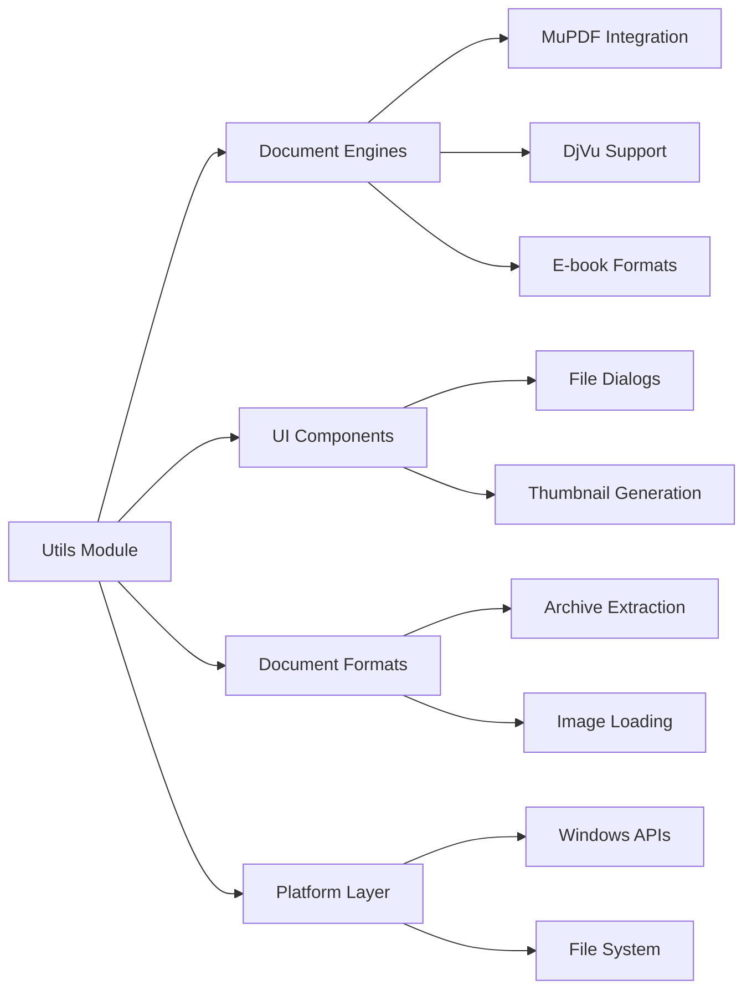

# Utils Module Documentation

## Overview

The utils module is a comprehensive collection of utility libraries that provide core functionality for the SumatraPDF application. It serves as the foundation layer, offering essential services for file operations, data processing, system integration, and format handling.

## Architecture

The utils module is organized into several specialized sub-modules, each focusing on specific functionality areas:

```mermaid
graph TD
    A[Utils Module] --> B[Archive Handling]
    A --> C[Image Processing]
    A --> D[Data Structures]
    A --> E[File System]
    A --> F[Text Processing]
    A --> G[System Services]
    A --> H[Format Detection]
    A --> I[Compression]
    A --> J[Threading]
    
    B --> B1[Multi-format Archive Support]
    B --> B2[ZIP/RAR/7Z/TAR Handling]
    
    C --> C1[AVIF Image Reader]
    C --> C2[TGA Image Reader]
    
    D --> D1[Dictionary Implementation]
    D --> D2[String Vector Management]
    
    E --> E1[File Watching Service]
    E --> E2[File Type Detection]
    
    F --> F1[String Formatting]
    F --> F2[JSON Parsing]
    
    G --> G1[Thread Utilities]
    G --> G2[Windows Integration]
    
    H --> H1[Content-based Detection]
    H --> H2[Extension-based Detection]
    
    I --> I1[LZMA Compression]
    I --> I2[ZIP Creation]
    
    J --> J1[Thread Management]
    J --> J2[Thread Naming]
```



## Core Sub-modules

### 1. Archive Handling ([Archive](Archive.md))
Provides unified interface for reading multiple archive formats including ZIP, RAR, 7Z, and TAR files. Features lazy loading, memory-efficient extraction, and fallback mechanisms for format-specific handling.

### 2. Image Processing
- **AVIF Reader** ([AvifReader](AvifReader.md)): Modern image format support using libheif for HEIC/AVIF image decoding with GDI+ bitmap conversion
- **TGA Reader** ([TgaReader](TgaReader.md)): Comprehensive TGA format support with RLE compression, metadata handling, and multiple pixel format support

### 3. Data Structures
- **Dictionary** ([Dict](Dict.md)): High-performance hash table implementation with chaining collision resolution, supporting both string and wide-string keys
- **String Vector** ([StrVec](StrVec.md)): Memory-efficient string collection with paging, sorting, and advanced manipulation capabilities

### 4. File System Services
- **File Watcher** ([FileWatcher](FileWatcher.md)): Real-time file change monitoring using Windows ReadDirectoryChangesW with network drive fallback and thread-safe operation
- **File Type Detection** ([GuessFileType](GuessFileType.md)): Multi-method file format identification using both content-based signatures and extension mapping

### 5. Text Processing
- **String Formatting** ([StrFormat](StrFormat.md)): Advanced formatting system with positional arguments, type safety, and printf-style compatibility
- **JSON Parser** ([JsonParser](JsonParser.md)): Lightweight JSON parsing with visitor pattern for streaming processing

### 6. System Services
- **Thread Utilities** ([ThreadUtil](ThreadUtil.md)): Cross-platform thread management with naming support and async execution capabilities
- **LZMA Archive** ([LzmaSimpleArchive](LzmaSimpleArchive.md)): Custom archive format with LZMA compression, CRC32 verification, and memory allocation integration
- **ZIP Utilities** ([ZipUtil](ZipUtil.md)): ZIP file creation with compression, directory archiving, and gzip decompression support

## Key Features

### Performance Optimizations
- Memory pooling for frequent allocations
- Lazy loading for archive contents
- Efficient string interning
- Optimized hash functions (MurmurHash2)

### Robustness
- Comprehensive error handling
- Fallback mechanisms for format variations
- Thread-safe operations where applicable
- Memory overflow protection

### Extensibility
- Plugin-friendly architecture
- Clean separation of concerns
- Consistent API patterns
- Comprehensive documentation

## Integration Points

The utils module integrates with other system components:



## Usage Patterns

### File Type Detection
```cpp
// Quick format identification
Kind kind = GuessFileType(path, true); // sniff content if needed
if (kind == kindFilePDF) {
    // Handle PDF file
}
```

### Archive Operations
```cpp
// Open and extract from archive
MultiFormatArchive* archive = OpenZipArchive(path);
if (archive) {
    ByteSlice data = archive->GetFileDataByName("content.pdf");
    // Process extracted data
    delete archive;
}
```

### String Management
```cpp
// Efficient string collection
StrVec strings;
strings.Append("example");
strings.SortNatural();
char* joined = Join(strings, ", ");
```

## Thread Safety

Most utils components are thread-safe for read operations. Write operations and shared state modifications are protected by appropriate synchronization mechanisms. The FileWatcher service uses a dedicated thread with APC-based communication for optimal performance.

## Memory Management

The module employs several memory management strategies:
- Custom allocators for specific use cases
- Memory pooling for frequently allocated objects
- Automatic cleanup with RAII patterns
- Careful buffer management to prevent overflows

## Error Handling

Comprehensive error handling throughout:
- Return value checking
- Exception-safe code paths
- Graceful degradation for unsupported features
- Detailed logging for debugging

## Dependencies

The utils module has minimal external dependencies:
- System libraries (Windows API, standard C++ library)
- Selected third-party libraries (libheif, zlib, unarr)
- Internal base utilities

This design ensures maximum portability and minimal deployment overhead while providing comprehensive functionality for the application layer.