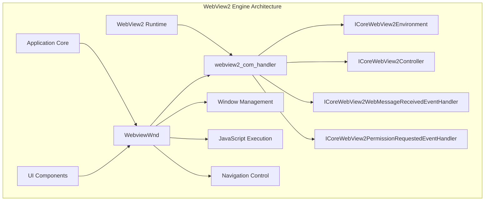
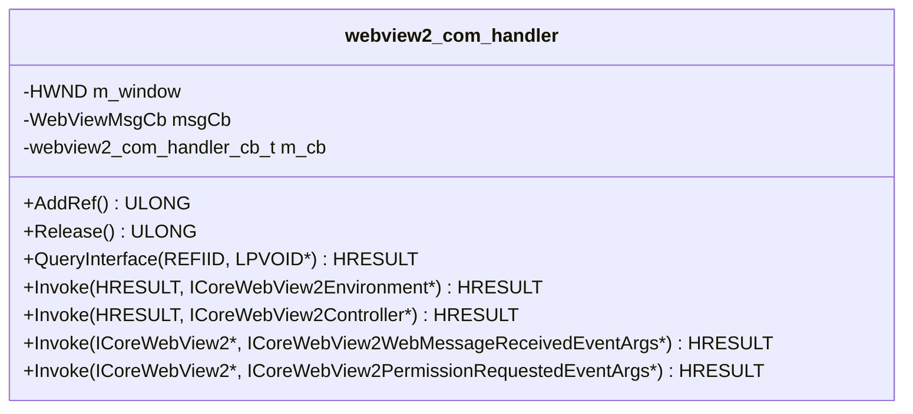
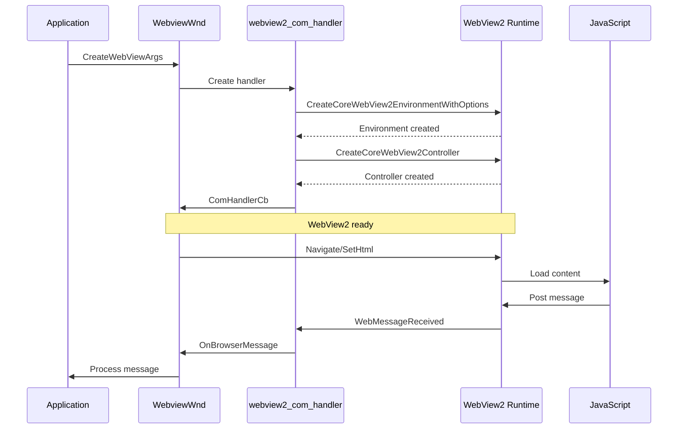
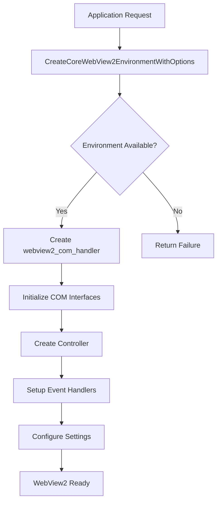
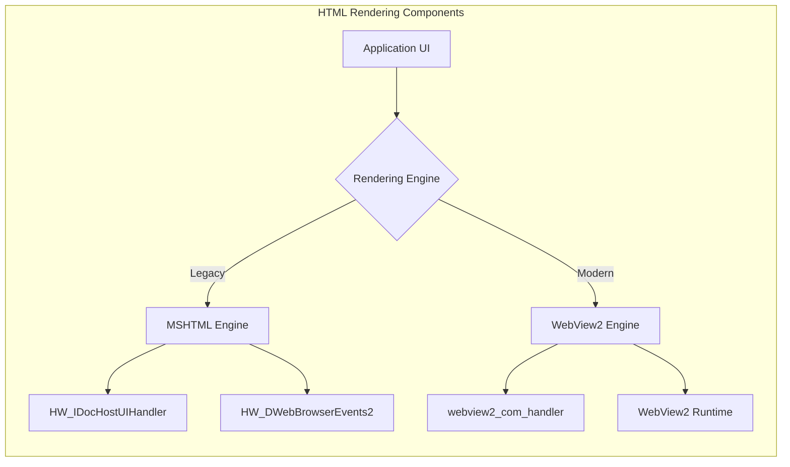
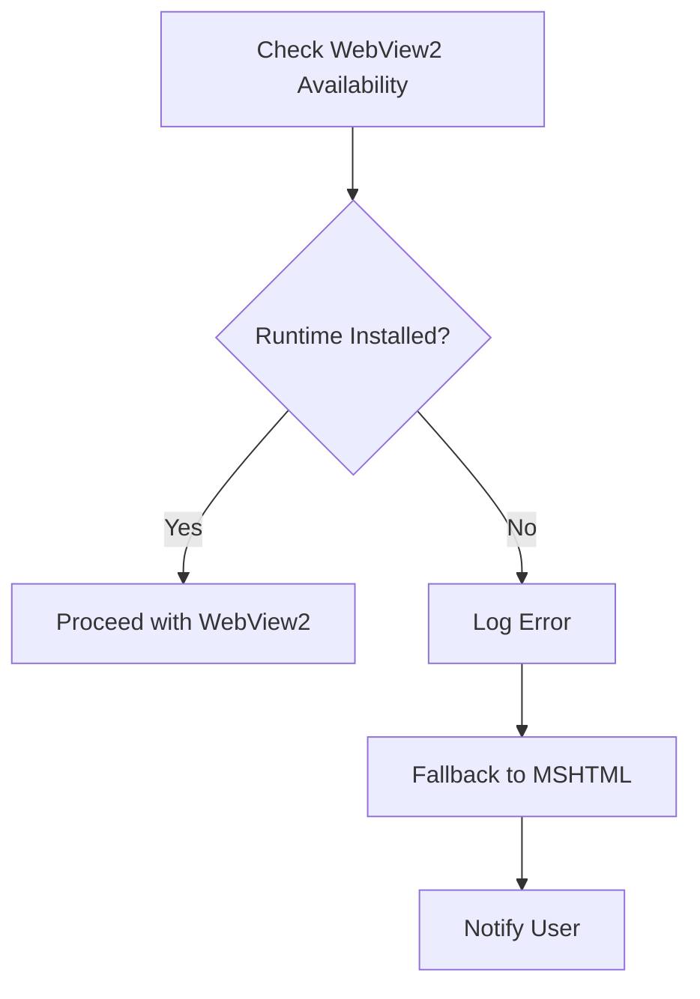

# WebView2 Engine Module Documentation

## Introduction

The WebView2 Engine module provides modern HTML rendering capabilities for the SumatraPDF application using Microsoft's WebView2 technology. This module serves as an alternative to the legacy MSHTML engine, offering better performance, modern web standards support, and enhanced security features. It enables the application to render HTML content, display web-based UI components, and integrate web technologies within the desktop application.

## Architecture Overview

The WebView2 Engine module is built around a COM-based architecture that interfaces with Microsoft's WebView2 runtime. The core component `webview2_com_handler` implements multiple COM interfaces to handle WebView2 lifecycle events, messaging, and permission management.



## Core Components

### webview2_com_handler

The `webview2_com_handler` is the central component that implements multiple COM interfaces to manage WebView2 operations:

- **ICoreWebView2CreateCoreWebView2EnvironmentCompletedHandler**: Handles environment creation completion
- **ICoreWebView2CreateCoreWebView2ControllerCompletedHandler**: Manages controller creation and initialization
- **ICoreWebView2WebMessageReceivedEventHandler**: Processes JavaScript-to-native messaging
- **ICoreWebView2PermissionRequestedEventHandler**: Handles permission requests from web content



### WebviewWnd

The `WebviewWnd` class provides the window management and high-level API for WebView2 integration:

- **Window Management**: Handles WebView2 embedding within application windows
- **Navigation Control**: Provides methods for loading HTML content and URLs
- **JavaScript Integration**: Enables bidirectional communication with web content
- **Size Management**: Automatically adjusts WebView2 bounds to match window size

## Data Flow Architecture



## Component Interactions

### Environment Creation Process



### Message Handling Flow


## Integration with HTML Rendering Components

The WebView2 Engine module is part of the broader HTML rendering components family, which includes:

- **[MSHTML Engine](mshtml_engine.md)**: Legacy Internet Explorer-based rendering
- **WebView2 Engine (Current)**: Modern Chromium-based rendering



## Key Features and Capabilities

### 1. Modern Web Standards Support
- Full HTML5, CSS3, and ES6+ JavaScript support
- WebGL and Canvas rendering
- Modern DOM APIs and event handling

### 2. Security Features
- Sandboxed rendering environment
- Configurable permission management
- Isolated from system resources

### 3. Performance Benefits
- Hardware-accelerated rendering
- Multi-process architecture
- Optimized memory usage

### 4. JavaScript Integration
- Bidirectional messaging between native and web content
- Custom JavaScript injection
- External object exposure

## Configuration and Settings

The WebView2 Engine provides several configuration options:

```cpp
// Available settings via ICoreWebView2Settings
settings->put_AreDefaultContextMenusEnabled(FALSE);    // Disable context menus
settings->put_AreDevToolsEnabled(FALSE);              // Disable developer tools
settings->put_IsStatusBarEnabled(FALSE);              // Disable status bar
settings->put_IsWebMessageEnabled(TRUE);              // Enable web messaging
settings->put_AreDefaultScriptDialogsEnabled(FALSE);  // Disable script dialogs
```

## Error Handling and Fallback

The module implements robust error handling for WebView2 availability:



## Usage Patterns

### Basic WebView2 Creation
```cpp
WebviewWnd* webview = new WebviewWnd();
CreateWebViewArgs args;
args.parent = parentWindow;
args.pos = initialPosition;
HWND hwnd = webview->Create(args);
```

### HTML Content Loading
```cpp
// Load HTML string
webview->SetHtml("<html><body>Hello World</body></html>");

// Navigate to URL
webview->Navigate("https://example.com");
```

### JavaScript Execution
```cpp
// Execute JavaScript
webview->Eval("console.log('Hello from native code');");

// Inject initialization script
webview->Init("window.external = { invoke: s => window.chrome.webview.postMessage(s) };");
```

## Dependencies and Requirements

### System Requirements
- Windows 10 version 1803 or later
- WebView2 Runtime (Evergreen or Fixed Version)
- Microsoft Edge Chromium-based browser components

### Module Dependencies
- `utils/BaseUtil.h`: Base utility functions
- `utils/WinUtil.h`: Windows-specific utilities
- `wingui/UIModels.h`: UI model definitions
- `webview2.h`: WebView2 SDK headers

## Performance Considerations

### Memory Management
- Automatic cleanup of COM objects
- Reference counting for WebView2 components
- Proper disposal of event handlers

### Thread Safety
- COM apartment threading model
- Message queue processing during initialization
- Synchronous environment creation

### Resource Usage
- Shared WebView2 runtime across applications
- Configurable user data folder for caching
- Optimized for multiple WebView2 instances

## Future Enhancements

Potential areas for future development include:

1. **Enhanced JavaScript Bridge**: More sophisticated native-to-JavaScript communication
2. **Custom Protocol Handling**: Support for custom URL schemes
3. **Print Integration**: Web content printing capabilities
4. **Accessibility Improvements**: Better screen reader and accessibility support
5. **Performance Monitoring**: Built-in performance metrics and profiling

## Related Documentation

- [MSHTML Engine](mshtml_engine.md) - Legacy HTML rendering implementation
- [Core Application and UI](core_application_and_ui.md) - Main application components
- [Windows Dark Mode](windows_dark_mode.md) - UI theming integration

## Conclusion

The WebView2 Engine module represents a significant modernization of the SumatraPDF application's HTML rendering capabilities. By leveraging Microsoft's WebView2 technology, it provides a secure, performant, and feature-rich environment for rendering web content within the desktop application. The modular design allows for easy integration with existing UI components while maintaining compatibility with legacy systems through the parallel MSHTML engine implementation.