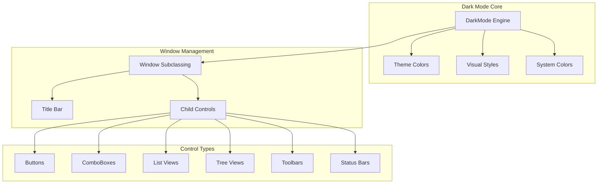
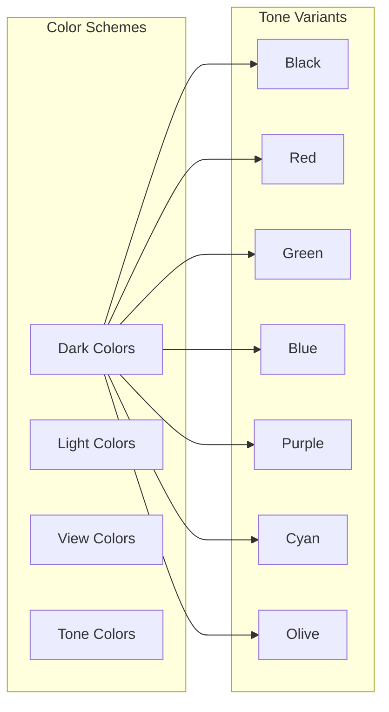
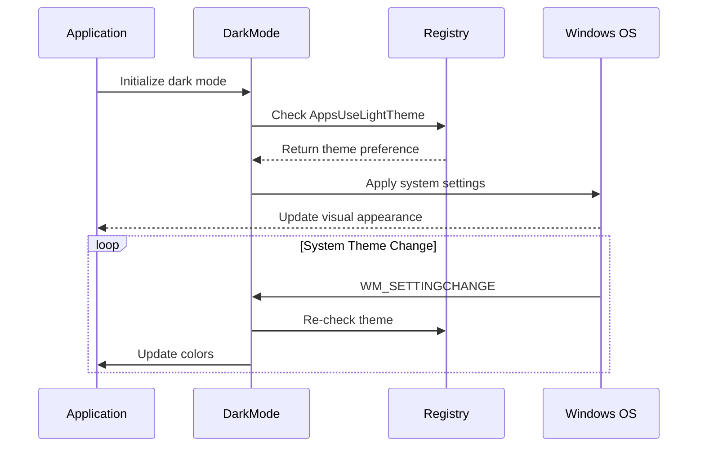

# Windows Dark Mode Module

## Introduction

The Windows Dark Mode module provides comprehensive dark mode support for Windows applications, implementing a sophisticated theming system that adapts to Windows 10/11 dark mode settings. This module extends the core application functionality by providing customizable dark themes, system integration, and extensive control styling capabilities.

## Architecture Overview

The module is built around a centralized theming system that manages color schemes, visual styles, and window subclassing for consistent dark mode appearance across the application.



## Core Components

### DarkModeParams Structure
The `DarkModeParams` structure defines theming and subclassing parameters for child controls:
- `_themeClassName`: Optional theme class name for visual styling
- `_subclass`: Whether to apply custom subclassing for dark-mode behavior
- `_theme`: Whether to apply themed visual style to controls

### Theme Management
The module implements a comprehensive theme system with multiple color schemes:



### Brushes and Pens Management
The `Brushes` and `Pens` structures provide GDI resource management:
- **Brushes**: Background, control background, hot background, dialog background, error background, edge brushes
- **Pens**: Text pens, edge pens, hot edge pens, disabled edge pens

## System Integration

### Windows Version Support
The module adapts to different Windows versions:
- **Windows 10 (2004+)**: Full dark mode support with DWM integration
- **Windows 11**: Additional features like Mica effects, rounded corners
- **Legacy Windows**: Fallback to classic theming

### System Theme Detection


## Control Support

### Supported Control Types
The module provides comprehensive support for standard Windows controls:

| Control Type | Subclassing | Theming | Custom Drawing |
|--------------|-------------|---------|----------------|
| Buttons | ✓ | ✓ | ✓ |
| ComboBoxes | ✓ | ✓ | ✓ |
| ListViews | ✓ | ✓ | ✓ |
| TreeViews | ✓ | ✓ | ✓ |
| Toolbars | ✓ | ✓ | ✓ |
| StatusBars | ✓ | ✓ | ✓ |
| Tab Controls | ✓ | ✓ | ✓ |
| Progress Bars | ✓ | ✓ | ✓ |
| Edit Controls | ✓ | ✓ | ✓ |
| List Boxes | ✓ | ✓ | ✓ |
| RichEdit | ✓ | ✓ | ✓ |
| Trackbars | ✓ | ✓ | ✓ |
| Rebars | ✓ | ✓ | ✓ |
| ScrollBars | ✓ | ✓ | ✓ |
| SysLink | ✓ | ✓ | ✓ |

### Control-Specific Features

#### Button Controls
- Checkbox and radio button owner drawing
- Group box custom painting with rounded corners
- Push button theming integration
- State-based visual feedback (hot, pressed, disabled)

#### ListView Controls
- Custom item rendering with selection/hot states
- Grid line support with custom colors
- Header control integration
- Checkbox theming (Windows 11+)
- Dark scroll bar integration

#### TreeView Controls
- Adaptive styling based on background lightness
- Three style modes: dark, light, classic
- Automatic theme switching
- Custom node rendering with frames

#### ComboBox Controls
- Dropdown list theming
- Edit control integration
- Dark scroll bar support
- Custom border rendering

## Configuration and Customization

### INI Configuration
The module supports external configuration through INI files:
- Theme mode selection (dark/light/classic)
- Color customization for all elements
- Mica and rounded corner settings
- Tone selection for dark themes

### Runtime Configuration
```cpp
// Initialize dark mode
DarkMode::initDarkMode(L"config.ini");

// Set custom colors
DarkMode::setBackgroundColor(RGB(32, 32, 32));
DarkMode::setTextColor(RGB(220, 220, 220));

// Apply to window
DarkMode::setDarkWndSafe(hWnd, true);
```

## Integration with Core Application

The dark mode module integrates with the main application through several key interfaces:

### Window Management Integration
- Title bar theming for main windows
- Menu bar custom drawing
- Dialog background handling
- System color hooking

### Control Palette Integration
- Command palette theming
- Toolbar customization
- Status bar appearance
- Tooltip styling

### Document Navigation Integration
- Find dialog theming
- Go-to-page dialog styling
- Table of contents dark mode
- Search interface customization

## Advanced Features

### Windows 11 Enhancements
- **Mica Effects**: Background material that samples desktop wallpaper
- **Rounded Corners**: Configurable corner radius for windows
- **Border Colorization**: Custom window border colors
- **Extended Frame**: Full-window Mica application

### Experimental Features
- Undocumented Windows APIs for enhanced dark mode
- System color hooking for runtime customization
- Advanced scroll bar theming
- Custom animation support

### Performance Optimizations
- Double buffering for flicker-free rendering
- Efficient GDI resource management
- Selective redraw strategies
- DPI-aware scaling

## Error Handling and Fallbacks

### Graceful Degradation
- Automatic fallback to classic mode on unsupported systems
- Light mode fallback when dark mode fails
- System color restoration on errors
- Resource cleanup on failures

### Compatibility Checks
- Windows version detection
- Feature availability validation
- Registry access error handling
- Theme API availability checks

## Dependencies

### External Dependencies
- **Windows DWM APIs**: For title bar and window effects
- **UXTheme.dll**: For visual style theming
- **System Registry**: For theme preference detection

### Internal Dependencies
- [Core Application and UI](core_application_and_ui.md): For main window integration
- [UI Components](ui_components.md): For control theming coordination
- [Document Navigation](document_navigation.md): For dialog and search interface theming

## Usage Examples

### Basic Implementation
```cpp
// Initialize dark mode
DarkMode::initDarkMode();

// Apply to main window
DarkMode::setDarkWndNotifySafeEx(hMainWnd, true, true);
```

### Custom Theme Configuration
```cpp
// Set dark mode with custom colors
DarkMode::setDarkModeConfig(1); // Force dark mode
DarkMode::setColorTone(DarkMode::ColorTone::blue);
DarkMode::setDefaultColors(true);
```

### Control-Specific Theming
```cpp
// Apply to specific control
DarkMode::setListViewCtrlSubclassAndTheme(hListView, {L"DarkMode_Explorer", true, true});

// Custom button theming
DarkMode::setCheckboxOrRadioBtnCtrlSubclass(hCheckBox);
```

## Best Practices

1. **Initialization Order**: Initialize dark mode before creating UI elements
2. **System Integration**: Use `setDarkWndNotifySafeEx` for main windows to handle system theme changes
3. **Resource Management**: Allow the module to manage GDI resources automatically
4. **Testing**: Test on multiple Windows versions and themes
5. **Performance**: Use appropriate subclassing levels to avoid unnecessary overhead

## Troubleshooting

### Common Issues
- **Theme not applying**: Check Windows version compatibility and registry settings
- **Colors incorrect**: Verify INI configuration and color values
- **Performance issues**: Review subclassing scope and redraw frequency
- **System integration**: Ensure proper WM_SETTINGCHANGE handling

### Debug Features
- Version information retrieval
- Feature flag checking
- System capability detection
- Theme state validation

This module provides a robust foundation for implementing professional dark mode support in Windows applications, with extensive customization options and seamless system integration.