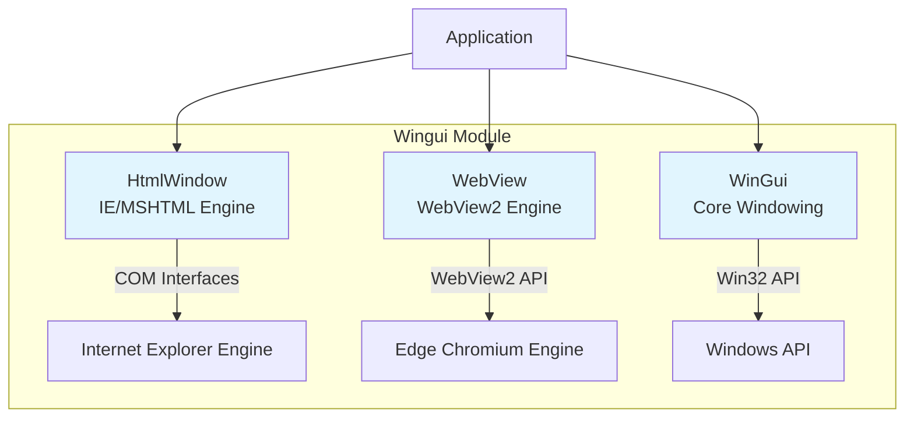
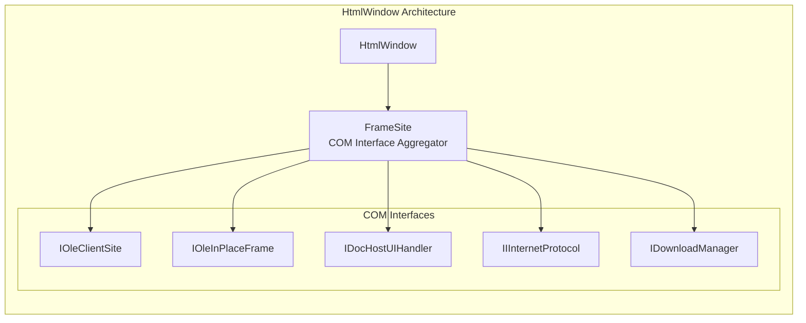
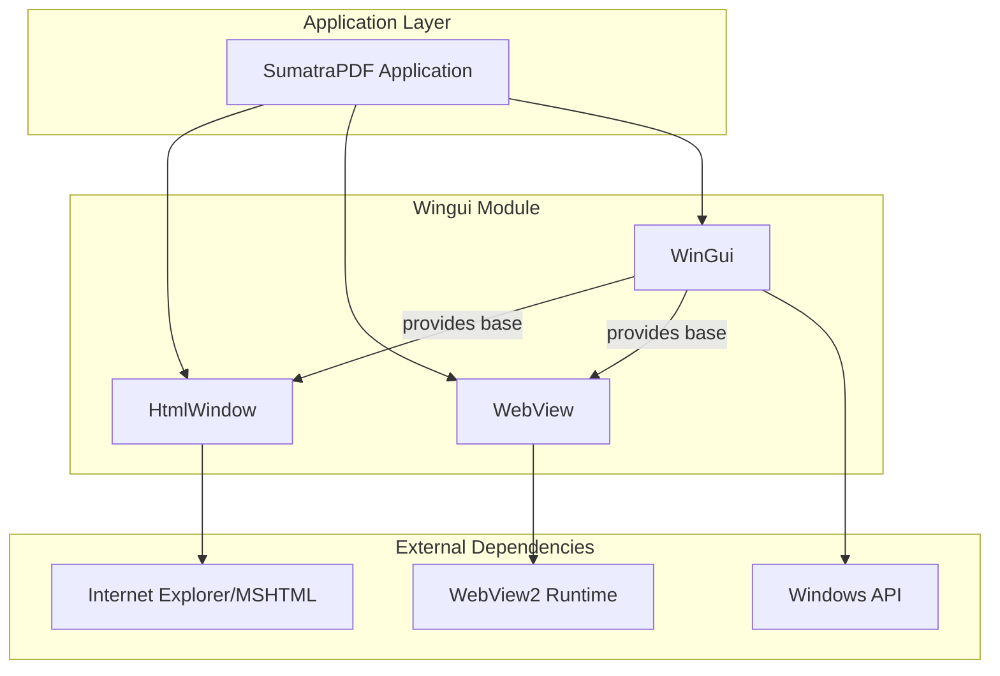

# Wingui Module Documentation

## Overview

The `wingui` module is a comprehensive Windows GUI framework that provides a high-level abstraction layer over the Windows API for creating rich desktop applications. It serves as the primary UI foundation for SumatraPDF, offering both traditional Win32 controls and modern web-based rendering capabilities.

## Architecture

## Core Components

### 1. HtmlWindow (HTML Rendering Engine)

The `HtmlWindow` component provides embedded HTML rendering capabilities using Internet Explorer's MSHTML engine through COM interfaces. It's specifically designed for displaying CHM documents and HTML content with custom protocol handling.

**Key Features:**
- Custom protocol handler (`its://`) for CHM document support
- In-memory HTML rendering without temporary files
- Navigation control and event handling
- Screenshot capabilities for document thumbnails
- Zoom and print functionality

**Architecture:**

**Detailed Documentation:** [HtmlWindow.md](HtmlWindow.md)

### 2. WebView (Modern Web Engine)

The `WebView` component provides modern web rendering capabilities using Microsoft's WebView2 control, which is based on the Edge Chromium engine.

**Key Features:**
- Modern HTML5/CSS3/JavaScript support
- WebView2 integration with message handling
- Permission management for web content
- JavaScript execution capabilities

**Detailed Documentation:** [WebView.md](WebView.md)

### 3. WinGui (Core Windowing Framework)

The `WinGui` component provides the foundational windowing system and UI controls for the application.

**Key Features:**
- Base window class with message handling
- Common controls (buttons, edit boxes, lists, etc.)
- Layout management system
- Event handling and callbacks
- Tooltip system

**Detailed Documentation:** [WinGui.md](WinGui.md)

## Module Relationships

## Usage Patterns

### HTML Content Display
For displaying CHM documents or HTML content, use `HtmlWindow`:
- Provides custom protocol handling for embedded resources
- Supports navigation history (back/forward)
- Includes print and zoom functionality
- Handles CHM-specific requirements

### Modern Web Content
For modern web applications or HTML5 content, use `WebView`:
- Full modern web standards support
- Better performance and security
- JavaScript integration capabilities

### Native UI Controls
For traditional Windows UI, use `WinGui` controls:
- Native look and feel
- Standard Windows behavior
- Accessibility support

## Integration with Other Modules

The `wingui` module integrates with several other system modules:

- **[utils](utils.md)**: Provides utility functions for file operations, string handling, and Windows API wrappers
- **[engines](engines.md)**: Document engines use HtmlWindow for displaying HTML-based content
- **[ui_components](ui_components.md)**: Higher-level UI components build upon wingui foundations

## Technical Considerations

### Threading Model
- All UI operations must occur on the main UI thread
- COM initialization required for HtmlWindow
- WebView2 requires proper apartment threading

### Memory Management
- COM objects follow standard reference counting
- Window objects managed through WndList for safe destruction
- Automatic cleanup on window destruction

### Performance
- HtmlWindow uses IE's rendering engine (limited performance)
- WebView2 provides better performance for modern content
- WinGui controls are lightweight and efficient

## Security Considerations

- HtmlWindow runs in IE's security context
- WebView2 provides better security isolation
- Custom protocol handlers validated for security
- Download management controlled through callbacks

## Future Considerations

The module is designed to support both legacy (HtmlWindow) and modern (WebView) web content rendering, allowing applications to migrate from IE-based rendering to modern Chromium-based rendering as needed.