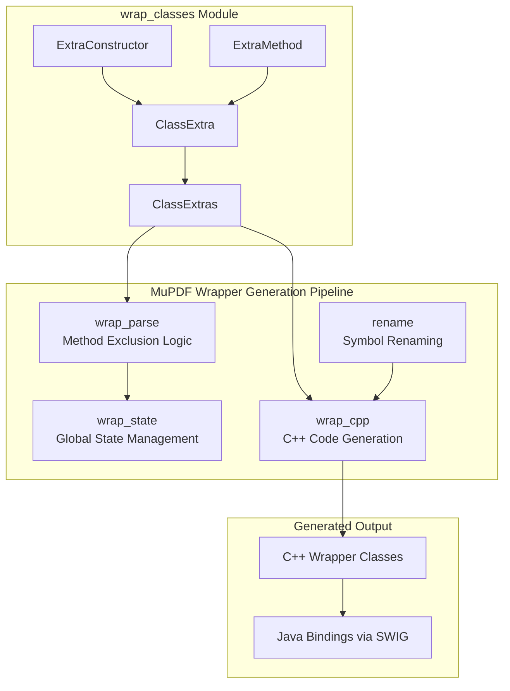
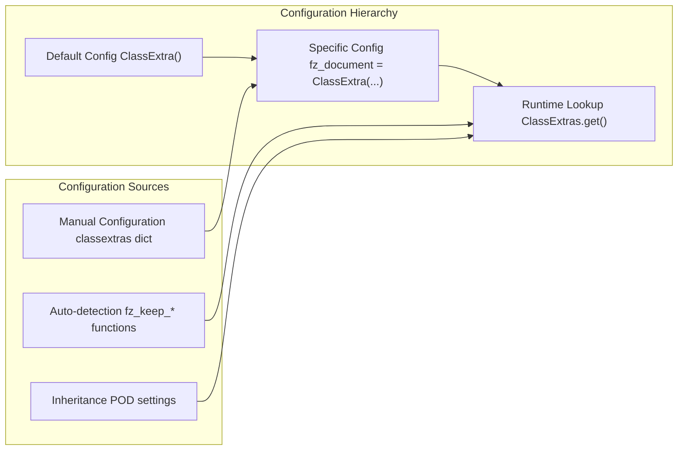
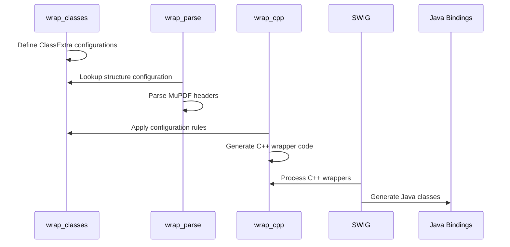

# wrap_classes Module Documentation

## Introduction

The `wrap_classes` module is a core component of the MuPDF Java bindings generation system. It provides a sophisticated configuration and customization framework for automatically generating C++ wrapper classes from MuPDF's C structures. This module enables fine-grained control over how MuPDF's low-level C API is exposed as object-oriented C++ classes, which are then used to create Java bindings through SWIG.

The module serves as the central configuration repository that defines how each MuPDF structure should be wrapped, what constructors should be generated, which methods should be exposed, and how memory management should be handled.

## Architecture Overview



## Core Components

### ExtraConstructor Class

The `ExtraConstructor` class defines custom constructors for generated C++ wrapper classes. It allows specification of constructor signatures, implementation bodies, and documentation comments.

**Key Features:**
- Custom constructor parameter lists
- Implementation code generation
- Documentation comment support
- Integration with MuPDF's C API functions

### ExtraMethod Class

The `ExtraMethod` class represents additional methods to be added to generated wrapper classes beyond those automatically created from MuPDF function wrappers.

**Key Features:**
- Custom method signatures and return types
- Implementation body specification
- Overload support
- Documentation generation

### ClassExtra Class

The `ClassExtra` class is the central configuration object that controls all aspects of how a specific MuPDF structure is wrapped into a C++ class.

**Key Configuration Options:**
- **Memory Management**: POD vs pointer-based wrapping
- **Constructor Generation**: Default, raw, and custom constructors
- **Method Wrapping**: Which MuPDF functions to expose as methods
- **Iterator Support**: Linked list iteration capabilities
- **Virtual Function Pointers**: Callback mechanism support
- **Copy Semantics**: Copyable vs non-copyable classes

### ClassExtras Container

The `ClassExtras` class acts as a registry and factory for `ClassExtra` configurations, providing lookup and default creation capabilities for any MuPDF structure.

## Configuration System Architecture



## Key Configuration Patterns

### 1. POD (Plain Old Data) Wrapping

```python
fz_matrix = ClassExtra(
    pod='inline',  # Members directly in class
    constructor_raw=True,
    method_wrappers_static=['fz_concat', 'fz_scale']
)
```

### 2. Reference-Counted Pointer Wrapping

```python
fz_document = ClassExtra(
    constructor_raw='default',
    constructor_prefixes=['fz_open_document'],
    method_wrappers=['fz_load_outline'],
    copyable=True  # Uses fz_keep_document()
)
```

### 3. Virtual Function Pointer Support

```python
fz_device = ClassExtra(
    virtual_fnptrs=dict(
        self_=lambda name: f'(*({rename.class_("fz_device")}2**) ({name} + 1))',
        alloc=textwrap.dedent(...),
    ),
    constructor_raw=True
)
```

### 4. Iterator-Enabled Classes

```python
fz_outline = ClassExtra(
    accessors=True,
    iterator_next=('', ''),  # Self is first element
)
```

## Integration with MuPDF Java Bindings

The `wrap_classes` module integrates with the broader MuPDF Java bindings system:



## Memory Management Strategies

The module supports multiple memory management approaches:

### 1. Inline POD Structures
- Structure members are directly embedded in the wrapper class
- No separate allocation required
- Copyable by default
- Example: `fz_matrix`, `fz_rect`

### 2. Pointer-Based with Reference Counting
- Wrapper holds pointer to MuPDF structure
- Automatic memory management via `fz_keep_*`/`fz_drop_*` functions
- Copyable if reference counting functions exist
- Example: `fz_document`, `fz_page`

### 3. Custom Allocation Strategies
- Virtual function pointer classes with custom allocation
- Complex lifecycle management
- Callback integration
- Example: `fz_device`, `fz_output`

## Constructor Generation Patterns

### Automatic Constructor Discovery

```python
constructor_prefixes = ['fz_new_', 'fz_open_']
# Automatically finds and wraps all fz_new_* and fz_open_* functions
```

### Manual Constructor Definition

```python
constructors_extra = [
    ExtraConstructor(
        '(const char* filename)',
        '''
        {
            m_internal = fz_open_document(filename);
        }
        ''',
        '/* Opens document from file */'
    )
]
```

### Enum-Based Constructor Differentiation

```python
class_top = '''
enum PathType {
    PathType_PDF,
    PathType_SVG,
    PathType_CBZ
};
'''
constructors_extra = [
    ExtraConstructor('(const char* path, PathType type)', ...)
]
```

## Error Handling and Safety

The module incorporates several safety mechanisms:

1. **Automatic Reference Counting**: Detects and uses `fz_keep_*` functions
2. **Constructor Exclusion**: Prevents problematic constructor generation
3. **Copy Semantics Validation**: Ensures proper copy behavior
4. **Memory Ownership Transfer**: Handles output stream ownership correctly

## Dependencies

The `wrap_classes` module depends on several other components in the MuPDF wrapper system:

- **[jlib](jlib.md)**: Logging and utility functions
- **[rename](rename.md)**: Symbol name transformation
- **[state](wrap_state.md)**: Global state and enum management
- **[util](util.md)**: String manipulation utilities

## Usage Examples

### Basic Configuration

```python
# Simple POD structure
fz_point = ClassExtra(
    pod='inline',
    constructor_raw=True,
    method_wrappers_static=['fz_transform_point']
)
```

### Complex Class with Multiple Constructors

```python
fz_document_writer = ClassExtra(
    class_top='enum OutputType { PDF, SVG, CBZ };',
    constructors_extra=[
        ExtraConstructor('(const char* path, OutputType type)', ...),
        ExtraConstructor('(fz_output& output, const char* options)', ...)
    ],
    constructor_excludes=['fz_new_pdf_writer']  # Exclude specific functions
)
```

### Virtual Function Pointer Class

```python
fz_device = ClassExtra(
    virtual_fnptrs=dict(
        self_=lambda name: f'(*({rename.class_("fz_device")}2**) ({name} + 1))',
        alloc=textwrap.dedent('''
            m_internal = fz_new_device_of_size(
                sizeof(*m_internal) + sizeof(fz_device2*)
            );
            *((fz_device2**) (m_internal + 1)) = this;
        '''),
    ),
    constructor_raw=True
)
```

## Extensibility

The module is designed for extensibility through:

1. **Custom Method Addition**: `methods_extra` for arbitrary methods
2. **Post-Generation Code**: `extra_cpp` for additional implementation
3. **Class Customization**: `class_top`, `class_bottom` for member variables
4. **Iterator Support**: `iterator_next` for container-like behavior

This comprehensive configuration system enables the automatic generation of high-quality C++ bindings that provide natural object-oriented interfaces to MuPDF's C API while maintaining proper memory management and error handling.