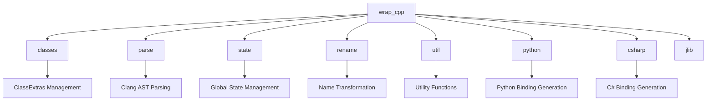
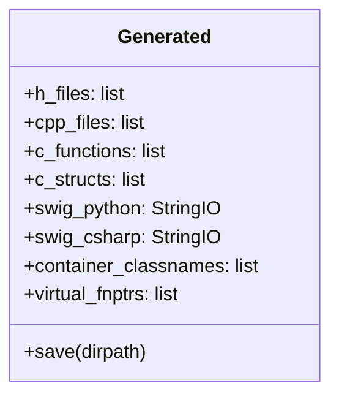
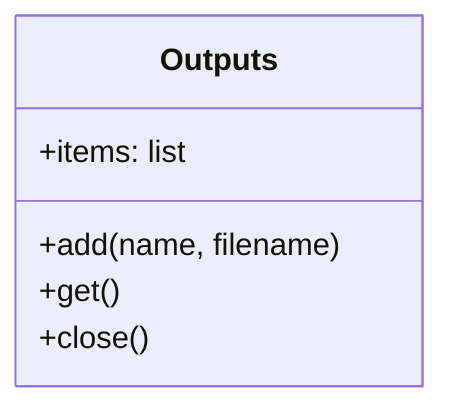
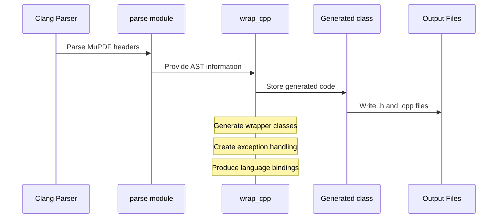
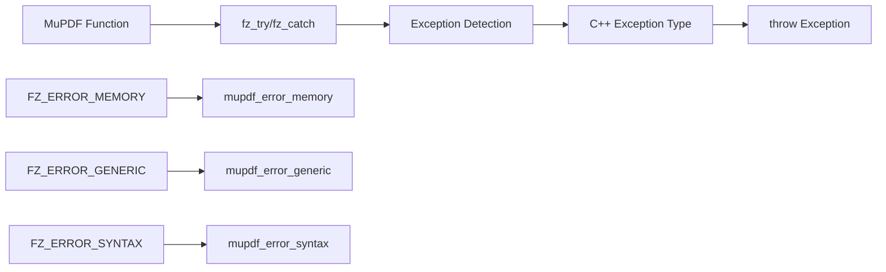
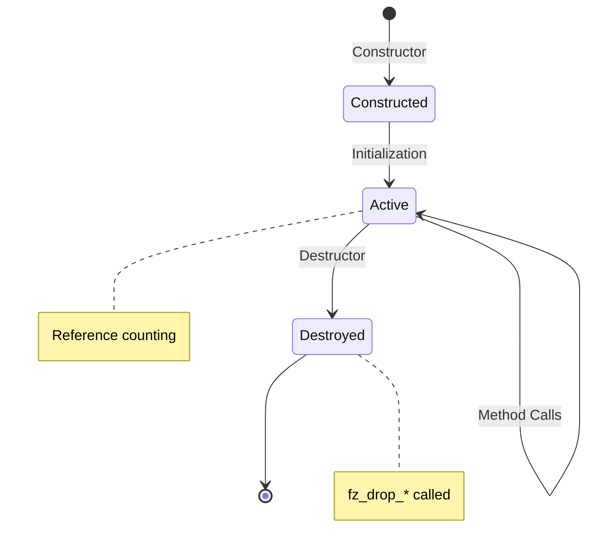
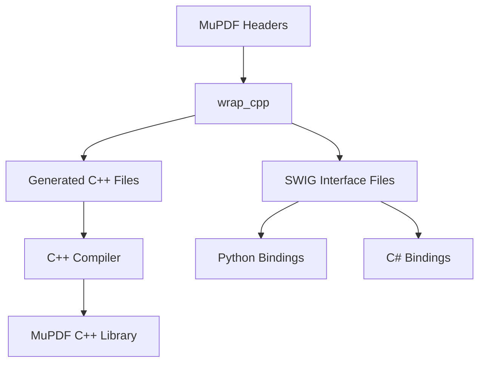

# wrap_cpp Module Documentation

## Overview

The `wrap_cpp` module is a core component of the MuPDF C++ binding generation system. It provides the functionality to automatically generate C++ wrapper code, Python bindings, and C# bindings for the MuPDF C library. This module is responsible for creating object-oriented interfaces that wrap the procedural C API of MuPDF.

## Purpose and Core Functionality

The primary purpose of the `wrap_cpp` module is to:

1. **Generate C++ Wrapper Classes**: Create C++ classes that wrap MuPDF's C structures and functions
2. **Create Language Bindings**: Generate Python and C# bindings through SWIG integration
3. **Provide Exception Safety**: Convert MuPDF's error handling (fz_try/fz_catch) to C++ exceptions
4. **Memory Management**: Handle reference counting and memory management automatically
5. **Type Safety**: Provide type-safe interfaces for MuPDF operations

## Architecture and Component Relationships

### Module Dependencies



### Core Components

#### 1. Generated Class

The `Generated` class serves as the central data structure for storing all generated code and metadata:



#### 2. Outputs Class

Manages multiple output streams for different generated files:



## Key Functions and Their Roles

### Core Generation Functions

#### `cpp_source()`
- **Purpose**: Main entry point for generating all C++ source files
- **Responsibilities**:
  - Parse MuPDF headers using Clang
  - Generate wrapper classes, functions, and exceptions
  - Create output files (.h and .cpp)
  - Handle regression testing

#### `function_wrapper()`
- **Purpose**: Generates low-level C++ wrapper functions
- **Key Features**:
  - Converts fz_try/fz_catch to C++ exceptions
  - Handles function parameters and return types
  - Supports variadic functions (with limitations)

#### `function_wrapper_class_aware()`
- **Purpose**: Creates class-aware wrapper functions and methods
- **Special Features**:
  - Generates both static and instance methods
  - Handles constructor and destructor wrapping
  - Manages out-parameters for multiple return values

#### `class_wrapper()`
- **Purpose**: Generates complete C++ wrapper classes for MuPDF structs
- **Capabilities**:
  - Creates constructors, destructors, and methods
  - Handles POD (Plain Old Data) and non-POD types
  - Implements iterators for container classes
  - Manages reference counting

### Utility Functions

#### `declaration_text()`
- **Purpose**: Converts Clang type information to C++ declaration strings
- **Handles**:
  - Arrays, pointers, and references
  - Function types and typedefs
  - Const qualifiers and namespaces

#### `write_call_arg()`
- **Purpose**: Generates code for function call arguments
- **Features**:
  - Translates between wrapper classes and raw pointers
  - Handles "this" pointer optimization
  - Supports both C++ and Python code generation

#### `make_fncall()`
- **Purpose**: Generates complete function calls with exception handling
- **Includes**:
  - fz_context management
  - fz_try/fz_catch blocks
  - Error tracing and diagnostics
  - Return value handling

## Data Flow Architecture



## Exception Handling Integration

The module integrates MuPDF's error handling with C++ exceptions:



## Memory Management Strategy

### Reference Counting
- Automatic reference counting for MuPDF objects
- Integration with fz_keep_* and fz_drop_* functions
- Thread-safe reference tracking

### Wrapper Class Lifecycle


## Multi-Language Support

### Python Bindings
- SWIG integration for Python wrappers
- Automatic out-parameter handling
- Exception translation to Python exceptions

### C# Bindings  
- SWIG integration for .NET compatibility
- Similar wrapper patterns as Python
- Memory management integration

## Integration with Build System

The module integrates with the overall MuPDF build system:



## Configuration and Customization

### Class Extras System
The module supports extensive customization through the `classes` module:
- Custom constructors and destructors
- Additional methods and operators
- Iterator support for container classes
- Virtual function pointer support for callbacks

### Runtime Configuration
- Debug tracing via environment variables
- Reference counting validation
- Exception tracing and diagnostics

## Performance Considerations

### Optimization Features
- Inline function generation where appropriate
- Minimal overhead wrapper classes
- Efficient parameter passing
- Thread-local context management

### Memory Efficiency
- POD wrapper optimization
- Reference counting minimization
- Smart pointer integration

## Error Handling and Diagnostics

### Runtime Diagnostics
- Function call tracing
- Reference count validation
- Exception stack tracking
- Memory leak detection

### Build-Time Validation
- Clang AST validation
- Type compatibility checking
- Function signature verification

## Usage Examples

### Basic Wrapper Generation
```python
# The module automatically generates wrappers like:
class Document {
public:
    Document(const char* filename);
    ~Document();
    Page load_page(int number);
    // ... other methods
};
```

### Exception Handling
```cpp
// Generated code converts MuPDF errors to C++ exceptions
try {
    auto doc = mupdf::open_document("file.pdf");
} catch (const mupdf::error& e) {
    std::cerr << "Error: " << e.what() << std::endl;
}
```

## Relationship to Other Modules

### [wrap_classes.md](wrap_classes.md)
Provides the configuration system for customizing wrapper class generation, including extra methods, constructors, and special handling for specific MuPDF types.

### [wrap_parse.md](wrap_parse.md)  
Handles the Clang-based parsing of MuPDF headers, providing the AST analysis that drives the wrapper generation process.

### [wrap_state.md](wrap_state.md)
Manages global state and configuration for the wrapper generation system, including function lookup and type information.

### [wrap_python.md](wrap_python.md) and [wrap_csharp.md](wrap_csharp.md)
Provide language-specific binding generation for Python and C# respectively, building on the C++ wrappers generated by this module.

## Conclusion

The `wrap_cpp` module is the cornerstone of MuPDF's multi-language binding system. It provides a sophisticated code generation framework that transforms MuPDF's C API into modern, type-safe C++ interfaces while maintaining compatibility with multiple programming languages. The module's architecture supports extensive customization, robust error handling, and efficient memory management, making it suitable for production use in document processing applications.