# wrap_main Module Documentation

## Overview

The `wrap_main` module is the core entry point and orchestrator for the MuPDF wrapper generation system. It serves as the main command-line interface for building C++, Python, and C# language bindings for the MuPDF library, providing a comprehensive wrapper generation framework that transforms the native C API into higher-level, object-oriented interfaces.

## Purpose and Core Functionality

The primary purpose of the `wrap_main` module is to:

1. **Generate Language Bindings**: Create C++, Python, and C# wrappers for the MuPDF C API
2. **Automate Build Processes**: Orchestrate the complex build pipeline involving multiple tools (Clang, SWIG, compilers)
3. **Provide Cross-Platform Support**: Handle platform-specific build requirements for Windows, Linux, and macOS
4. **Manage Dependencies**: Coordinate between different MuPDF components and external tools
5. **Enable Testing**: Provide comprehensive testing capabilities for generated bindings

## Architecture and Component Relationships

### High-Level Architecture

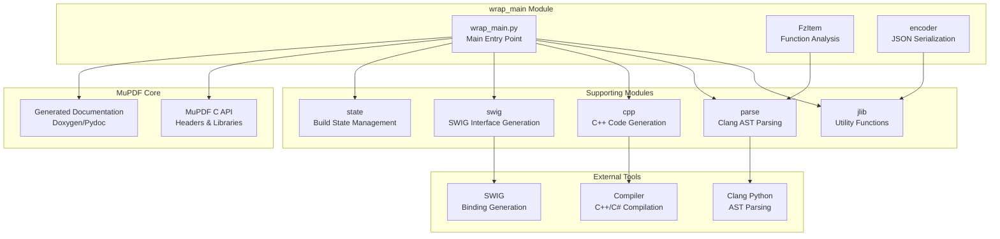

### Build Process Flow

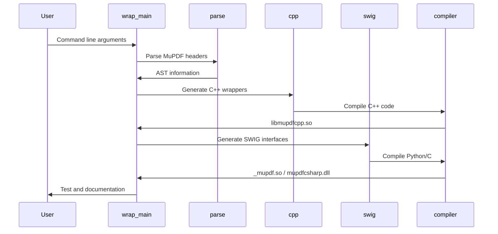

## Core Components

### FzItem Class

The `FzItem` class represents a MuPDF function or structure element for analysis and wrapper generation.

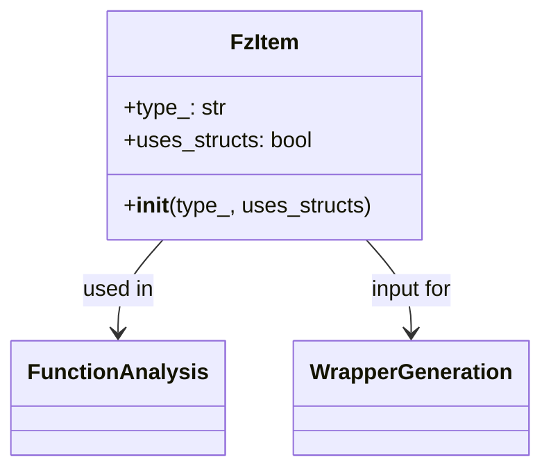

**Purpose**: Encapsulates information about MuPDF API elements during the parsing phase

**Key Attributes**:
- `type_`: Specifies whether the item is a 'function' or other type
- `uses_structs`: Boolean indicating if the function uses MuPDF structures

### encoder Class

The `encoder` class provides JSON serialization capabilities for wrapper configuration data.

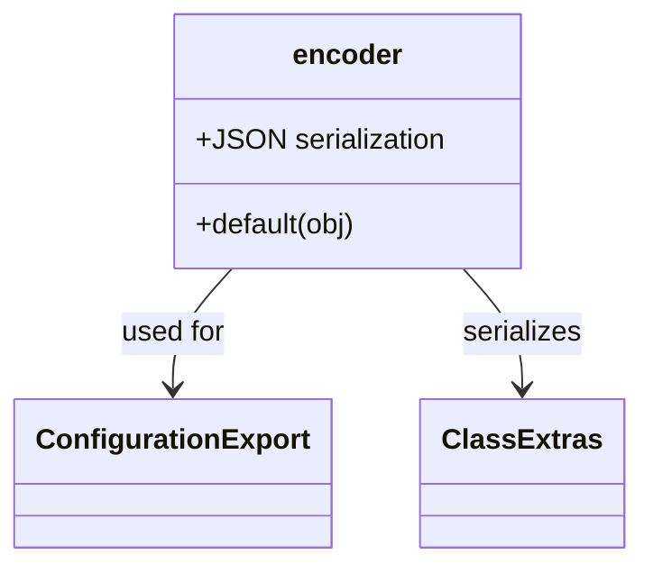

**Purpose**: Handles serialization of complex wrapper configuration objects to JSON format

**Key Features**:
- Custom serialization for Extra* and ClassExtra* objects
- Handles callable objects and complex data structures
- Used for debugging and configuration persistence

## Build System Integration

### Module Dependencies

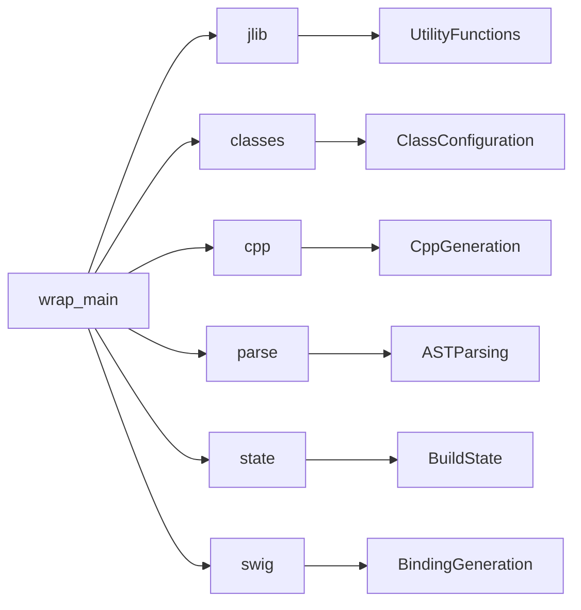

### Platform-Specific Build Process

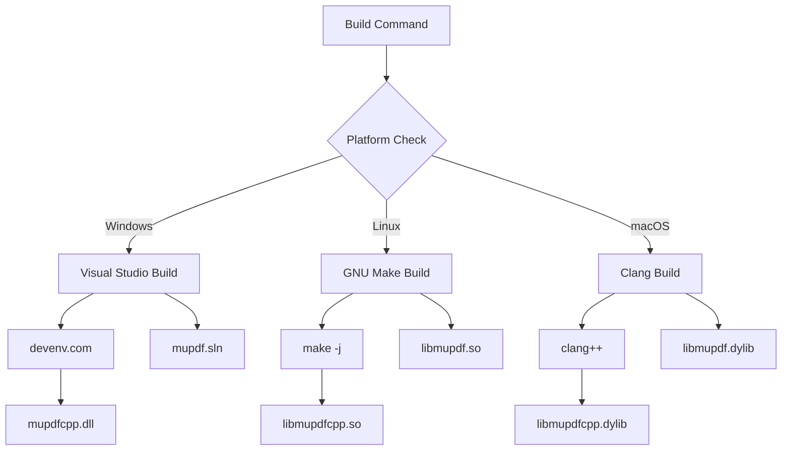

## Command-Line Interface

### Primary Build Actions

The module supports a comprehensive set of build actions through the `-b` flag:

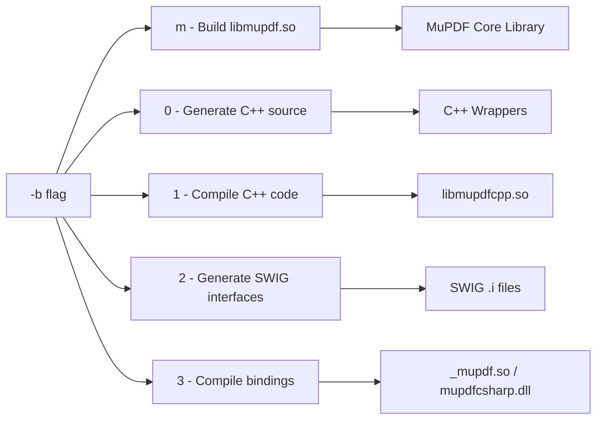

### Configuration Options

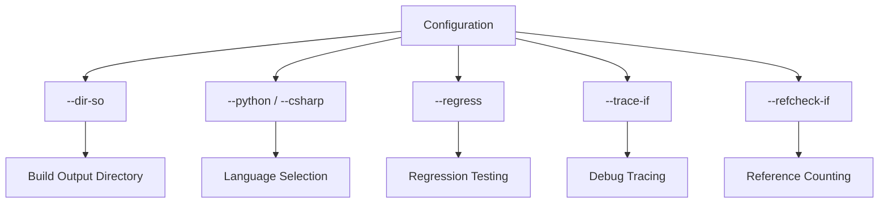

## Wrapper Generation Process

### C++ Wrapper Architecture

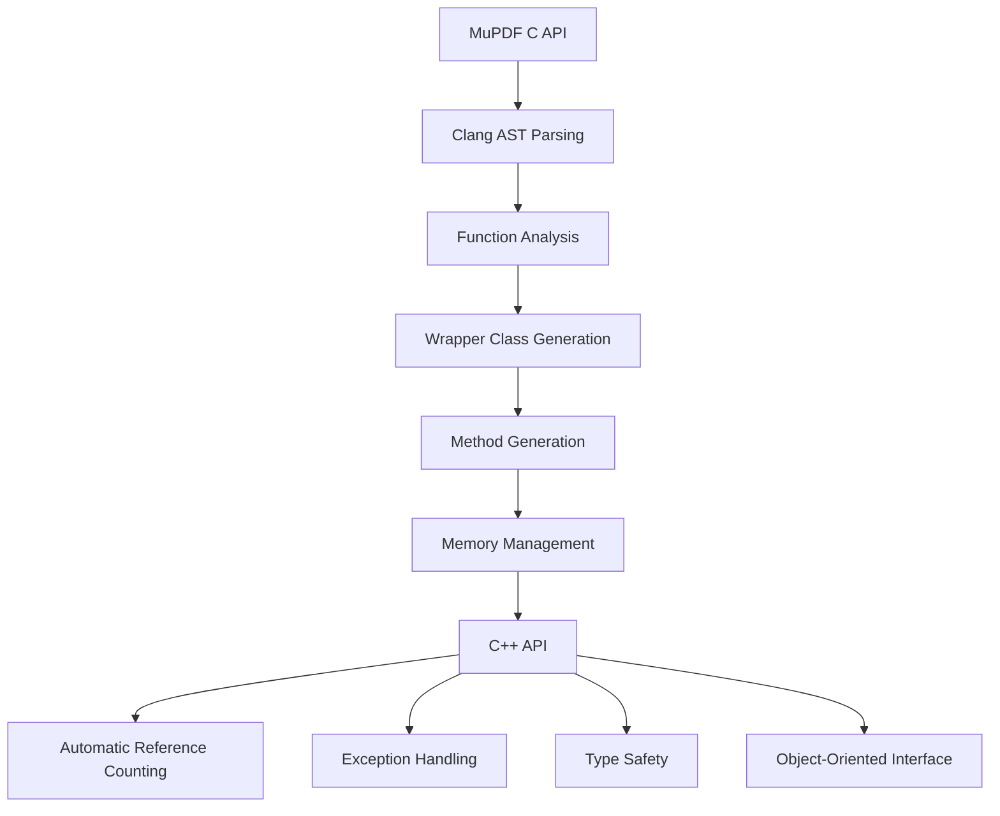

### Python Binding Generation

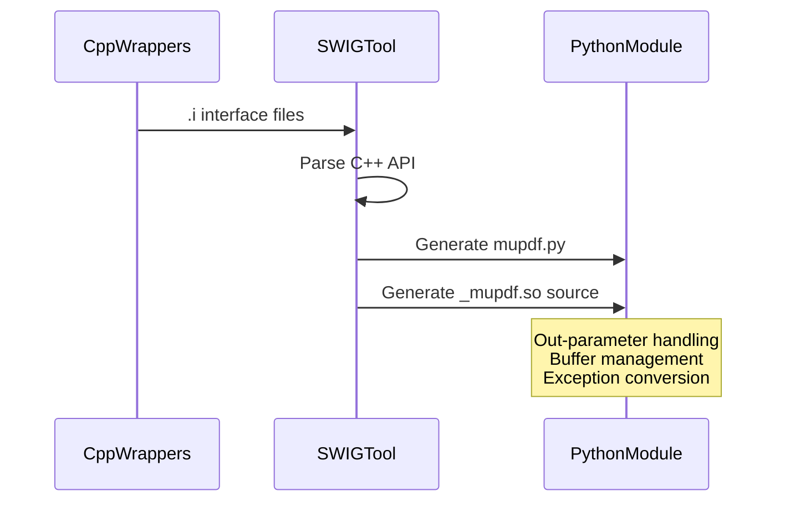

## Testing and Validation

### Test Infrastructure

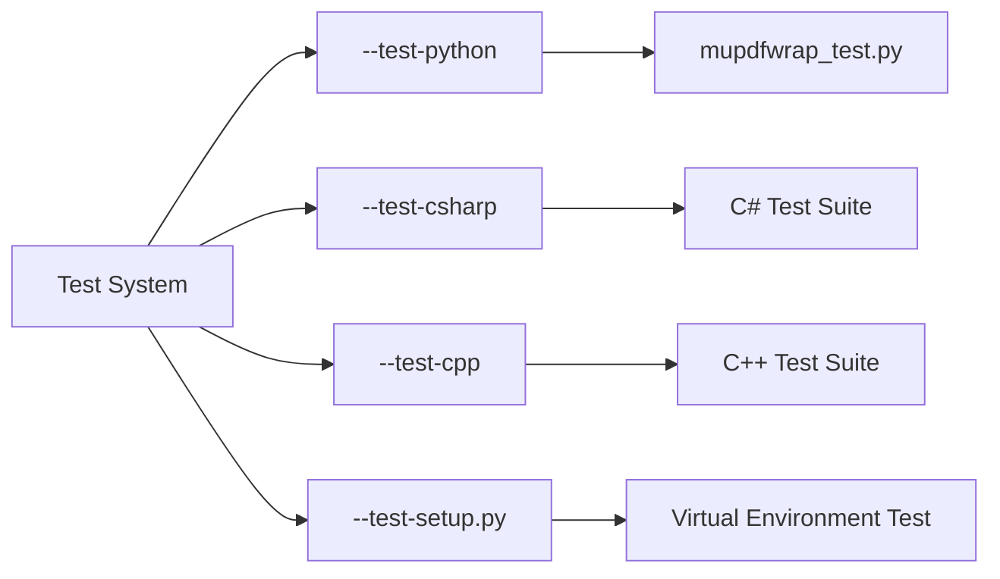

### Quality Assurance

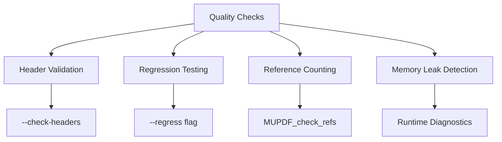

## Documentation Generation

### Multi-Language Documentation

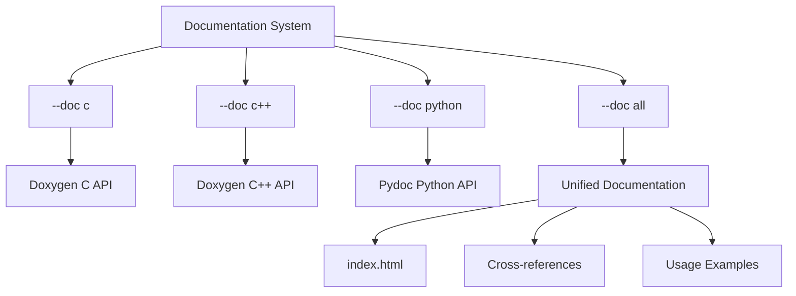

## Integration with MuPDF Ecosystem

### Related Module Dependencies

The `wrap_main` module integrates with several other modules in the MuPDF ecosystem:

- **[mupdf_java_bindings](mupdf_java_bindings.md)**: Provides Java language bindings using similar wrapper generation techniques. The Java bindings share the same underlying MuPDF C API but target a different language runtime.
- **[mupdf_wrap_scripts](mupdf_wrap_scripts.md)**: Contains supporting scripts and utilities for the wrapper generation process. The `jlib` module provides essential utility functions used throughout the build process.
- **[metadata](metadata.md)**: Handles metadata structures used in document processing. The wrapper generation process needs to understand these structures to create appropriate language bindings.
- **[gumbo_parser](gumbo_parser.md)**: HTML parsing capabilities for document processing. While not directly used in wrapper generation, it's part of the broader MuPDF processing pipeline.

### Data Flow Integration

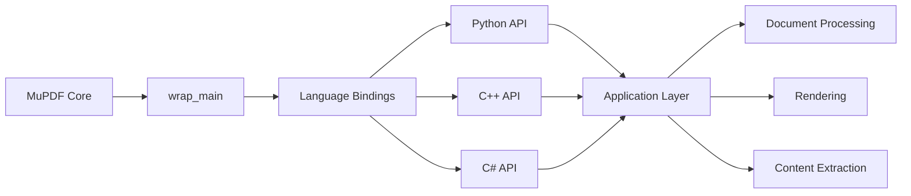

### Cross-Module Communication

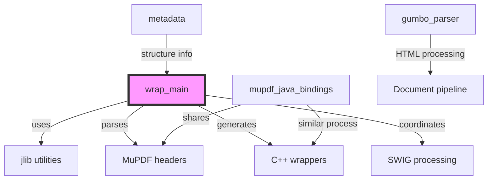

## Technical Implementation Details

### Build Process State Machine

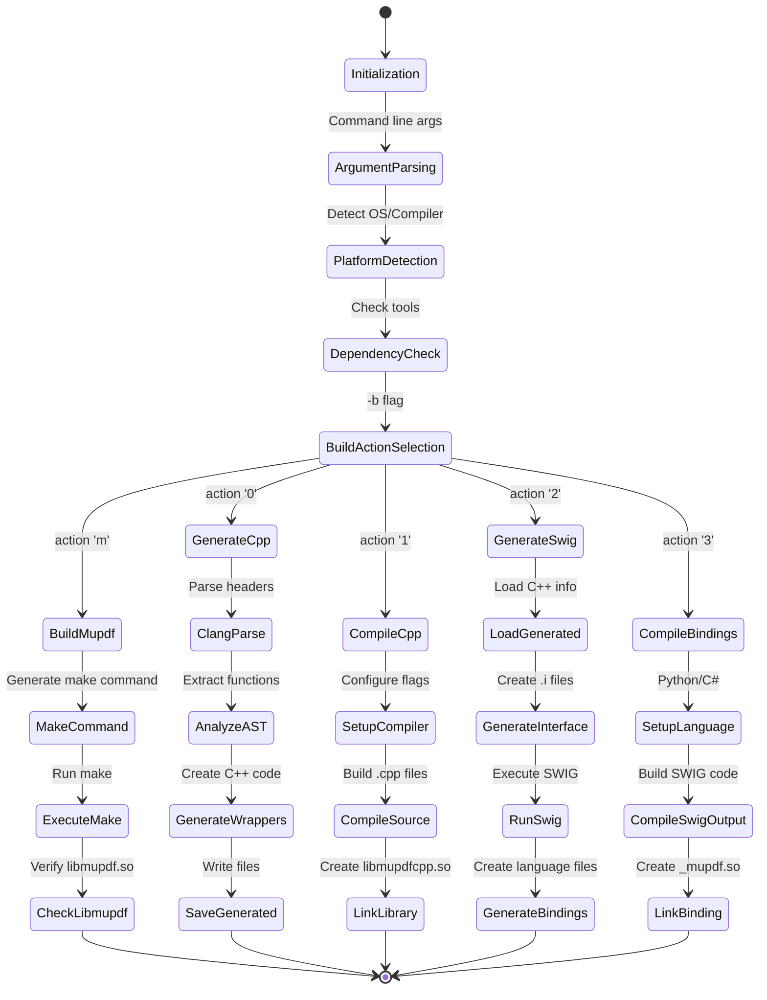

### Memory Management Architecture

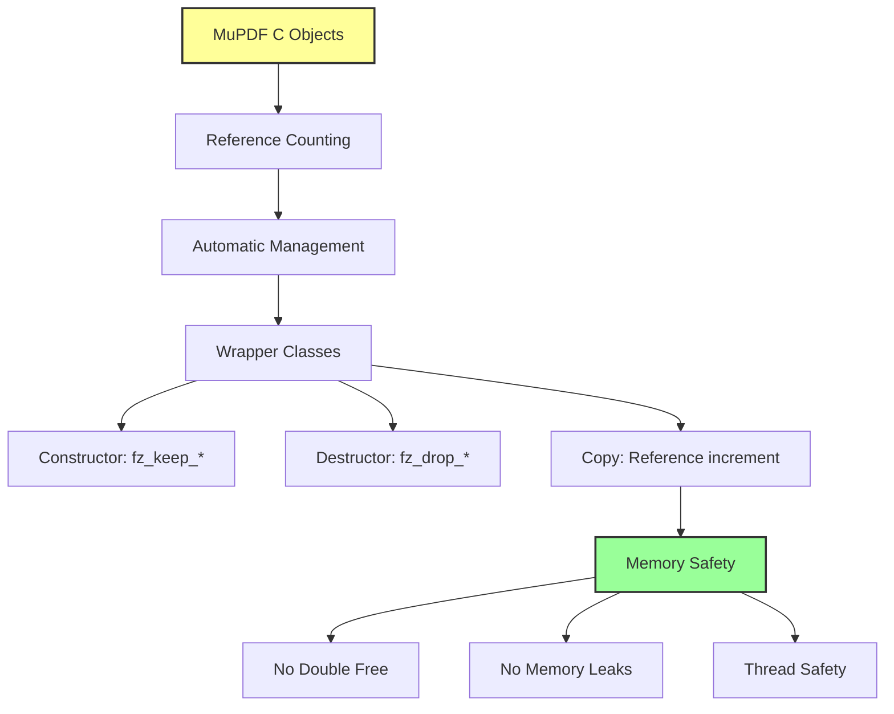

### Cross-Platform Build Strategy

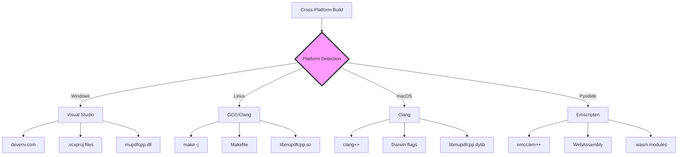

### Runtime Diagnostics

The module provides comprehensive diagnostic capabilities through environmental variables:

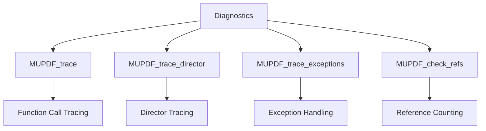

## Usage Examples and Best Practices

### Basic Build Commands

```bash
# Complete build for Python bindings
./scripts/mupdfwrap.py -b all

# Build with specific output directory
./scripts/mupdfwrap.py -d build/shared-debug -b all

# Build only C++ wrappers
./scripts/mupdfwrap.py -b 01

# Build only Python bindings
./scripts/mupdfwrap.py -b 23

# Force rebuild
./scripts/mupdfwrap.py -b all -f
```

### Advanced Configuration

```bash
# Build with regression testing
./scripts/mupdfwrap.py -b all --regress

# Build with custom trace conditions
./scripts/mupdfwrap.py -b all --trace-if '#if 1'

# Build with reference checking
./scripts/mupdfwrap.py -b all --refcheck-if '#ifndef NDEBUG'

# Parallel build with 8 cores
./scripts/mupdfwrap.py -b all -j 8
```

### Testing and Validation

```bash
# Test Python bindings
./scripts/mupdfwrap.py --test-python

# Test C# bindings
./scripts/mupdfwrap.py --test-csharp

# Test with specific PDF file
./scripts/mupdfwrap.py --test-python /path/to/test.pdf

# Generate documentation
./scripts/mupdfwrap.py --doc all
```

### Platform-Specific Examples

#### Windows
```cmd
# Build with Visual Studio
python scripts\mupdfwrap.py -b all

# Build with specific Python version
python scripts\mupdfwrap.py -d build/shared-release-x64-py3.9 -b all
```

#### Linux
```bash
# Standard build
./scripts/mupdfwrap.py -b all

# Debug build
./scripts/mupdfwrap.py -d build/shared-debug -b all
```

#### macOS
```bash
# Build with Apple Clang
./scripts/mupdfwrap.py -b all

# Build with specific architecture
ARCHFLAGS="-arch arm64" ./scripts/mupdfwrap.py -b all
```

### Best Practices

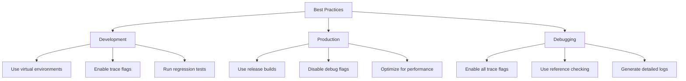

### Troubleshooting Common Issues

```mermaid
graph TD
    A[Common Issues] --> B[Build Failures]
    A --> C[Import Errors]
    A --> D[Runtime Crashes]
    
    B --> E[Check dependencies]
    B --> F[Verify tool versions]
    B --> G[Clean rebuild]
    
    C --> H[Check LD_LIBRARY_PATH]
    C --> I[Verify Python path]
    C --> J[Check architecture match]
    
    D --> K[Enable trace flags]
    D --> L[Check reference counts]
    D --> M[Use debug build]
```

### Build Error Handling

```mermaid
graph LR
    A[Build Errors] --> B[Clang Parsing Errors]
    A --> C[SWIG Generation Errors]
    A --> D[Compilation Errors]
    A --> E[Linking Errors]
    
    B --> F[Detailed Logging]
    C --> G[Error Recovery]
    D --> H[Platform-Specific Handling]
    E --> I[Dependency Resolution]
```

## Performance Considerations

### Build Optimization

```mermaid
graph TB
    A[Performance] --> B[Parallel Building]
    A --> C[Incremental Compilation]
    A --> D[Cache Management]
    A --> E[Memory Optimization]
    
    B --> F[-j <N> flag]
    C --> G[File Timestamp Checking]
    D --> H[Generated Code Caching]
    E --> I[Resource Management]
```

### Runtime Performance

The generated wrappers include several performance optimizations:

- **Reference Counting**: Automatic memory management to prevent leaks
- **Inline Methods**: Critical methods are inlined for performance
- **Exception Optimization**: Efficient exception handling with minimal overhead
- **Buffer Management**: Optimized buffer handling for large documents

## Security Considerations

### Code Generation Security

```mermaid
graph LR
    A[Security] --> B[Input Validation]
    A --> C[Code Injection Prevention]
    A --> D[Memory Safety]
    A --> E[Access Control]
    
    B --> F[Header File Validation]
    C --> G[Safe Code Generation]
    D --> H[Buffer Overflow Protection]
    E --> I[API Access Control]
```

## Future Enhancements

### Planned Features

```mermaid
graph TD
    A[Future Enhancements] --> B[Additional Language Support]
    A --> C[Improved Documentation]
    A --> D[Performance Optimization]
    A --> E[Enhanced Testing]
    
    B --> F[JavaScript Bindings]
    B --> G[Rust Bindings]
    C --> H[Interactive Examples]
    D --> I[JIT Compilation]
    E --> J[Automated Testing]
```

## Conclusion

The `wrap_main` module serves as the central orchestrator for MuPDF's multi-language binding generation system. It provides a robust, extensible framework for creating high-quality language bindings that maintain the performance and functionality of the native MuPDF library while offering modern, object-oriented APIs for different programming languages.

The module's architecture demonstrates sophisticated software engineering practices, including modular design, comprehensive error handling, cross-platform compatibility, and extensive testing capabilities. Its integration with the broader MuPDF ecosystem makes it an essential component for developers seeking to leverage MuPDF's capabilities across different programming environments.

### Key Strengths

1. **Comprehensive Language Support**: Generates bindings for C++, Python, and C# with consistent APIs
2. **Cross-Platform Compatibility**: Supports Windows, Linux, macOS, and WebAssembly builds
3. **Automated Memory Management**: Implements reference counting and automatic cleanup
4. **Extensive Testing**: Provides comprehensive testing and validation capabilities
5. **Documentation Generation**: Automatically generates API documentation for all supported languages
6. **Performance Optimization**: Includes numerous optimizations for runtime performance

### Integration Benefits

The `wrap_main` module seamlessly integrates with other MuPDF components:

- **Shared Core**: Uses the same MuPDF C API as other language bindings
- **Consistent Interface**: Provides uniform APIs across different programming languages
- **Documentation Consistency**: Generates coordinated documentation across all bindings
- **Testing Coordination**: Ensures consistent behavior across language implementations

This comprehensive approach makes MuPDF accessible to developers regardless of their preferred programming language while maintaining the high performance and reliability of the underlying C library.

### Build Optimization

```mermaid
graph TB
    A[Performance] --> B[Parallel Building]
    A --> C[Incremental Compilation]
    A --> D[Cache Management]
    A --> E[Memory Optimization]
    
    B --> F[-j <N> flag]
    C --> G[File Timestamp Checking]
    D --> H[Generated Code Caching]
    E --> I[Resource Management]
```

### Runtime Performance

The generated wrappers include several performance optimizations:

- **Reference Counting**: Automatic memory management to prevent leaks
- **Inline Methods**: Critical methods are inlined for performance
- **Exception Optimization**: Efficient exception handling with minimal overhead
- **Buffer Management**: Optimized buffer handling for large documents

## Security Considerations

### Code Generation Security

```mermaid
graph LR
    A[Security] --> B[Input Validation]
    A --> C[Code Injection Prevention]
    A --> D[Memory Safety]
    A --> E[Access Control]
    
    B --> F[Header File Validation]
    C --> G[Safe Code Generation]
    D --> H[Buffer Overflow Protection]
    E --> I[API Access Control]
```

## Future Enhancements

### Planned Features

```mermaid
graph TD
    A[Future Enhancements] --> B[Additional Language Support]
    A --> C[Improved Documentation]
    A --> D[Performance Optimization]
    A --> E[Enhanced Testing]
    
    B --> F[JavaScript Bindings]
    B --> G[Rust Bindings]
    C --> H[Interactive Examples]
    D --> I[JIT Compilation]
    E --> J[Automated Testing]
```

## Conclusion

The `wrap_main` module serves as the central orchestrator for MuPDF's multi-language binding generation system. It provides a robust, extensible framework for creating high-quality language bindings that maintain the performance and functionality of the native MuPDF library while offering modern, object-oriented APIs for different programming languages.

The module's architecture demonstrates sophisticated software engineering practices, including modular design, comprehensive error handling, cross-platform compatibility, and extensive testing capabilities. Its integration with the broader MuPDF ecosystem makes it an essential component for developers seeking to leverage MuPDF's capabilities across different programming environments.