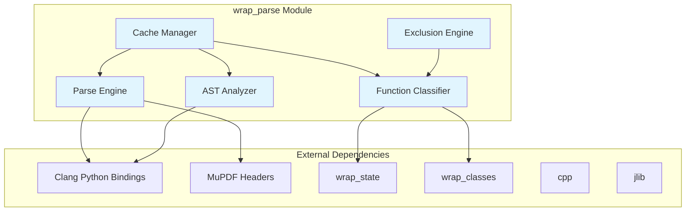
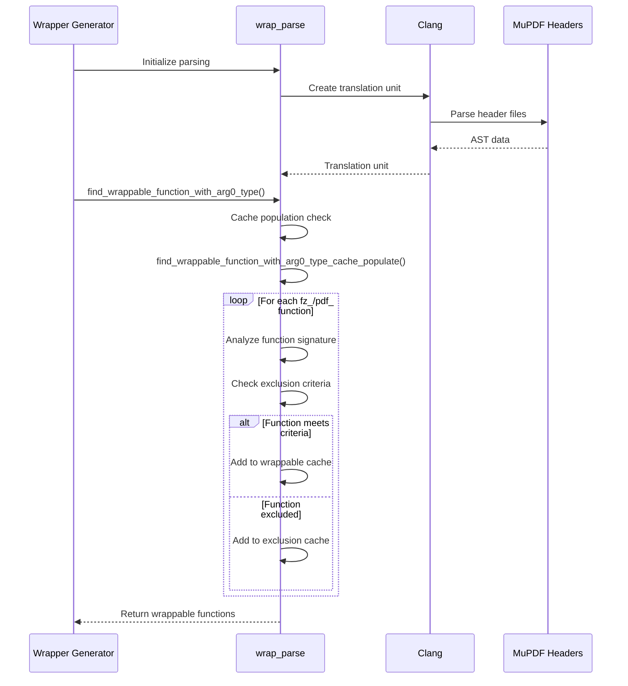
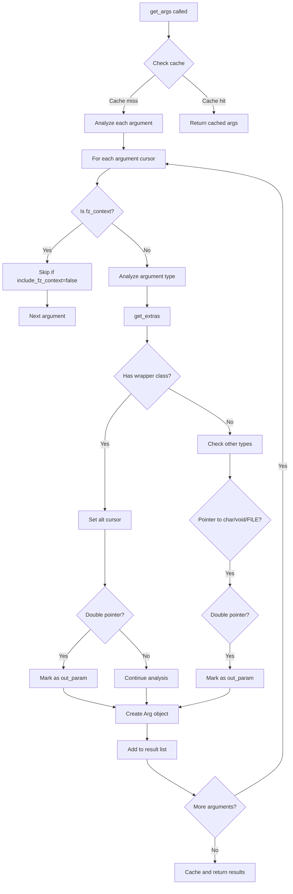
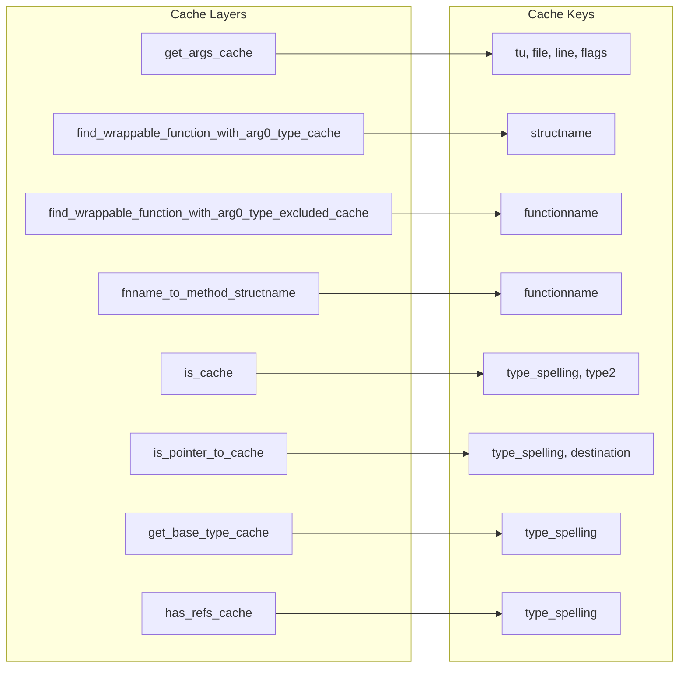
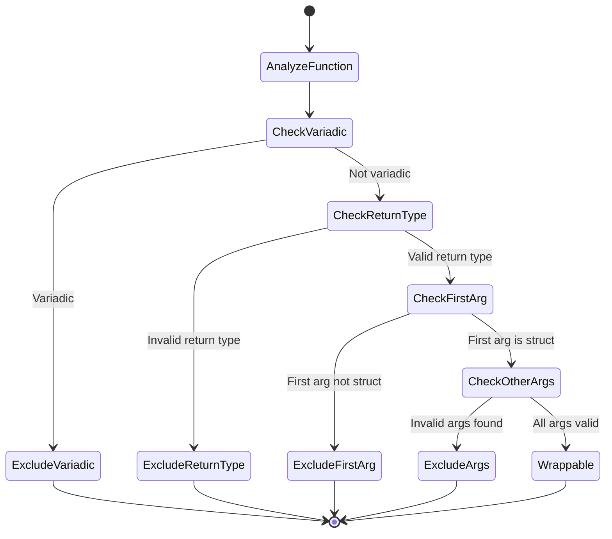
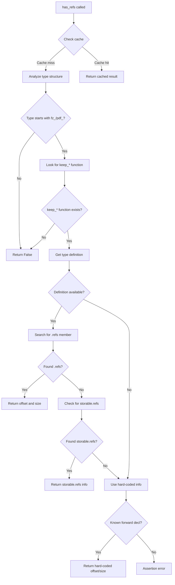

# wrap_parse Module Documentation

## Introduction

The `wrap_parse` module is a critical component of the MuPDF wrapper generation system, responsible for parsing C/C++ header files and analyzing function signatures to determine which functions can be automatically wrapped for language bindings. It uses the Clang Python bindings to perform AST (Abstract Syntax Tree) analysis of MuPDF's header files, identifying wrappable functions based on specific criteria and exclusion rules.

## Module Architecture

### Core Components

The module defines several key enumeration classes that represent reasons why functions might be excluded from automatic wrapping:

- `MethodExcludeReason_VARIADIC`: Functions with variadic arguments
- `MethodExcludeReason_OMIT_CLASS`: Functions from omitted classes
- `MethodExcludeReason_NO_EXTRAS`: Functions lacking wrapper class extras
- `MethodExcludeReason_NO_RAW_CONSTRUCTOR`: Functions whose return types lack raw constructors
- `MethodExcludeReason_NOT_COPYABLE`: Functions returning non-copyable types
- `MethodExcludeReason_NO_WRAPPER_CLASS`: Functions with arguments lacking wrapper classes
- `MethodExcludeReason_ENUM`: Functions related to enum handling
- `MethodExcludeReason_FIRST_ARG_NOT_STRUCT`: Functions whose first argument is not a struct

### System Architecture



## Key Functions and Data Flow

### Function Discovery and Analysis



### Argument Analysis Process



## Integration with Wrapper System

### Module Dependencies

The `wrap_parse` module integrates with several other components of the MuPDF wrapper system:

- **[wrap_state](wrap_state.md)**: Provides global state management and Clang configuration
- **[wrap_classes](wrap_classes.md)**: Defines class extras and wrapper configurations
- **[cpp](wrap_cpp.md)**: Handles C++ code generation and type analysis
- **[jlib](jlib.md)**: Provides logging and utility functions

### Caching Strategy

The module implements sophisticated caching to improve performance:



## Function Classification Logic

### Wrappable Function Criteria

Functions are considered wrappable if they meet all of the following criteria:

1. **Function naming**: Must start with `fz_` or `pdf_`
2. **Not reference management**: Must not be `*_drop_*` or `*_keep_*` functions
3. **Non-variadic**: Must not have variadic arguments
4. **Valid return type**: If returning a fz_/pdf_ struct, the wrapper class must have a raw constructor
5. **Valid arguments**: All fz_/pdf_ arguments must have corresponding wrapper classes
6. **First argument**: First non-context argument must be a fz_/pdf_ struct

### Exclusion Reason Processing



## Type Analysis Capabilities

### Advanced Type Inspection

The module provides sophisticated type analysis functions:

- **`get_base_type()`**: Recursively dereferences pointers to find the ultimate type
- **`get_base_typename()`**: Extracts the base type name, removing qualifiers
- **`is_pointer_to()`**: Determines if a type is a pointer to a specific destination type
- **`has_refs()`**: Analyzes structures to determine if they use reference counting
- **`get_extras()`**: Retrieves wrapper class configuration for types

### Reference Counting Analysis



## Error Handling and Diagnostics

### AST Dumping Capabilities

The module includes comprehensive AST dumping functionality for debugging:

- **`dump_ast()`**: Recursively dumps the entire AST structure
- **`show_ast()`**: Parses and displays AST for a specific file
- **`get_text()`**: Generates diagnostic text for cursor properties

### Logging Integration

All operations integrate with the [jlib](jlib.md) logging system, providing detailed diagnostic information when the `show_details` flag is set for specific function or type names.

## Performance Optimizations

### Caching Strategy

The module implements multiple levels of caching to optimize performance:

1. **Function argument caching**: `get_args_cache` stores analyzed function signatures
2. **Type analysis caching**: Various caches store type inspection results
3. **Function classification caching**: Wrappable function lists are cached by struct name
4. **Reference counting caching**: `has_refs_cache` stores reference counting analysis

### Time Complexity Reduction

Caching reduces processing time significantly:
- Function argument analysis: 3.5s → 2.1s
- Type base analysis: 0.24s → 0.1s
- Pointer type checking: 0.6s → 0.2s

## Usage Examples

### Basic Function Analysis

```python
# Parse MuPDF headers and find wrappable functions
tu = clang.cindex.Index.create().parse(header_file, args=['-I', include_dir])

# Find functions that can be wrapped as methods of a specific class
wrappable_functions = find_wrappable_function_with_arg0_type(tu, 'fz_document')

# Analyze function arguments
for arg in get_args(tu, function_cursor):
    print(f"Argument: {arg.name}, Type: {arg.cursor.type.spelling}")
```

### Type Inspection

```python
# Check if a type uses reference counting
refs_info = has_refs(tu, type_cursor)
if refs_info:
    offset, bits = refs_info
    print(f"Type uses reference counting: offset={offset}, bits={bits}")

# Get base type information
base_type = get_base_type(type_cursor)
base_name = get_base_typename(type_cursor)
```

## Conclusion

The `wrap_parse` module serves as the analytical engine of the MuPDF wrapper generation system. By leveraging Clang's AST parsing capabilities, it provides intelligent analysis of C/C++ code to determine wrappability, manage type information, and optimize the wrapper generation process through sophisticated caching mechanisms. Its integration with other wrapper modules creates a cohesive system for automatically generating language bindings for the MuPDF library.