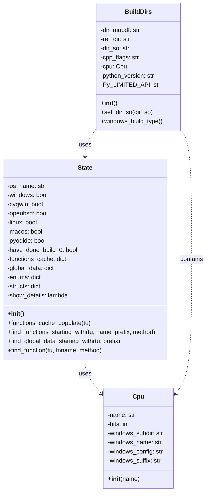
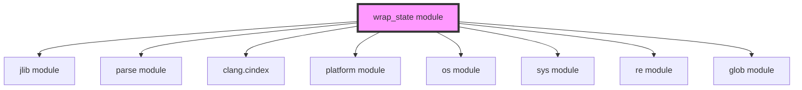
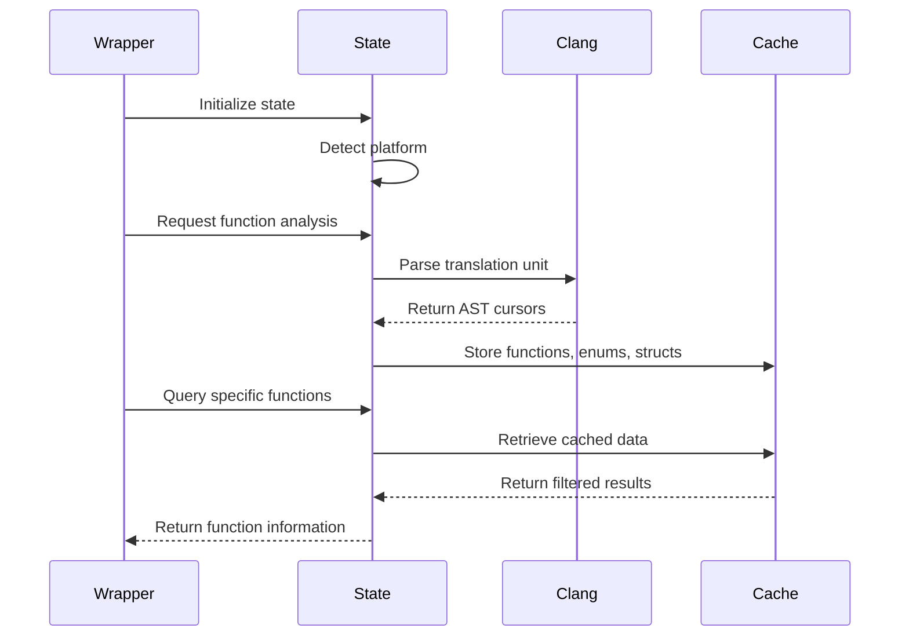
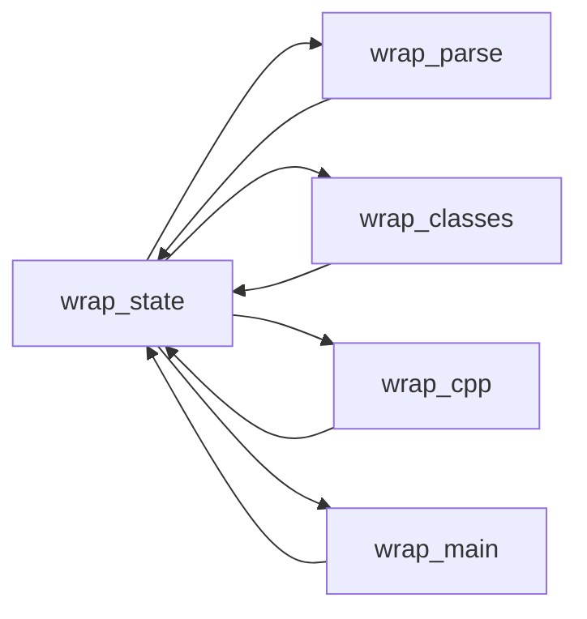

# wrap_state Module Documentation

## Introduction

The `wrap_state` module is a core component of the MuPDF Python binding generation system. It serves as the central state management system for the MuPDF wrapper generation process, providing platform detection, build configuration, and code analysis capabilities. This module acts as the foundation for the entire wrapping system by maintaining global state and providing utilities for parsing and analyzing MuPDF's C API.

## Module Architecture

### Core Components



### Module Dependencies



## Component Details

### State Class

The `State` class is the central state management component that provides:

#### Platform Detection
- **Operating System Detection**: Automatically detects the current OS (Windows, Linux, macOS, OpenBSD, Cygwin, Pyodide)
- **Platform-Specific Configuration**: Sets boolean flags for different platforms to enable conditional behavior

#### Code Analysis and Caching
- **Function Discovery**: Parses translation units to find MuPDF functions and methods
- **Symbol Caching**: Maintains caches for functions, global data, enums, and structs
- **Filtering System**: Implements exclusion lists for functions that should not be wrapped

#### Key Methods

```python
def functions_cache_populate(self, tu)
```
Populates the internal cache with functions, global data, enums, and structs from a translation unit. This method performs the heavy lifting of code analysis using Clang's Python bindings.

```python
def find_functions_starting_with(self, tu, name_prefix, method)
```
Generator that yields functions matching a specific prefix, with optional method filtering.

```python
def find_function(self, tu, fnname, method)
```
Retrieves a specific function cursor from the cache, returning None if not found.

### Supporting Classes

#### Cpu Class
Manages CPU architecture information with platform-specific configurations:
- Architecture detection (32-bit vs 64-bit)
- Windows-specific naming conventions
- Build configuration strings

#### BuildDirs Class
Handles build directory management and configuration:
- MuPDF source directory detection
- Build output directory management
- Compiler flag configuration based on build type
- Python version and CPU architecture inference

## Data Flow Architecture



## Integration with MuPDF Wrapper System

The `wrap_state` module serves as the foundation for the entire MuPDF Python binding generation process:

### Relationship to Other Modules



- **[wrap_parse](wrap_parse.md)**: Uses State for function discovery and analysis
- **[wrap_classes](wrap_classes.md)**: Relies on State for struct and enum information
- **[wrap_cpp](wrap_cpp.md)**: Uses State for build configuration and directory management
- **[wrap_main](wrap_main.md)**: Coordinates all modules through State

## Platform-Specific Behavior

### Windows Support
- Cygwin detection and special handling
- Visual Studio configuration management
- Windows-specific function exclusions
- Path normalization for Windows compatibility

### Cross-Platform Build Management
- Automatic compiler flag selection based on build type (debug/release/memento)
- Platform-specific library naming conventions
- Python version detection and integration

## Configuration and Exclusion System

### Function Exclusions
The module maintains exclusion lists for functions that should not be wrapped:
- **omit_fns**: Functions excluded from wrapping due to implementation issues or platform constraints
- **omit_methods**: Methods specifically excluded from class generation

### Build Configuration
- **Debug builds**: Include debugging symbols and runtime checks
- **Release builds**: Optimized builds with assertions disabled
- **Memento builds**: Special builds with memory debugging enabled

## Error Handling and Logging

The module integrates with the [jlib](jlib.md) logging system to provide:
- Detailed analysis information when `show_details` is enabled
- Warning messages for missing dependencies (e.g., clang.cindex)
- Progress indicators during cache population

## Usage Examples

### Basic State Initialization
```python
from mupdf.scripts.wrap.state import State, BuildDirs

# Initialize global state
state = State()

# Configure build directories
build_dirs = BuildDirs()
build_dirs.set_dir_so('/path/to/build/dir')
```

### Function Discovery
```python
# Populate cache with translation unit data
state.functions_cache_populate(tu)

# Find all functions starting with 'fz_'
for fnname, cursor in state.find_functions_starting_with(tu, 'fz_', method=False):
    print(f"Found function: {fnname}")
```

## Performance Considerations

- **Caching Strategy**: All parsing results are cached to avoid repeated expensive Clang operations
- **Lazy Loading**: Cache population is performed on-demand when first needed
- **Memory Management**: Large translation units are processed incrementally

## Future Considerations

The module is designed to be extensible for:
- Additional platform support
- New MuPDF API versions
- Enhanced code analysis capabilities
- Integration with other build systems

## Related Documentation

- [jlib module](jlib.md) - Logging and utility functions
- [wrap_parse module](wrap_parse.md) - Code parsing and analysis
- [wrap_classes module](wrap_classes.md) - Class generation logic
- [wrap_cpp module](wrap_cpp.md) - C++ code generation
- [wrap_main module](wrap_main.md) - Main wrapper coordination