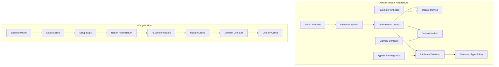
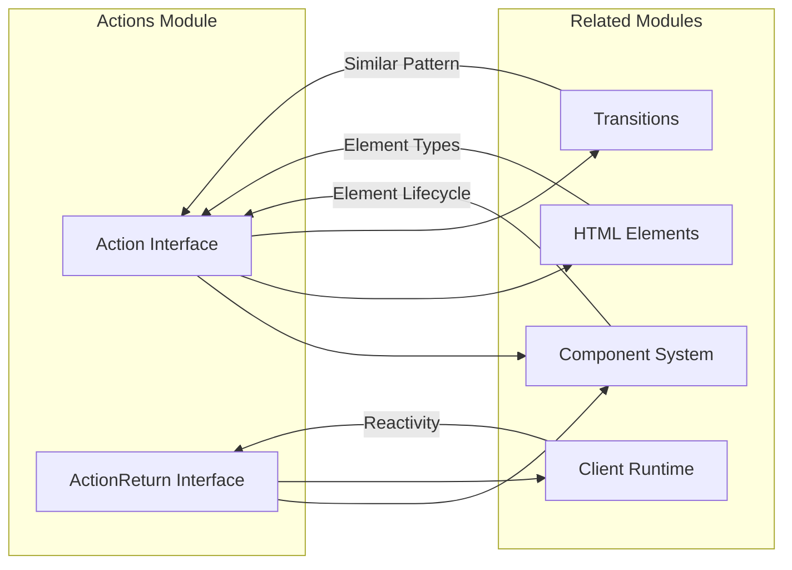
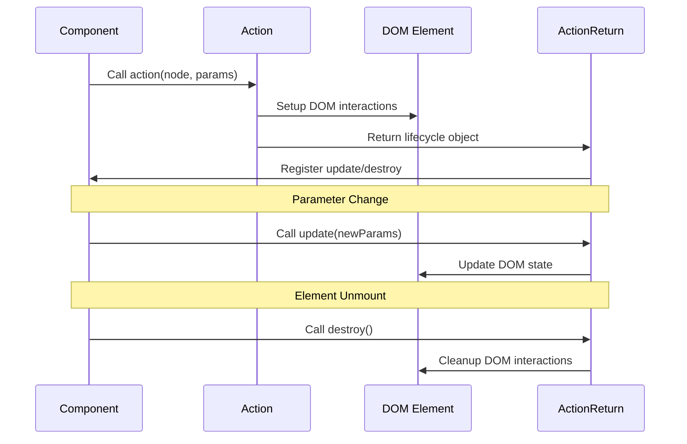

# Actions Module

The Actions module provides a powerful mechanism for extending HTML elements with custom behavior in Svelte applications. Actions are functions that are called when an element is created, allowing developers to add reusable functionality, event listeners, and lifecycle management to DOM elements.

## Overview

Actions in Svelte serve as a bridge between the declarative component model and imperative DOM manipulation. They provide a clean, reusable way to:

- Add custom event listeners and DOM interactions
- Integrate third-party libraries with DOM elements
- Implement complex behaviors that require direct DOM access
- Manage element lifecycle with setup and cleanup logic
- Extend elements with additional attributes and events (TypeScript only)

## Architecture



## Core Components

### Action Interface

The `Action` interface defines the contract for action functions:

```typescript
interface Action<Element, Parameter, Attributes> {
    (node: Element, parameter?: Parameter): void | ActionReturn<Parameter, Attributes>;
}
```

**Key Features:**
- **Generic Element Type**: Constrains which DOM elements the action can be applied to
- **Optional Parameters**: Supports actions with or without configuration parameters
- **Type Safety**: Provides compile-time checking for element compatibility
- **Flexible Return**: Can return void or an ActionReturn object for lifecycle management

### ActionReturn Interface

The `ActionReturn` interface defines the optional object that actions can return:

```typescript
interface ActionReturn<Parameter, Attributes> {
    update?: (parameter: Parameter) => void;
    destroy?: () => void;
    $$_attributes?: Attributes; // TypeScript-only
}
```

**Lifecycle Methods:**
- **update**: Called when action parameters change
- **destroy**: Called when the element is unmounted
- **$$_attributes**: Type-only property for enhanced TypeScript support

## Component Relationships



**Dependencies:**
- **[Component System](component_system.md)**: Actions integrate with Svelte's component lifecycle
- **[HTML Elements](html_elements.md)**: Actions work with typed DOM elements
- **[Client Runtime](client_runtime.md)**: Actions participate in Svelte's reactivity system
- **[Transitions](transitions.md)**: Similar lifecycle pattern for DOM element enhancement

## Usage Patterns

### Basic Action

```typescript
// Simple action without parameters
export const clickOutside: Action<HTMLElement> = (node) => {
    const handleClick = (event: MouseEvent) => {
        if (!node.contains(event.target as Node)) {
            node.dispatchEvent(new CustomEvent('clickoutside'));
        }
    };
    
    document.addEventListener('click', handleClick);
    
    return {
        destroy() {
            document.removeEventListener('click', handleClick);
        }
    };
};
```

### Parameterized Action

```typescript
// Action with parameters and updates
interface TooltipParams {
    text: string;
    position: 'top' | 'bottom' | 'left' | 'right';
}

export const tooltip: Action<HTMLElement, TooltipParams> = (node, params) => {
    let tooltipElement: HTMLElement;
    
    const createTooltip = (params: TooltipParams) => {
        // Tooltip creation logic
    };
    
    const removeTooltip = () => {
        // Tooltip cleanup logic
    };
    
    createTooltip(params);
    
    return {
        update(newParams: TooltipParams) {
            removeTooltip();
            createTooltip(newParams);
        },
        destroy() {
            removeTooltip();
        }
    };
};
```

### Type-Enhanced Action

```typescript
// Action with custom attributes and events
interface Attributes {
    'data-enhanced'?: boolean;
    'on:enhance': (e: CustomEvent<string>) => void;
}

export const enhance: Action<HTMLElement, string, Attributes> = (node, message) => {
    node.setAttribute('data-enhanced', 'true');
    
    const handleClick = () => {
        node.dispatchEvent(new CustomEvent('enhance', { detail: message }));
    };
    
    node.addEventListener('click', handleClick);
    
    return {
        update(newMessage: string) {
            message = newMessage;
        },
        destroy() {
            node.removeEventListener('click', handleClick);
            node.removeAttribute('data-enhanced');
        }
    };
};
```

## Data Flow



## Integration with Svelte

### Component Usage

```svelte
<script>
    import { clickOutside, tooltip } from './actions.js';
    
    let showModal = false;
    let tooltipText = 'Click me!';
</script>

<!-- Basic action -->
<div use:clickOutside on:clickoutside={() => showModal = false}>
    Modal content
</div>

<!-- Parameterized action -->
<button use:tooltip={{ text: tooltipText, position: 'top' }}>
    Hover for tooltip
</button>
```

### Reactive Parameters

Actions automatically receive parameter updates when reactive values change:

```svelte
<script>
    let count = 0;
    
    // Action will be updated when count changes
    $: params = { value: count, threshold: 10 };
</script>

<div use:myAction={params}>
    Count: {count}
</div>
```

## Best Practices

### 1. Resource Management
Always clean up resources in the destroy method:

```typescript
export const websocket: Action<HTMLElement, string> = (node, url) => {
    const ws = new WebSocket(url);
    
    // Setup WebSocket handlers
    
    return {
        destroy() {
            ws.close(); // Always cleanup
        }
    };
};
```

### 2. Parameter Validation
Validate parameters and provide defaults:

```typescript
export const draggable: Action<HTMLElement, DragOptions | undefined> = (
    node, 
    options = { axis: 'both', containment: 'parent' }
) => {
    // Validate and merge options
    const config = { ...defaultOptions, ...options };
    
    // Implementation
};
```

### 3. Type Safety
Use specific element types when possible:

```typescript
// Specific to form elements
export const autoFocus: Action<HTMLInputElement | HTMLTextAreaElement> = (node) => {
    node.focus();
};
```

### 4. Event Handling
Use proper event cleanup patterns:

```typescript
export const keyboardShortcut: Action<HTMLElement, KeyConfig> = (node, config) => {
    const handlers = new Map();
    
    const addHandler = (key: string, handler: () => void) => {
        const wrappedHandler = (e: KeyboardEvent) => {
            if (e.key === key) handler();
        };
        handlers.set(key, wrappedHandler);
        node.addEventListener('keydown', wrappedHandler);
    };
    
    return {
        destroy() {
            handlers.forEach((handler, key) => {
                node.removeEventListener('keydown', handler);
            });
            handlers.clear();
        }
    };
};
```

## Performance Considerations

### Efficient Updates
Minimize work in update methods:

```typescript
export const expensiveAction: Action<HTMLElement, Config> = (node, config) => {
    let currentConfig = config;
    
    return {
        update(newConfig: Config) {
            // Only update what changed
            if (newConfig.property !== currentConfig.property) {
                updateProperty(newConfig.property);
            }
            currentConfig = newConfig;
        }
    };
};
```

### Memory Management
Avoid memory leaks with proper cleanup:

```typescript
export const observer: Action<HTMLElement> = (node) => {
    const intersectionObserver = new IntersectionObserver(callback);
    const mutationObserver = new MutationObserver(callback);
    
    intersectionObserver.observe(node);
    mutationObserver.observe(node, { childList: true });
    
    return {
        destroy() {
            intersectionObserver.disconnect();
            mutationObserver.disconnect();
        }
    };
};
```

## Common Use Cases

### 1. Third-Party Library Integration
```typescript
export const chart: Action<HTMLCanvasElement, ChartConfig> = (canvas, config) => {
    const chart = new Chart(canvas, config);
    
    return {
        update(newConfig: ChartConfig) {
            chart.data = newConfig.data;
            chart.update();
        },
        destroy() {
            chart.destroy();
        }
    };
};
```

### 2. Custom Event Handling
```typescript
export const longPress: Action<HTMLElement, number> = (node, duration = 500) => {
    let timer: number;
    
    const start = () => {
        timer = setTimeout(() => {
            node.dispatchEvent(new CustomEvent('longpress'));
        }, duration);
    };
    
    const cancel = () => clearTimeout(timer);
    
    node.addEventListener('mousedown', start);
    node.addEventListener('mouseup', cancel);
    node.addEventListener('mouseleave', cancel);
    
    return {
        update(newDuration: number) {
            duration = newDuration;
        },
        destroy() {
            cancel();
            node.removeEventListener('mousedown', start);
            node.removeEventListener('mouseup', cancel);
            node.removeEventListener('mouseleave', cancel);
        }
    };
};
```

### 3. Accessibility Enhancement
```typescript
export const trapFocus: Action<HTMLElement> = (node) => {
    const focusableElements = node.querySelectorAll(
        'button, [href], input, select, textarea, [tabindex]:not([tabindex="-1"])'
    );
    
    const firstElement = focusableElements[0] as HTMLElement;
    const lastElement = focusableElements[focusableElements.length - 1] as HTMLElement;
    
    const handleKeydown = (e: KeyboardEvent) => {
        if (e.key === 'Tab') {
            if (e.shiftKey && document.activeElement === firstElement) {
                e.preventDefault();
                lastElement.focus();
            } else if (!e.shiftKey && document.activeElement === lastElement) {
                e.preventDefault();
                firstElement.focus();
            }
        }
    };
    
    node.addEventListener('keydown', handleKeydown);
    firstElement?.focus();
    
    return {
        destroy() {
            node.removeEventListener('keydown', handleKeydown);
        }
    };
};
```

## Testing Actions

### Unit Testing
```typescript
import { fireEvent } from '@testing-library/dom';
import { clickOutside } from './actions.js';

test('clickOutside action', () => {
    const element = document.createElement('div');
    const handler = jest.fn();
    
    element.addEventListener('clickoutside', handler);
    
    const action = clickOutside(element);
    
    // Click outside
    fireEvent.click(document.body);
    expect(handler).toHaveBeenCalled();
    
    // Cleanup
    action?.destroy?.();
});
```

### Integration Testing
```typescript
import { render, fireEvent } from '@testing-library/svelte';
import ComponentWithAction from './ComponentWithAction.svelte';

test('action integration', () => {
    const { getByTestId } = render(ComponentWithAction);
    const element = getByTestId('action-element');
    
    // Test action behavior
    fireEvent.click(element);
    
    // Assert expected behavior
});
```

## Migration and Compatibility

### From Svelte 4 to 5
Actions maintain backward compatibility, but TypeScript improvements provide better type safety:

```typescript
// Svelte 4 style (still works)
export function oldAction(node: HTMLElement, param: any) {
    return {
        update(newParam: any) { /* ... */ },
        destroy() { /* ... */ }
    };
}

// Svelte 5 style (recommended)
export const newAction: Action<HTMLElement, MyParam> = (node, param) => {
    return {
        update(newParam: MyParam) { /* ... */ },
        destroy() { /* ... */ }
    };
};
```

The Actions module provides a robust foundation for extending DOM elements with custom behavior while maintaining clean separation of concerns and excellent TypeScript support. It integrates seamlessly with Svelte's component model and reactivity system, making it an essential tool for building interactive web applications.