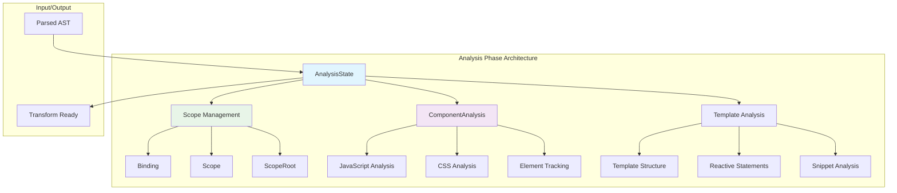
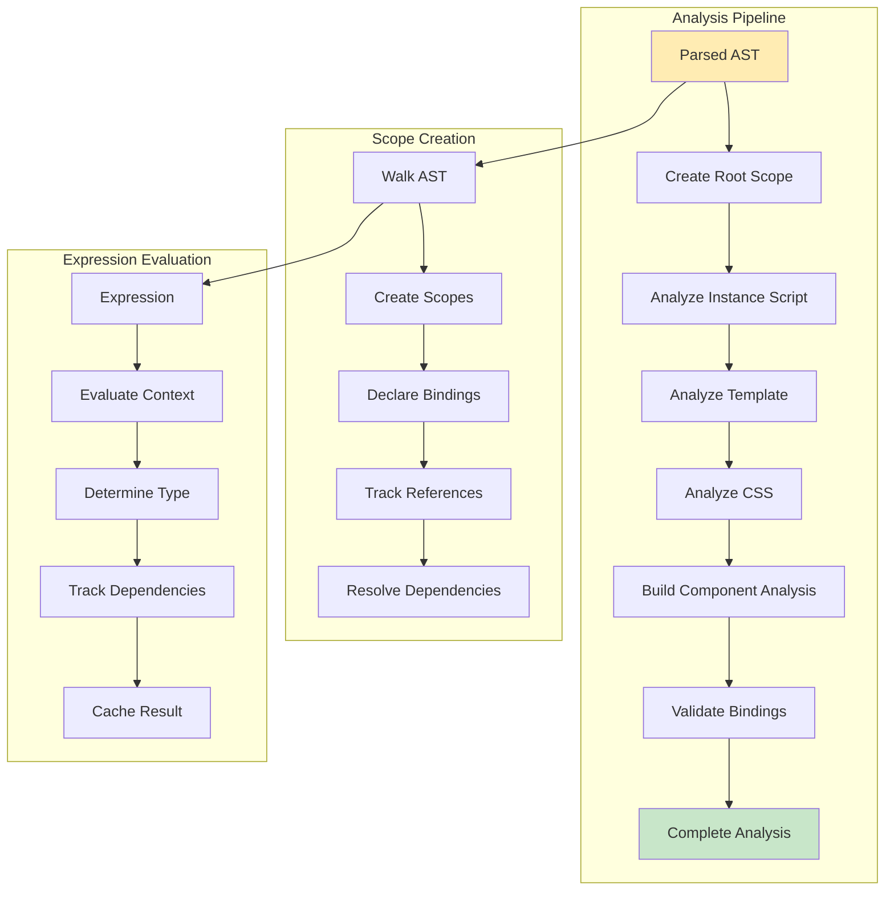
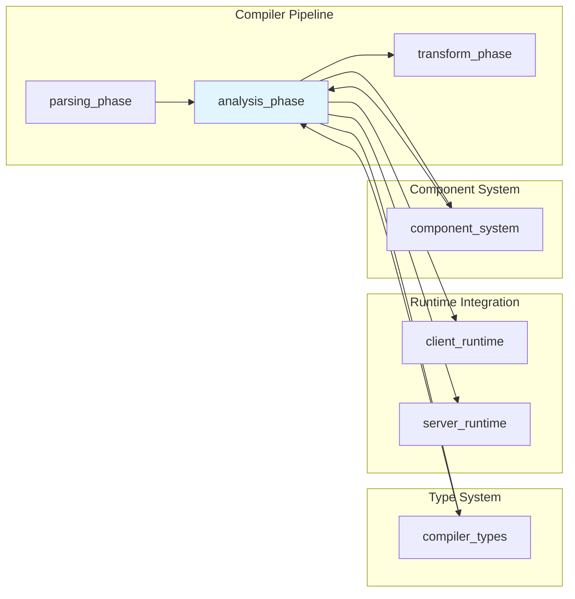

# Analysis Phase Module

The analysis_phase module is a critical component of the Svelte compiler that performs semantic analysis on parsed Svelte components. It operates as the second phase in the compilation pipeline, transforming the parsed AST into a rich analysis structure with scope information, binding relationships, and component metadata.

## Overview

The analysis phase takes the output from the [parsing_phase](parsing_phase.md) and performs deep semantic analysis to understand:
- Variable scoping and binding relationships
- Component structure and dependencies
- Reactive statement analysis
- Template and instance code relationships
- CSS analysis and element tracking

This analysis forms the foundation for the subsequent [transform_phase](transform_phase.md) that generates the final compiled output.

## Architecture



## Core Components

### AnalysisState

The `AnalysisState` interface serves as the central context object that carries all necessary information during the analysis traversal.

```typescript
interface AnalysisState {
    scope: Scope;                    // Current scope context
    scopes: Map<AST.SvelteNode, Scope>; // Node-to-scope mapping
    analysis: ComponentAnalysis;     // Component-wide analysis results
    options: ValidatedCompileOptions; // Compilation options
    ast_type: 'instance' | 'template' | 'module'; // Current AST section
    fragment: AST.Fragment | null;   // Template fragment being analyzed
    parent_element: string | null;   // Parent element context
    has_props_rune: boolean;         // Runes mode detection
    component_slots: Set<string>;    // Available component slots
    expression: ExpressionMetadata | null; // Current expression context
    state_fields: Map<string, StateField>; // Class state tracking
    function_depth: number;          // Nested function depth
    reactive_statement: null | ReactiveStatement; // Legacy reactive statement
}
```

**Key Responsibilities:**
- Maintains traversal context during analysis
- Tracks scope hierarchy and binding relationships
- Provides access to compilation options and metadata
- Manages expression evaluation context

### Scope Management System

The scope management system provides hierarchical variable tracking and binding resolution.

```mermaid
graph TD
    subgraph "Scope Hierarchy"
        SR[ScopeRoot] --> S1[Module Scope]
        S1 --> S2[Instance Scope]
        S2 --> S3[Template Scope]
        S3 --> S4[Block Scopes]
        S4 --> S5[Function Scopes]
    end
    
    subgraph "Binding Types"
        B1[normal] --> B2[prop]
        B2 --> B3[bindable_prop]
        B3 --> B4[rest_prop]
        B4 --> B5[template]
        B5 --> B6[each]
        B6 --> B7[snippet]
        B7 --> B8[legacy_reactive]
    end
    
    subgraph "Declaration Kinds"
        D1[var] --> D2[let]
        D2 --> D3[const]
        D3 --> D4[function]
        D4 --> D5[import]
        D5 --> D6[param]
        D6 --> D7[rest_param]
    end
```



#### ScopeRoot

The root scope manager that handles global name conflicts and unique identifier generation.

```javascript
class ScopeRoot {
    conflicts: Set<string>;          // Reserved/conflicting names
    
    unique(preferred_name: string): Identifier; // Generate unique identifiers
}
```

#### Scope

Individual scope instances that manage variable declarations and references within their context.

```javascript
class Scope {
    root: ScopeRoot;                 // Reference to root scope
    parent: Scope | null;            // Parent scope in hierarchy
    declarations: Map<string, Binding>; // Variable declarations
    references: Map<string, Reference[]>; // Variable references
    function_depth: number;          // Nested function depth
    
    declare(node, kind, declaration_kind, initial): Binding;
    child(porous?: boolean): Scope;  // Create child scope
    get(name: string): Binding | null; // Resolve binding
    reference(node, path): void;     // Track variable reference
    evaluate(expression): Evaluation; // Evaluate expressions
}
```

#### Binding

Represents a variable binding with its metadata and usage tracking.

```javascript
class Binding {
    scope: Scope;                    // Containing scope
    node: Identifier;                // Declaration node
    kind: BindingKind;              // Binding type
    declaration_kind: DeclarationKind; // Declaration type
    initial: Expression | null;      // Initial value
    references: Reference[];         // All references
    mutated: boolean;               // Mutation tracking
    reassigned: boolean;            // Reassignment tracking
    prop_alias: string | null;      // Property alias for props
    
    is_function(): boolean;         // Check if binding is a function
}
```

### Analysis Results

#### ComponentAnalysis

The comprehensive analysis result containing all component metadata.

```typescript
interface ComponentAnalysis extends Analysis {
    root: ScopeRoot;                 // Root scope manager
    instance: Js;                    // Instance script analysis
    template: Template;              // Template analysis
    elements: Array<Element>;        // DOM elements for CSS
    runes: boolean;                  // Runes mode detection
    exports: Array<Export>;          // Component exports
    uses_props: boolean;             // $$props usage
    uses_slots: boolean;             // $$slots usage
    reactive_statements: Map<LabeledStatement, ReactiveStatement>;
    binding_groups: Map<GroupKey, Identifier>; // bind:group tracking
    css: CSSAnalysis;               // CSS analysis results
    snippets: Set<AST.SnippetBlock>; // Local snippets
}
```

#### Template

Template-specific analysis results.

```typescript
interface Template {
    ast: AST.Fragment;              // Template AST
    scope: Scope;                   // Template scope
    scopes: Map<AST.SvelteNode, Scope>; // Node scope mapping
}
```

## Data Flow



## Component Interactions



## Key Features

### Scope Analysis
- **Hierarchical Scoping**: Manages nested scopes with proper variable resolution
- **Binding Tracking**: Tracks all variable declarations and their usage patterns
- **Reference Resolution**: Resolves variable references to their declarations
- **Conflict Detection**: Prevents naming conflicts and generates unique identifiers

### Expression Evaluation
- **Static Analysis**: Evaluates expressions at compile time when possible
- **Type Inference**: Infers types from usage patterns and initial values
- **Dependency Tracking**: Tracks reactive dependencies for optimization
- **Rune Detection**: Identifies and processes Svelte runes

### Component Structure Analysis
- **Template Analysis**: Analyzes template structure and directives
- **CSS Integration**: Tracks elements for CSS scoping and pruning
- **Slot Analysis**: Identifies and validates slot usage
- **Export Tracking**: Manages component exports and props

### Reactive System Integration
- **Reactive Statements**: Analyzes `$:` labeled statements
- **Binding Groups**: Manages `bind:group` relationships
- **State Tracking**: Tracks component state and mutations
- **Effect Dependencies**: Identifies reactive dependencies

## Usage Patterns

### Basic Analysis Flow
```typescript
// Create analysis state
const state: AnalysisState = {
    scope: rootScope,
    scopes: new Map(),
    analysis: componentAnalysis,
    // ... other properties
};

// Perform analysis
const result = analyze(ast, state);
```

### Scope Management
```typescript
// Create child scope
const childScope = parentScope.child();

// Declare variable
const binding = scope.declare(identifier, 'normal', 'let', initialValue);

// Reference variable
scope.reference(identifier, path);

// Resolve binding
const binding = scope.get(variableName);
```

### Expression Evaluation
```typescript
// Evaluate expression
const evaluation = scope.evaluate(expression);

if (evaluation.is_known) {
    // Use compile-time value
    const value = evaluation.value;
} else {
    // Handle runtime evaluation
    generateRuntimeCode(expression);
}
```

## Integration Points

### With Parsing Phase
- Receives parsed AST from [parsing_phase](parsing_phase.md)
- Validates AST structure and semantics
- Enriches AST with analysis metadata

### With Transform Phase
- Provides analysis results to [transform_phase](transform_phase.md)
- Supplies scope and binding information for code generation
- Enables optimization based on analysis insights

### With Type System
- Integrates with [compiler_types](compiler_types.md) for type checking
- Provides type inference and validation
- Supports TypeScript integration

### With Runtime Systems
- Informs [client_runtime](client_runtime.md) code generation
- Supports [server_runtime](server_runtime.md) optimizations
- Enables reactive system integration

## Performance Considerations

### Optimization Strategies
- **Lazy Evaluation**: Defers expensive analysis until needed
- **Caching**: Caches evaluation results to avoid recomputation
- **Incremental Analysis**: Supports incremental compilation scenarios
- **Memory Management**: Efficient scope and binding management

### Scalability Features
- **Parallel Analysis**: Supports parallel analysis of independent components
- **Memory Pooling**: Reuses objects to reduce garbage collection
- **Selective Analysis**: Analyzes only necessary parts for incremental builds

## Error Handling

The analysis phase provides comprehensive error detection and reporting:

- **Scope Errors**: Undeclared variables, duplicate declarations
- **Binding Errors**: Invalid binding patterns, circular dependencies
- **Type Errors**: Type mismatches, invalid operations
- **Semantic Errors**: Invalid component structure, directive usage

## Future Enhancements

- **Enhanced Type Inference**: More sophisticated type analysis
- **Performance Optimizations**: Further optimization of analysis algorithms
- **IDE Integration**: Better support for language server features
- **Incremental Analysis**: Improved incremental compilation support

The analysis_phase module serves as the semantic foundation of the Svelte compiler, providing the rich analysis information needed for effective code generation and optimization in subsequent compilation phases.