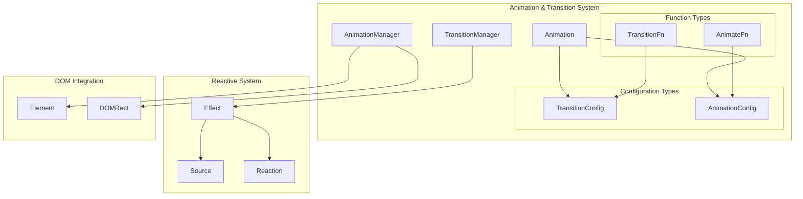
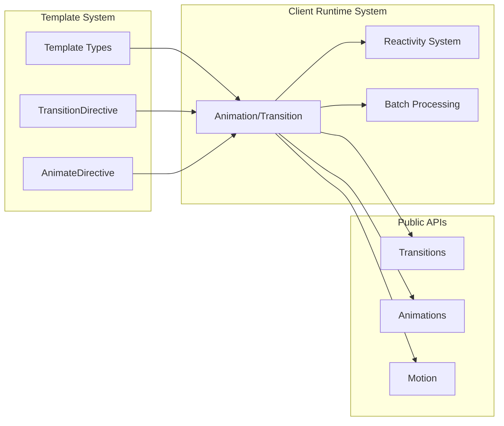
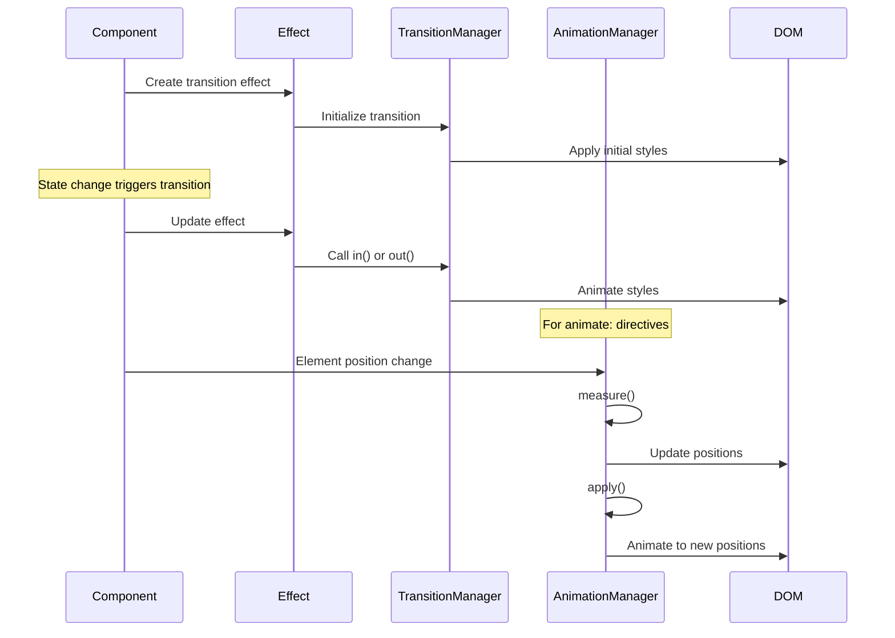
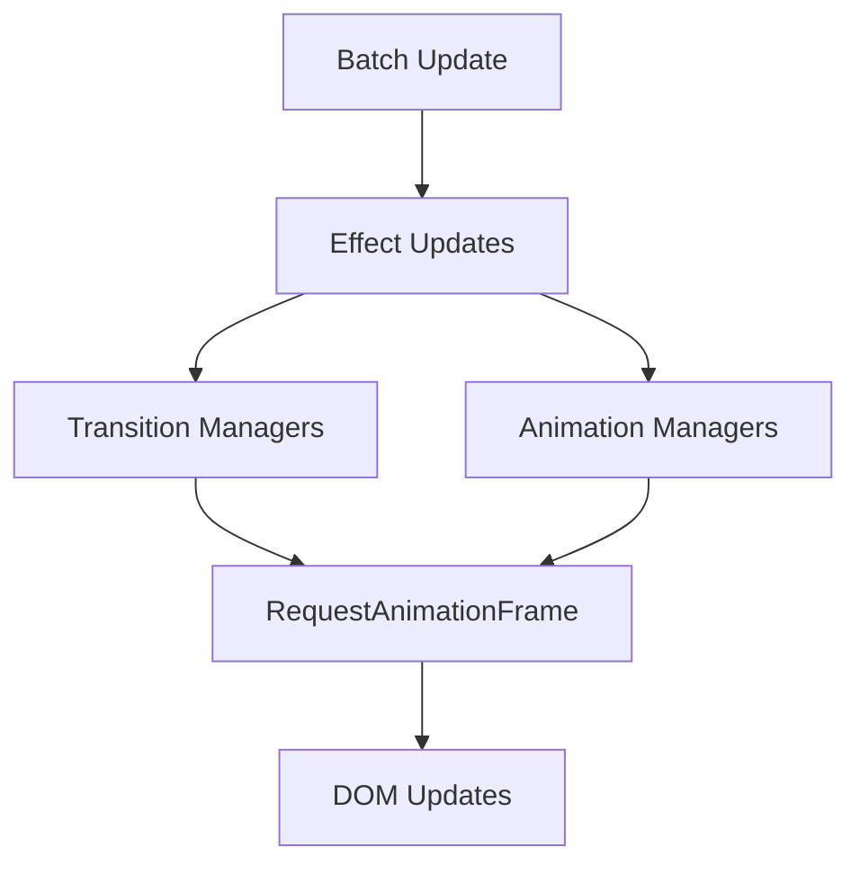

# Animation & Transition Management Module

The animation_transition module is a core component of Svelte's client-side runtime system, responsible for managing smooth visual transitions and animations in Svelte applications. This module provides the foundational infrastructure for handling element transitions, animations, and their lifecycle management within the reactive framework.

## Overview

This module defines the core interfaces and types that enable Svelte's declarative animation and transition system. It bridges the gap between Svelte's reactive state management and the browser's animation capabilities, providing a unified API for managing complex visual effects while maintaining optimal performance.

## Core Components

### TransitionManager Interface

The `TransitionManager` interface defines the contract for managing element transitions in Svelte applications.

```typescript
interface TransitionManager {
  /** Whether the `global` modifier was used (i.e. `transition:fade|global`) */
  is_global: boolean;
  /** Called inside `resume_effect` */
  in: () => void;
  /** Called inside `pause_effect` */
  out: (callback?: () => void) => void;
  /** Called inside `destroy_effect` */
  stop: () => void;
}
```

**Key Features:**
- **Global Transition Support**: Handles both local and global transition scopes
- **Lifecycle Integration**: Seamlessly integrates with Svelte's effect system
- **Callback Management**: Provides hooks for transition completion handling

### AnimationManager Interface

The `AnimationManager` interface manages animations for elements with `animate:` directives, particularly in keyed each blocks.

```typescript
interface AnimationManager {
  /** An element with an `animate:` directive */
  element: Element;
  /** Called during keyed each block reconciliation, before updates */
  measure: () => void;
  /** Called during keyed each block reconciliation, after updates — this triggers the animation */
  apply: () => void;
  /** Fix the element position, so that siblings can move to the correct destination */
  fix: () => void;
  /** Unfix the element position if the outro is aborted */
  unfix: () => void;
}
```

**Key Features:**
- **FLIP Animation Support**: Implements First, Last, Invert, Play animation technique
- **Position Management**: Handles element positioning during animations
- **Reconciliation Integration**: Works seamlessly with keyed each block updates

### Animation Interface

The `Animation` interface provides fine-grained control over individual animation instances.

```typescript
interface Animation {
  /** Abort the animation */
  abort: () => void;
  /** Allow the animation to continue running, but remove any callback */
  deactivate: () => void;
  /** Resets an animation to its starting state, if it uses `tick` */
  reset: () => void;
  /** Get the `t` value (between `0` and `1`) of the animation */
  t: () => number;
}
```

## Architecture Overview



## Component Relationships



## Data Flow Architecture



## Integration with Reactive System

The animation_transition module is deeply integrated with Svelte's [reactivity system](reactivity_system.md):

### Effect Integration
- **Transition Effects**: TransitionManagers are stored in Effect instances via the `transitions` property
- **Lifecycle Coordination**: Transitions are coordinated with effect lifecycle methods (`resume_effect`, `pause_effect`, `destroy_effect`)
- **Reactive Updates**: Animation states respond to reactive value changes

### Source Integration
- **State Tracking**: Animation progress and states are tracked using reactive sources
- **Dependency Management**: Animations can depend on reactive values for dynamic behavior

## Performance Optimizations

### Batch Processing Integration
The module works closely with Svelte's [batch processing](batch_processing.md) system:



### Memory Management
- **Cleanup Coordination**: Proper cleanup of animation resources when effects are destroyed
- **Reference Management**: Careful management of DOM element references to prevent memory leaks
- **Callback Cleanup**: Automatic cleanup of animation callbacks and event listeners

## Function Types and Configuration

### TransitionFn Type
```typescript
type TransitionFn<P> = (
  element: Element,
  props: P,
  options: { direction?: 'in' | 'out' | 'both' }
) => AnimationConfig | ((options: { direction?: 'in' | 'out' }) => AnimationConfig);
```

### AnimateFn Type
```typescript
type AnimateFn<P> = (
  element: Element,
  rects: { from: DOMRect; to: DOMRect },
  props: P
) => AnimationConfig;
```

### AnimationConfig Type
```typescript
type AnimationConfig = {
  delay?: number;
  duration?: number;
  easing?: (t: number) => number;
  css?: (t: number, u: number) => string;
  tick?: (t: number, u: number) => string;
};
```

## Usage Patterns

### Transition Management
1. **Effect Creation**: Transitions are created within effect contexts
2. **Lifecycle Binding**: Transition lifecycle is bound to effect lifecycle
3. **Global vs Local**: Support for both global and local transition scopes

### Animation Management
1. **FLIP Technique**: Measure → Apply pattern for smooth animations
2. **Position Fixing**: Temporary position fixing during complex animations
3. **Reconciliation**: Integration with keyed each block reconciliation

## Related Modules

- **[Reactivity System](reactivity_system.md)**: Provides the reactive foundation for animation state management
- **[Batch Processing](batch_processing.md)**: Coordinates animation updates with reactive batching
- **[Template Types](template_types.md)**: Defines the directive types that use this animation system
- **[Transitions](transitions.md)**: Public API for transition functions
- **[Animations](animations.md)**: Public API for animation functions
- **[Motion](motion.md)**: Higher-level motion utilities built on this foundation

## Development and Debugging

### Dev Mode Features
- **Stack Tracking**: Integration with dev stack for debugging animation issues
- **Component Function References**: Links animations back to their originating components
- **Performance Monitoring**: Built-in performance tracking for animation bottlenecks

### Testing Considerations
- **RAF Mocking**: Support for mocking `requestAnimationFrame` in tests
- **Time Control**: Ability to control animation timing in test environments
- **State Inspection**: Access to internal animation states for testing

This module serves as the foundational layer for all visual effects in Svelte applications, providing the necessary abstractions and performance optimizations to deliver smooth, responsive user interfaces while maintaining the declarative programming model that Svelte is known for.