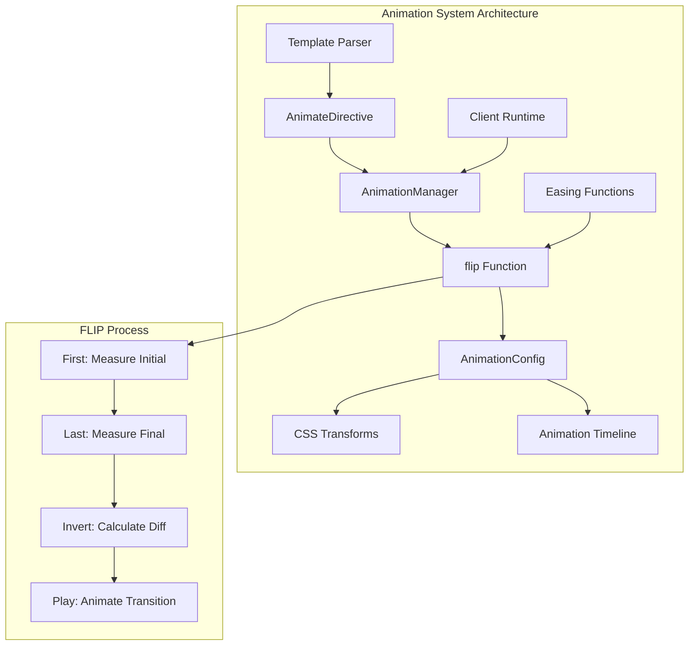
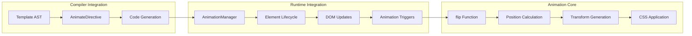
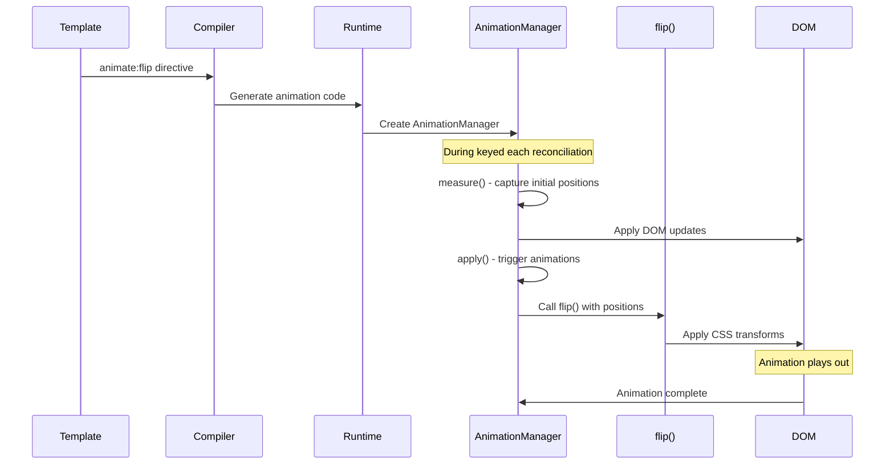
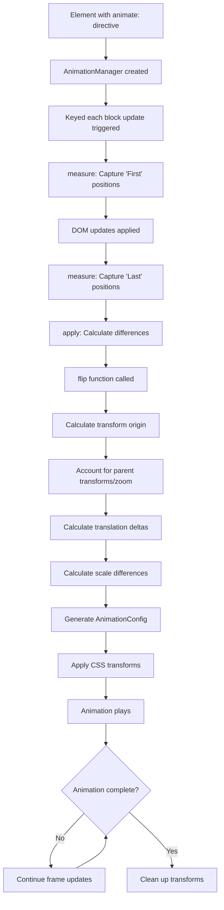

# Animations Module

The animations module provides Svelte's built-in animation system, enabling smooth visual transitions for elements during DOM updates. It implements the FLIP (First, Last, Invert, Play) animation technique to create performant animations that respond to layout changes.

## Core Components

### AnimationConfig Interface
Defines the configuration structure for animations, providing control over timing, easing, and visual effects.

**Properties:**
- `delay?: number` - Animation start delay in milliseconds
- `duration?: number` - Animation duration in milliseconds  
- `easing?: (t: number) => number` - Easing function for animation progression
- `css?: (t, u) => string` - CSS transformation function
- `tick?: (t, u) => void` - Frame-by-frame callback function

### FlipParams Interface
Configuration parameters specifically for the FLIP animation function.

**Properties:**
- `delay?: number` - Animation start delay
- `duration?: number | ((len: number) => number)` - Duration as fixed value or function of distance
- `easing?: (t: number) => number` - Easing function for smooth transitions

### flip() Function
The core FLIP animation implementation that calculates element position changes and creates smooth transitions.

**Signature:** `flip(node, { from, to }, params) => AnimationConfig`

## Architecture Overview



## Component Relationships



## Data Flow



## Animation Process Flow



## Integration Points

### Compiler Integration
The animations module integrates with the compiler through:
- **[Template Types](template_types.md)**: `AnimateDirective` AST node representation
- **[Compiler Core](compiler_core.md)**: Code generation for animation directives
- **[Transform Phase](transform_phase.md)**: Converting animate directives to runtime calls

### Runtime Integration  
Runtime integration occurs through:
- **[Client Runtime](client_runtime.md)**: `AnimationManager` interface for lifecycle management
- **[Animation Transition](animation_transition.md)**: Coordination with transition system
- **[Reactivity System](reactivity_system.md)**: Responding to reactive state changes

### Related Systems
- **[Transitions](transitions.md)**: Complementary animation system for enter/exit effects
- **[Motion](motion.md)**: Higher-level animation utilities (springs, tweens)
- **[Component System](component_system.md)**: Integration with component lifecycle

## Key Features

### FLIP Animation Technique
- **First**: Measure initial element positions
- **Last**: Measure final positions after DOM updates  
- **Invert**: Calculate the transformation needed
- **Play**: Animate from inverted state back to natural position

### Performance Optimizations
- Uses CSS transforms for hardware acceleration
- Calculates animations based on actual pixel distances
- Accounts for parent transforms and CSS zoom
- Minimal DOM manipulation during animation

### Flexible Configuration
- Customizable duration based on animation distance
- Support for custom easing functions
- CSS and JavaScript animation callbacks
- Configurable delays and timing

## Usage Patterns

### Basic FLIP Animation
```svelte
{#each items as item (item.id)}
  <div animate:flip>
    {item.name}
  </div>
{/each}
```

### Customized Animation
```svelte
{#each items as item (item.id)}
  <div animate:flip={{ duration: 300, easing: cubicOut }}>
    {item.name}
  </div>
{/each}
```

### Dynamic Duration
```svelte
{#each items as item (item.id)}
  <div animate:flip={{ duration: d => Math.sqrt(d) * 120 }}>
    {item.name}
  </div>
{/each}
```

## Technical Implementation

### Position Calculation
The flip function performs sophisticated position calculations:
1. **Transform Origin**: Determines the pivot point for transformations
2. **Parent Effects**: Accounts for parent transforms and CSS zoom levels
3. **Scale Factors**: Calculates size differences between states
4. **Translation Deltas**: Determines movement distances

### CSS Generation
Generates optimized CSS transforms:
- Combines existing transforms with animation transforms
- Uses translate3d for hardware acceleration
- Applies scale transformations for size changes
- Maintains transform origin consistency

### Animation Timeline
Manages animation progression:
- Linear interpolation between start and end states
- Easing function application for smooth motion
- Frame-by-frame updates via requestAnimationFrame
- Cleanup and restoration of original styles

## Best Practices

### Performance
- Use animations primarily for layout changes in keyed each blocks
- Prefer CSS transforms over property animations
- Consider animation distance when setting duration
- Test performance on lower-end devices

### User Experience
- Provide appropriate animation durations (not too fast/slow)
- Use consistent easing functions across the application
- Consider reduced motion preferences
- Ensure animations enhance rather than distract

### Development
- Test animations with various data sets and update patterns
- Monitor for animation conflicts with other CSS
- Consider fallbacks for browsers without animation support
- Profile animation performance in development tools