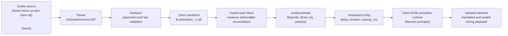
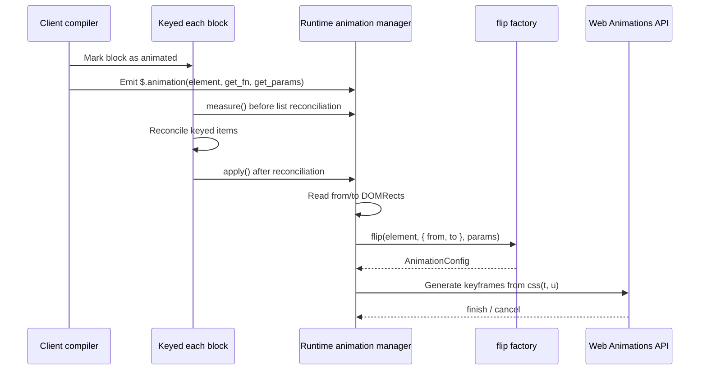
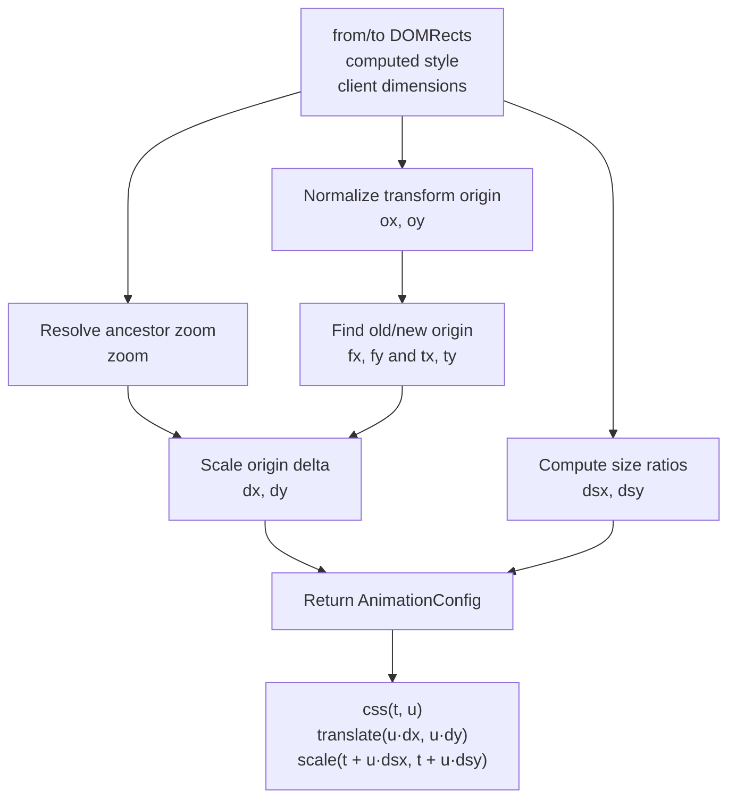
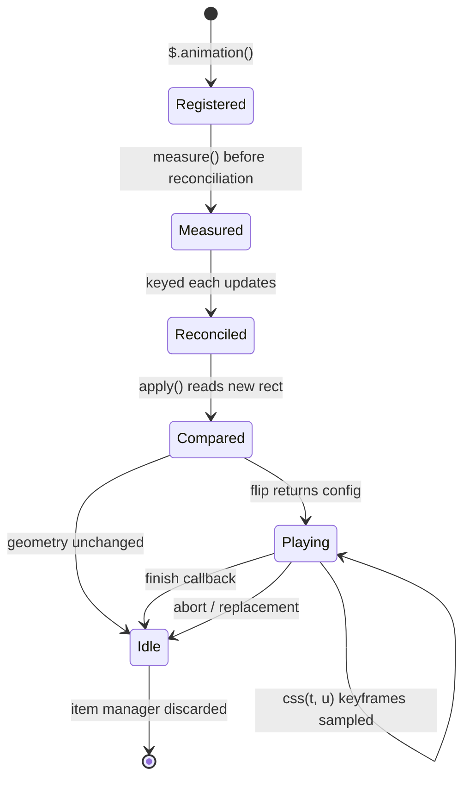
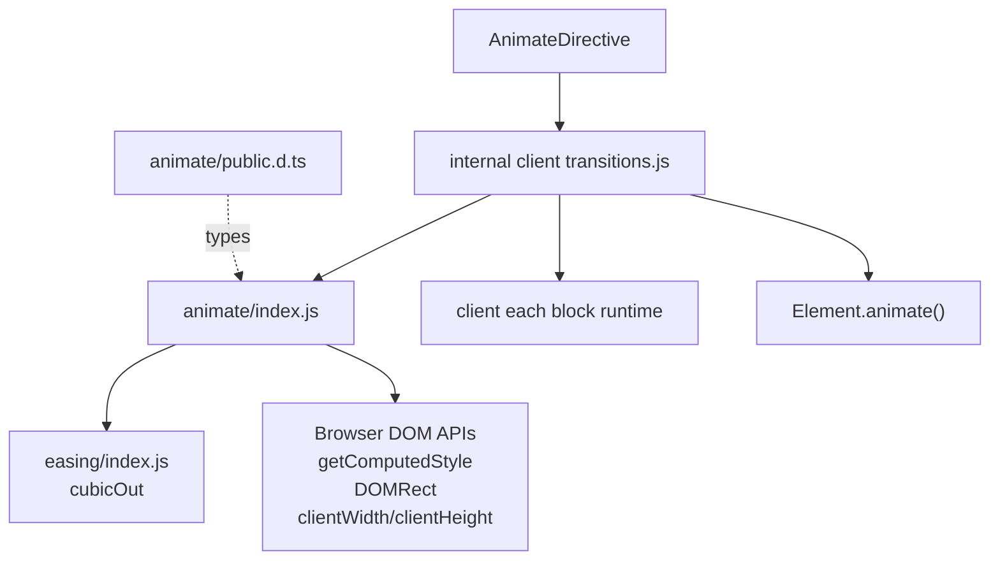

# Animations

The `animations` module provides Svelte's built-in `flip` animation factory. `flip` implements the First–Last–Invert–Play technique for elements whose position or size changes inside a keyed `{#each}` block. It compares the element's pre-update and post-update `DOMRect` values, then returns a CSS-producing `AnimationConfig` that translates and scales the element from its old geometry into its new geometry.

This module is intentionally a policy layer, not an animation scheduler. The compiler recognizes and validates `animate:` directives, the client block runtime measures elements around reconciliation, and the DOM animation runtime executes the returned configuration. See [compiler_transform_client_directives.md](compiler_transform_client_directives.md), [client_blocks.md](client_blocks.md), and [client_dom_elements_transitions.md](client_dom_elements_transitions.md) for those responsibilities. General compilation sequencing is described in [compilation_pipeline.md](compilation_pipeline.md).

## Scope and public surface

The package is exposed through the `svelte/animate` entry point and currently exports:

| Export | Source | Purpose |
| --- | --- | --- |
| `flip` | `packages/svelte/src/animate/index.js` | Build a translate/scale animation between two rectangles |
| `AnimationConfig` | `packages/svelte/src/animate/public.d.ts` | Runtime animation result contract |
| `FlipParams` | `packages/svelte/src/animate/public.d.ts` | Optional timing and easing parameters |

`public.d.ts` re-exports the implementation entry point. The aggregate published declarations also expose the same contracts through the transitions-and-animations section documented by the package type surface.

## Architecture


```mermaid
flowchart LR
    Source["Svelte source\n{#each items as item (item.id)}\n  <div animate:flip>\n{/each}"] --> Parse["Parser\nAnimateDirective AST"]
    Parse --> Analyze["Analyzer\nplacement and key validation"]
    Analyze --> Transform["Client transform\n$.animation(...) call"]
    Transform --> Each["Keyed each block\nmeasure before/after reconciliation"]
    Each --> Factory["svelte/animate\nflip(node, {from, to}, params)"]
    Factory --> Config["AnimationConfig\ndelay, duration, easing, css"]
    Config --> Runtime["Client DOM animation runtime\nElement.animate()"]
    Runtime --> DOM["Updated element\ntranslated and scaled during playback"]
```

The dependency direction is important:

- The compiler emits a call to the runtime's `animation` helper; it does not import `flip` directly.
- The keyed `each` runtime owns measurement timing and invokes the user-selected factory.
- `flip` only calculates geometry and interpolation values.
- `client/dom/elements/transitions.js` converts the returned CSS function into Web Animations keyframes, applies delay/easing, and handles cancellation and completion.

## Compiler integration

An `AnimateDirective` is valid only when it is attached to the sole meaningful child of a keyed `{#each}` block. The analyzer rejects an animation when:

- its parent is not an `each` block;
- the `each` block has no key;
- the block contains more than one meaningful child; or
- the element contains more than one animation directive.

During client transformation, `AnimateDirective` emits an `after_update` call equivalent to:

```js
$.animation(element, () => flip, paramsThunk)
```

The deferred function and parameter thunk preserve component expression semantics. The `after_update` placement also ensures `bind:this` and related element setup has occurred before the animation manager is attached. The keyed `EachBlock` transform marks the block as animated so reconciliation can take the required before/after measurements.


```mermaid
sequenceDiagram
    participant Compiler as Client compiler
    participant Each as Keyed each block
    participant Manager as Runtime animation manager
    participant Factory as flip factory
    participant Browser as Web Animations API

    Compiler->>Each: Mark block as animated
    Compiler->>Manager: Emit $.animation(element, get_fn, get_params)
    Each->>Manager: measure() before list reconciliation
    Each->>Each: Reconcile keyed items
    Each->>Manager: apply() after reconciliation
    Manager->>Manager: Read from/to DOMRects
    Manager->>Factory: flip(element, { from, to }, params)
    Factory-->>Manager: AnimationConfig
    Manager->>Browser: Generate keyframes from css(t, u)
    Browser-->>Manager: finish / cancel
```

## `flip` algorithm

The factory accepts an element, a `{ from, to }` rectangle pair, and optional `FlipParams`:

```ts
interface FlipParams {
  delay?: number;
  duration?: number | ((length: number) => number);
  easing?: (t: number) => number;
}
```

Defaults are `delay = 0`, `easing = cubicOut`, and `duration = sqrt(distance) * 120`, where `distance` is the calculated translation length in pixels. A numeric duration bypasses this distance-based calculation.

The calculation proceeds as follows:

1. Read the element's existing transform and transform origin.
2. Normalize the transform-origin coordinates against the element's client width and height.
3. Compute effective zoom, using `currentCSSZoom` where available or multiplying the `zoom` value of the element and its ancestors.
4. Calculate the transform-origin position in the old and new rectangles.
5. Convert the origin delta into the translation required at the start of playback.
6. Calculate width and height ratios from `from` to `to`.
7. Return a CSS callback that interpolates translation and scale while preserving the original transform.


```mermaid
flowchart TD
    Input["from/to DOMRects\ncomputed style\nclient dimensions"] --> Origin["Normalize transform origin\nox, oy"]
    Input --> Zoom["Resolve ancestor zoom\nzoom"]
    Origin --> Positions["Find old/new origin\nfx, fy and tx, ty"]
    Zoom --> Translation["Scale origin delta\ndx, dy"]
    Positions --> Translation
    Input --> Scale["Compute size ratios\ndsx, dsy"]
    Translation --> Config["Return AnimationConfig"]
    Scale --> Config
    Config --> CSS["css(t, u)\ntranslate(u·dx, u·dy)\nscale(t + u·dsx, t + u·dsy)"]
```

For normalized progress `t` and `u = 1 - t`, the callback emits:

```css
transform: <existing transform>
  translate(u * dx, u * dy)
  scale(t + u * dsx, t + u * dsy);
```

At the beginning (`t = 0`), the element is positioned and sized like the old rectangle. At the end (`t = 1`), the translation is zero and both scale factors are one. Preserving the existing transform avoids discarding transforms authored by component CSS or other runtime behavior.

## Runtime interaction and lifecycle

The runtime's `animation` helper stores a manager on each keyed item. Its lifecycle is:


```mermaid
stateDiagram-v2
    [*] --> Registered: $.animation()
    Registered --> Measured: measure() before reconciliation
    Measured --> Reconciled: keyed each updates
    Reconciled --> Compared: apply() reads new rect
    Compared --> Idle: geometry unchanged
    Compared --> Playing: flip returns config
    Playing --> Playing: css(t, u) keyframes sampled
    Playing --> Idle: finish callback
    Playing --> Idle: abort / replacement
    Idle --> [*]: item manager discarded
```

If the rectangles are unchanged, no animation is created. If an earlier animation is active, `apply()` aborts it before starting the replacement. The runtime also temporarily fixes layout for moving elements when needed, preventing normal-flow changes from invalidating the captured geometry; this implementation detail belongs to [client_dom_elements_transitions.md](client_dom_elements_transitions.md), not to `flip`.

The returned config is consumed as follows:

- `delay` creates the initial delay period.
- `duration` determines playback length.
- `easing` shapes progress.
- `css(t, u)` is sampled into CSS keyframes and applied through `Element.animate()`.
- The runtime owns finish callbacks, abort behavior, and cleanup.

## Dependencies


```mermaid
graph TD
    Animate["animate/index.js"] --> Easing["easing/index.js\ncubicOut"]
    Animate --> DOM["Browser DOM APIs\ngetComputedStyle\nDOMRect\nclientWidth/clientHeight"]
    Public["animate/public.d.ts"] -. types .-> Animate
    Compiler["AnimateDirective"] --> Runtime["internal client transitions.js"]
    Runtime --> Animate
    Runtime --> Blocks["client each block runtime"]
    Runtime --> WA["Element.animate()"]
```

The only code dependency of the factory itself is `cubicOut` from the easing library, used as the default easing function; easing usage and shared animation configuration are covered in [transitions.md](transitions.md). It has no dependency on reactivity, stores, server rendering, or component state. Because it reads browser layout and computed styles, it is evaluated on the client during an animated keyed-list update; server rendering can emit the surrounding markup but does not run this geometry calculation. See [server_runtime.md](server_runtime.md) for server responsibilities.

## Maintenance guidance

- Change geometry, zoom handling, transform composition, or defaults in `packages/svelte/src/animate/index.js`.
- Change public timing contracts in `packages/svelte/src/animate/public.d.ts` and the published declarations.
- Change directive placement or generated calls in `compiler/phases/3-transform/client/visitors/AnimateDirective.js`.
- Change legal placement and keyed-block validation in `compiler/phases/2-analyze/visitors/shared/element.js`.
- Change measurement timing, layout fixing, keyframe generation, or cancellation in `internal/client/dom/elements/transitions.js`.

When modifying `flip`, test at least movement, resizing, non-default transform origins, existing transforms, nested CSS zoom, keyed insertion/removal, and interruption by a second list update. Changes to the runtime should also be checked against the transition factories documented in [transitions.md](transitions.md), because both features share the same animation execution machinery.
