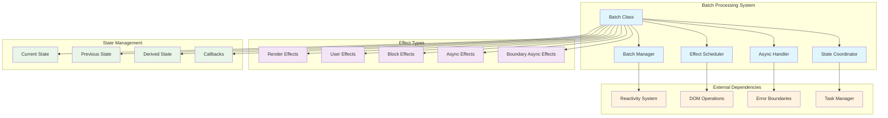
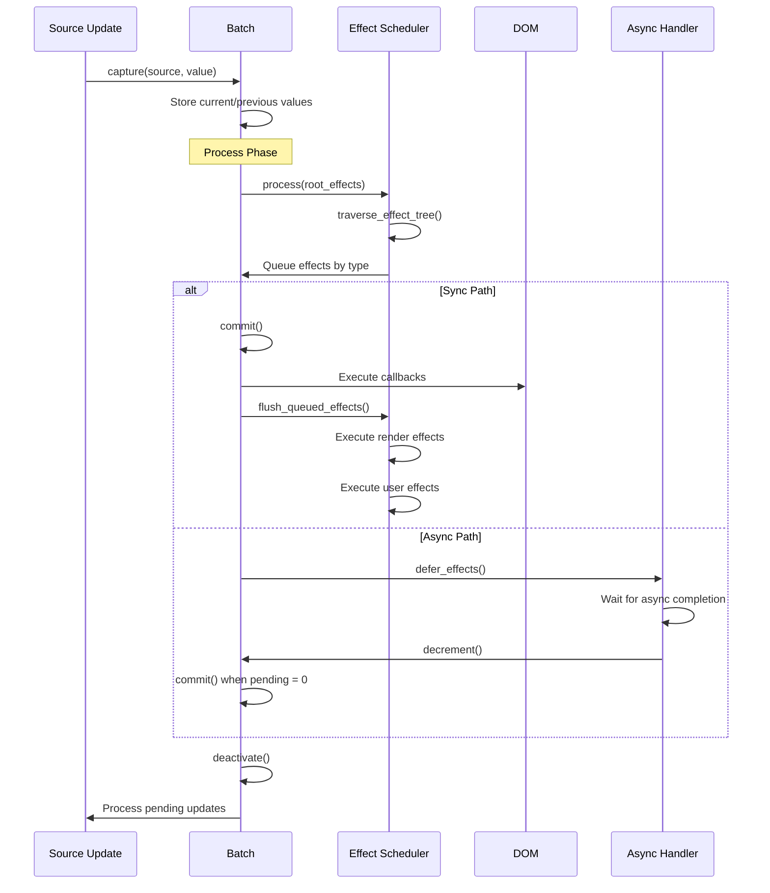
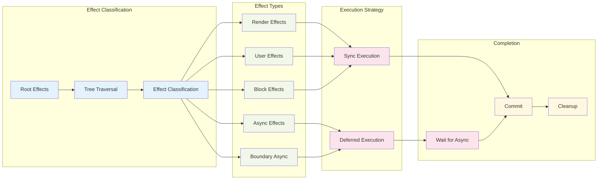

# Batch Processing Module

The batch processing module is a critical component of Svelte's client-side reactivity system that manages the efficient execution of reactive updates through batching and scheduling mechanisms. It ensures optimal performance by grouping related updates together and executing them in the correct order while handling asynchronous operations and preventing infinite loops.

## Overview

The batch processing system coordinates the execution of effects, manages state transitions, and handles both synchronous and asynchronous updates in Svelte's reactive runtime. It serves as the orchestrator for all reactive computations, ensuring that updates are processed efficiently and consistently.

## Architecture



## Core Components

### Batch Class

The `Batch` class is the central orchestrator that manages reactive updates:

```javascript
export class Batch {
    // State tracking
    current = new Map();           // Current source values
    #previous = new Map();         // Previous source values
    #callbacks = new Set();        // DOM update callbacks
    
    // Effect queues
    #render_effects = [];          // Template and $effect.pre
    #effects = [];                 // User $effect
    #block_effects = [];           // Block effects (if/each/etc)
    #async_effects = [];           // Async derived effects
    #boundary_async_effects = [];  // Boundary async effects
    
    // Deferred effects
    #dirty_effects = [];           // DIRTY deferred effects
    #maybe_dirty_effects = [];     // MAYBE_DIRTY deferred effects
    
    // Async coordination
    #pending = 0;                  // Outstanding async operations
    #deferred = null;              // Promise for settled()
    #neutered = false;             // Batch invalidation flag
}
```

### Global State Management

```javascript
// Active batch tracking
export let current_batch = null;
export let previous_batch = null;

// Time-travel support for async mode
export let batch_deriveds = null;

// Effect scheduling
export let effect_pending_updates = new Set();
```

## Data Flow



## Effect Processing Pipeline



## Key Features

### 1. Batching Strategy

The system groups related updates to minimize DOM operations and ensure consistency:

- **Capture Phase**: Records source value changes
- **Process Phase**: Traverses effect trees and classifies effects
- **Commit Phase**: Executes DOM updates and callbacks
- **Cleanup Phase**: Manages effect lifecycle and memory

### 2. Effect Scheduling

Different effect types are handled with appropriate timing:

```javascript
// Immediate execution (sync mode)
if (is_dirty(effect)) {
    if ((effect.f & BLOCK_EFFECT) !== 0) this.#block_effects.push(effect);
    update_effect(effect);
}

// Deferred execution (async mode)
if ((flags & ASYNC) !== 0) {
    var effects = effect.b?.pending ? 
        this.#boundary_async_effects : 
        this.#async_effects;
    effects.push(effect);
}
```

### 3. Async Coordination

Manages asynchronous operations with proper synchronization:

- **Pending Counter**: Tracks outstanding async operations
- **Boundary Effects**: Handles effects within error boundaries
- **Deferred Resolution**: Provides `settled()` promise for completion

### 4. Time Travel Support

Enables debugging and development features through state restoration:

```javascript
// Store current values for restoration
if (async_mode_flag && batches.size > 1) {
    current_values = new Map();
    batch_deriveds = new Map();
    
    // Apply batch-specific values
    for (const [source, current] of this.current) {
        current_values.set(source, { v: source.v, wv: source.wv });
        source.v = current;
    }
}
```

## Integration Points

### Reactivity System Integration

The batch processing module integrates closely with the [reactivity system](reactivity_system.md):

- **Signal Updates**: Captures changes to reactive sources
- **Effect Execution**: Coordinates effect updates and dependencies
- **Derived Computation**: Manages derived value recalculation

### DOM Integration

Coordinates with DOM operations for efficient updates:

- **Callback Management**: Queues DOM manipulation functions
- **Node Tracking**: Manages effect-associated DOM nodes
- **Transition Coordination**: Handles animation and transition effects

### Error Handling Integration

Provides robust error handling and recovery:

- **Boundary Support**: Integrates with error boundary components
- **Infinite Loop Detection**: Prevents runaway effect updates
- **Stack Trace Preservation**: Maintains debugging information

## API Reference

### Batch Class Methods

#### Core Operations
- `process(root_effects)`: Main processing pipeline
- `capture(source, value)`: Records source value changes
- `activate()` / `deactivate()`: Batch lifecycle management
- `flush()`: Forces batch completion

#### Async Operations
- `increment()` / `decrement()`: Async operation tracking
- `settled()`: Returns completion promise
- `suspend()`: Creates suspension context

#### Utility Methods
- `add_callback(fn)`: Adds DOM update callback
- `neuter()`: Invalidates batch

### Global Functions

#### Synchronization
- `flushSync(fn?)`: Synchronous update execution
- `schedule_effect(signal)`: Queues effect for execution
- `clear()`: Removes all batches (testing utility)

#### State Management
- `suspend()`: Creates async suspension context
- Effect queue management functions

## Performance Characteristics

### Optimization Strategies

1. **Batching Efficiency**: Groups related updates to minimize work
2. **Effect Deduplication**: Prevents redundant effect execution
3. **Memory Management**: Cleans up unused effects and references
4. **Async Coordination**: Optimizes async operation handling

### Complexity Analysis

- **Time Complexity**: O(n) for effect tree traversal, O(1) for most operations
- **Space Complexity**: O(n) for effect and source tracking
- **Batch Size**: Scales with number of concurrent updates

## Error Handling

### Infinite Loop Prevention

```javascript
if (flush_count++ > 1000) {
    // Collect update information for debugging
    var updates = new Map();
    for (const source of batch.current.keys()) {
        // Track update patterns
    }
    infinite_loop_guard();
}
```

### Error Boundary Integration

The system integrates with Svelte's error boundary mechanism to handle failures gracefully and maintain application stability.

## Development and Debugging

### Debug Features

- **Effect Tracking**: Monitors effect execution patterns
- **Source Monitoring**: Tracks source value changes
- **Stack Trace Preservation**: Maintains debugging context
- **Time Travel**: Supports state inspection and restoration

### Testing Utilities

- `clear()`: Resets batch state for test isolation
- `flushSync()`: Enables deterministic testing
- Effect queue inspection capabilities

## Related Modules

- [Reactivity System](reactivity_system.md): Core reactive primitives and signals
- [Animation & Transition](animation_transition.md): Animation and transition management
- [Client Runtime](client_runtime.md): Overall client-side runtime system

The batch processing module serves as the coordination layer that makes Svelte's reactive system both performant and predictable, ensuring that updates are processed efficiently while maintaining consistency and providing robust error handling.