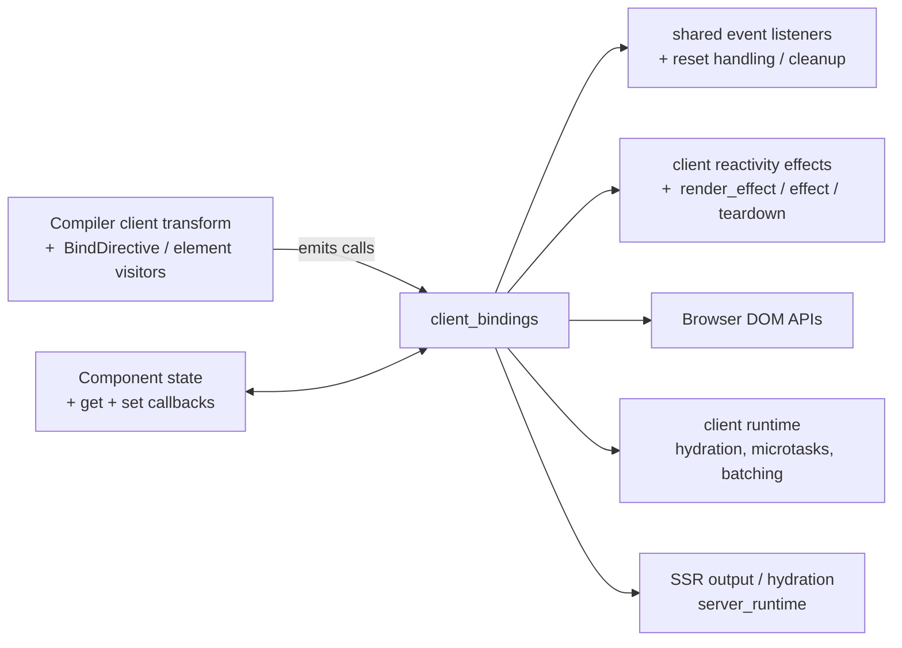
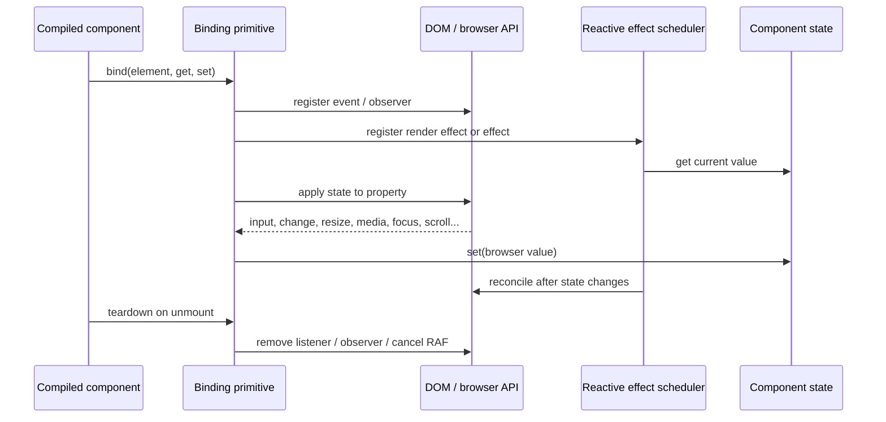
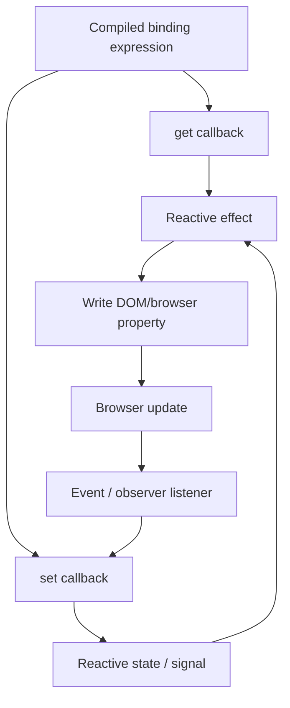

# `client_bindings`

`client_bindings` is Svelte’s browser-side binding layer. It connects compiled binding expressions to DOM, media, viewport, document, navigator, element, component, and form APIs. Each binding establishes one or both directions of synchronization:

- DOM/event state → the component through a supplied `set` callback.
- Component state → the DOM through a supplied `get` callback and a reactive effect.

The functions are runtime primitives called by generated client code; they are not generally application-facing APIs.

## Architecture

The compiler selects a specialized primitive based on the target and directive. The primitive owns browser-specific details, while the generated code supplies the state accessors. Hydration-aware branches preserve user-visible DOM state when server markup and current client state differ.

## Submodules

| Submodule | Responsibility |
| --- | --- |
| [Input bindings](client_bindings_input.md) | Text/number/range values, checked state, checkbox/radio groups, and files. |
| [Select bindings](client_bindings_select.md) | Single and multiple `<select>` synchronization, option values, and option mutation tracking. |
| [Media bindings](client_bindings_media.md) | Audio/video time, ranges, playback state, rate, volume, and mute state. |
| [Size bindings](client_bindings_size.md) | Element dimensions and `ResizeObserver` multiplexing. |
| [Window bindings](client_bindings_window.md) | Window scroll position and viewport dimensions. |
| [Document and navigator bindings](client_bindings_global.md) | Active element and online/offline state. |
| [Universal and component bindings](client_bindings_universal.md) | Generic DOM properties, contenteditable, focus, `bind:this`, and component prop forwarding. |

## Runtime interaction

## Design constraints

- `render_effect` is used where DOM writes should participate in synchronous rendering; `effect` is used where the element must already be mounted or where ordering after block updates matters.
- `teardown` removes listeners, observers, animation frames, and stale `bind:this` values.
- Hydration paths often adopt the live DOM value rather than overwriting it, preventing server/client or user-input loss.
- Browser values are normalized where necessary: number-like inputs become numbers or `null`, checkbox groups become arrays, and media `TimeRanges` become serializable arrays.
- Focused controls are protected from unnecessary writes, preserving selection and in-progress editing.

## Related modules

- [client_reactivity](client_reactivity.md) supplies the effect, batch, proxy, and runtime primitives used by bindings.
- [client_dom_elements](client_dom_elements.md) contains neighboring attribute, event, transition, and custom-element runtime behavior.
- [client_dom_elements](client_dom_elements.md) and the client rendering pipeline provide mounting, hydration, and DOM template operations.
- [compiler_transform_client_directives](compiler_transform_client_directives.md) and [compiler_transform_client_elements](compiler_transform_client_elements.md) generate the calls into this runtime layer.
- [compiler_transform_server](compiler_transform_server.md) and [compilation_pipeline](compilation_pipeline.md) describe the SSR-side counterparts and the surrounding compile pipeline.

## Binding data flow

