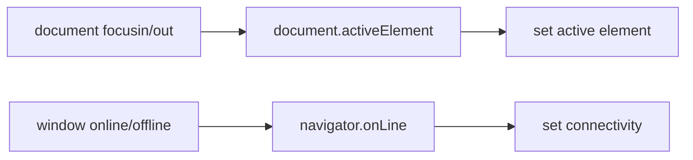

# Document and navigator bindings

Sources: `internal/client/dom/elements/bindings/document.js` and `navigator.js`.

`bind_active_element(update)` observes `focusin` and `focusout`, then reports `document.activeElement`. A `focusout` with a related target is ignored because focus is moving between elements and should not briefly report `document.body`.

`bind_online(update)` observes window `online` and `offline` events and reports `navigator.onLine`.

Both are read-only bindings. They rely on the shared listener utility and therefore follow the runtime’s listener cleanup behavior.

