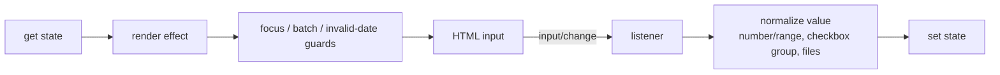

# Input bindings

Source: `internal/client/dom/elements/bindings/input.js`.

This submodule synchronizes form controls whose value is represented by an `HTMLInputElement`.

## Components

- `bind_value(input, get, set)` handles text-like controls and converts `number`/`range` values with `'' → null` and numeric coercion. It listens to `input`, adopts hydration-time DOM changes, and writes state changes back through a render effect. Focused inputs are not rewritten for updates originating in the same reactive batch; this preserves caret/selection during deferred work. Date inputs also preserve temporarily invalid editing states.
- `bind_checked(input, get, set)` handles boolean checked state. It listens to `change`, adopts a hydration mismatch, and writes `Boolean(get())` reactively.
- `bind_group(inputs, group_index, input, get, set)` registers checkbox/radio members in a nested group, derives checked checkbox values as an array, compares radio values with Svelte’s proxy-aware `is`, sorts members in document order, and removes the member during teardown. Hydration mismatch handling chooses the live checked state.
- `bind_files(input, get, set)` exposes the read-only browser `FileList` on `change`, adopts files during hydration, and assigns the state value back to `input.files` in a render effect.

The shared reset-aware listener handles form reset semantics. Binding setup also uses batching, hydration, `tick`, and microtask scheduling to avoid clobbering edits made while a reactive flush is in progress.

