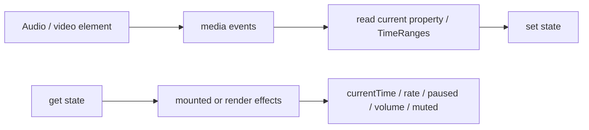

# Media bindings

Source: `internal/client/dom/elements/bindings/media.js`.

The media bindings target `HTMLAudioElement` and `HTMLVideoElement` and expose browser media state through event listeners and reactive writes.

## Components

`bind_current_time` uses both `timeupdate` and a `requestAnimationFrame` loop while playback is active, providing smooth current-time updates while still supporting paused scrubbing. State writes update `media.currentTime`; teardown cancels the frame and listener.

`bind_buffered`, `bind_seekable`, and `bind_played` convert `TimeRanges` to arrays of `{ start, end }`. Buffered ranges are deeply compared because browsers return new `TimeRanges` objects and may update them without a single dedicated event.

`bind_seeking`, `bind_ended`, and `bind_ready_state` are read-only event bindings for the corresponding media properties. `bind_playback_rate`, `bind_paused`, `bind_volume`, and `bind_muted` are two-way bindings. Playback writes are delayed until mount; failed `play()` promises force state back to paused.

