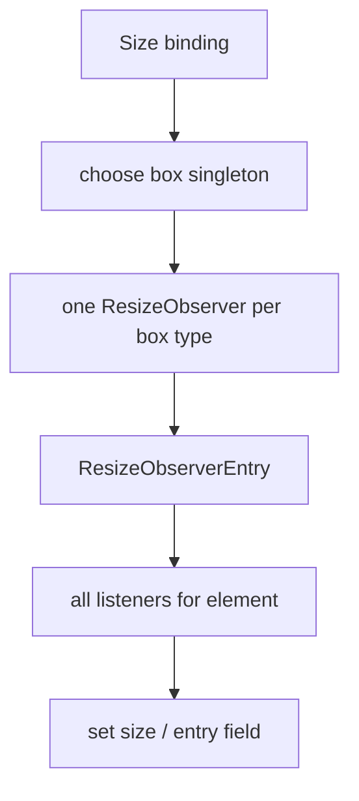

# Size bindings

Source: `internal/client/dom/elements/bindings/size.js`.

`ResizeObserverSingleton` multiplexes listeners per element while keeping one underlying `ResizeObserver` per box configuration. Three shared instances cover content-box, border-box, and device-pixel-content-box observations. Entries are cached in a static `WeakMap` and dispatched to all listeners registered for the target.

`bind_resize_observer(element, type, set)` selects the appropriate singleton, forwards the requested entry field, and unregisters on teardown. `bind_element_size(element, type, set)` observes the border box and reads `clientWidth`, `clientHeight`, `offsetWidth`, or `offsetHeight`; the initial read is untracked so it does not accidentally create reactive dependencies.

